这是一篇关于小白在没有任何技术深度，但是在善于使用AI工具的情况下，能否弥补技术深度鸿沟的探讨。

## 前言

<!-- truncate -->

我在迷茫的时候，总会去翻一些大佬的文章寻找方向，我特别想知道在AI洪流中，怎么去提升自己，于是我特地去翻了一下启蒙老师的博客，也许里面就有我想要的答案。在这提一下，特别感谢我的导师，带我进入到AI行业中。

感兴趣的可以点击查看原文：
[AI水平依然与用户挂钩](https://jiangmiemie.com/blog/2026/2/28/)

文中做了一个特别有意思的实验：

使用`Opus 4.6`在`Docusaurus`中添加“复制 Markdown”按钮的实验，通过模拟小白、基础和专家三类用户，探讨技术深度对AI协作效率的影响。

文章里面提到： 
**技术深度可以放大模型的能力**，我非常赞同。

不知道你们会不会有这种感觉，在使用AI的时候会觉得特别没有安全感，总感觉给我埋了什么雷，即使它是世界上最强的`claude`

当自己想认真看一下ai改了什么的时候，时常因为自己技术不够深入，发现review起来非常吃力，有时候直接不想看了。

并且由于技术水平的上限，根本无法判断AI写的是否正确，写的不好要么给AI重新改，搞乱了只能作为AI垃圾丢掉，重头再来。

文章中的小白在最后并没有完成，原文说到：<span style={{color: '#ff4444'}}>遗憾的是，修复后样式依然不正确，7次机会用完了。</span>

但是我认为：

大模型发展到了今天，<span style={{color: '#ff6b35'}}>善于使用工具已经可以做到弥补技术深度的不足。</span>这样的小需求，不应该在7次对话下依旧无法完成。

说实话，虽然我的博客是用`Docusaurus`框架写的，但我其实只是当作md笔记本一样写，我并不了解这个框架到底是一个什么原理，什么逻辑，我只知道一些md文档的格式，和启动命令是`npm run start`，其他什么美化我都是交给ai打理。

那对于我这个小白来说，能否在使用一些工具技巧的情况下完成这个需求呢？

话不多说，开始吧！

## 工具选择

对于这种需求来说，`claude code`简直太适合了了。这次我只打开终端，不打开ide，完全由它操作，全程用自然语言，看看需要几轮来完成。

## 进入计划模式

首先，这种需要参考一个项目来实现的，直接无脑计划模式就行了，进入计划模式，输入简洁的需求后，加上一句特别的提示词

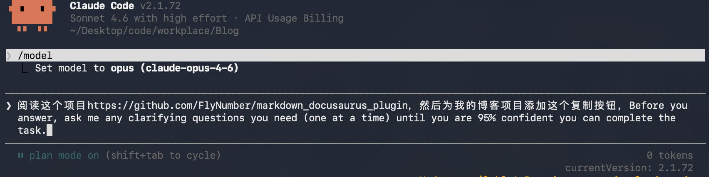

这个提示词也没啥神奇，就是让大模型进行提问澄清，但是确实特别有用。

大模型发展到今天，人类传统思维的约束也许会限制模型的发挥，这也是为什么`claude code`工程师后面放弃了`RAG`检索代码库的方式，而是只给它一个`grep`，因为他们相信，大模型更懂自己需要什么。

按下回车键后，它开始探索链接的项目内容，在一段时间的探索后，它开始向我提问：

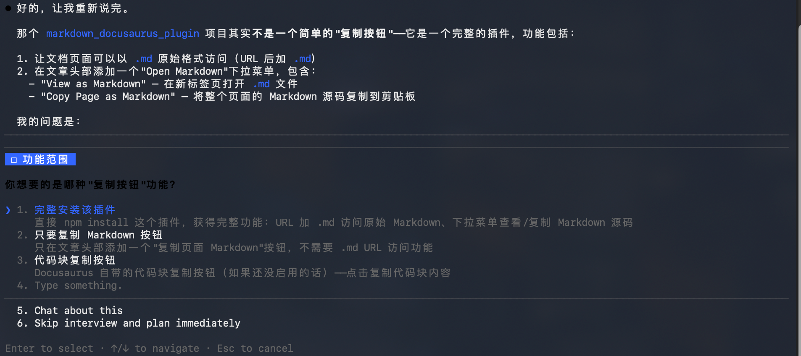

紧接着又问了我第二个问题：

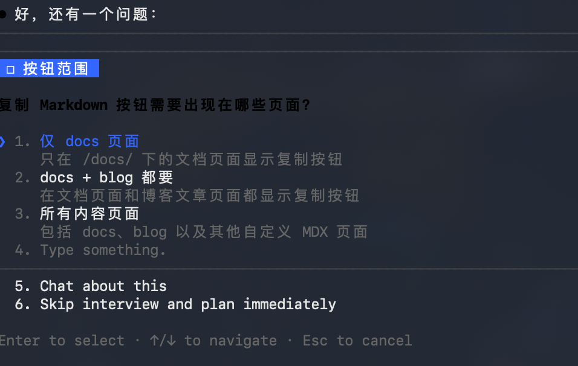

两个问题回答后，它就开始写计划了，下面是它写的计划：

````markdown
# 为 Docs 页面添加「复制 Markdown」按钮

## Context

用户希望参考 [FlyNumber/markdown_docusaurus_plugin](https://github.com/FlyNumber/markdown_docusaurus_plugin) 的实现，为博客的 docs 页面添加一个"复制 Markdown"按钮。点击后将当前页面的 Markdown 源码复制到剪贴板。

核心思路：构建时生成清洗后的 `.md` 文件 → 按钮点击时 fetch 该文件 → 复制到剪贴板。

## 需要新建/修改的文件

| 文件 | 操作 |
| ---- | ---- |
| `plugins/copy-markdown-source/index.js` | 新建 - 本地 Docusaurus 插件，postBuild 生成 .md 文件 |
| `src/components/CopyMarkdownButton/index.js` | 新建 - 复制按钮 React 组件 |
| `src/components/CopyMarkdownButton/styles.module.css` | 新建 - 按钮样式 |
| `src/theme/Root.js` | 修改 - 扩展现有组件，注入按钮到 docs 页面 |
| `docusaurus.config.js` | 修改 - 注册本地插件 |

## 实现步骤

### 1. 创建本地插件 `plugins/copy-markdown-source/index.js`

使用 Docusaurus `postBuild` 生命周期钩子：

- 从 `props.plugins` 中找到 `plugin-content-docs`，提取所有 doc 的 `permalink` 和 `source` 路径
- 读取源 `.md/.mdx` 文件，执行清洗（去 frontmatter、去 import、去 MDX 组件标签）
- 将清洗后的内容写入 `{outDir}{permalink}.md`

清洗规则：
- 移除 YAML frontmatter（`---...---`）
- 移除 `import` 语句
- 移除 MDX 组件：`<DocCardList />`、`<CsvTable ... />`、`<Tabs>`、`<TabItem>` 及闭合标签
- 合并多余空行
- 保留标准 HTML 标签（`<mark>`、`<span>`、`<details>` 等）和图片引用

注意：插件使用 CJS（`module.exports`），因为 Docusaurus 本地插件在 Node.js 端运行，项目 `package.json` 无 `"type": "module"`，CJS 兼容。需要 `fs` 和 `path`（Node 内置），无需额外依赖。

### 2. 创建按钮组件 `src/components/CopyMarkdownButton/`

简单的单按钮组件：
- 从 `window.location.pathname` 构造 `.md` 文件 URL（去尾部斜杠后加 `.md`）
- `fetch` 该文件，`navigator.clipboard.writeText` 复制
- 状态切换：默认显示复制图标，成功后显示"已复制"2 秒

样式：使用 CSS Modules，配合 `--ifm-color-primary` 等 Docusaurus CSS 变量，支持亮/暗模式。

### 3. 修改 `src/theme/Root.js`

在现有 `PasswordProtect` 包裹基础上，增加 `useEffect`：
- 检查当前路径是否以 `/docs/` 开头
- 查找 `article .markdown h1`（或 `article header`），在其后注入按钮容器
- 用 `createRoot` 渲染 `CopyMarkdownButton`
- 使用 `MutationObserver` 监听 DOM 变化，处理客户端路由切换时的重新注入
- 通过 `data-copy-md-btn` 属性防止重复注入

### 4. 修改 `docusaurus.config.js`

在 config 对象中新增 `plugins` 字段（与 `presets` 同级）：

```js
plugins: [
  './plugins/copy-markdown-source',
],
```

## 验证方式

1. `npm run build` — 检查 `build/docs/` 下是否生成了对应的 `.md` 文件，内容已清洗
2. `npm run serve` — 打开任意 docs 页面，确认按钮出现在标题区域
3. 点击按钮 → 粘贴到编辑器，确认复制的是清洗后的 Markdown 源码
4. 测试客户端导航：在 docs 页面间切换，确认按钮正确出现/消失
5. 确认非 docs 页面（首页、博客）不显示按钮
````

当然了作为小白，假装自己看完了整个计划，然后按下回车，这里如果自己有技术深度的话，也许会讨论计划的修改。

## 开始执行

很快它就按照开始执行

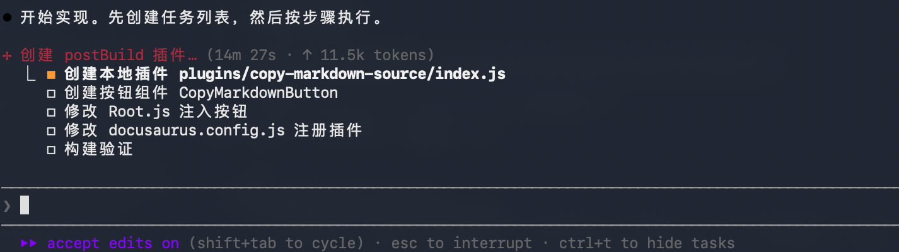

这里细心观察的话会发现，`claude code`用的不再是`todo list`了，而是`task`

为什么换成`task`的话可以查看这篇文章 [Lessons from Building Claude Code: Seeing like an Agent](https://x.com/trq212/status/2027463795355095314?s=20)，这里不加赘述。

这里它发现了一些关键信息：

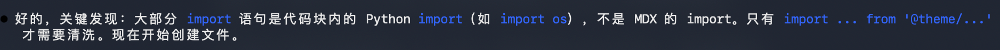

## 开始验证

在[claude code的最佳实践](https://code.claude.com/docs/zh-CN/best-practices)中提到：给`Claude`一种验证其工作的方式。

这里它开始了自己的验证，不过我可没要求它验证，这是它自己的计划

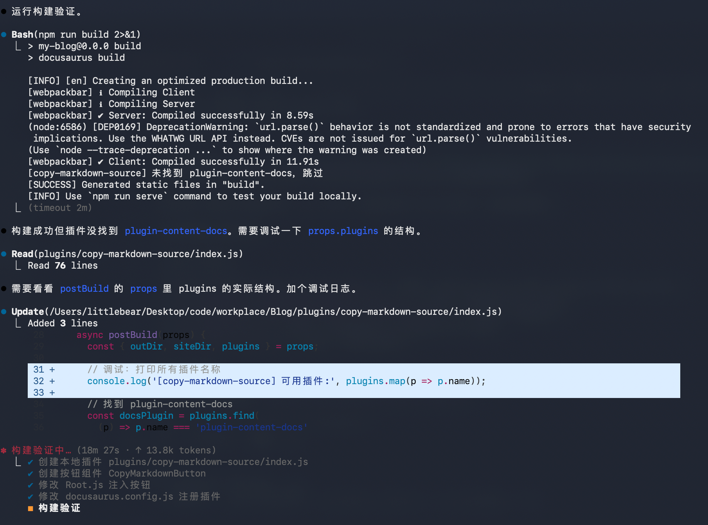

它发现了一些问题，并尝试调试修复，最后发现是名字不对

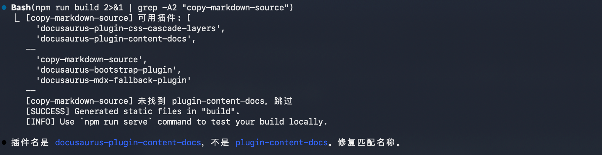

然后就是一顿操作，我就吃着麦当劳，按下回车，这就是我的工作。

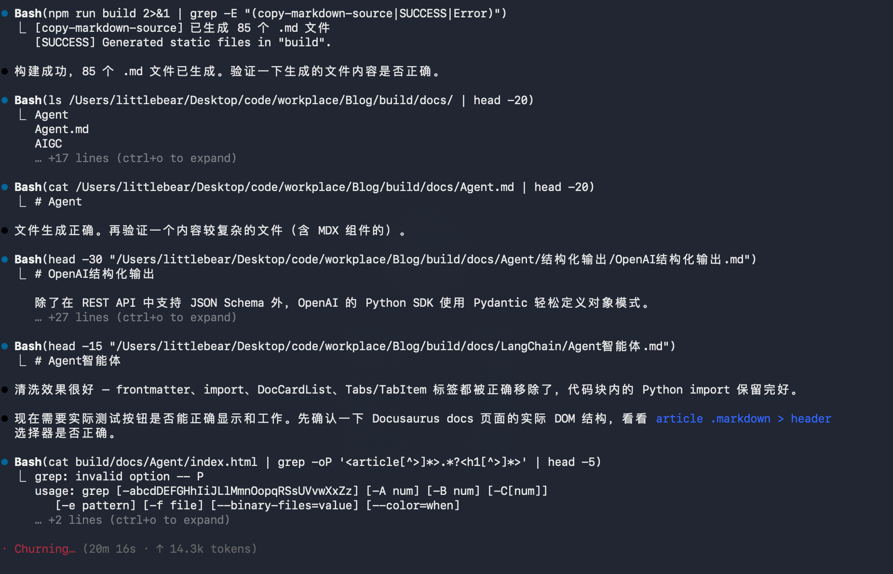

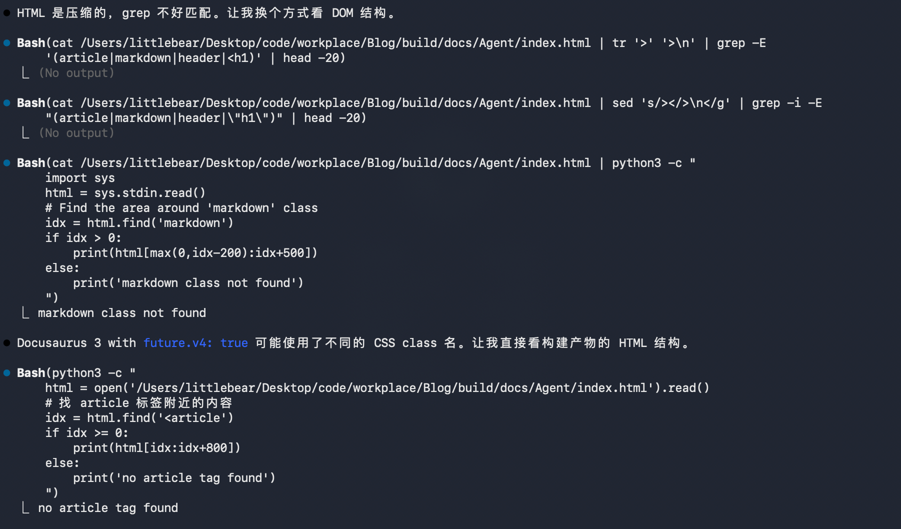

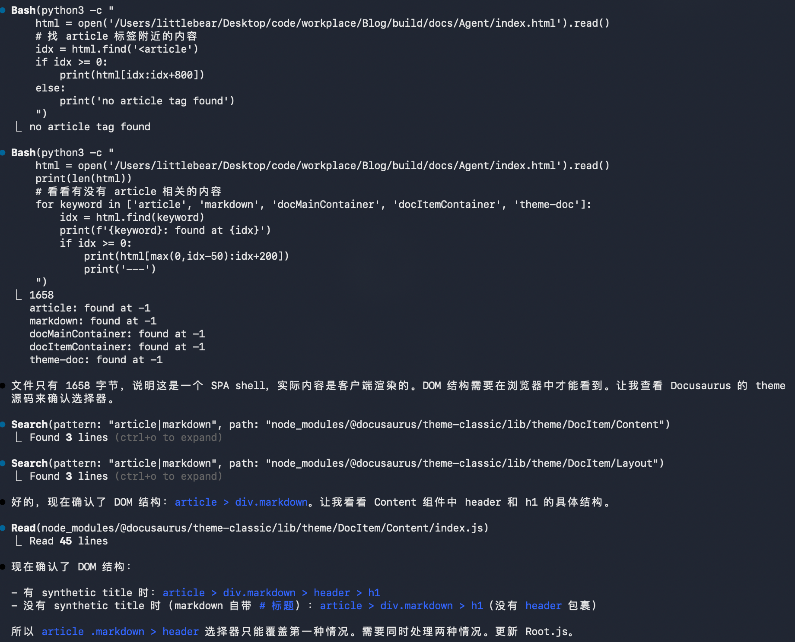

这里说一下，其实我也不知道它遇到啥问题了，因为我对这框架不熟悉，但它一直在操作让我感觉有点慌了，我开始怀疑它能不能完成。

## 初步成功

这里说构建成功了，接下来就是我验收成果了，说实话这种感觉好像有点爽：

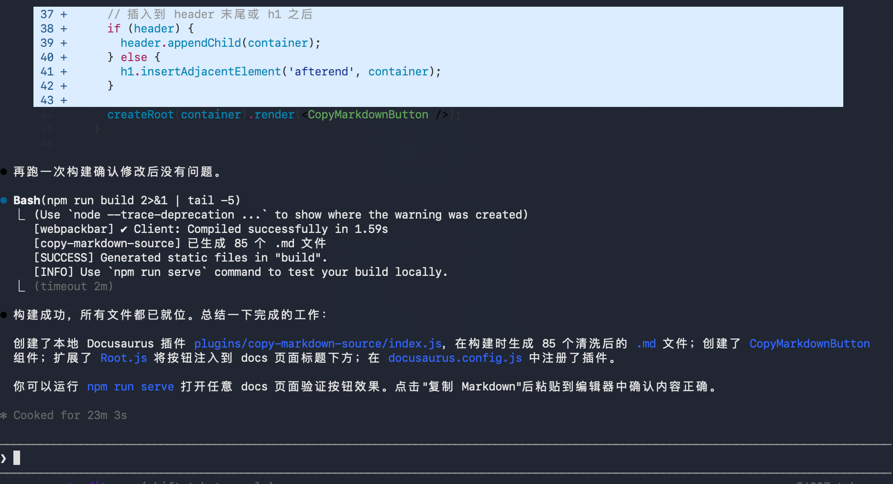

没错我遇到了同样的错误，按钮不对，然后点击复制竟然不是md，到这里我无奈的笑了，果然AI还是需要技术深度才能用好吗。

这里买下一个小伏笔，这里其实除了按钮位置不对，`claude`是正确完成了的，这里完全是我的问题造成的，不过也证明我真的是个一窍不通的小白，哈哈哈。

## 纠正错误

我告诉它我遇到的问题：

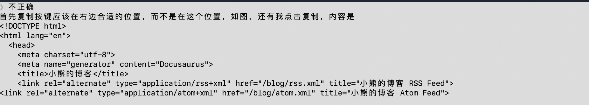

它认真分析了出现的bug：

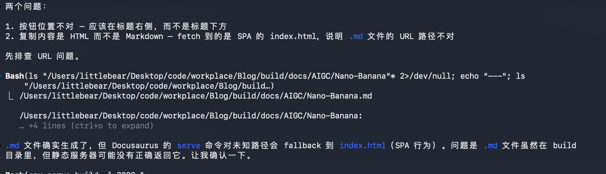

好的，到这里你就明白为什么我会复制的不是md格式了，因为我启动命令是`npm run start`，是的，就是我前面提到的，我只知道这个启动命令。

然后它指出了我的错误，让我用正确方式启动

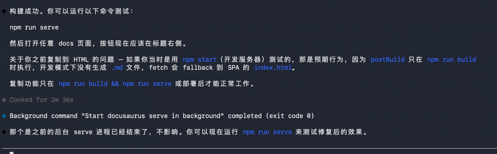

最后也成功实现了这个插件功能，只用了两轮对话。

但有一个问题是，我不知道这算不算成功，技术深度在这里的价值就来了，当然也可以问AI，但有自己的判断会更踏实。

## 总结思考

在AI时代下：

<mark style={{backgroundColor: '#fff3cd', padding: '0 4px', borderRadius: '3px'}}>力量本身并不可怕，可怕的是它的主人</mark>

虽然我通过工具技巧的使用，完成了这次的开发，但如果看token量和时间呢：

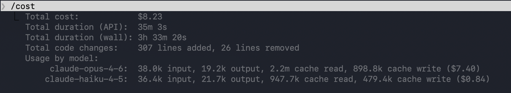

是的，它跑了三十多分钟，花费了8美金，算成人民币就是56块没了，这样说可能没有感觉，换句话说：花五十块加一个按钮，是不是听起来就很痛苦了。

如果有技术深度并善用工具，是不是一次要求直接跑完，根本不需要这么多时间和token呢。

项目的完成是一个函数：`y = kx + b`

b是善用工具，k就是技术深度。