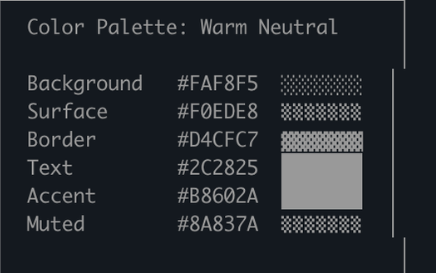

import Tabs from '@theme/Tabs';
import TabItem from '@theme/TabItem';


原文：[Using Claude Code: The Unreasonable Effectiveness of HTML](https://x.com/trq212/status/2052809885763747935)

Markdown 已成为智能体与我们沟通时使用的主流文件格式。它简洁、可移植、具备一定的富文本功能，且便于你编辑。Claude 甚至已经相当擅长在 Markdown 文件中使用 ASCII 字符绘制图表。

但随着智能体变得越来越强大，我感觉 Markdown 已成为一种限制性格式。我发现阅读超过一百行的 Markdown 文件很困难。我想要更丰富的可视化效果、色彩和图表，并且希望能够轻松分享它们。

我也越来越不亲自编辑这些文件，而是将它们用作规范、参考文件、头脑风暴输出等。当我确实需要编辑时，通常是通过提示 Claude 来修改，这消除了 Markdown 最大的优势之一。

我开始倾向于使用 HTML 而非 Markdown 作为输出格式，并且越来越多地看到 Claude Code 团队的其他成员也这样做，原因如下。

如果你想先看一些例子，可以在[这里](https://thariqs.github.io/html-effectiveness)找到很多，但记得回来继续阅读更多关于原因的内容。

{/* truncate */}

## 为什么是 HTML？

### 信息密度

与 Markdown 相比，HTML 能够传达更丰富的信息。它当然可以实现简单的文档结构（如标题和格式），但还能表示各种其他信息，例如：

- 使用表格呈现的表格数据
- 通过 CSS 实现的设计数据
- 使用 SVG 进行插图
- 包含脚本标签的代码片段
- 使用 HTML 元素结合 JavaScript 和 CSS 的交互
- 利用 SVG 和 HTML 构建的工作流程
- 使用绝对定位和画布处理的空间数据
- 使用图片标签的图片

我甚至敢说，几乎没有任何一组信息是克劳德能读取而你不能用 HTML 高效呈现的。这使得 HTML 成为模型向你传达深度信息、以及你审阅这些信息的高效方式。

我发现，如果无法做到这一点，模型可能会在 Markdown 中采用更低效的方式，比如 ASCII 图表，或者我最喜欢的——用 Unicode 字符来估算颜色，就像克劳德代码中的这个截图所示。



### 视觉清晰度与阅读舒适度

随着 Claude 能够处理更复杂的工作，它编写的规范和方案也越来越庞大。实际上，我发现我通常不会阅读超过 100 行的 Markdown 文件，而且我显然也无法让组织中的其他人去阅读它。

但 HTML 文档更易于阅读，Claude 可以直观地组织视觉结构，通过标签页、插图、链接等方式实现理想的导航体验。它甚至能自适应移动端，让你根据设备形态获得不同的阅读体验。

### 易于分享

Markdown 文件相当难以分享，因为大多数浏览器无法很好地原生渲染它们。你通常需要将它们作为附件添加到电子邮件或消息中。

使用 HTML 时，只需上传文件（例如上传到 S3），就能轻松分享链接。你的同事可以在任何地方打开它，并方便地引用。

如果以 HTML 格式呈现，你的规范、报告或 PR 说明被人真正阅读的可能性会大大提高。

### 双向互动

HTML 可以让你与文档进行交互，例如你可以要求它添加滑块或旋钮来调整设计，或者允许你调整算法中的不同选项以观察效果。你还可以让它将这些更改复制到提示词中，以便粘贴回 Claude Code。

更多关于这种双向交互的示例，请阅读我的[playgrounds 帖子](https://x.com/trq212/status/2017024445244924382)

### 数据摄取

为什么选择用 Claude Code 生成 HTML 文件，而不是直接用 ClaudeAI 或 Claude Design？一个最重要的原因是 Claude Code 能够处理大量上下文信息。

举个例子，在撰写本文时，我让 Claude Code 读取我的代码文件夹，找出所有我生成的 HTML 文件，对它们进行分组和分类，然后制作一个包含各类图表展示的 HTML 文件。你在本文中看到的图表，正是这样生成的。

除了文件系统外，Claude Code 还可以通过你的 MCP（如 Slack、Linear 等）、你的网页浏览器（配合 Chrome 中的 Claude）、你的 Git 历史记录等获取更多上下文信息。

### 充满喜悦

用 Claude 制作 HTML 文档就是更有趣，让我感觉更投入、更专注于创作过程，仅此一点就足够了。

### 如何开始

我有点担心人们读了这篇文章后，会把它变成一种“/html 技能”之类的东西。虽然这或许有些价值，但我想强调的是，你不需要做太多事情就能让 Claude 做到这一点。你只需让它“制作一个 HTML 文件”或“制作一个 HTML 工件”即可。

关键在于明确你希望这个工具实现什么功能，以及你打算如何使用它。随着时间的推移，你可能会掌握一项技能，但目前我建议你从零开始尝试，逐步熟悉在不同场景下如何运用它。

## 使用场景

为了让这一点更具体，我为不同的使用场景制作了许多不同的 HTML 文件。你可以在[这里](https://thariqs.github.io/html-effectiveness/)查看所有文件，但以下是概览。

### 规格、规划与探索

HTML 是 Claude 深入探索问题的丰富画布。当我开始处理一个问题时，我不会只做简单的 Markdown 计划，而是期望构建一个 HTML 文件网络。例如，我可能会先让 Claude Code 进行头脑风暴，创建一些不同选项的探索内容。然后我会要求它进一步扩展其中一个方向，可能制作原型或代码片段。最后，当我感觉满意时，我会让它编写实施计划。当我对计划满意后，我会创建一个新会话，将所有文件传入供其执行。

在验证时，我还会让验证代理读取文件，这样它就能对所需内容有更广泛的了解。

示例提示：

<Tabs groupId="prompt-lang">
<TabItem value="en" label="English">

```text
I'm not sure what direction to take the onboarding screen. Generate 6 distinctly different approaches — vary layout, tone, and density — and lay them out as a single HTML file in a grid so I can compare them side by side. Label each with the tradeoff it's making.
```

</TabItem>
<TabItem value="zh" label="中文">

```text
我不确定新手引导界面该往哪个方向设计。请生成 6 种截然不同的方案——在布局、风格和信息密度上都要有所变化——并以网格形式排版在单个 HTML 文件中，方便我进行横向对比。每种方案需标注其设计取舍。
```

</TabItem>
</Tabs>

<Tabs groupId="prompt-lang">
<TabItem value="en" label="English">

```text
Create a thorough implementation plan in a HTML file, be sure to make some mockups, show data flow and add important code snippets I might want to review. Make it easy to read and digest.
```

</TabItem>
<TabItem value="zh" label="中文">

```text
请创建一个详尽的实施方案 HTML 文件，务必包含一些模拟界面、展示数据流向，并附上可能需要审阅的重要代码片段。确保内容清晰易读、便于理解。
```

</TabItem>
</Tabs>

使用场景：

- 探索在代码中实现某功能的其他方法
- 探索多种视觉设计方案

### 代码审查与理解

代码在 Markdown 文件中可能难以阅读。但借助 HTML，我们可以呈现差异对比、注释、流程图、模块等内容。利用这一点可以理解智能体编写的代码、获取代码审查，或向审查你代码的人解释 PR。我发现这通常比默认的 GitHub 差异视图效果更好，现在我提交的每个 PR 都会附带一个 HTML 代码解释器。

示例提示：

<Tabs groupId="prompt-lang">
<TabItem value="en" label="English">

```text
Help me review this PR by creating an HTML artifact that describes it. I'm not very familiar with the streaming/backpressure logic so focus on that. Render the actual diff with inline margin annotations, color-code findings by severity and whatever else might be needed to convey the concept well.
```

</TabItem>
<TabItem value="zh" label="中文">

```text
帮我审查这个 PR，创建一个描述它的 HTML 文档。我对流式处理/背压逻辑不太熟悉，所以请重点关注这部分。渲染实际的差异对比，并添加行内边距注释，按严重程度对发现的问题进行颜色编码，以及任何其他有助于清晰传达概念的内容。
```

</TabItem>
</Tabs>

使用场景：

- 创建 PR
- 审查 PR
- 理解代码中的某个主题

### 设计与原型

Claude 设计基于 HTML，因为 HTML 在设计方面具有极强的表现力，即使你的最终界面并非 HTML。Claude 可以用 HTML 勾勒出设计草图，然后将其转换为你选择的语言，无论是 React、Swift 还是其他语言。

你还可以制作交互原型，比如动画、动作等。不妨让 Claude 创建滑块、旋钮等控件，来精确调整你想要的参数。

示例提示：

<Tabs groupId="prompt-lang">
<TabItem value="en" label="English">

```text
I want to prototype a new checkout button, when clicked it does a play animation and then turns purple quickly. Create a HTML file with several sliders and options for me to try different options on this animation, give me a copy button to copy the parameters that worked well.
```

</TabItem>
<TabItem value="zh" label="中文">

```text
我想制作一个新的结账按钮原型，点击时播放动画并快速变为紫色。创建一个包含多个滑块和选项的 HTML 文件，让我可以尝试这个动画的不同设置，并提供一个复制按钮来复制效果好的参数。
```

</TabItem>
</Tabs>

用于：

- 创建设计系统工件
- 调整组件
- 可视化组件库
- 制作愉悦动画原型

### 报告、研究与学习

Claude Code 在跨多个数据源综合信息并将其转化为可读报告方面表现出色。你可以提示 Claude 搜索你的 Slack、代码库、Git 历史记录、互联网等，并利用它为你自己、领导层、团队等生成极具可读性的报告。

你可以将其整理成一份长篇幅的 HTML 文档、交互式讲解页面，甚至幻灯片/演示文稿的形式。让 Claude 使用 SVG 绘制图表来帮助可视化呈现。

例如，在我撰写关于提示缓存的文章时，我让 Claude 在阅读完 Git 历史记录后，为我准备一份关于提示缓存所有变更的深度研究 HTML 文件。

示例提示：

<Tabs groupId="prompt-lang">
<TabItem value="en" label="English">

```text
I don't understand how our rate limiter actually works. Read the relevant code and produce a single HTML explainer page: a diagram of the token-bucket flow, the 3–4 key code snippets annotated, and a "gotchas" section at the bottom. Optimize it for someone reading it once.
```

</TabItem>
<TabItem value="zh" label="中文">

```text
我不明白我们的速率限制器实际上是如何工作的。请阅读相关代码，并生成一个单一的 HTML 解释页面：包含令牌桶流程的示意图、3-4 个带注释的关键代码片段，以及底部的"注意事项"部分。优化页面，使其适合一次性阅读。
```

</TabItem>
</Tabs>

用于：

- 总结某个功能的工作原理
- 向我解释某个概念
- 向你的老板提交每周状态报告
- 向你的领导提交事件报告
- SVG 插图、流程图、技术图表等

### 自定义编辑界面

有时，仅凭文本框很难准确描述你想要的内容。在这种情况下，我会让 Claude 为我正在处理的具体任务构建一个一次性编辑器。这不是一个产品，也不是可重复使用的工具，而是一个单一的 HTML 文件，专为这一份数据量身定制。

诀窍在于始终以导出功能收尾：一个"复制为 JSON"或"复制为提示词"的按钮，能将我在界面中完成的所有操作，重新转化为可粘贴到 Claude Code 中的内容。

示例提示：

<Tabs groupId="prompt-lang">
<TabItem value="en" label="English">

```text
I need to reprioritize these 30 Linear tickets. Make me an HTML file with each ticket as a draggable card across Now / Next / Later / Cut columns. Pre-sort them by your best guess. Add a "copy as markdown" button that exports the final ordering with a one-line rationale per bucket.
```

</TabItem>
<TabItem value="zh" label="中文">

```text
我需要重新排列这 30 个 Linear 工单的优先级。请创建一个 HTML 文件，将每个工单作为可拖拽的卡片，分布在"现在/下一步/稍后/取消"四列中。请按你的最佳判断预先排序。添加一个"复制为 Markdown"按钮，用于导出最终排序结果，并为每个分组附上一行说明理由。
```

</TabItem>
</Tabs>

<Tabs groupId="prompt-lang">
<TabItem value="en" label="English">

```text
Here's our feature flag config. Build a form-based editor for it,  group flags by area, show dependencies between them, warn me if I enable a flag whose prerequisite is off. Add a "copy diff" button that gives me just the changed keys.
```

</TabItem>
<TabItem value="zh" label="中文">

```text
这是我们的功能开关配置。请为其构建一个基于表单的编辑器，按区域对开关进行分组，显示它们之间的依赖关系，并在我启用某个依赖开关未开启的功能时发出警告。添加一个"复制差异"按钮，仅输出发生变更的键值。
```

</TabItem>
</Tabs>

<Tabs groupId="prompt-lang">
<TabItem value="en" label="English">

```text
I'm tuning this system prompt. Make a side-by-side editor: editable prompt on the left with the variable slots highlighted, three sample inputs on the right that re-render the filled template live. Add a character/token counter and a copy button.
```

</TabItem>
<TabItem value="zh" label="中文">

```text
我正在调整这个系统提示。创建一个并排编辑器：左侧是可编辑的提示，其中变量插槽高亮显示，右侧有三个示例输入，可实时渲染填充后的模板。添加一个字符/词元计数器和复制按钮。
```

</TabItem>
</Tabs>

用于：

- 对任何内容进行重新排序、分类或分组（如工单、测试用例、反馈）
- 编辑结构化配置（如功能开关、环境变量、带约束条件的 JSON/YAML）
- 实时预览调整提示词、模板或文案
- 整理数据集，批准/拒绝数据行，标记示例，导出所选内容
- 对文档、转录文本或差异比较进行注释，并导出注释内容
- 选择那些难以用文本表达的值：颜色、缓动曲线、裁剪区域、定时任务表达式、正则表达式

## 常见问题解答

我一直向很多人提到我已经转向使用 HTML，也看到了一些反复出现的问题。

1.**这样不是更消耗 token 吗？**

虽然 Markdown 通常使用更少的 token，但我发现 HTML 更强的表现力以及我更愿意阅读它的特性，意味着我能获得整体更优的输出。在 Opus 4.7 的 100 万 token 上下文窗口中，增加的 token 消耗实际上并不明显。

2.**你现在什么时候还会用 Markdown？**

老实说，我现在几乎完全不用 Markdown 了，不过我在 HTML 使用上可能属于极端派。

3.**如何查看 HTML 文件？**

我通常直接在本地浏览器中打开它（你可以让 Claude 来打开），或者如果需要可分享的链接，就上传到 S3。

4.**生成 HTML 不是比 Markdown 更耗时吗？**

确实更耗时！HTML 比 Markdown 多花 2-4 倍的时间，但我发现结果值得。

5.**版本控制呢？**

说实话，这是 HTML 最大的缺点之一。与 Markdown 相比，HTML 的差异对比杂乱且难以审查。

6.**如何让 Claude 符合我的审美/避免设计丑陋？**

前端设计插件能帮助 Claude 生成优质的 HTML 文件。但若要匹配贵公司的自有风格，只需将 Claude 指向您的代码库，即可创建一份统一的设计系统 HTML 文件。随后可将该设计系统文件作为其他 HTML 文件的参考基准。

## 保持联系

综上所述，我认为使用 HTML 的真正原因在于，我感觉与 Claude 的互动更加紧密。我曾一度担心，由于不再深入阅读计划，我将不得不完全让 Claude 自行决策。

但我很高兴地说，在使用 HTML 时，我感觉比以往任何时候都更了解全局。希望你也如此。

## 推荐项目

设计风格参考[awesome-design-md](https://github.com/voltagent/awesome-design-md)

下面放一个我最喜欢的的`Claude.com`风格页面设计，复制为`DESIGN.md`然后让 Claude 遵守就可以啦。

### Claude风格

```markdown
## Overview

Claude.com is the warmest, most editorial interface in the AI-product category. The base atmosphere is a **tinted cream canvas** (`{colors.canvas}` — #faf9f5) — distinctly warm, deliberately not the cool gray-white that every other AI brand uses. Headlines run a **slab-serif display** ("Copernicus" / Tiempos Headline) at weight 400 with negative letter-spacing, paired with **StyreneB / Inter** body sans. The combination feels like a literary publication, not a SaaS marketing page.

Brand voltage comes from the **cream + coral pairing** — coral (`{colors.primary}` — #cc785c) is the signature Anthropic accent, used on every primary CTA, on the brand wordmark, and on full-bleed callout cards. The coral is warm, slightly muted, never cyan/blue — a deliberate counter-positioning against OpenAI's cool slate, Google's saturated blue, and Microsoft's corporate cyan.

The system has three surface modes that alternate page-by-page:
1. **Cream canvas** (`{colors.canvas}`) — default body floor
2. **Light cream cards** (`{colors.surface-card}`) — feature card backgrounds
3. **Dark navy product surfaces** (`{colors.surface-dark}`) — code editor mockups, model showcase cards, pre-footer CTAs, footer itself

The dark surfaces are where Claude shows its product chrome — code blocks, terminal output, model comparison tables, agentic-flow diagrams. The cream-to-dark contrast is the page's pacing rhythm.

**Key Characteristics:**
- Warm cream canvas (`{colors.canvas}` — #faf9f5) with dark warm-ink text (`{colors.ink}` — #141413). The brand's defining color choice.
- Coral primary CTA (`{colors.primary}` — #cc785c). Used scarcely on individual buttons, generously on full-bleed coral callout cards.
- Slab-serif display headlines via Copernicus / Tiempos Headline at weight 400 with negative letter-spacing. Pairs with humanist sans body for a literary editorial voice.
- Dark navy product mockup cards (`{colors.surface-dark}` — #181715) carrying code blocks, terminal panels, model comparison data — the brand shows the product chrome at scale rather than abstract marketing illustrations.
- Light cream feature cards (`{colors.surface-card}` — #efe9de) — slightly darker than canvas, used for content-driven feature explanations.
- Anthropic radial-spike mark — a small black asterisk-like glyph (4-spoke radial) — appears as the brand wordmark prefix and as a content marker.
- Border radius is hierarchical: `{rounded.md}` (8px) for buttons + inputs, `{rounded.lg}` (12px) for content + product cards, `{rounded.xl}` (16px) for the hero illustration container, `{rounded.pill}` for badges.
- Section rhythm `{spacing.section}` (96px) — modern-SaaS standard. Internal card padding stays generous at `{spacing.xl}` (32px).

## Colors

### Brand & Accent
- **Coral / Primary** (`{colors.primary}` — #cc785c): The signature Anthropic warm coral. Used on every primary CTA background, on full-bleed coral callout cards, on the brand wordmark accent. The most-recognized Anthropic color outside of the spike-mark logo.
- **Coral Active** (`{colors.primary-active}` — #a9583e): The press / hover-darker variant.
- **Coral Disabled** (`{colors.primary-disabled}` — #e6dfd8): A desaturated cream-tinted disabled state.
- **Accent Teal** (`{colors.accent-teal}` — #5db8a6): Used sparingly on secondary product surfaces (terminal status indicators, "active connection" dots in connectors page).
- **Accent Amber** (`{colors.accent-amber}` — #e8a55a): A small companion warm-tone used on category badges and inline highlights.

### Surface
- **Canvas** (`{colors.canvas}` — #faf9f5): The default page floor. Tinted cream — warm, deliberately not pure white.
- **Surface Soft** (`{colors.surface-soft}` — #f5f0e8): Section dividers, very-soft band backgrounds.
- **Surface Card** (`{colors.surface-card}` — #efe9de): Feature cards, content cards. One step darker than canvas.
- **Surface Cream Strong** (`{colors.surface-cream-strong}` — #e8e0d2): A strongest-cream variant used on selected category tabs and emphasized section bands.
- **Surface Dark** (`{colors.surface-dark}` — #181715): Code editor mockups, model showcase cards, footer. The dominant dark surface.
- **Surface Dark Elevated** (`{colors.surface-dark-elevated}` — #252320): Elevated cards inside dark bands (settings panels in mockups).
- **Surface Dark Soft** (`{colors.surface-dark-soft}` — #1f1e1b): Slightly lighter dark, used for code block backgrounds inside larger dark cards.
- **Hairline** (`{colors.hairline}` — #e6dfd8): The 1px border tone on cream surfaces. Same hex as `{colors.primary-disabled}` — borders feel like one elevation step rather than ink lines.
- **Hairline Soft** (`{colors.hairline-soft}` — #ebe6df): Barely-visible divider used inside the same band.

### Text
- **Ink** (`{colors.ink}` — #141413): All headlines and primary text. Warm dark, slightly off-pure-black.
- **Body Strong** (`{colors.body-strong}` — #252523): Emphasized paragraphs, lead text.
- **Body** (`{colors.body}` — #3d3d3a): Default running-text color.
- **Muted** (`{colors.muted}` — #6c6a64): Sub-headings, breadcrumbs, footer-adjacent secondary text.
- **Muted Soft** (`{colors.muted-soft}` — #8e8b82): Captions, fine-print, copyright lines.
- **On Primary** (`{colors.on-primary}` — #ffffff): Text on coral buttons.
- **On Dark** (`{colors.on-dark}` — #faf9f5): Cream-tinted white used on dark surfaces (echoes the canvas tone).
- **On Dark Soft** (`{colors.on-dark-soft}` — #a09d96): Footer body text, secondary labels in dark mockups.

### Semantic
- **Success** (`{colors.success}` — #5db872): Green status dots, "available" indicators.
- **Warning** (`{colors.warning}` — #d4a017): Warning callouts (rare on marketing surfaces).
- **Error** (`{colors.error}` — #c64545): Validation errors.

## Typography

### Font Family
The system runs **Copernicus** (or **Tiempos Headline** as substitute) as the slab-serif display face for headlines, and **StyreneB** (or **Inter** as substitute) as the humanist sans for body, navigation, and UI labels. **JetBrains Mono** handles code blocks. The fallback stack walks `Tiempos Headline, Garamond, "Times New Roman", serif` for display and `Inter, -apple-system, BlinkMacSystemFont, "Segoe UI", Roboto, sans-serif` for body.

The display/body split is editorial:
- Copernicus serif (weight 400, negative tracking) → h1, h2, h3, hero display
- StyreneB sans (weight 400-500) → body, navigation, buttons, captions, labels
- JetBrains Mono → all code blocks and terminal text

### Hierarchy

| Token | Size | Weight | Line Height | Letter Spacing | Use |
|---|---|---|---|---|---|
| `{typography.display-xl}` | 64px | 400 | 1.05 | -1.5px | Homepage h1 ("Meet your thinking partner") — Copernicus serif |
| `{typography.display-lg}` | 48px | 400 | 1.1 | -1px | Section heads — Copernicus |
| `{typography.display-md}` | 36px | 400 | 1.15 | -0.5px | Sub-section heads, model names — Copernicus |
| `{typography.display-sm}` | 28px | 400 | 1.2 | -0.3px | Pricing tier names, callout headlines — Copernicus |
| `{typography.title-lg}` | 22px | 500 | 1.3 | 0 | Pricing plan size labels — StyreneB |
| `{typography.title-md}` | 18px | 500 | 1.4 | 0 | Feature card titles, intro paragraphs |
| `{typography.title-sm}` | 16px | 500 | 1.4 | 0 | Connector tile titles, list labels |
| `{typography.body-md}` | 16px | 400 | 1.55 | 0 | Default running-text — StyreneB |
| `{typography.body-sm}` | 14px | 400 | 1.55 | 0 | Footer body, fine-print |
| `{typography.caption}` | 13px | 500 | 1.4 | 0 | Badge labels, captions |
| `{typography.caption-uppercase}` | 12px | 500 | 1.4 | 1.5px | Category tags, "NEW" badges |
| `{typography.code}` | 14px | 400 | 1.6 | 0 | Code blocks — JetBrains Mono |
| `{typography.button}` | 14px | 500 | 1.0 | 0 | Standard button labels |
| `{typography.nav-link}` | 14px | 500 | 1.4 | 0 | Top-nav menu items |

### Principles
Display sizes use weight 400 (regular), never bold. Negative letter-spacing (-0.3 to -1.5px) is essential — Copernicus without it reads as off-brand. The serif character is what gives Anthropic its literary, considered voice; switching to a sans-serif display would make Claude feel like every other AI tool.

Body type stays at weight 400 for paragraphs, weight 500 for labels and emphasized phrases. The sans body is humanist (StyreneB) — never geometric. Inter is an acceptable substitute because of its similar humanist proportions; Helvetica or Arial would be too neutral and break the warm-editorial feel.

### Note on Font Substitutes
If Copernicus / Tiempos Headline is unavailable, **Cormorant Garamond** at weight 500 with -0.02em letter-spacing is the closest open-source approximation. **EB Garamond** is a fallback. For StyreneB, **Inter** is the closest match — both are humanist sans designed for screen reading. **Söhne** is another close alternative if licensed.

## Layout

### Spacing System
- **Base unit:** 4px.
- **Tokens:** `{spacing.xxs}` 4px · `{spacing.xs}` 8px · `{spacing.sm}` 12px · `{spacing.md}` 16px · `{spacing.lg}` 24px · `{spacing.xl}` 32px · `{spacing.xxl}` 48px · `{spacing.section}` 96px.
- **Section padding:** `{spacing.section}` (96px) — modern-SaaS rhythm.
- **Card internal padding:** `{spacing.xl}` (32px) for feature cards, pricing tier cards, model comparison cards; `{spacing.lg}` (24px) for code-window cards and connector tiles.
- **Callout / CTA bands:** `{spacing.xxl}` (48px) inside coral callout cards; 64px inside the larger dark CTA band.

### Grid & Container
- **Max content width:** ~1200px centered.
- **Editorial body:** Single 12-column grid; hero often uses 6/6 split (h1 left, illustration right).
- **Feature card grids:** 3-up at desktop, 2-up at tablet, 1-up at mobile.
- **Connector tile grids:** 4-up or 6-up at desktop, 2-up at tablet, 1-up at mobile.
- **Pricing grid:** 3-up at desktop (Free / Pro / Team / Enterprise often), 1-up at mobile.

### Whitespace Philosophy
The cream canvas + serif display + generous internal padding create an editorial pacing — Claude reads like a long-form magazine column rather than a marketing template. Whitespace between bands stays uniform at 96px; whitespace inside cards is generous (32px), letting type breathe.

## Elevation & Depth

| Level | Treatment | Use |
|---|---|---|
| Flat | No shadow, no border | Body sections, top nav, hero bands |
| Soft hairline | 1px `{colors.hairline}` border | Inputs, sub-nav, occasionally on cards |
| Cream card | `{colors.surface-card}` background — no shadow | Feature cards, content cards |
| Dark surface card | `{colors.surface-dark}` background — no shadow | Code editor mockups, model showcase cards |
| Subtle drop shadow | Faint shadow at low alpha | Hover-elevated states (the system uses `0 1px 3px rgba(20,20,19,0.08)` rarely) |

The elevation philosophy is **color-block first, shadow rare**. Most depth comes from the cream-vs-dark surface contrast. Shadows are minimal. The dark surface mockups have their own internal product chrome (code editor scrollbars, line numbers, syntax highlighting) which adds detail without needing external shadows.

### Decorative Depth
- The Anthropic spike-mark glyph (4-spoke radial asterisk) appears as a small black mark in the brand wordmark and inline as a content marker.
- Code editor mockups carry their own internal depth: syntax-highlighted text in muted blues / oranges / grays, line numbers in `{colors.muted-soft}`, status bars at the bottom in `{colors.surface-dark-elevated}`.
- Some hero illustrations use simple line-art with coral and dark-navy strokes on cream — minimal, hand-drawn-feeling, never photorealistic.

## Shapes

### Border Radius Scale

| Token | Value | Use |
|---|---|---|
| `{rounded.xs}` | 4px | Reserved for badge accents and tiny dropdowns |
| `{rounded.sm}` | 6px | Small inline buttons, dropdown items |
| `{rounded.md}` | 8px | Standard CTA buttons, text inputs, category tabs |
| `{rounded.lg}` | 12px | Content cards (feature, pricing, code-window, model-comparison) |
| `{rounded.xl}` | 16px | Hero illustration container, the larger marquee components |
| `{rounded.pill}` | 9999px | Badge pills, "NEW" tags |
| `{rounded.full}` | 9999px / 50% | Avatar substitutes, icon buttons |

### Photography & Illustrations
Claude's hero rarely uses photography. Instead it uses:
- Simple line-art illustrations with coral + dark-navy strokes on the cream canvas
- Code editor mockups (the dominant "hero" treatment on developer-focused pages)
- Terminal output mockups with monospace text on dark
- Model comparison cards (Opus / Sonnet / Haiku) with abstract geometric thumbnails

When photography is used (rare — mostly testimonials), avatars crop to perfect circles at 40px diameter.

## Components

### Top Navigation

**`top-nav`** — Cream nav bar pinned to the top of every page. 64px tall, `{colors.canvas}` background. Carries the Anthropic spike-mark + "Claude" wordmark at left, primary horizontal menu (Product, Solutions, Use Cases, Pricing, Research, Company) center-left, right-side cluster with "Sign in" text-link, "Try Claude" `{component.button-primary}` (coral). Menu items in `{typography.nav-link}` (StyreneB 14px / 500).

### Buttons

**`button-primary`** — The signature coral CTA. Background `{colors.primary}` (#cc785c), text `{colors.on-primary}` (white), type `{typography.button}` (StyreneB 14px / 500), padding 12px × 20px, height 40px, rounded `{rounded.md}` (8px). Active state `button-primary-active` darkens to `{colors.primary-active}` (#a9583e).

**`button-secondary`** — Cream button with hairline outline. Background `{colors.canvas}`, text `{colors.ink}`, 1px hairline border, same padding + height + radius as primary.

**`button-secondary-on-dark`** — Used over `{colors.surface-dark}` cards. Background `{colors.surface-dark-elevated}` (#252320), text `{colors.on-dark}`. Stays dark — the system never inverts to a light secondary on dark surfaces.

**`button-text-link`** — Inline text button, no background. Used for "Sign in" in the top nav and inline CTA links.

**`button-icon-circular`** — 36px circular icon button. Background `{colors.canvas}`, hairline border, ink-color icon. Used for carousel arrows, share, "view more".

**`text-link`** — Inline body links in `{colors.primary}` (the coral). Underlined on press; the coral inline link is one of the system's most distinctive small details.

### Cards & Containers

**`hero-band`** — Cream-canvas hero with a 6-6 grid: h1 + sub-headline + button row on the left, hero illustration card or product mockup card on the right. Vertical padding `{spacing.section}` (96px).

**`hero-illustration-card`** — A larger card holding the hero's right-side artifact — sometimes a coral-stroke line illustration on cream background, sometimes a dark code editor mockup. Background `{colors.canvas}` or `{colors.surface-dark}` depending on context, rounded `{rounded.xl}` (16px).

**`feature-card`** — Used in 3-up feature grids. Background `{colors.surface-card}` (#efe9de — slightly darker cream), rounded `{rounded.lg}` (12px), internal padding `{spacing.xl}` (32px). Carries a small icon at top, an `{typography.title-md}` headline, and a body description in `{typography.body-md}`.

**`product-mockup-card-dark`** — Dark navy card showing actual Claude product chrome (chat interface, code editor, agent controls). Background `{colors.surface-dark}`, rounded `{rounded.lg}`, internal padding `{spacing.xl}` (32px). Carries text labels in `{colors.on-dark}` and product UI fragments below.

**`code-window-card`** — A specialized dark card showing a code editor with line numbers, syntax-highlighted code in `{typography.code}` (JetBrains Mono), and sometimes a "Run" button or terminal output panel below. Background `{colors.surface-dark}` with `{colors.surface-dark-soft}` for the inner code block, rounded `{rounded.lg}`, padding `{spacing.lg}` (24px). The signature visual element of Claude Code product pages.

**`model-comparison-card`** — Used on the homepage's "Which problem are you up against?" section comparing Opus / Sonnet / Haiku. Background `{colors.canvas}` with hairline border, rounded `{rounded.lg}`, internal padding `{spacing.xl}` (32px). Carries the model name, a short capability blurb, and a `{component.text-link}` to learn more.

**`pricing-tier-card`** — Standard tier card. Background `{colors.canvas}` with hairline border, rounded `{rounded.lg}`, padding `{spacing.xl}` (32px). Carries the plan name in `{typography.title-lg}` (StyreneB), price in `{typography.display-sm}` (Copernicus serif!), feature checklist in `{typography.body-md}`, and a `{component.button-primary}` at the bottom.

**`pricing-tier-card-featured`** — The featured tier (typically "Pro" or "Team"). Background flips to `{colors.surface-dark}`, text inverts to `{colors.on-dark}`. The dark surface IS the featured-tier signal.

**`callout-card-coral`** — A full-bleed coral card carrying a major call-to-action. Background `{colors.primary}` (#cc785c), text `{colors.on-primary}` (white), rounded `{rounded.lg}`, padding `{spacing.xxl}` (48px). The coral surface IS the voltage; the CTA inside uses an inverted button style (cream/canvas button on coral).

**`connector-tile`** — Used on the connectors page's integration grid. Background `{colors.canvas}` with hairline border, rounded `{rounded.lg}`, padding 20px. Each tile carries a logo at top, a `{typography.title-sm}` connector name, and a short description.

### Inputs & Forms

**`text-input`** — Standard text input. Background `{colors.canvas}`, text `{colors.ink}`, type `{typography.body-md}`, rounded `{rounded.md}` (8px), padding 10px × 14px, height 40px. 1px hairline border in `{colors.hairline}`.

**`text-input-focused`** — Focus state. Border thickens or shifts to `{colors.primary}` (coral) for emphasis. Carries a 3px coral-at-15%-alpha outer ring.

**`cookie-consent-card`** — Bottom-right floating dark cookie banner. Background `{colors.surface-dark}`, text `{colors.on-dark}`, rounded `{rounded.lg}`, padding `{spacing.lg}` (24px). One of the few places dark surface appears at small scale on cream pages.

### Tags / Badges

**`badge-pill`** — Small pill label used for category tags. Background `{colors.surface-card}`, text `{colors.ink}`, type `{typography.caption}` (13px / 500), rounded `{rounded.pill}`, padding 4px × 12px.

**`badge-coral`** — Coral-fill badge for "NEW", "BETA", featured highlights. Background `{colors.primary}`, text `{colors.on-primary}`, type `{typography.caption-uppercase}` (12px / 500 / 1.5px tracking), rounded `{rounded.pill}`, padding 4px × 12px.

### Tab / Filter

**`category-tab`** + **`category-tab-active`** — Used in sub-nav rows on solutions / connectors pages. Inactive: transparent background, `{colors.muted}` text. Active: `{colors.surface-card}` background, `{colors.ink}` text. Padding 8px × 14px, rounded `{rounded.md}`.

### CTA / Footer

**`cta-band-coral`** — A pre-footer "Try Claude" CTA card. Full-width coral fill, white type, rounded `{rounded.lg}`, padding 64px. Carries an h2 in `{typography.display-sm}` (still serif!), a sub-line, and a cream-button CTA.

**`cta-band-dark`** — Alternative pre-footer band on developer-focused pages. Background `{colors.surface-dark}`, text `{colors.on-dark}`, rounded `{rounded.lg}`, padding 64px. Often pairs with a code-window card.

**`footer`** — Dark navy footer that closes every page. Background `{colors.surface-dark}` (#181715), text `{colors.on-dark-soft}`. 4-column link list at desktop covering Product / Company / Resources / Legal. Vertical padding 64px. The Anthropic spike-mark + "Anthropic" wordmark sits at the top in `{colors.on-dark}`. The footer never inverts.

## Do's and Don'ts

### Do
- Anchor every page on the cream canvas. Pure white reads as "any other AI tool"; the warm tint is the brand differentiator.
- Use Copernicus serif for every display headline. Pair with StyreneB sans body. Negative letter-spacing on display sizes is non-negotiable.
- Reserve `{colors.primary}` (coral) for primary CTAs and full-bleed `{component.callout-card-coral}` moments. Don't paint accent moments coral elsewhere.
- Use `{component.product-mockup-card-dark}` and `{component.code-window-card}` to show actual Claude product chrome. Don't paint marketing illustrations of code when you can show real code.
- Pair `{component.feature-card}` (cream) with `{component.product-mockup-card-dark}` (navy) in alternating bands. The cream-to-dark rhythm is the brand's pacing mechanism.
- Use the Anthropic spike-mark glyph as the brand wordmark prefix. Never invert the mark to white-on-dark within the wordmark itself.
- Apply `{spacing.section}` (96px) between major bands.

### Don't
- Don't use cool grays or pure white for canvas. Cream is the brand.
- Don't bold serif display weight. Copernicus at 700 reads as bombastic; the system stays at 400.
- Don't use cool blue or saturated cyan as a brand accent. The coral is the brand voltage.
- Don't put coral everywhere. The coral is scarce on individual elements and generous only on full-bleed coral callout cards.
- Don't use Inter for display headlines. The serif character is the brand voice.
- Don't repeat the same surface mode in two consecutive bands. The pacing alternates: cream → cream-card → dark-mockup → cream → coral-callout → dark-footer.
- Don't add hover state styling beyond what the system already encodes — primary darkens on press; nothing else changes.

## Responsive Behavior

### Breakpoints

| Name | Width | Key Changes |
|---|---|---|
| Mobile | < 768px | Hamburger nav; hero h1 64→32px; hero-illustration-card stacks below content; feature grids 1-up; connector tiles 2-up; pricing 1-up; footer 4 cols → 1 |
| Tablet | 768–1024px | Top nav stays horizontal but tightens; feature cards 2-up; connector tiles 3-up; pricing 2-up |
| Desktop | 1024–1440px | Full top-nav with all menu items; 3-up feature cards; 4-up or 6-up connector tiles; 3-up pricing tiers |
| Wide | > 1440px | Same as desktop with more outer breathing room; max content width caps at 1200px |

### Touch Targets
- `{component.button-primary}` at minimum 40 × 40px.
- `{component.button-icon-circular}` at exactly 36 × 36 — slightly under WCAG 44 but visually centered.
- `{component.text-input}` height is 40px.
- Connector tile entire card area is tappable; effective tap area >> 44px.

### Collapsing Strategy
- Top nav collapses to hamburger at < 768px; menu opens as a full-screen cream sheet.
- Hero band's 6-6 grid collapses to single-column on mobile — h1 + sub-head + buttons first, then the illustration / mockup card below.
- Feature grids reduce columns rather than scaling cards down.
- Pricing tier cards collapse 4 → 2 → 1; featured-tier dark surface stays visually distinct at every breakpoint.
- Code-window cards retain code legibility at every breakpoint by allowing horizontal scroll within the card rather than wrapping code lines.

### Image Behavior
- Code blocks inside dark mockups stay at fixed font-size; horizontal scroll on mobile rather than wrapping.
- Hero illustrations scale proportionally; line-art strokes thin slightly on mobile.
- Avatar photos in testimonials crop to circles at every breakpoint.

## Iteration Guide

1. Focus on ONE component at a time. Reference its YAML key (`{component.feature-card}`, `{component.code-window-card}`).
2. Variants of an existing component (`-active`, `-disabled`, `-focused`) live as separate entries in `components:`.
3. Use `{token.refs}` everywhere — never inline hex.
4. Never document hover. Default and Active/Pressed states only.
5. Display headlines stay Copernicus serif 400 with negative tracking. Body stays StyreneB / Inter 400. The split is unbreakable.
6. Cream + coral + dark navy is the trinity. Don't introduce a fourth surface tone (no purple cards, no green sections).
7. When in doubt about emphasis: bigger Copernicus serif before bolder weight.

## Known Gaps

- Copernicus and StyreneB are licensed Anthropic typefaces and not available as public web fonts. Substitutes (Tiempos Headline / Cormorant Garamond / EB Garamond for serif; Inter / Söhne for sans) are documented in the typography section.
- The Anthropic radial-spike-mark is a brand glyph rendered as inline SVG; it's not formalized as a system token here. Treat it as a logo asset.
- Animation and transition timings (chat message reveal, code block typewriter effect on the homepage, agentic-flow diagram animations) are not in scope.
- Form validation states beyond `{component.text-input-focused}` are not extracted — error / success states would need a sign-up or feedback flow to confirm.
- The actual Claude product surface (claude.ai chat interface) shares some tokens with the marketing site but adds many product-specific components (chat bubbles, message tools, file upload chips, conversation history sidebar) that are out of scope for this marketing-surface document.
- The "agent" / "computer use" demo cards on certain pages display animated Claude controlling a browser — the static screenshot doesn't fully capture the animation chrome.
```