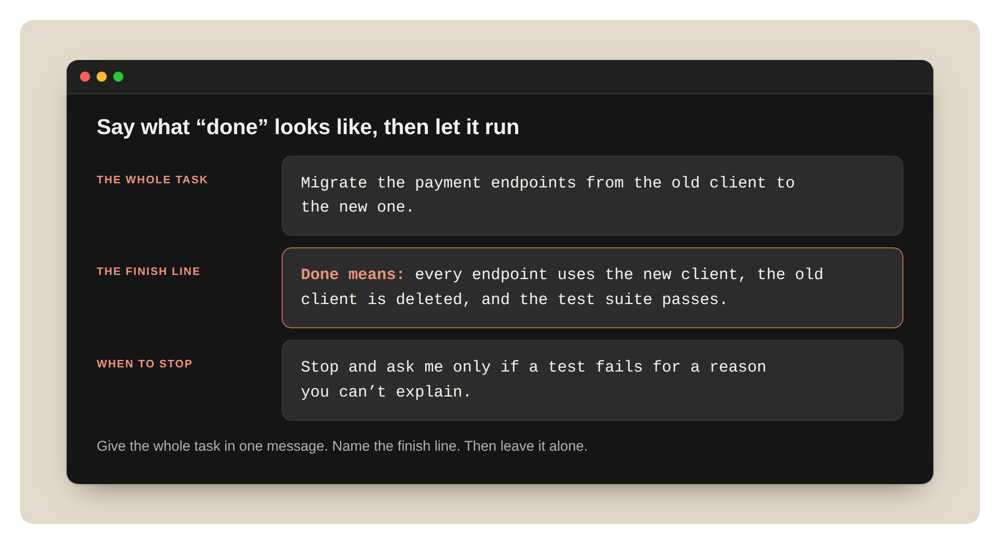
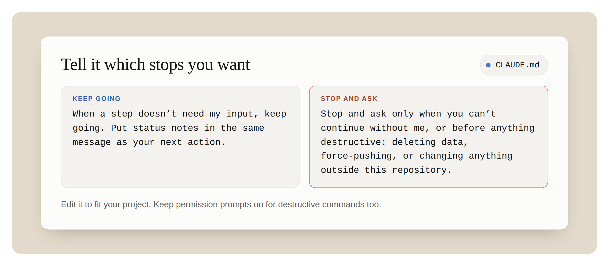
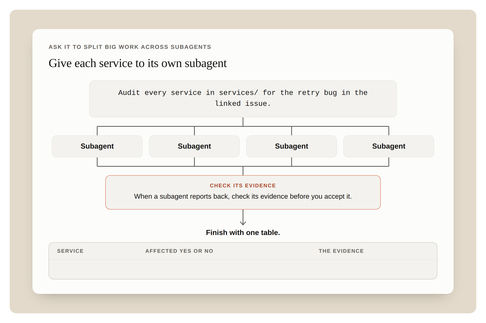
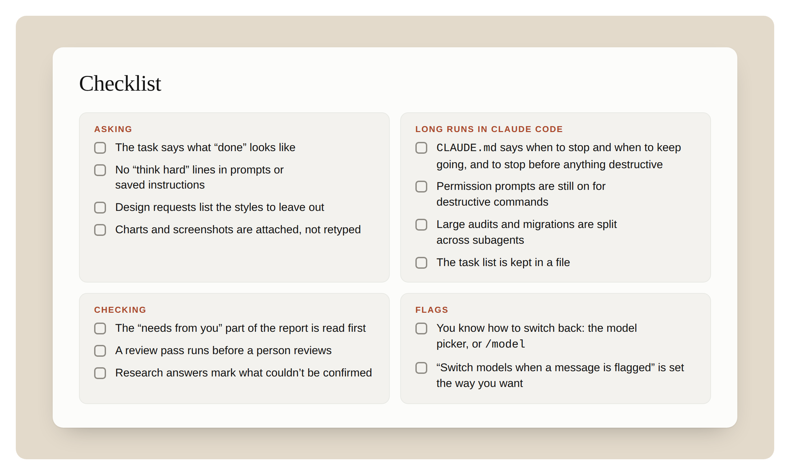

如何给 Opus 5.5 写提示词、引导长时间运行的任务，以及在 Claude 应用和 Claude Code 中检查结果。

Opus 5.5 能很好地适应您现在使用 Claude 的方式。不过，有几处表现不太一样：它能独立工作更长时间，会直白地告诉您它做了什么，并且每次回复前都会先思考。本指南介绍如何在 Claude 应用和 Claude Code 中与 Opus 5.5 协作，包括如何给模型写提示词、如何引导长时间运行的任务，以及如何检查结果。

{/* truncate */}

## 先试试这些

在第一次使用 Opus 5.5 时，可以先试试这三件事：

- 把整个任务交给它。说清楚“完成”是什么样子，以及您希望它在什么时候停下来问您。然后让它去做。
- 删掉“仔细思考”之类的语句。Opus 5.5 每次回复前本来就会思考。
- 长时间运行结束后，先看它需要您做什么。

## 如何提问

### 说清终点，然后放手

**做法。** 在一条消息里给出整个任务。说明终点线，比如“测试全部通过”或“每个接口都已迁移”。然后让它自己干。

**为什么这在 Opus 5.5 上很重要。** 在长时间、多环节的工作中，Opus 5.5 比 Opus 5 更能坚持下去。与之前的 Opus 模型相比，它进步最大的是多步骤工作，比如在一个大型代码库里把一项改动一路推进，直到测试通过。早期测试者让它在几乎无人看管的情况下连续跑了几个小时的长编程任务。有了清晰的终点线，它就知道什么时候算完成。

**怎么做。** 以 Claude Code 为例：

```text
把支付接口从旧客户端迁移到新客户端。
完成的标准是：每个接口都使用新客户端，旧客户端已删除，
并且测试套件全部通过。
只有当某个测试失败、而你又解释不了原因时，才停下来问我。
```



*图 A：一条消息，包含整个任务、终点线，以及何时停下。*

### 别再叫它“认真想想”

**做法。** 把“仔细思考”“一步一步地想”之类的语句从您的提示词和保存的指令里删掉。

**为什么这在 Opus 5.5 上很重要。** Opus 5.5 回复前总会先思考，而且由它自己决定想多少。您不需要叫它思考。我们在一款聊天产品中测试发现，删掉一行“仔细思考”后，回复开始得更快，质量也没有明显下降。

**怎么做。** 删掉这一行。如果只是想让它快速回答一个简单问题，就直接说：“直接回答。”在 Claude Code 中，如果想调整它的思考量，就改 effort。

### 运行中补充要求

**做法。** 如果在运行过程中想起了什么，您可以在它工作时直接输入补充消息。

**为什么这在 Opus 5.5 上很重要。** 现在的运行时间更长了，所以重新开始的代价也更高。

**怎么做。** 在 Claude Code 中，趁 Claude 工作时输入消息并按回车，比如：“另外，把旧的接口名保留为别名。”

### 列出不想要的设计风格

**做法。** 当您让它做一个页面、一个应用或一个 artifact 时，列出您希望它避开的设计习惯。

**为什么这在 Opus 5.5 上很重要。** 没有设计方向时，Opus 5.5 会退回到几种默认风格。像“避免千篇一律的样子”这种笼统的指令，多半只是把一种默认风格换成另一种。列出具体的样式要有效得多。

**怎么做。** 点名这些样式：

```text
做一个带占位内容的个人网站。
不要用奶油色或米白色背景、标题里的斜体强调词、
“01 / 02 / 03”这样的编号章节标签、等宽字体标签，
也不要用药丸形按钮。
```

然后看看它改用了什么。如果那个您也不喜欢，就把它也加进清单，再让它重做。

## Claude Code 长任务

### 说清在哪里停下

**做法。** 在 CLAUDE.md 文件里写一条简短的规则，说明什么时候该停下来问，什么时候该继续做。

**为什么这在 Opus 5.5 上很重要。** Opus 5.5 会在工作过程中随时向您汇报进展。在长任务中，它有时会停下来汇报而不是继续往下做：给出一段总结，点明下一步却不去执行；主动问要不要继续；或者列出一些并不影响工作推进的选项。只要指令里点明了这几种停顿，它就会照做。您希望它在哪里停下，也一并写清楚。

**怎么做。** 把下面这段加进 CLAUDE.md，并根据您的项目修改：

```text
当某一步不需要我的输入时，就继续做。把进度说明和你的下一个动作
放在同一条消息里。
只有在没有我就无法继续时，或者在做任何破坏性操作之前，才停下来问我：
删除数据、强制推送，或者改动这个仓库以外的任何东西。
```



*图 B：CLAUDE.md 里的规则：什么时候继续做，什么时候停下来问。*

如果运行停在“要我继续吗？”，就回复“继续”。如果这种情况经常发生，上面这条规则会有帮助。

让它继续做的规则意味着停顿更少，所以在任何有风险或难以撤销的操作之前，要保留您自己的检查。上面规则的最后一行就是干这个的。对破坏性命令也要保持权限确认开启。

如果是结对编程，您可能想要相反的效果：开始前给一行计划，结束时给一段简短的回顾。那就在 CLAUDE.md 里这么写。两种写法 Opus 5.5 都会遵循。

### 把大任务拆给子代理

**做法。** 对于跨大型代码库的审计、迁移或审查，让 Opus 5.5 把工作拆分给多个子代理，并检查每一份结果。

**为什么这在 Opus 5.5 上很重要。** 早期测试者曾让 Opus 5.5 在长时间的审计和迁移中协调多个并行子代理，几乎不需要人看管。

**怎么做。**

```text
针对关联 issue 里的重试 bug，审计 services/ 下的每一个服务。
每个服务交给一个单独的子代理。子代理汇报回来时，
先核查它的证据，再决定是否采纳。
最后给出一张表：服务、是否受影响，以及证据。
```



*图 C：分发给子代理，核查每个子代理的证据，最后汇总成一张表。*

### 任务清单放进文件

**做法。** 对于要跑一段时间的任务，让 Opus 5.5 把任务清单放在一个文件里，并边做边更新。然后通过读这个文件，而不是翻滚动记录，来了解运行到哪一步了。

**为什么这在 Opus 5.5 上很重要。** 现在的运行时间更长了。长时间运行会填满上下文窗口，这时 Claude Code 会对较早的对话轮次做摘要。放在文件里的清单不受影响，而且能让您一眼看出哪些做完了、哪些还没做。

**怎么做。** “在 TASKS.md 里维护一份清单。每完成一项就勾掉，发现新的事项也加进去。”

## 检查结果

### 先看需要您做什么

**做法。** 长时间运行结束后，先找找 Claude 有没有在等您处理的事，比如它留下未决的决定，或者一处需要您批准的改动。然后再看 Claude 总结的其余部分。

**为什么这在 Opus 5.5 上很重要。** Opus 5.5 汇报工作比 Opus 5 更清楚。它的进展更新和最终总结会用平实的语言说明它做了什么、发现了什么，以及需要您做什么。

**怎么做。** 如果想改变总结的格式，就在 CLAUDE.md 里写明，比如：“每次运行结束时用三个标题：等我处理的、改了什么、发现了什么。”

### 让它审查代码

**做法。** 在人工审查之前，先让 Opus 5.5 审查一遍 diff 或 pull request。

**为什么这在 Opus 5.5 上很重要。** 一位早期测试者说，最低 effort 下的 Opus 5.5 发现的 bug 比高 effort 下的 Opus 5 还多，误报也更少。它还会用平实的语言解释自己的改动，所以它写的 pull request 描述更容易审查。

**怎么做。** 把这段提示词交给 Claude：

```text
对照 main 审查这个分支上的 diff。
只列出你会因此阻止合并的问题。每个问题都给出
文件和行号、错在哪里，以及如何证明它会出错。
```

### 标出无法确认的内容

**做法。** 做调研和分析时，让它说明哪些内容没找到、哪些没法核实。

**为什么这在 Opus 5.5 上很重要。** “我没找到这个”本身就值得一读，而明确要求它说出来，您就能很容易找到这些地方。

**怎么做。** 在请求里加上“标出所有你无法确认的内容，并说明你查了哪些地方”。这在 Claude 的调研报告和 Claude Code 里都适用。

## 在 Claude 应用中

首先，确认模型选择器里显示的是 Opus 5.5。

### 直接发图表或截图

**做法。** 把图表、示意图、截图或幻灯片作为附件上传。不要把数字重新敲一遍。

**为什么这在 Opus 5.5 上很重要。** Opus 5.5 读图表、示意图和截图比 Opus 5 更准确，而且不需要任何额外步骤。它也更擅长理解那些取决于图中位置关系的含义：一个箭头连接的是哪两个框，同一张示意图的两个版本之间改了什么，或者日历截图里一个会议从几点开始、几点结束。

**怎么做。** 附上图片，并提一个具体的问题：“这些服务里，哪些是直接调用计费 API 的？”

### 让它检查长文档

**做法。** 给它一份很长的计划、报告或演示文稿，让它找出错误。

**为什么这在 Opus 5.5 上很重要。** 与之前的 Opus 模型相比，Opus 5.5 更关注细节。在我们的测试中，它在一个很长的规划讨论串里发现了一个日期和星期几对不上，还在一份演示文稿里发现了一张与数字不符的图表。

**怎么做。** 发送这段提示词：“检查这份演示文稿里有没有前后矛盾的地方：数字、日期和名字。引用每一处问题，并说明它在哪里。”

### 直接要成品文件

**做法。** 当您需要一份电子表格或文档时，直接要文件，而不是要大纲。

**为什么这在 Opus 5.5 上很重要。** 与 Opus 5 相比，Opus 5.5 做出来的电子表格和文档在分享之前需要修改的地方更少。

**怎么做。** “把这个做成一份我可以分享的电子表格：每个供应商一行，列包括费用、合同到期日和负责人。”

### 说明哪些回答已定

**做法。** 如果在一段很长的对话里，追问的回复感觉很慢，就加一条指令，说明之前的回答已经定了。

**为什么这在 Opus 5.5 上很重要。** 在很长的对话里，Opus 5.5 思考一个简短的追问时，有时会回头重新推敲之前的回答。这会拖慢回复。

**怎么做。** 把这段加到项目的指令里：

```text
一旦你回答过某个问题，就把那个回答当作已经完成。专注于
我现在问的内容，除非我问起之前的回答或指出其中的问题，
否则不要回头重新推敲。
```

如果项目是做长篇分析的，就别加这条，因为在那种项目里，后面的步骤可能会暴露前面某一步的错误。

## 当消息被标记时

Opus 5.5 是第一个在发布时就带有 Fable 级别生物和网络安全防护措施的 Opus 模型。在 Claude 应用和 Claude Code 中，大多数被标记的消息会被转到一个较早的模型上，您的工作会在那里继续。在源代码中查找安全漏洞是允许的，日常的健康和教育类问题也应该仍然可以正常使用。这些防护措施有时会误标正当的工作，我们正在调整它们，以减少错误标记。如果您被切换了模型，下面是您会看到的内容以及该怎么做。

### 在 Claude 应用中

**您会看到。** 一条以“Switched to”开头、后面跟着一个较早模型名称的提示。Claude 会用那个模型回答，并且这个对话会一直停留在那个模型上。

**该怎么做。**

- 要切回 Opus 5.5，在模型选择器里选中它。如果之前那条消息还在对话里，它可能会再次被标记。开一个新对话可以避免这种情况。
- 如果希望先征求您的同意，就依次进入“设置”→“功能”，关闭“消息被标记时切换模型”。之后您会看到一张“已暂停”卡片，上面列出了您可以选择的操作。

检查覆盖的是对话里的所有内容，包括文件和搜索结果。所以标记可能来自更早的内容，而不只是您最后一条消息。

### 在 Claude Code 中

**您会看到。** 一条写明较早模型名称的提示。会话会在那个模型上继续。

**该怎么做。**

- 运行 `/model` 切换回来。
- 按两次 Esc 编辑您的上一条消息，然后重试。
- 如果希望先征求您的同意，运行 `/config` 并修改“消息被标记时切换模型”。
- 如果标记有误，运行 `/feedback`。

### 别要求展示推理过程

**做法。** 从您的提示词和指令中删掉那些要求它在回复里复现内部推理的请求。

**为什么这在 Opus 5.5 上很重要。** 要求它在回复里复现内部推理的请求可能会被拒绝。这是标记类别之一。

**怎么做。** 改为直接向 Claude 要您需要的东西，比如：“用三句话解释你为什么选择这种做法。”

## 速度

### 等回复时开启快速模式

**做法。** 在 Claude Code 中，做来回往复的工作时使用快速模式，也就是您会读完每条回复再发下一条消息的那种工作。

**为什么这在 Opus 5.5 上很重要。** Opus 5.5 发布时就可以使用快速模式，作为研究预览版提供。模型还是同一个，只是文字出来得更快。它需要开启额外用量，而且每个 token 的价格比标准模式更高。

**怎么做。** 在 Claude 中输入 `/fast`。

## Opus 5.5 检查清单

在开始下一个长任务之前，把这份清单过一遍。



*图 D：清单一览。*

**提问**

- 任务里说明了“完成”是什么样子
- 提示词和保存的指令里没有“认真想想”之类的语句
- 设计请求里列出了要避开的风格
- 图表和截图是作为附件上传的，而不是重新敲进去的

**Claude Code 中的长时间运行**

- CLAUDE.md 里写明了什么时候停下、什么时候继续，以及在任何破坏性操作前都要停下
- 对破坏性命令仍然开启了权限确认
- 大型审计和迁移拆分给了多个子代理
- 任务清单放在文件里

**检查**

- 先读报告里“需要您做什么”的部分
- 在人工审查之前先跑一遍审查
- 调研回答标出了无法确认的内容

**标记**

- 您知道怎么切换回来：模型选择器，或者 `/model`
- “消息被标记时切换模型”已按您的需要设置好

---

*参考文章：[Getting the most out of Opus 5.5 in Claude and Claude Code](https://claude.dev/blog/getting-the-most-out-of-opus-5-5/)*
