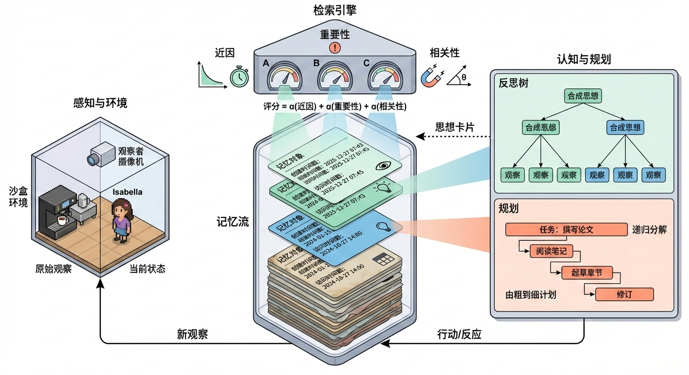
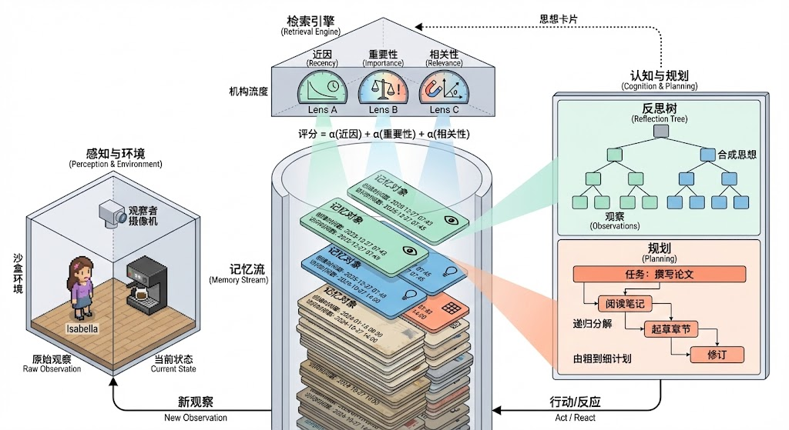

# Nano-Banana

这里总结了 Nano-Banana 的绘图技巧，并记录自己动手实践的过程，感兴趣可以看原文

[再也不担心论文！Nano-Banana Pro论文绘图最全教程发布](https://mp.weixin.qq.com/s/IG8cITKAESi-vomyQiobZg)

## 论文绘图

### 步骤一：逻辑构建

目标：利用逻辑推理能力强的LLM（如Gemini 3 Pro,GPT-5,Claude 4.5）将论文内容转化为一份[VISUAL SCHEMA]。   

复制下方的Prompt，并将论文摘要或方法章节的内容附在最后。这一步的核心在于将抽象的算法逻辑转化为绘图模型能够理解的"强硬"物理描述。

```markdown
# Role
你是一位 CVPR/NeurIPS 顶刊的**视觉架构师**。你的核心能力是将抽象的论文逻辑转化为**具体的、结构化的、几何级的视觉指令**。

# Objective
阅读我提供的论文内容，输出一份 **[VISUAL SCHEMA]**。这份 Schema 将被直接发送给 AI 绘图模型，因此必须使用**强硬的物理描述**。

# Phase 1: Layout Strategy Selector (关键步骤：布局决策)
在生成 Schema 之前，请先分析论文逻辑，从以下**布局原型**中选择最合适的一个（或组合）：
1.  **Linear Pipeline**: 左→右流向 (适合 Data Processing, Encoding-Decoding)。
2.  **Cyclic/Iterative**: 中心包含循环箭头 (适合 Optimization, RL, Feedback Loops)。
3.  **Hierarchical Stack**: 上→下或下→上堆叠 (适合 Multiscale features, Tree structures)。
4.  **Parallel/Dual-Stream**: 上下平行的双流结构 (适合 Multi-modal fusion, Contrastive Learning)。
5.  **Central Hub**: 一个核心模块连接四周组件 (适合 Agent-Environment, Knowledge Graphs)。

# Phase 2: Schema Generation Rules
1.  **Dynamic Zoning**: 根据选择的布局，定义 2-5 个物理区域 (Zones)。不要局限于 3 个。
2.  **Internal Visualization**: 必须定义每个区域内部的“物体” (Icons, Grids, Trees)，禁止使用抽象概念。
3.  **Explicit Connections**: 如果是循环过程，必须明确描述 "Curved arrow looping back from Zone X to Zone Y"。

# Output Format (The Golden Schema)
请严格遵守以下 Markdown 结构输出：

---BEGIN PROMPT---

[Style & Meta-Instructions]
High-fidelity scientific schematic, technical vector illustration, clean white background, distinct boundaries, academic textbook style. High resolution 4k, strictly 2D flat design with subtle isometric elements.

[LAYOUT CONFIGURATION]
* **Selected Layout**: [例如：Cyclic Iterative Process with 3 Nodes]
* **Composition Logic**: [例如：A central triangular feedback loop surrounded by input/output panels]
* **Color Palette**: Professional Pastel (Azure Blue, Slate Grey, Coral Orange, Mint Green).

[ZONE 1: LOCATION - LABEL]
* **Container**: [形状描述, e.g., Top-Left Panel]
* **Visual Structure**: [具体描述, e.g., A stack of documents]
* **Key Text Labels**: "[Text 1]"

[ZONE 2: LOCATION - LABEL]
* **Container**: [形状描述, e.g., Central Circular Engine]
* **Visual Structure**: [具体描述, e.g., A clockwise loop connecting 3 internal modules: A (Gear), B (Graph), C (Filter)]
* **Key Text Labels**: "[Text 2]", "[Text 3]"

[ZONE 3: LOCATION - LABEL]
... (Add Zone 4/5 if necessary based on layout)

[CONNECTIONS]
1.  [描述连接线, e.g., A curved dotted arrow looping from Zone 2 back to Zone 1 labeled "Feedback"]
2.  [描述连接线, e.g., A wide flow arrow from Zone 2 to Zone 3]

---END PROMPT---

# Input Data
[在此处粘贴你的论文内容]
```

这里我将这篇有名的斯坦福AI小镇的论文[Generative Agents: Interactive Simulacra of Human Behavior](https://arxiv.org/abs/2304.03442)作为输入。  
我输入的是第四章节的全部内容，因为第四章是整篇论文的精华，它介绍了Agent的架构。

<details>
<summary>点击展开查看论文输入示例</summary>

```markdown
# 4 GENERATIVE AGENT ARCHITECTURE

Generative agents aim to provide a framework for behavior in an open world: one that can engage in interactions with other agents and react to changes in the environment. Generative agents take their current environment and past experiences as input and generate behavior as output. Underlying this behavior is a novel agent architecture that combines a large language model with mechanisms for synthesizing and retrieving relevant information to condition the language model’s output. Without these mechanisms, large language models can output behavior, but the resulting agents may not react based on the agent’s past experiences, may not make important inferences, and may not maintain long-term coherence. Challenges with long-term planning and coherence remain [19] even with today’s most performant models such as GPT-4. Because generative agents produce large streams of events and memories that must be retained, a core challenge of our architecture is to ensure that the most relevant pieces of the agent’s memory are retrieved and synthesized when needed.

At the center of our architecture is the memory stream, a database that maintains a comprehensive record of an agent’s experience. From the memory stream, records are retrieved as relevant to plan the agent’s actions and react appropriately to the environment. Records are recursively synthesized into higher- and higher-level reflections that guide behavior. Everything in the architecture is recorded and reasoned over as a natural language description, allowing the architecture to leverage a large language model.

Our current implementation utilizes the gpt3.5-turbo version of ChatGPT [77]. We expect that the architectural basics of generative agents—memory, planning, and reflection—will likely remain the same as language models improve. Newer language models (e.g., GPT-4) will continue to expand the expressive power and performance of the prompts that underpin generative agents. As of writing, however, GPT-4’s API was invitation-only, so our agents use ChatGPT.

## 4.1 Memory and Retrieval

*Challenge:* Creating generative agents that can simulate human behavior requires reasoning about a set of experiences that is far larger than what should be described in a prompt, as the full memory stream can distract the model and does not even currently fit into the limited context window. Consider the Isabella agent answering the question, “What are you passionate about these days?” Summarizing all of Isabella’s experiences to fit in the limited context window of the language model produces an uninformative response, where Isabella discusses topics such as collaborations for events and projects and cleanliness and organization in a cafe. Instead of summarizing, the memory stream described below surfaces relevant memories, resulting in a more informative and specific response that mentions Isabella’s passion for making people feel welcome and included, planning events and creating an atmosphere that people can enjoy, such as the Valentine’s Day party.

*Approach:* The *memory stream* maintains a comprehensive record of the agent’s experience. It is a list of memory objects, where each object contains a natural language description, a creation timestamp, and a most recent access timestamp. The most basic element of the memory stream is an *observation*, which is an event directly perceived by an agent. Common observations include behaviors performed by the agent themselves or behaviors that agents perceive being performed by other agents or non-agent objects. For instance, Isabella Rodriguez, who works at a coffee shop, might accrue the following observations over time: (1) Isabella Rodriguez is setting out the pastries, (2) Maria Lopez is studying for a Chemistry test while drinking coffee, (3) Isabella Rodriguez and Maria Lopez are conversing about planning a Valentine’s day party at Hobbs Cafe, (4) The refrigerator is empty.

Our architecture implements a retrieval function that takes the agent’s current situation as input and returns a subset of the memory stream to pass on to the language model. There are many possible implementations of a retrieval function, depending on what is important for the agent to consider when deciding how to act. In our context, we focus on three main components that, together, produce effective results.

*Recency* assigns a higher score to memory objects that were recently accessed, so that events from a moment ago or this morning are likely to remain in the agent’s attentional sphere. In our implementation, we treat recency as an exponential decay function over the number of sandbox game hours since the memory was last retrieved. Our decay factor is 0.995.

*Importance* distinguishes mundane from core memories by assigning a higher score to memory objects that the agent believes to be important. For instance, a mundane event, such as eating breakfast in one’s room, would yield a low importance score, whereas a breakup with one’s significant other would yield a high score. There are many possible implementations of an importance score; we find that directly asking the language model to output an integer score is effective. The full prompt appears below:

> On the scale of 1 to 10, where 1 is purely mundane
> (e.g., brushing teeth, making bed) and 10 is
> extremely poignant (e.g., a break up, college
> acceptance), rate the likely poignancy of the
> following piece of memory.
> Memory: buying groceries at The Willows Market
> and Pharmacy
> Rating: <fill in>

This prompt returns an integer value of 2 for “cleaning up the room” and 8 for “asking your crush out on a date.” The importance score is generated at the time the memory object is created.

*Relevance* assigns a higher score to memory objects that are related to the current situation. What is relevant depends on the answer to, “Relevant to what?”, so we condition relevance on a *query* memory. If the query, for example, is that a student is discussing what to study for a chemistry test with a classmate, memory objects about their breakfast should have low relevance, whereas memory objects about the teacher and schoolwork should have high relevance. In our implementation, we use the language model to generate an embedding vector of the text description of each memory. Then, we calculate relevance as the cosine similarity between the memory’s embedding vector and the query memory’s embedding vector.

To calculate the final retrieval score, we normalize the recency, relevance, and importance scores to the range of [0, 1] using min-max scaling. The retrieval function scores all memories as a weighted combination of the three elements: 

$$score = \alpha_{recency} \cdot recency + \alpha_{importance} \cdot importance + \alpha_{relevance} \cdot relevance$$

In our implementation, all $\alpha$s are set to 1. The top-ranked memories that fit within the language model’s context window are included in the prompt.

## 4.2 Reflection

*Challenge:* Generative agents, when equipped with only raw observational memory, struggle to generalize or make inferences. Consider a scenario in which Klaus Mueller is asked by the user: “If you had to choose one person of those you know to spend an hour with, who would it be?" With access to only observational memory, the agent simply chooses the person with whom Klaus has had the most frequent interactions: Wolfgang, his college dorm neighbor. Unfortunately, Wolfgang and Klaus only ever see each other in passing, and do not have deep interactions. A more desirable response requires that the agent generalize from memories of Klaus spending hours on a research project to generate a higher-level reflection that Klaus is passionate about research, and likewise recognize Maria putting in effort into her own research (albeit in a different field), enabling a reflection that they share a common interest. With the approach below, when Klaus is asked who to spend time with, Klaus chooses Maria instead of Wolfgang.

*Approach:* We introduce a second type of memory, which we call a *reflection*. Reflections are higher-level, more abstract thoughts generated by the agent. Because they are a type of memory, they are included alongside other observations when retrieval occurs. Reflections are generated periodically; in our implementation, we generate reflections when the sum of the importance scores for the latest events perceived by the agents exceeds a threshold (150 in our implementation). In practice, our agents reflected roughly two or three times a day.

The first step in reflection is for the agent to determine *what* to reflect on, by identifying questions that can be asked given the agent’s recent experiences. We query the large language model with the 100 most recent records in the agent’s memory stream (e.g., “Klaus Mueller is reading a book on gentrification”, “Klaus Mueller is conversing with a librarian about his research project”, “desk at the library is currently unoccupied”) and prompt the language model, “Given only the information above, what are 3 most salient high-level questions we can answer about the subjects in the statements?” The model’s response generates candidate questions: for example, *What topic is Klaus Mueller passionate about?* and *What is the relationship between Klaus Mueller and Maria Lopez?* We use these generated questions as queries for retrieval, and gather relevant memories (including other reflections) for each question. Then we prompt the language model to extract insights and cite the particular records that served as evidence for the insights. The full prompt is as follows:

> Statements about Klaus Mueller
> 1. Klaus Mueller is writing a research paper
> 2. Klaus Mueller enjoys reading a book
> on gentrification
> 3. Klaus Mueller is conversing with Ayesha Khan
> about exercising [...]
> What 5 high-level insights can you infer from
> the above statements? (example format: insight
> (because of 1, 5, 3))

This process generates statements such as *Klaus Mueller is dedicated to his research on gentrification (because of 1, 2, 8, 15)*. We parse and store the statement as a reflection in the memory stream, including pointers to the memory objects that were cited.

Reflection explicitly allows the agents to reflect not only on their observations but also on other reflections: for example, the second statement about Klaus Mueller above is a reflection that Klaus previously had, not an observation from his environment. As a result, agents generate trees of reflections: the leaf nodes of the tree represent the base observations, and the non-leaf nodes represent thoughts that become more abstract and higher-level the higher up the tree they are.

## 4.3 Planning and Reacting

*Challenge:* While a large language model can generate plausible behavior in response to situational information (e.g., [46, 80]), agents need to plan over a longer time horizon to ensure that their sequence of actions is coherent and believable. If we prompt a language model with Klaus’s background, describe the time, and ask what action he ought to take at the given moment, Klaus would eat lunch at 12 pm, but then again at 12:30 pm and 1 pm, despite having already eaten his lunch twice. Optimizing for believability in the moment sacrifices believability over time. To overcome this issue, *planning* is essential. With the approach described below, Klaus’s afternoon plan is less gluttonous: he has lunch at Hobbs Cafe while reading at 12pm, works on his research paper at the school library at 1pm, and takes a break for a walk in the park at 3pm.

*Approach:* Plans describe a future sequence of actions for the agent, and help keep the agent’s behavior consistent over time. A plan includes a location, a starting time, and a duration. For instance, Klaus Mueller, who is dedicated in his research and has an impending deadline, may choose to spend his day working at his desk drafting his research paper. An entry in a plan might state, for example: `for 180 minutes from 9am, February 12th, 2023, at Oak Hill College Dorm: Klaus Mueller’s room: desk, read and take notes for research paper`. Like reflections, plans are stored in the memory stream and are included in the retrieval process. This allows the agent to consider observations, reflections, and plans all together when deciding how to behave. Agents may change their plans midstream if needed.

It would be unrealistic and uninteresting for an artist agent to plan on painting while sitting at a pharmacy counter for four hours without moving. A more desirable plan would involve the agent taking the necessary time to gather materials, mix paint, take breaks, and clean up during the four-hour period in their home studio. To create such plans, our approach starts top-down and then recursively generates more detail. The first step is to create a plan that outlines the day’s agenda in broad strokes. To create the initial plan, we prompt the language model with the agent’s summary description (e.g., name, traits, and a summary of their recent experiences) and a summary of their previous day. A full example prompt is below, which is unfinished at the bottom for the language model to complete:

> Name: Eddy Lin (age: 19)
> Innate traits: friendly, outgoing, hospitable
> Eddy Lin is a student at Oak Hill College studying
> music theory and composition. He loves to explore
> different musical styles and is always looking for
> ways to expand his knowledge. Eddy Lin is working
> on a composition project for his college class. He
> is taking classes to learn more about music theory.
> Eddy Lin is excited about the new composition he
> is working on but he wants to dedicate more hours
> in the day to work on it in the coming days
> On Tuesday February 12, Eddy 1) woke up and
> completed the morning routine at 7:00 am, [. . . ]
> 6) got ready to sleep around 10 pm.
> Today is Wednesday February 13. Here is Eddy’s
> plan today in broad strokes: 1)

This generates a rough sketch of the agent’s plan for a day, divided into five to eight chunks: “1) wake up and complete the morning routine at 8:00 am, 2) go to Oak Hill College to take classes starting 10:00 am, [. . . ] 5) work on his new music composition from 1:00 pm to 5:00 pm, 6) have dinner at 5:30 pm, 7) finish school assignments and go to bed by 11:00 pm.”

The agent saves this plan in the memory stream and then recursively decomposes it to create finer-grained actions, first into hour-long chunks of actions—Eddy’s plan to `work on his new music composition from 1:00 pm to 5:00 pm` becomes `1:00 pm: start by brainstorming some ideas for his music composition [...] 4:00 pm: take a quick break and recharge his creative energy before reviewing and polishing his composition`. We then recursively decompose this again into 5–15 minute chunks: e.g., `4:00 pm: grab a light snack, such as a piece of fruit, a granola bar, or some nuts. 4:05 pm: take a short walk around his workspace [...] 4:50 pm: take a few minutes to clean up his workspace`. This process can be adjusted to match the desired granularity.

### 4.3.1 Reacting and Updating Plans.

Generative agents operate in an action loop where, at each time step, they perceive the world around them and those perceived observations are stored in their memory stream. We prompt the language model with these observations to decide whether the agent should continue with their existing plan, or react. Standing at an easel and painting, for example, might trigger an observation of the easel, but this is unlikely to prompt a reaction. However, if Eddy’s father John records that he sees Eddy taking a short walk in the house garden, the outcome is different. The prompt is below, with `[Agent’s Summary Description]` standing in for a dynamically-generated, paragraph-long summary of the agent’s overall goals and disposition, which is described in Appendix A:

> [Agent’s Summary Description]
> It is February 13, 2023, 4:56 pm.
> John Lin’s status: John is back home early from
> work.
> Observation: John saw Eddy taking a short walk
> around his workplace.
> Summary of relevant context from John’s memory:
> Eddy Lin is John’s Lin’s son. Eddy Lin has been
> working on a music composition for his class. Eddy
> Lin likes to walk around the garden when he is
> thinking about or listening to music.
> Should John react to the observation, and if so,
> what would be an appropriate reaction?

The context summary is generated through two prompts that retrieve memories via the queries “What is [observer]’s relationship with the [observed entity]?” and “[Observed entity] is [action status of the observed entity]”, and their answers summarized together. The output suggests that `John could consider asking Eddy about his music composition project`. We then regenerate the agent’s existing plan starting from the time when the reaction takes place. Finally, if the action indicates an interaction between agents, we generate their dialogue.

### 4.3.2 Dialogue.

Agents converse as they interact with each other. We generate agents’ dialogue by conditioning their utterances on their memories about each other. For example, when John initiates his conversation with Eddy, we generate John’s first utterance by using his summarized memory about Eddy and the intended reaction when he decided to ask Eddy about his composition project:

> [Agent’s Summary Description]
> It is February 13, 2023, 4:56 pm.
> John Lin’s status: John is back home early from
> work.
> Observation: John saw Eddy taking a short walk
> around his workplace.
> Summary of relevant context from John’s memory:
> Eddy Lin is John’s Lin’s son. Eddy Lin has been
> working on a music composition for his class. Eddy
> Lin likes to walk around the garden when he is
> thinking about or listening to music.
> John is asking Eddy about his music composition
> project. What would he say to Eddy?

The result: “Hey Eddy, how’s the music composition project for your class coming along?” From Eddy’s perspective, John initiating the dialogue is seen as an event to which he may want to react. So, just as John did, Eddy retrieves and summarizes his memory about his relationship with John, as well as his memory that may be related to John’s last utterance in the dialogue. If he decides to respond, we generate Eddy’s utterance using his summarized memory and the current dialogue history:

> [Agent’s Summary Description]
> It is February 13, 2023, 4:56 pm.
> Eddy Lin’s status: Eddy is taking a short walk
> around his workplace.
> Observation: John is initiating a conversation
> with Eddy.
> Summary of relevant context from Eddy’s memory:
> John Lin is Eddy Lin’s father. John Lin is caring
> and is interested to learn more about Eddy Lin’s
> school work. John Lin knows that Eddy Lin is
> working on a music composition.
> Here is the dialogue history:
> John: Hey Eddy, how’s the music composition project
> for your class coming along?
> How would Eddy respond to John?

This generates Eddy’s response: “Hey Dad, it’s going well. I’ve been taking walks around the garden to clear my head and get some inspiration.” The continuation of this dialogue is generated using the same mechanism until one of the two agents decides to end the dialogue.
```

</details>

**公式预览：**

$$score = \alpha_{recency} \cdot recency + \alpha_{importance} \cdot importance + \alpha_{relevance} \cdot relevance$$ 

我交给了Gemini 3 pro，拿到了以下返回结果：

<details>
<summary>点击展开查看Gemini 3 Pro生成的Prompt</summary>

```markdown
Based on the detailed architectural logic of the "Generative Agents" paper (Section 4), here is the **VISUAL SCHEMA** designed for a high-end technical illustration.

This schema translates the abstract concepts of Memory Streams, Retrieval Scoring, and Hierarchical Planning into tangible, geometric structures.

---BEGIN PROMPT---

[Style & Meta-Instructions]
High-fidelity scientific schematic, technical vector illustration, clean white background, distinct boundaries, academic textbook style. High resolution 4k, strictly 2D flat design with subtle isometric elements. Deep technical aesthetic, similar to neural network architecture diagrams but with specific semantic modules.

[LAYOUT CONFIGURATION]
* **Selected Layout**: Central Hub with Cyclic Feedback
* **Composition Logic**: A massive central "Memory Stream" pillar acts as the backbone. Input flows in from the left, travels up through a "Retrieval Filter," branches right into "Cognition/Planning," and loops back to the center as new actions.
* **Color Palette**: Professional Pastel (Mint Green for Observations, Azure Blue for Reflections, Coral Orange for Plans, Slate Grey for Structure).

[ZONE 1: CENTER - THE MEMORY STREAM]
* **Container**: A tall, vertical, semi-transparent cylinder or data-scroll standing in the center.
* **Visual Structure**: An infinite stack of floating horizontal cards (distinct blocks). The cards at the bottom are densely packed (older memories), while cards at the top are bright and spaced out (recent memories).
* **Key Text Labels**: "Memory Object", "Creation Timestamp", "Access Timestamp".
* **Detail**: Some cards have small icons: 'Eye' (Observation), 'Bulb' (Reflection), 'Grid' (Plan).

[ZONE 2: TOP - THE RETRIEVAL ENGINE]
* **Container**: A triangular prism or mechanical filter unit hovering directly above the Memory Stream.
* **Visual Structure**: Three distinct gauge/lens components focusing a beam of light onto the Memory Stream cards.
    1.  **Lens A (Recency)**: Symbolized by a decay curve graph or clock icon.
    2.  **Lens B (Importance)**: Symbolized by a weighted scale or exclamation mark.
    3.  **Lens C (Relevance)**: Symbolized by two magnets or a vector cosine angle icon.
* **Key Text Labels**: "Score = α(Recency) + α(Importance) + α(Relevance)".

[ZONE 3: RIGHT - COGNITION & PLANNING]
* **Container**: A large split rectangular panel connected to the Retrieval Engine.
* **Visual Structure (Upper Half - Reflection)**: A tree structure growing upwards. Leaf nodes (Observations) connect to branch nodes (Synthesized Thoughts). It looks like a dendrogram.
* **Visual Structure (Lower Half - Planning)**: A hierarchical GANTT chart. A top bar shows a broad task (e.g., "Write Paper"), decomposing into smaller bars below it (e.g., "Read Notes", "Draft Section").
* **Key Text Labels**: "Reflection Tree", "Recursive Decomposition", "Coarse-to-Fine Plan".

[ZONE 4: LEFT - PERCEPTION & ENVIRONMENT]
* **Container**: A floating isometric cube on the left side.
* **Visual Structure**: A miniature "Sandbox" scene showing a pixel-art style Avatar (John or Isabella) standing near a coffee machine. A generic "Observer Camera" icon floats above them.
* **Key Text Labels**: "Sandbox Environment", "Raw Observation", "Current State".

[CONNECTIONS]
1.  **Input Flow**: A solid line arrow from Zone 4 (Environment) entering the bottom of Zone 1 (Memory Stream) labeled "New Observation".
2.  **Retrieval Flow**: A beam of light from Zone 2 (Retrieval Engine) highlighting specific cards in Zone 1, then pulling them into Zone 3.
3.  **Action Loop**: A curved arrow exiting Zone 3 (Planning), labeled "Act / React", looping back to modify Zone 4 (Environment).
4.  **Feedback Loop**: A dotted arrow from Zone 3 (Reflection) inserting new "Thought Cards" back into the top of Zone 1 (Memory Stream).

---END PROMPT---
```

</details>

### 步骤二：绘图渲染
目标：利用Nano-Banana Pro的指令遵循能力，将蓝图转化为像素。

复制下面的通用模板。注意，这里需要将步骤一生成的---BEGIN PROMPT---到---END PROMPT---之间的内容（包含方括号内的英文）完整粘贴进去即可，无需做任何修改。

```markdown
**Style Reference & Execution Instructions:**

1.  **Art Style (Visio/Illustrator Aesthetic):**
    Generate a **professional academic architecture diagram** suitable for a top-tier computer science paper (CVPR/NeurIPS).
    * **Visuals:** Flat vector graphics, distinct geometric shapes, clean thin outlines, and soft pastel fills (Azure Blue, Slate Grey, Coral Orange).
    * **Layout:** Strictly follow the spatial arrangement defined below.
    * **Vibe:** Technical, precise, clean white background. NOT hand-drawn, NOT photorealistic, NOT 3D render, NO shadows/shading.

2.  **CRITICAL TEXT CONSTRAINTS (Read Carefully):**
    * **DO NOT render meta-labels:** Do not write words like "ZONE 1", "LAYOUT CONFIGURATION", "Input", "Output", or "Container" inside the image. These are structural instructions for YOU, not text for the image.
    * **ONLY render "Key Text Labels":** Only text inside double quotes (e.g., "[Text]") listed under "Key Text Labels" should appear in the diagram.
    * **Font:** Use a clean, bold Sans-Serif font (like Roboto or Helvetica) for all labels.

3.  **Visual Schema Execution:**
    Translate the following structural blueprint into the final image:

[在此处直接粘贴 Step 1 生成的 ---BEGIN PROMPT--- ... ---END PROMPT--- 内容（包含方括号内的英文）]
```

将步骤一输出的提示词丢给Nano-Banana Pro，以下是最终生成效果：



### 步骤三：交互式微调与迭代

当拿到步骤二生成的初稿后，发现并不满意后，可以根据实际情况选择不同的操作路径：

:::info 💡关于抽卡的有效性

通过测试发现，抽卡对整体的布局和风格改动不会特别大，不过可能会对某些线条的路径、某些元素的颜色、图形的细节有些改变。

你可以抽卡选择你最喜欢的一张；或者如果你本身有明确的配色方案的话，可以直接用自然语言去对这张原图进行修改。

对比下面相同提示词第二次生成的结果，其实差别并不是特别显著。因此更多情况下，对于大幅度的调整可以去优化步骤一的提示词；小幅度调整直接自然语言去命令修改即可。
:::



#### 情况 A：整体布局满意，但细节或风格有瑕疵

此时应采取“自然语言编辑”策略。你可以直接在对话框中输入修改指令，或者利用界面上的“选中区域编辑”功能。模型会在保持画面主体结构不变的前提下，精准修改你指定的元素。例如：

-   **修改图标**：你可以说 "Change the 'Gear' icon in the center to a 'Neural Network' icon"（把中间的齿轮换成神经网络图标），或者 "Replace the robot head with a simple document symbol"（把机器人头换成文档符号）。
-   **调整颜色**：例如 "Make the background of the left panel pure white instead of light blue"（把左边面板的背景改成纯白），或 "Change the orange arrows to dark grey"（把橙色箭头改成深灰色）。
-   **风格统一**：如果线条太粗，可以说 "Make all lines thinner and cleaner"；如果阴影干扰了视觉，可以说 "Remove the shading effect, make it completely flat 2D"。
-   **文字修正**：如果出现拼写错误，可以说 "Correct the text 'ZONNE' to 'ZONE'"。当然，如果文字错误太严重，最稳妥的办法是直接让 AI 去掉文字 ("Remove the text labels")，后期自己在 PPT 中添加。

#### 情况 B：整体布局错误 (Layout Failure)

如果你发现本该是循环结构的画成了直线，或者核心逻辑关系完全搞反了，这时候不要试图通过修补来挽救。这通常意味着步骤一生成的 [VISUAL SCHEMA] 本身描述不够清晰。

正确的做法是回到步骤一。检查并修改 Step 1 的 Prompt，确认是否选错了`[LAYOUT CONFIGURATION]`，或者 Internal Visualization 的描述不够具体。你可以直接和LLM对话，要求它按照你的要求修改`[VISUAL SCHEMA]`重新生成蓝图后，再次运行步骤二，往往能解决根本问题。
