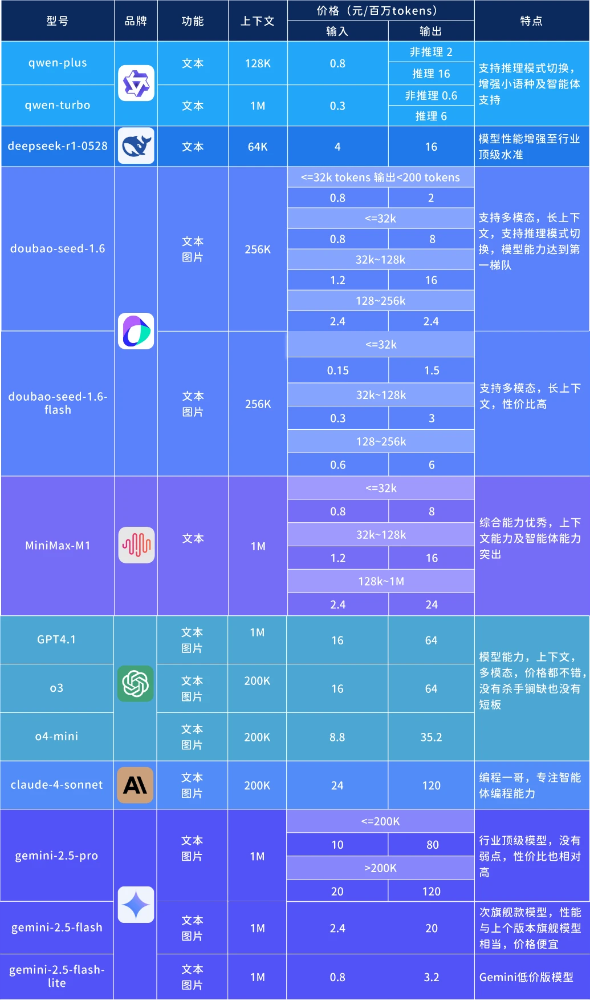
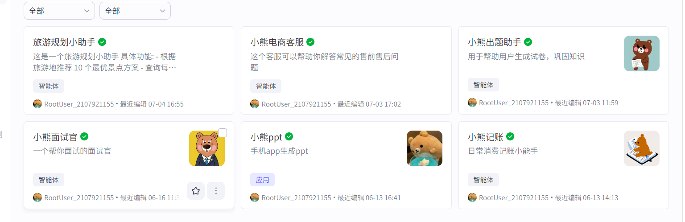

# 实战问题

---

## 第一场

### 1.自我介绍  

面试官您好，我叫黄思陶，是一名大数据专业的应届毕业生，在一次偶然的机会接触到了Cursor，让我感受到ai应用的强大，也激起了我对人工智能的兴趣，尤其是agent大模型应用方面。

在校期间，我参与人工智能实验室，专注于coze智能平台的开发以及对常见的深度学习算法进行学习，在coze平台上我成功开发上线了6个智能体，积累了一定的智能体开发经验。并且我通过了大学英语六级以及软考中级信息安全工程师，也拿过阿里云天池比赛的第二名，这也为后续在ai领域的学习奠定了基础。

之前在一个科技公司实习期间，我参与了基于LangGraph的智能面试官开发项目，负责rag知识库搭建、agent架构逻辑设计，以及工具模块的实现。
作为实习生嘛，刚开始公司安排我基于LangGraph开源项目进行二次开发，锻炼我独立开发能力，我通过提示词深度集成千问模型，成功开发了一个深度搜索agent并通过docker部署到阿里云服务器，得到了公司的认可。  

未来呢，我也希望能够深耕ai应用方向，让ai融入我们的生活

### 2.你对AI应用怎么理解？

AI应用就是通过人工智能技术去解决实际问题、创造价值的过程，比如NLP领域的智能客服/自动翻译；机器视觉的人脸识别，智能驾驶都实现了从技术实现到行业落地。目前ai发展趋势是多模态ai和agent去处理复杂任务。

### 3.你用过哪些常见大模型？分别有什么特点，使用的感受是什么？

:::info 追问：使用的模型是什么型号？

:::

### 4.Deepseek V3和R1的区别？

DeepSeek V3 是一个通用大语言模型，强调多任务处理和生成速度，适合内容创作、对话等场景；  
而 DeepSeek R1 则在 V3 的基础上通过强化学习大幅增强了逻辑推理和链式思考能力，更擅长数学、代码和结构化推理任务  

### 5.还有用过其他的模型吗？

### 6.你对提示词工程是怎么理解的，你在使用过程中对提示词有什么看法？

提示词工程其实是一种**软编程**，通过过精心设计输入的文本提示，利用语言自然的方式去约束和调节模型  
“一个好的提示词，首先要做到清晰、具体、可引导。一般来说，会遵循三个核心原则：  
1️⃣角色化：告诉模型它是谁，比如『你是一名资深 Python 工程师』，这样它就用专业角度回答  
2️⃣任务明确：具体说清要它做什么，比如『请逐步推理解决这个逻辑问题，并输出每一步』，避免模糊的『帮我看看』  
3️⃣输出格式：最好告诉它输出形式，比如『请以 markdown 列表输出步骤』或『请返回 JSON』，这样后期还可以程序读取  

### 7.你用过大模型应用框架，比如coze，dify吗？

大学期间在人工智能实验室用过coze搭建6个智能体，并且上线了自定义插件火车票查询，熟悉基本的组件使用和插件调用

dify还有n8n自己有去主动了解过，都是差不多的原理，最大区别就是dify是开源的，可以本地部署，数据完全可控，适合企业级定制，可接入的模型型号也很多，包括OpenAI，Claude等

而coze仅支持国产的deepseek和qwen等模型，适合对话场景依靠平台插件，定制复杂流程不够灵活
:::info 追问：用来做了什么？

:::

### 8.你试过AI辅助编程吗？比如说Cursor

有的，cursor、winsurf和trae都有试过

### 9.你有没有尝试过用ai辅助你去完成一个项目？流程是怎么样的，怎么用ai去辅助你完成的呢?

完成过毕设项目《基于django的大学生情绪追踪与分析系统》，主要是先分析自己需要使用的技术栈，然后先通过一个通用大模型列出逻辑大纲，然后在大纲上进行提示词调整，最好一次性写完所有需求，并分步骤列出，最后再不断的迭代修改，直到满足自己的项目需求

### 10.你有了解过ai问答机器人吗？你是怎么实现的？涉及到了哪些东西？

有的，比如coze搭建的智能电商客服，通过提示词的设定和工作流搭建售前售后两个知识库，将结果丢给大模型进行规整然后输出

还有基于langchain搭建的多模态聊天助手，整合多种工具，支持联网搜索、音频识别、会议纪要生成、发票识别和手写体识别

### 11.大模型有些知识本身不具备怎么解决？

- 用检索增强生成。让模型实时拉外部数据，比如接个知识库或爬网页。我实习时搞过LangGraph项目，用RAG技术，教AI读PDF文档，补足它不懂的知识，效果挺不错。

- 用MCP也可以，比如问它“2025年新政策”，它自己查不到，但通过联网搜索就能答了。

- 微调模型。如果项目有特定需求，可以拿小数据集再训一下模型，让它学点新东西。比如我之前搞情绪追踪系统，用人工标注的常见文本数据微调BERT让它更懂大学生的聊天语境，准确率显著提高。不过这得收集数据和算力，时间成本比较高。

### 12.RAG实现的流程？

### 13.目前有没有使用过付费模型？

### 14.有没有玩过一些爬虫，数据采集的项目？

---

## 第二场

### 1.请先自我介绍，有相关的实习经历可以分享一下？

### 2.你的这些项目有没有实际应用？

### 3.实习经历是自己找的还是学校的校招？

:::info 实习公司的业务类型是什么？

:::

### 4.你当时的工作内容是什么？

:::warning 你做的这些项目都是自己的还是甲方的？

:::

### 5.项目人员情况？各负责什么工作？

### 6.未来的职业发展规划？

### 7.自己是什么性格的人？

### 8.本专业排名前20，那你们专业多少人？

### 9.有什么想问的？

---

## 第三场

### 1.你在公司做的主要项目是哪个？

### 2.项目背景是什么？

### 3.项目产品是用于什么的？

### 4.你在团队负责工作的内容？

### 5.你的项目挺复杂的，为什么当时没有考虑用低代码coze，dify来搭建呢？

### 6.进入公司后的五年展望或者规划？深耕技术领域吗？具体方向是什么？

### <mark>7.怎么用大模型为企业降本增效？为公司提供哪些价值，比如说哪些场景</mark>

:::info 具体一点的Agent应用呢？

:::

### 8.你掌握的技术栈比较精通的有些？

### 9.如果你是ai应用工程师，现在要做一个简历手写体识别并数据化存到数据库，你会怎么去实现？

:::warning 大模型应用和开发是有很大区别的，基本都是现成去使用！
:::
