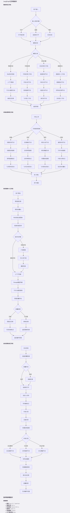

# 实战问题

## 项目通用问题

### 1.项目概述

### 2.你做了什么工作呢？

我主要负责基于LangGraph的智能Agent系统设计和开发，具体包括：

**核心Agent架构设计**  

- 设计了多个专门化的Agent节点：客服对话Agent、文档处理Agent、知识检索Agent、会议纪要Agent  
- 构建了Agent之间的工作流编排，实现多模态输入的智能路由和处理  
- 设计了状态管理机制，确保不同Agent之间的数据传递和上下文保持

**RAG知识管理系统**  

- 基于LangChain实现了企业知识库的向量化存储和检索
- 设计了文档分块、嵌入和索引策略，优化检索准确性
- 实现了知识库的动态更新和版本管理机制
- 多模态处理流水线
- 集成语音转文字、OCR文字识别等多模态输入处理
- 设计了统一的消息格式和处理流程，支持文字、语音、图片等多种输入

**Agent决策逻辑优化**  

- 实现了基于意图识别的智能路由，根据用户输入自动选择合适的处理Agent
- 设计了回退机制和异常处理流程，提高系统鲁棒性

### 3.你用了什么技术？

- LangGraph: 用于构建复杂的Agent工作流，实现状态管理和节点编排
- LangChain: 实现RAG检索、文档处理、模型调用等基础功能
- 千问大模型API: 作为核心的语言理解和生成引擎
- 向量数据库: 用于企业知识的向量化存储和相似度检索
- FastAPI: 构建后端API服务，处理前端请求

### 4.遇到什么困难？

#### 问题1: RAG检索准确性不足

初期知识检索经常返回不相关的结果，影响回答质量

**解决方案:**

- 优化了文档分块策略，采用语义分块而非固定长度分块
- 实现了混合检索（关键词+向量），提高召回率
- 加入了重排序模块，使用交叉编码器对检索结果进行二次排序
- 设置了相似度阈值，低于阈值时明确告知用户没有相关信息

#### 问题2：大模型调用的延迟和成本控制

频繁的模型调用导致响应延迟高，成本快速上升

**解决方案:**  

- 实现了智能缓存命中机制，相似问题直接返回缓存结果
- 设计了模型调用的优先级队列，重要请求优先处理
- 使用流式输出，提升用户体验
- 实现了请求合并，将多个小请求合并为批量处理

#### 问题3：多Agent协作的状态一致性问题

不同Agent处理同一个用户请求时，状态信息容易丢失或冲突

**解决方案:**

设计了统一的状态管理器，使用LangGraph的状态图机制，确保每个节点都能访问和更新全局状态。实现了状态快照和回滚机制，保证数据一致性

### 5.agent工作流

## 第二场

### 1.请先自我介绍，有相关的实习经历可以分享一下？

### 2.你的这些项目有没有实际应用？

### 3.实习经历是自己找的还是学校的校招？

:::info 实习公司的业务类型是什么？

:::

### 4.你当时的工作内容是什么？

:::warning 你做的这些项目都是自己的还是甲方的？

:::

### 5.项目人员情况？各负责什么工作？

当时是有四个人的团队，团队成员包括一名经验丰富的后端工程师带我一起负责开发，一个前端工程师负责UI设计，还有一名测试运维人员负责测试和部署支持，我主要是负责开发Agent逻辑，工具模块以及rag知识库搭建

### 6.未来的职业发展规划？

### 7.自己是什么性格的人？

### 8.本专业排名前20，那你们专业多少人？

### 9.有什么想问的？

---

## 第三场

### 1.你在公司做的主要项目是哪个？

### 2.项目背景是什么？

### 3.项目产品是用于什么的？

### 4.你在团队负责工作的内容？

### 5.你的项目挺复杂的，为什么当时没有考虑用低代码coze，dify来搭建呢？

### 6.进入公司后的五年展望或者规划？深耕技术领域吗？具体方向是什么？

### `<mark>`7.怎么用大模型为企业降本增效？为公司提供哪些价值，比如说哪些场景`</mark>`

- 客户服务 - 智能客服电商平台使用大模型驱动的聊天机器人，自动回答"售前售后"等常见问题,减少人工客服需求
- 内容生成 - 营销文案广告公司用大模型生成多版本广告文案和社交媒体帖子，降低创意团队工作量
- 数据管理 - 搭建知识库
  使用大模型连接公司内部知识库，自动整理成结构化知识库，回答员工关于流程或政策的疑问。

:::info 具体一点的Agent应用呢？

:::

### 8.你掌握的技术栈比较精通的有些？

### 9.如果你是ai应用工程师，现在要做一个简历手写体识别并数据化存到数据库，你会怎么去实现？

:::warning 大模型应用和开发是有很大区别的，基本都是现成去使用！
:::

## 最新问题

### 1.列表和元组有什么区别？

### 2.生成器有了解过吗？

### 3.init，str有什么区别？

### 4.并发编程有了解过吗？

### 5.多线程和多进程使用什么实现的，各自应用在什么场景?

### 6.你在项目过程中是否遇到什么难点，都是怎么解决的？

### 7.介绍一下你了解的大模型相关的技术

### 8.你做过什么大模型应用吗

### 9.你说一下为在线教育平台搭建的智能答疑系统具体是怎么做的，几个人做的？

### 10.你觉得你做的这两个项目有哪些好的地方和不好的地方

### 11.agent工作流是你们怎么设计的

### 12.rag知识库是怎么搭建的

### 13.使用python语言，如何对字符串中每个单词进行翻转，你会怎么写

### 14.除了fastapi，你会什么后端框架技术，djiango会吗?

### 15.你说说RAG知识库设计流程?

### 16.你是使用什么方法把其它类型文件转化为PDF，转化为pdf后你又是怎么处理的?如果图片数据用OCR识别出来之后出现错误(如O和0)，你会怎么处理?

### 17.你使用的什么向量数据库？

### 18.如果大模型回答的内容不准确，你会怎么做?

### 19.大模型有哪些参数可调，各个参数代表什么含义?

### 20.你们项目几个人做的，你负责哪一部分？

### 21.你使用过什么AI编程软件？

### 22.你使用过什么大模型？

### 23.熟悉传统机器学习算法，那讲一下决策树和随机森林

### 24.你有了解过 transformer 吗?介绍一下

### 25.你熟悉深度学习框架 pytorch,简单介绍一下这个框架

### 26.当用户同时输入多个不同意图的问题时，模型能准确识别到你的意图吗?你怎么解决的

### 27.你的意图识别，模型时怎么意图识别的

### 28.用户咨询时的表达口语化，碎片化，错别字，歧义，这个你怎么调整的

### 29.你的大模型如果给出错误的答案，你怎么去解决

### 30.简单介绍一下你在项目中用到的yolov5模型框架，用的v5那个模型
