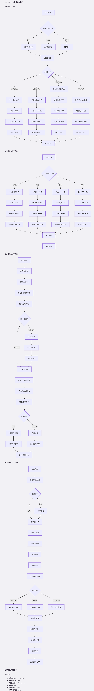
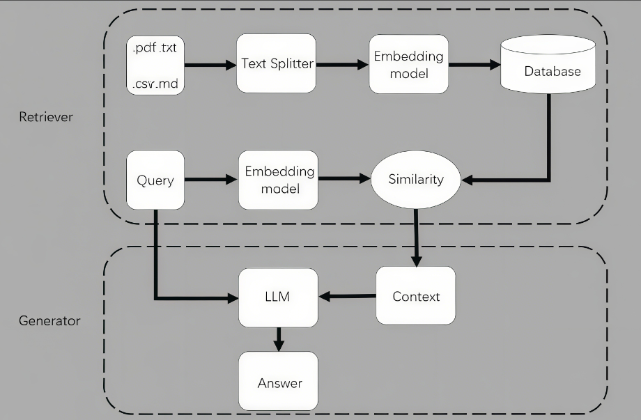

# 实战问题

## 项目通用问题

### 1.项目概述

### 2.你做了什么工作呢？

我主要负责基于LangGraph的智能Agent系统设计和开发，具体包括：

**核心Agent架构设计**  

- 设计了多个专门化的Agent节点：客服对话Agent、文档处理Agent、知识检索Agent、会议纪要Agent  
- 构建了Agent之间的工作流编排，实现多模态输入的智能路由和处理  
- 设计了状态管理机制，确保不同Agent之间的数据传递和上下文保持

**RAG知识管理系统**  

- 基于LangChain实现了企业知识库的向量化存储和检索
- 设计了文档分块、嵌入和索引策略，优化检索准确性
- 实现了知识库的动态更新和版本管理机制
- 多模态处理流水线
- 集成语音转文字、OCR文字识别等多模态输入处理
- 设计了统一的消息格式和处理流程，支持文字、语音、图片等多种输入

**Agent决策逻辑优化**  

- 实现了基于意图识别的智能路由，根据用户输入自动选择合适的处理Agent
- 设计了回退机制和异常处理流程，提高系统鲁棒性

### 3.你用了什么技术？

- LangGraph: 用于构建复杂的Agent工作流，实现状态管理和节点编排
- LangChain: 实现RAG检索、文档处理、模型调用等基础功能
- 千问大模型API: 作为核心的语言理解和生成引擎
- 向量数据库: 用于企业知识的向量化存储和相似度检索
- FastAPI: 构建后端API服务，处理前端请求

### 4.遇到什么困难？

#### 问题1: RAG检索准确性不足

初期知识检索经常返回不相关的结果，影响回答质量

**解决方案:**

- 优化了文档分块策略，采用语义分块而非固定长度分块
- 实现了混合检索（关键词+向量），提高召回率
- 加入了重排序模块，使用交叉编码器对检索结果进行二次排序
- 设置了相似度阈值，低于阈值时明确告知用户没有相关信息

#### 问题2：大模型调用的延迟和成本控制

频繁的模型调用导致响应延迟高，成本快速上升

**解决方案:**  

- 实现了智能缓存命中机制，相似问题直接返回缓存结果
- 设计了模型调用的优先级队列，重要请求优先处理
- 使用流式输出，提升用户体验
- 实现了请求合并，将多个小请求合并为批量处理

#### 问题3：多Agent协作的状态一致性问题

不同Agent处理同一个用户请求时，状态信息容易丢失或冲突

**解决方案:**

设计了统一的状态管理器，使用LangGraph的状态图机制，确保每个节点都能访问和更新全局状态。实现了状态快照和回滚机制，保证数据一致性

### 5.agent工作流

---

## 第一场

### 1.自我介绍

面试官您好，我叫黄思陶，是一名大数据专业的应届毕业生，毕业于广州工商学院，是一所双非民办二本，在校期间，我担任人工智能实验室助理，学习过langchain、coze平台的智能体开发和机器学习算法，参加过阿里云算法竞赛，并在两万多团队的比赛中拿过第二名，并且比赛心得我也分析到我的个人博客上，可以扫简历上的二维码查看。语言水平的话，我通过英语六级，能够流畅阅读国外的开源项目和技术文档

说说我的实习经历吧，之前在深圳聚泉鑫公司做过ai应用工程师，我在这家公司做了一个企业内部办公智能体，之前的话，他们只是简单地用RPA来自动化一些重复性的点击操作，比如录入一些固定格式的表单，或者定时发送一些通知。但面对处理客户发票、或是从海量文档中快速查找公司业务流程需要理解的办公场景，RPA就没有作用了。然后根据这个需求，我搭建了rag知识库将企业规章制度，财务报表，报销发票，产品手册，数据清洗，分块，向量嵌入到数据库并和现有的飞书集成，支持发票

在实际上线使用的过程中，rag有时候检索准确度不是很高，我用langsmith去监控rag流程，在界面中提供“是否识别正确？”的反馈按钮，收集用户的纠正信息，作为持续改进的数据。我通过调整分块大小和重叠度，采用语义分割和人工审核确保每个分块都包含相对完整的信息单元，通过这些调整呢提升检索的准确率

后来通义推出千问3，刚开始呢模型用的是千问2.5系列，我也及时更新，替换效果更好的嵌入模型，让智能体越来越聪明

### 2.你对AI应用怎么理解？

AI应用就是通过人工智能技术去解决实际问题、创造价值的过程，比如NLP领域的智能客服/自动翻译；机器视觉的人脸识别，智能驾驶都实现了从技术实现到行业落地。目前ai发展趋势是多模态ai和agent去处理复杂任务。

### 3.你用过哪些常见大模型？分别有什么特点，使用的感受是什么？

:::info 追问：使用的模型是什么型号？

:::

### 4.Deepseek V3和R1的区别？

DeepSeek V3 是一个通用大语言模型，强调多任务处理和生成速度，适合内容创作、对话等场景；
而 DeepSeek R1 则在 V3 的基础上通过强化学习大幅增强了逻辑推理和链式思考能力，更擅长数学、代码和结构化推理任务

### 5.还有用过其他的模型吗？

### 6.你对提示词工程是怎么理解的，你在使用过程中对提示词有什么看法？

提示词工程其实是一种**软编程**，通过过精心设计输入的文本提示，利用语言自然的方式去约束和调节模型
“一个好的提示词，首先要做到清晰、具体、可引导。一般来说，会遵循三个核心原则：
1️⃣角色化：告诉模型它是谁，比如『你是一名资深 Python 工程师』，这样它就用专业角度回答
2️⃣任务明确：具体说清要它做什么，比如『请逐步推理解决这个逻辑问题，并输出每一步』，避免模糊的『帮我看看』
3️⃣输出格式：最好告诉它输出形式，比如『请以 markdown 列表输出步骤』或『请返回 JSON』，这样后期还可以程序读取

### 7.你用过大模型应用框架，比如coze，dify吗？

大学期间在人工智能实验室用过coze搭建6个智能体，并且上线了自定义插件火车票查询，熟悉基本的组件使用和插件调用

dify还有n8n自己有去主动了解过，都是差不多的原理，最大区别就是dify是开源的，可以本地部署，数据完全可控，适合企业级定制，可接入的模型型号也很多，包括OpenAI，Claude等

而coze仅支持国产的deepseek和qwen等模型，适合对话场景依靠平台插件，定制复杂流程不够灵活
:::info 追问：用来做了什么？

:::

### 8.你试过AI辅助编程吗？比如说Cursor

有的，cursor、winsurf和trae都有试过

### 9.你有没有尝试过用ai辅助你去完成一个项目？流程是怎么样的，怎么用ai去辅助你完成的呢?

完成过毕设项目《基于django的大学生情绪追踪与分析系统》，主要是先分析自己需要使用的技术栈，然后先通过一个通用大模型列出逻辑大纲，然后在大纲上进行提示词调整，最好一次性写完所有需求，并分步骤列出，最后再不断的迭代修改，直到满足自己的项目需求

### 10.你有了解过ai问答机器人吗？你是怎么实现的？涉及到了哪些东西？

有的，比如coze搭建的智能电商客服，通过提示词的设定和工作流搭建售前售后两个知识库，将结果丢给大模型进行规整然后输出

还有基于langchain搭建的多模态聊天助手，整合多种工具，支持联网搜索、音频识别、会议纪要生成、发票识别和手写体识别

### 11.大模型有些知识本身不具备怎么解决？

- 用检索增强生成。让模型实时拉外部数据，比如接个知识库或爬网页。我实习时搞过LangGraph项目，用RAG技术，教AI读PDF文档，补足它不懂的知识，效果挺不错。
- 用MCP也可以，比如问它“2025年新政策”，它自己查不到，但通过联网搜索就能答了。
- 微调模型。如果项目有特定需求，可以拿小数据集再训一下模型，让它学点新东西。比如我之前搞情绪追踪系统，用人工标注的常见文本数据微调BERT让它更懂大学生的聊天语境，准确率显著提高。不过这得收集数据和算力，时间成本比较高。

### 12.RAG实现的流程？

当用户输入一个问题或请求时，RAG模型会启动两部分的协同工作来生成答案：检索器负责从外部知识库中查找相关信息，生成器则基于这些信息生成最终的回答。

首先，检索器会分析用户输入的内容，通常是通过自然语言处理技术来理解问题的语义。这个阶段可以通过将用户问题转换为一个嵌入向量来实现，嵌入向量是一种高维的数值表示，它能够捕捉问题的语义特征。然后，检索器会使用这个嵌入向量在向量数据库中搜索最相似的文档片段。向量数据库中的文档数据已经提前经过分割和向量化处理，分割的目的是将整个知识库分成更小的、可管理的片段，向量化则是将每个片段转换为数值表示，便于高效检索。

检索器的搜索结果通常是一组与用户问题最相关的文档片段。这些片段可能来自多个来源，可能涵盖不同方面的内容，但都与用户问题紧密相关。检索的过程本质上是通过在高维空间中进行向量相似性搜索，从而找到这些相关片段。这个步骤通常还能依赖高效的近似最近邻（ANN）搜索算法，如FAISS、HNSW等，以便能够在大规模数据库中快速找到相似度高的内容。

接下来，生成器会结合检索到的文档片段来生成答案。生成器通常是基于大规模预训练的语言模型（例如GPT系列模型），这些模型本身已经具备一定的生成能力和知识储备。生成器不仅会依赖于其在训练过程中学到的知识，还会将从检索器获取到的外部信息整合到最终的答案中。整合过程可以是直接将检索到的文档片段输入模型作为附加上下文，生成器会将这些片段与内部的生成机制结合，确保生成的答案与问题高度相关且准确。

这种方式让生成器能够应对各种需要具体或领域知识的复杂问题。即使生成器本身在训练时并没有接触到相关的领域或细节问题，依靠检索到的外部信息，它仍然能够生成高质量的回答。例如，当用户提出一个涉及最新科技或专业术语的问题时，生成器可以利用从外部知识库中提取的相关资料，生成更符合上下文、更加专业的答案。

此外，生成器在生成过程中通常会根据上下文判断信息的重要性，将最相关的部分突出表达，而略去与当前问题不相关的内容。这使得输出的答案既简洁又具备信息深度，符合用户的预期。

这个过程的好处在于，它能够动态地扩展模型的知识库，而不局限于生成器在预训练时所学到的内容。通过实时检索和动态生成，RAG模型能够为用户提供更精确、全面的答案，尤其适用于需要实时更新知识的任务场景。

:::tip 向量数据库和传统数据库的区别

- 数据类型传统数据库：存储结构化数据（如表格形式，数字、文本等）向量数据库：存储向量数据（高维数值表示，通常用于图像、文本的嵌入表示）
- 查询方式传统数据库：基于精确匹配（如SQL查询）向量数据库：基于相似性搜索（如余弦相似度、欧几里得距离），适合推荐或搜索场景
- 性能优化
  传统数据库：优化索引和查询速度
  向量数据库：优化高维向量计算，常用近似最近邻（ANN）算法
  :::

### 13.目前有没有使用过付费模型？

### 14.有没有玩过一些爬虫，数据采集的项目？

是的，我确实有过这方面的项目经验。当时实习期间主导了一个数据采集项目，主要目标是为我们当时开发的智能面试官提供高质量的招聘信息数据。我主要使用了**Playwright**这个强大的自动化测试工具，来处理那些内容动态加载的招聘网站。对于从复杂的HTML结构中提取所需信息，通过**BeautifulSoup库**，对数据进行解析，提取关键容器里面的信息。

:::info 说一下http请求的常用方式

- GET：请求获取指定资源，参数通常附加在URL后，用于查询数据，不修改服务器状态（如浏览网页、搜索内容）
- POST：向服务器提交数据，请求体中包含参数，用于创建或修改资源（如登陆注册、提交表单、上传文件）。
- PUT：向服务器发送数据，用于完整替换指定资源（如更新用户信息的头像、昵称）。
- DELETE：请求删除指定资源（如删除一条记录）

:::

### 15.常见距离公式

#### 余弦相似度

衡量两个向量之间方向相似性的方法,常用于文本、图像等高维数据的比较。

特点：
取值范围：[-1, 1]，1表示完全相似，0表示正交，-1表示完全相反。
忽略向量大小，只关注方向，适合比较语义相似性。

$$
\text{相似度} = \cos(\theta) = \frac{\mathbf{A} \cdot \mathbf{B}}{|\mathbf{A}| \cdot |\mathbf{B}|}
$$

- $\mathbf{A} \cdot \mathbf{B}$：两个向量的点积
- $|\mathbf{A}|$：向量A的欧几里得范数（长度）
- $|\mathbf{B}|$：向量B的欧几里得范数

举个小例子，假设有两个向量：
$\mathbf{A} = [1, 0]$
$\mathbf{B} = [0.9, 0.1]$

计算步骤
点积：$\mathbf{A} \cdot \mathbf{B} = (1 \cdot 0.9) + (0 \cdot 0.1) = 0.9$

向量长度：
$|\mathbf{A}| = \sqrt{1^2 + 0^2} = 1$
$|\mathbf{B}| = \sqrt{0.9^2 + 0.1^2} = \sqrt{0.81 + 0.01} = \sqrt{0.82} \approx 0.906$

余弦相似度：$\frac{0.9}{1 \cdot 0.906} \approx 0.993$

#### 欧几里得距离

衡量两个点在欧几里得空间中直线距离的公式。
计算公式为：

$$
d = \sqrt{(x_2 - x_1)^2 + (y_2 - y_1)^2}
$$

简单例子,假设有两个点：
点A = $(1, 2)$
点B = $(4, 6)$

计算步骤
计算x轴差值：
$4 - 1 = 3$
计算y轴差值：
$6 - 2 = 4$
平方和：
$3^2 + 4^2 = 9 + 16 = 25$
开方：
$\sqrt{25} = 5$

### 16.项目上线了吗？有没有落地

还没有完全上线，我们部署了一个试点版本，应用在某在线教育平台的面试培训模块中，为求职者提供模拟面试功能。目前项目处于小规模试点阶段，我们还在进行最后的测试和优化阶段，确保系统的稳定性和用户体验达到最佳状态再正式上线

---

## 第二场

### 1.请先自我介绍，有相关的实习经历可以分享一下？

### 2.你的这些项目有没有实际应用？

### 3.实习经历是自己找的还是学校的校招？

:::info 实习公司的业务类型是什么？

:::

### 4.你当时的工作内容是什么？

:::warning 你做的这些项目都是自己的还是甲方的？

:::

### 5.项目人员情况？各负责什么工作？

当时是有四个人的团队，团队成员包括一名经验丰富的后端工程师带我一起负责开发，一个前端工程师负责UI设计，还有一名测试运维人员负责测试和部署支持，我主要是负责开发Agent逻辑，工具模块以及rag知识库搭建

### 6.未来的职业发展规划？

### 7.自己是什么性格的人？

### 8.本专业排名前20，那你们专业多少人？

### 9.有什么想问的？

---

## 第三场

### 1.你在公司做的主要项目是哪个？

### 2.项目背景是什么？

### 3.项目产品是用于什么的？

### 4.你在团队负责工作的内容？

### 5.你的项目挺复杂的，为什么当时没有考虑用低代码coze，dify来搭建呢？

### 6.进入公司后的五年展望或者规划？深耕技术领域吗？具体方向是什么？

### `<mark>`7.怎么用大模型为企业降本增效？为公司提供哪些价值，比如说哪些场景`</mark>`

- 客户服务 - 智能客服电商平台使用大模型驱动的聊天机器人，自动回答"售前售后"等常见问题,减少人工客服需求
- 内容生成 - 营销文案广告公司用大模型生成多版本广告文案和社交媒体帖子，降低创意团队工作量
- 数据管理 - 搭建知识库
  使用大模型连接公司内部知识库，自动整理成结构化知识库，回答员工关于流程或政策的疑问。

:::info 具体一点的Agent应用呢？

:::

### 8.你掌握的技术栈比较精通的有些？

### 9.如果你是ai应用工程师，现在要做一个简历手写体识别并数据化存到数据库，你会怎么去实现？

:::warning 大模型应用和开发是有很大区别的，基本都是现成去使用！
:::

## 最新问题

### 1.列表和元组有什么区别？

### 2.生成器有了解过吗？

### 3.init，str有什么区别？

### 4.并发编程有了解过吗？

### 5.多线程和多进程使用什么实现的，各自应用在什么场景?

### 6.你在项目过程中是否遇到什么难点，都是怎么解决的？

### 7.介绍一下你了解的大模型相关的技术

### 8.你做过什么大模型应用吗

### 9.你说一下为在线教育平台搭建的智能答疑系统具体是怎么做的，几个人做的？

### 10.你觉得你做的这两个项目有哪些好的地方和不好的地方

### 11.agent工作流是你们怎么设计的

### 12.rag知识库是怎么搭建的

### 13.使用python语言，如何对字符串中每个单词进行翻转，你会怎么写

### 14.除了fastapi，你会什么后端框架技术，djiango会吗?

### 15.你说说RAG知识库设计流程?

### 16.你是使用什么方法把其它类型文件转化为PDF，转化为pdf后你又是怎么处理的?如果图片数据用OCR识别出来之后出现错误(如O和0)，你会怎么处理?

### 17.你使用的什么向量数据库？

### 18.如果大模型回答的内容不准确，你会怎么做?

### 19.大模型有哪些参数可调，各个参数代表什么含义?

### 20.你们项目几个人做的，你负责哪一部分？

### 21.你使用过什么AI编程软件？

### 22.你使用过什么大模型？

### 23.熟悉传统机器学习算法，那讲一下决策树和随机森林

### 24.你有了解过 transformer 吗?介绍一下

### 25.你熟悉深度学习框架 pytorch,简单介绍一下这个框架

### 26.当用户同时输入多个不同意图的问题时，模型能准确识别到你的意图吗?你怎么解决的

### 27.你的意图识别，模型时怎么意图识别的

### 28.用户咨询时的表达口语化，碎片化，错别字，歧义，这个你怎么调整的

### 29.你的大模型如果给出错误的答案，你怎么去解决

### 30.简单介绍一下你在项目中用到的yolov5模型框架，用的v5那个模型
