# 安装

## 前言

关于Docker的安装，我刚接触这个东西的时候，其实是先看的官方文档的，因为我相信官方文档是最好的说明书。

不过......在跟着文档走的过程中，有点自我怀疑了，各种安装失败，报错，网络，或者是系统版本问题涌来。

因为文档都是默认在正常情况下，并且由于是官方文档，通配性很强，但是没有适配性，比如国内的网络环境会不一样，有些人用的还是旧版的Windows等等这些问题。

于是我想了想，是不是看一些b站的教学视频会更快呢，毕竟中国人才最懂中国人，并且视频底下还会有很多大佬，对一些常见问题的解答，对新手非常友好。

于是我找了一个视频，全程不到八分钟，就教会了我如何安装并且跑通，并且遇到的问题都会有评论区提到，简直太爽了。

这里非常感谢SKki_ovo小姐姐的教学，大家去b站可以关注她～

[保姆级Docker安装+镜像加速](https://www.bilibili.com/video/BV1xHA3euEcn/?share_source=copy_web&vd_source=dd2e29b393996a07e5125b9acee4ec41)

写笔记的初衷是下一次遇到同样的问题的时候可以查阅快速解决，不过，这次我要做的东西有点不一样，我并不打算看一遍视频，写一次总结，而是用现在很火的skill去实现。

那话不多说，我们开始吧。

## 创建视频下载skill

我打算给自己用来跑小龙虾的Mac Mnini来走一遍流程，正好我需要用到Docker去跑项目。

首先这个教学是一个视频，<span style={{color: '#ff9900'}}>我们需要提取视频里面的文字</span>。有了这个需求呢，那当然是创建一个skill。

Anthropic在前几天更新了`skill-creator`，一口气加了四个全新的能力：

- 评估系统，跑完直接告诉你这个skill到底行不行。
- 基准测试，把通过率、耗时、token用量，全都量化。
- 多代理并行测试，每个测试在干净的环境里独立跑，支持A/B盲评，结果不互相污染。
- 描述调优，可以自动帮你改skill描述，该触发的触发，不该触发的就别乱触发。

感兴趣可以看看顶级工程师是怎么写skill的[skill-creator仓库](https://github.com/anthropics/skills/tree/main/skills/skill-creator)

不过在这之前，还需要先创建另外一个skill，那就是视频下载的skill，这里需要一个神级的开源项目[yt-dlp](https://github.com/yt-dlp/yt-dlp)

这是一个功能丰富的命令行音频/视频下载器，我们只需要打开Claude Code，然后输入提示词：

```bash
帮我把这个开源工具https://github.com/yt-dlp/yt-dlp打包成一个Skill，只要我后续给出视频链接，就可以帮我下载视频。
```

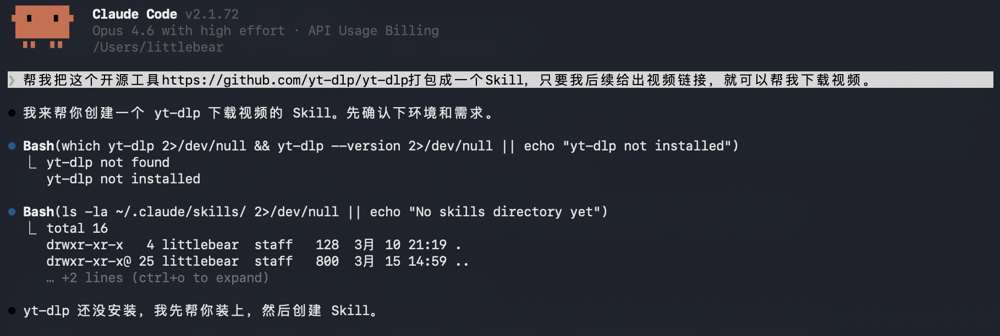

几分钟，这个skill就创建好了

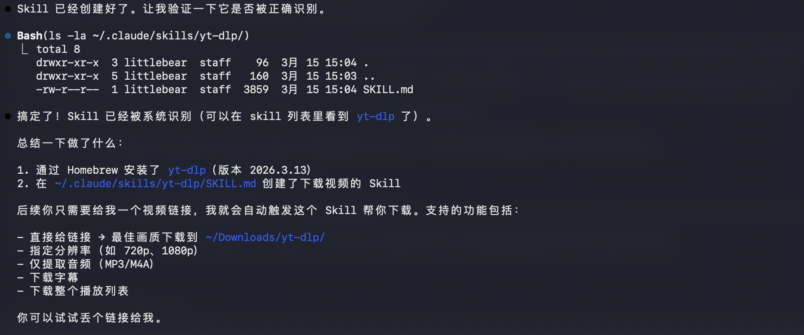

接着简单的测试一下：

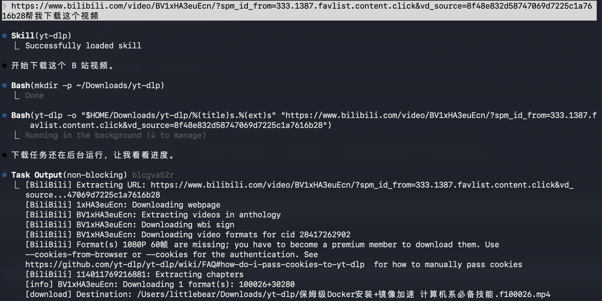

确实挺不错，在下载里我也看到了那个视频文件，这简直太酷了。

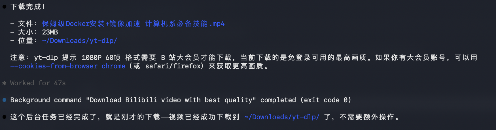

## 创建视频文本提取skill

接着开一个新对话，输入这段提示词即可：

```bash
我想创建一个skill，可以实现给一个视频链接，然后给我文字版的讲稿，如果是别的语言，最好是把原语言版和中文版的讲稿文档给我。
- 我之前安装了yt-dlp的skill，你可以用它下载字幕
- 我要纯文字版的.docx格式
- 不同语言的情况下，将原文和中文分成两个文件
- 所有平台的视频来源
```

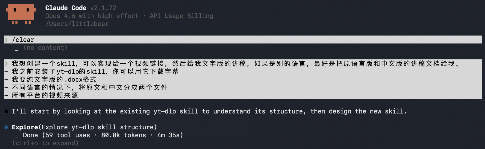

它还进行了自我验证，我太满意了。

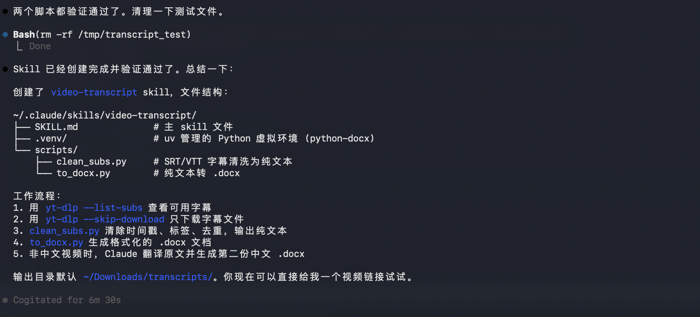

把视频丢给它试试效果，不满意的话可以继续迭代。

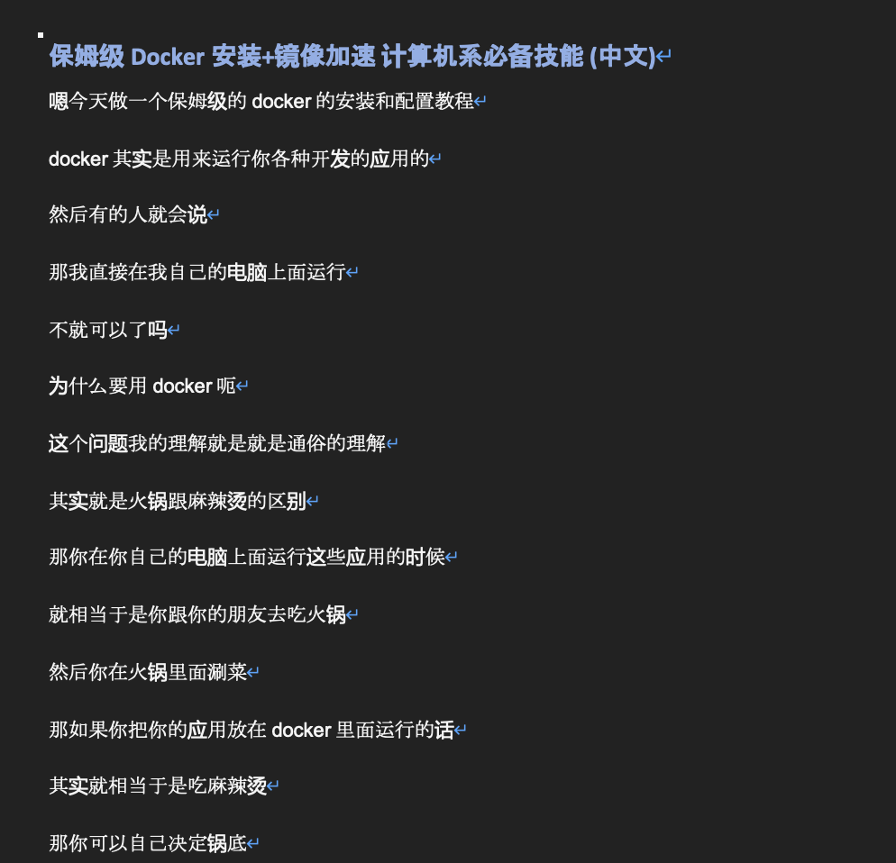

效果其实还行，但是总感觉有点混乱，没有层次感，这时候你可以继续对话，改进这个技能。

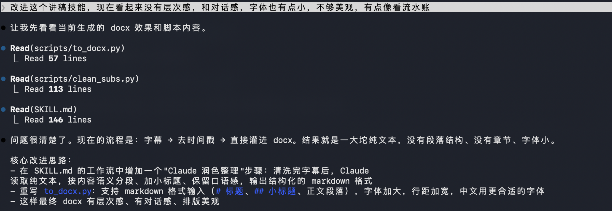

修改后感觉格式挺不错的，层级分明，但是字体怎么不统一。

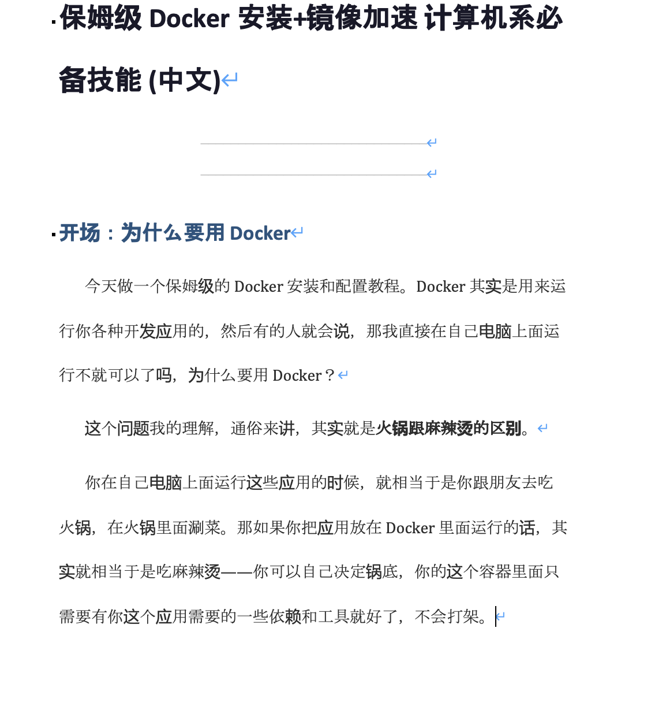

没关系，继续迭代改进，对AI宝宝要有耐心哈哈。

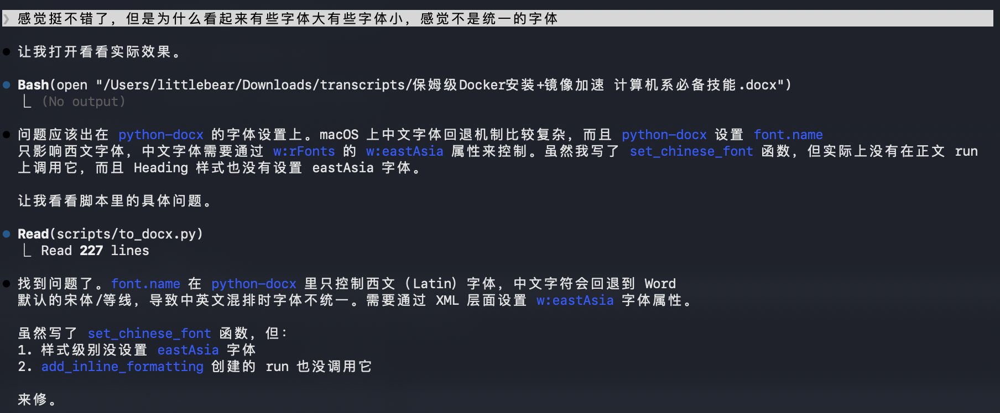

很好，简直太完美了，排版清晰。

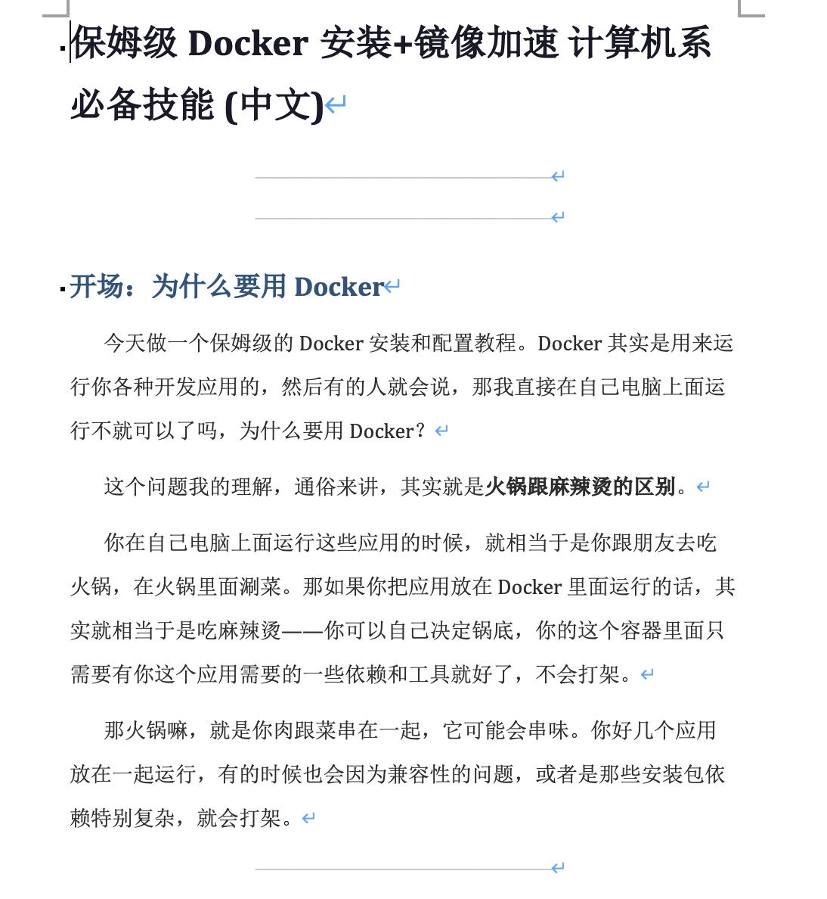

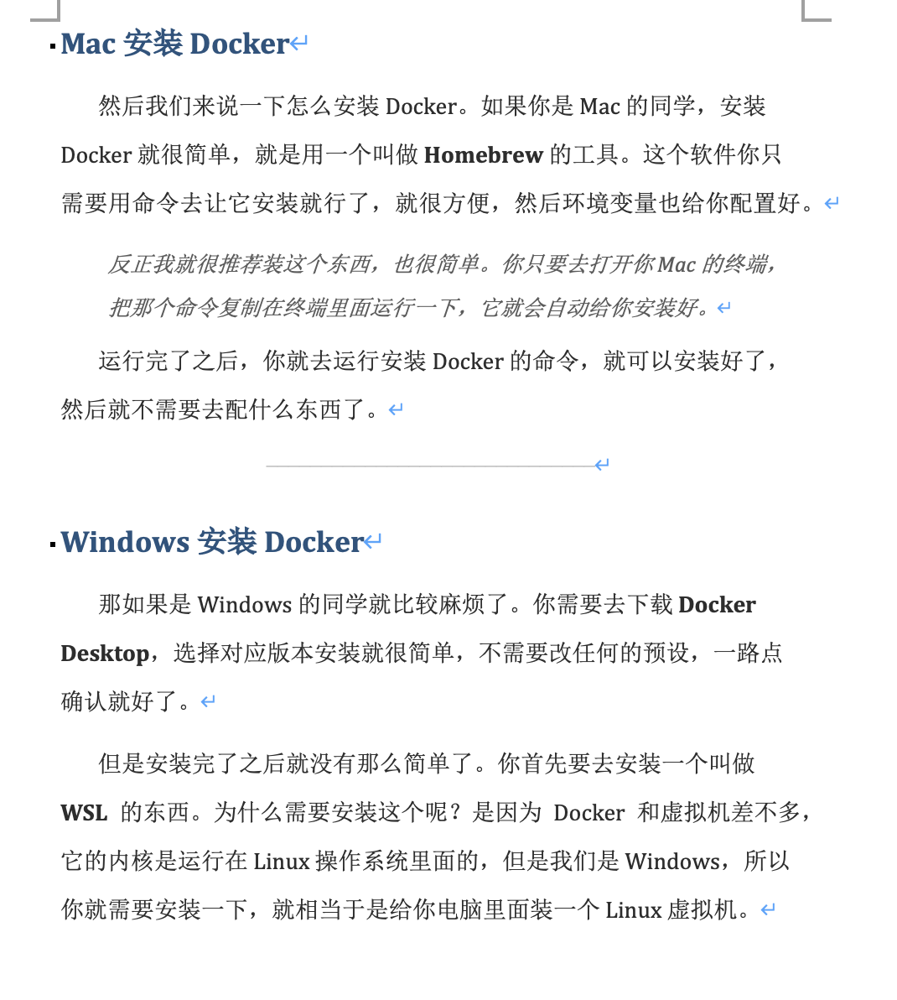

到这里技能就创建好了，不过爽是爽了，但是钱包真的大出血......

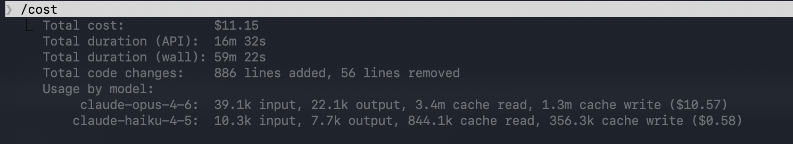

### 查看文档

- [下载完整指南](/files/Docker安装指南.docx)
- [在线预览](https://view.officeapps.live.com/op/embed.aspx?src=https://litterbear520.github.io/Blog/files/Docker安装指南.docx)

## 开始安装

好了，拿到了视频文稿，我们可以跟着文稿快速过一遍Docker的安装了。

好吧，原来Mac安装Docker竟然如此简单，只需要在安装有homebrew后直接一行命令即可安装：

```bash
brew install docker
```

然后去官网安装一下[Docker Desktop](https://www.docker.com/get-started/)，或者直接[点击下载](https://desktop.docker.com/mac/main/arm64/Docker.dmg)，我这里是M4芯片，所以我需要安装的是arm架构。

安装完成后直接试着运行`docker run hello-world`:

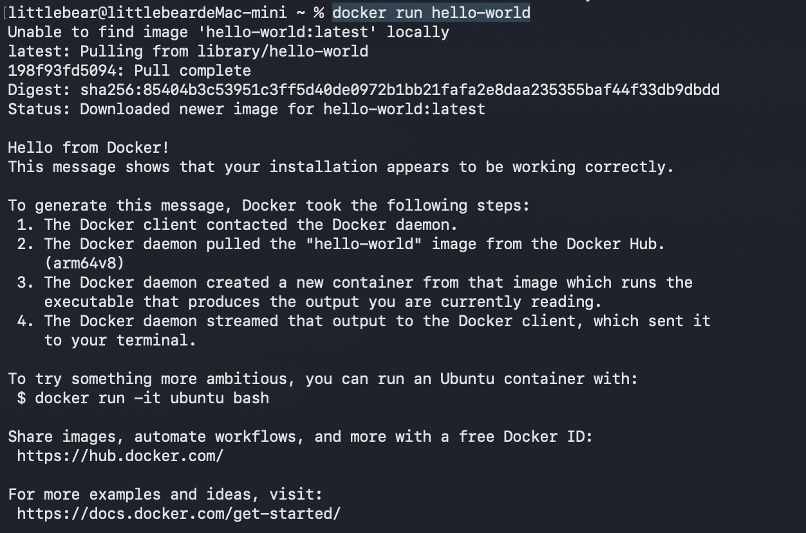

完美，看到`Hello from Docker!`就表示成功啦。

## 补充

### 官方资源

- [Docker 官网](https://www.docker.com/)
- [Homebrew](https://brew.sh/)
- [镜像源 Github 仓库](https://github.com/DaoCloud/public-image-mirror)

### Windows WSL 安装

```bash
wsl --install
wsl --set-default-version 2
```

### 镜像源配置

在 Docker 配置文件中添加以下镜像源（`/etc/docker/daemon.json`）：

```json
{
  "registry-mirrors": [
    "https://registry.docker-cn.com",
    "http://hub-mirror.c.163.com",
    "https://dockerhub.azk8s.cn",
    "https://mirror.ccs.tencentyun.com",
    "https://registry.cn-hangzhou.aliyuncs.com",
    "https://docker.mirrors.ustc.edu.cn",
    "https://docker.m.daocloud.io",
    "https://noohub.ru",
    "https://huecker.io",
    "https://dockerhub.timeweb.cloud"
  ]
}
```
