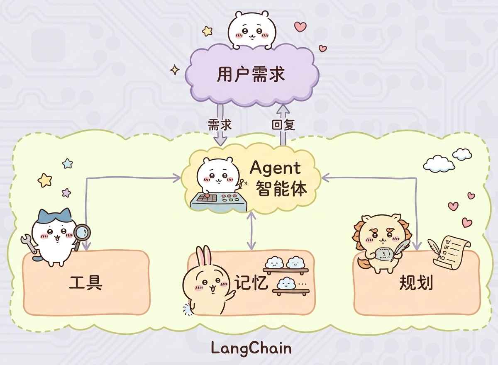

# Agent智能体初体验

## 工具调用

Agent智能体有一个很重要的核心：**工具调用**。
我们设计一个天气查询工具，让大模型拥有天气回答的能力。



## 代码实践

```python
from langchain.agents import create_agent
from langchain_community.chat_models import ChatTongyi
from langchain_core.tools import tool
import os
from dotenv import load_dotenv


load_dotenv()
api_key = os.getenv("LLM_API_KEY")


@tool(description="查询天气")
def get_weather() -> str:
    return "晴天"


agent = create_agent(
    model=ChatTongyi(model="qwen3-max", api_key=api_key),
    tools=[get_weather],
    system_prompt="你是一个聊天助手，可以回答用户问题。"
)

res = agent.invoke(
    {
        "messages": [
            {"role": "user", "content": "明天深圳天气怎么样"}
        ]
    }
)
for msg in res["messages"]:
    print(type(msg).__name__, msg.content)
```

## 总结

基于外部工具的提供，让大模型拥有了：感知外部世界并影响现实的能力。

丰富的工具集将极大提升大模型的工作性能和业务范畴。

工具越多，Agent能覆盖的业务场景就越广（从客服问答到库存管理，再到自动化运营），性能和实用性自然会大幅提升。