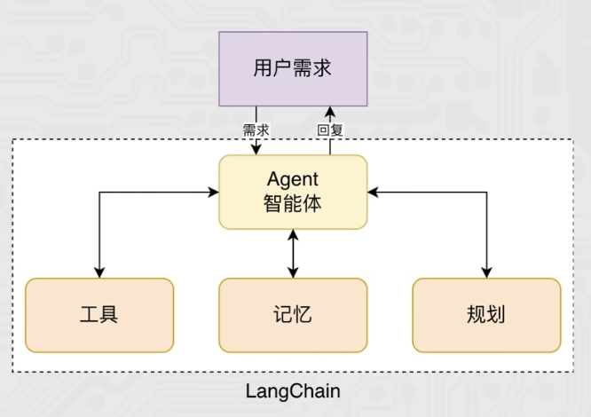
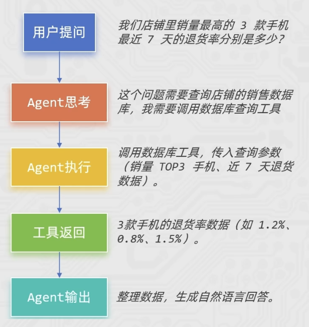

# Agent智能体简介

## 介绍

智能体（Agent）是一种能够自主规划、决策、执行任务的组件，核心是让大语言模型（LLM）根据任务需求，选择并调用工具，完成单靠模型自身无法解决的复杂问题。

- 没有Agent时，LLM只能基于自身训练数据回答问题，遇到需要实时数据、复杂计算、外部工具调用的场景就会卡壳。
- 有了Agent后，LLM就像一个"指挥官"，能思考任务步骤→选择合适工具→执行工具调用→根据结果调整策略，直到完成任务。

核心特点：
- 目标驱动：围绕用户的具体任务目标展开工作。
- 工具调用能力：能连接外部工具，弥补LLM的局限性。
- 自主决策与迭代：不需要人工干预，能根据工具返回的结果，判断是否需要继续调用工具，或直接生成最终答案。

## 例子

以电商商品问答为例：

| 普通 Chain | Agent |
| --- | --- |
| 执行流程固定，按预设步骤运行 | 执行流程动态，根据任务和结果自主调整 |
| 工具调用路径写死在代码里 | 工具选择由 LLM 思考决定 |
| 适合简单、标准化任务 | 适合复杂、多步骤、需要决策的任务 |

## 总结

Agent智能体 = 大语言模型（大脑）+ 工具集（手脚）+ 决策逻辑（思维），

是让LLM从 "只会回答" 升级为 "<mark style={{backgroundColor: '#ff9900', padding: '0 4px', borderRadius: '3px'}}>会做事（影响现实世界）</mark>" 的智能助手。
