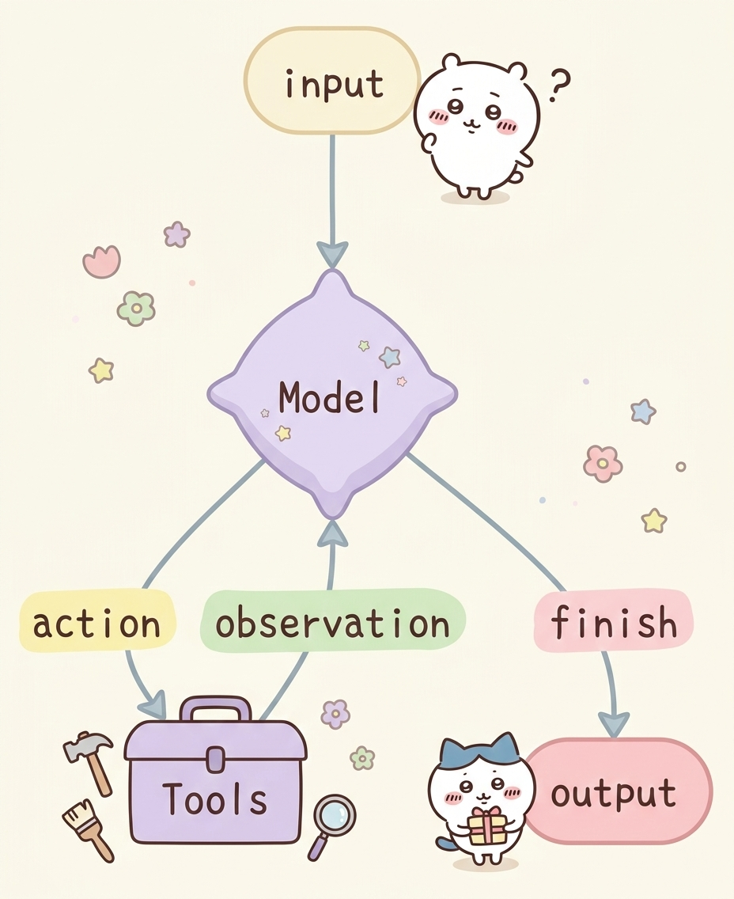

# Agent的ReAct行动框架

## ReAct

`Agent ReAct`是大模型智能体的核心思考与行动框架，全称 Reasoning + Acting（推理 + 行动），是让 Agent 像人类一样<span style={{color: 'red'}}>「思考问题→制定策略→执行行动→验证结果」</span>的关键逻辑。

简单来说：`ReAct`让`Agent`不再是 “直接回答问题”，而是通过 “自然语言思考过程” 指导工具调用，一步步解决复杂问题，完美适配需要多步推理、工具协作的场景（如智能客服、报告生成、任务规划等）。

一个典型的`ReAct`范式的`Agent`如图所示：



- 思考`Reasoning`：分析问题，判断现有信息是否足够，明确下一步即模型决策是否需要调用外部工具获取更多信息用来回答
- 行动`Action`：执行思考阶段指定的策略,即基于模型决策结果，调用工具获取信息
- 观察`Observation`：获取行动的结果，提取有效信息，即获取工具返回值即判断工具是否正常工作位下一轮思考提供信息
- （再）思考 → （再）行动 → （再）观察 → 循环往复直到结束

## 代码实践

LangChain的`Agent`对象遵循`ReAct`框架要求，在执行的过程中会持续的自我思考、自我行动、自我观察。
一个典型的`ReAct`案例如下：

```python
from langchain.agents import create_agent
# from langchain_community.chat_models import ChatTongyi
from langchain_openai import ChatOpenAI
from langchain_core.tools import tool
from dotenv import load_dotenv
import os


load_dotenv()
api_key = os.getenv("LLM_API_KEY")
base_url = "https://dashscope.aliyuncs.com/compatible-mode/v1"

@tool(description="获取体重，返回值是整数，单位千克")
def get_weight() -> int:
    return 58

@tool(description="获取身高，返回值是整数，单位厘米")
def get_height() -> int:
    return 172

agent = create_agent(
    model=ChatOpenAI(model="qwen3.5-plus", base_url=base_url, api_key=api_key),
    tools=[get_weight, get_height],
    system_prompt="""你是严格遵循ReAct框架的智能体，必须按「思考→行动→观察→再思考」的流程解决问题，
且**每轮仅能思考并调用1个工具**，禁止单次调用多个工具。
并告知我你的思考过程，工具的调用原因，按思考、行动、观察三个结构告知我""",
)

for chunk in agent.stream(
    {"messages": [{"role": "user", "content": "计算我的BMI"}]},
    stream_mode="values"
):
    # print(chunk)
    latest_message = chunk['messages'][-1]

    if latest_message.content:
        print(type(latest_message).__name__, latest_message.content)

    try:
        if latest_message.tool_calls:
            print(f"工具调用：{[tc['name'] for tc in latest_message.tool_calls]}")
    except AttributeError as e:
        pass
```

执行结果：

```bash
HumanMessage 计算我的BMI
AIMessage # 思考
用户要求计算BMI（身体质量指数）。BMI的计算公式是：BMI = 体重(kg) / 身高(m)²

我需要先获取用户的体重和身高数据。根据ReAct框架，我每轮只能调用1个工具，所以先获取体重信息。

# 行动

工具调用：['get_weight']
ToolMessage 90
AIMessage # 思考
我已经获取到用户的体重是90千克。现在需要获取用户的身高数据才能计算BMI。根据ReAct框架，我需要调用下一个工具来获取身高。

# 行动


工具调用：['get_height']
ToolMessage 172
AIMessage # 观察
已获取到用户的体重为90千克，身高为172厘米。

# 思考
现在我有足够的数据来计算BMI了。
- 体重：90 kg
- 身高：172 cm = 1.72 m

BMI计算公式：BMI = 体重(kg) / 身高(m)²
BMI = 90 / (1.72)² = 90 / 2.9584 ≈ 30.42

根据BMI标准：
- < 18.5：偏瘦
- 18.5-23.9：正常
- 24-27.9：超重
- ≥ 28：肥胖

用户的BMI约为30.42，属于肥胖范围。

您的BMI计算结果如下：
- **BMI值：30.42**
- **健康状态：肥胖**

建议关注体重管理，适当运动和饮食控制，必要时可咨询专业医生或营养师。
```

## 总结

`ReAct`是一种工作范式，定义了大模型的工作流程。

思考：分析需求，考虑下一步
行动：工具调用获取信息
观察：分析获取的信息

思考 → 行动 → 观察 → 思考 → … → … → 结束

LangChain的`Agent`对象，就是按`ReAct`模式运行。