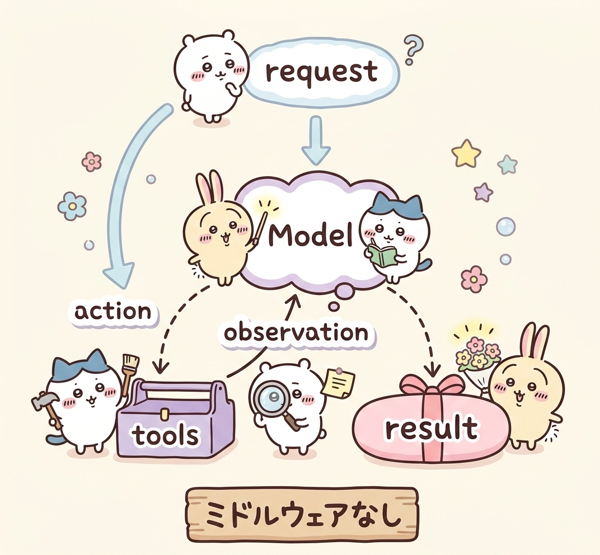
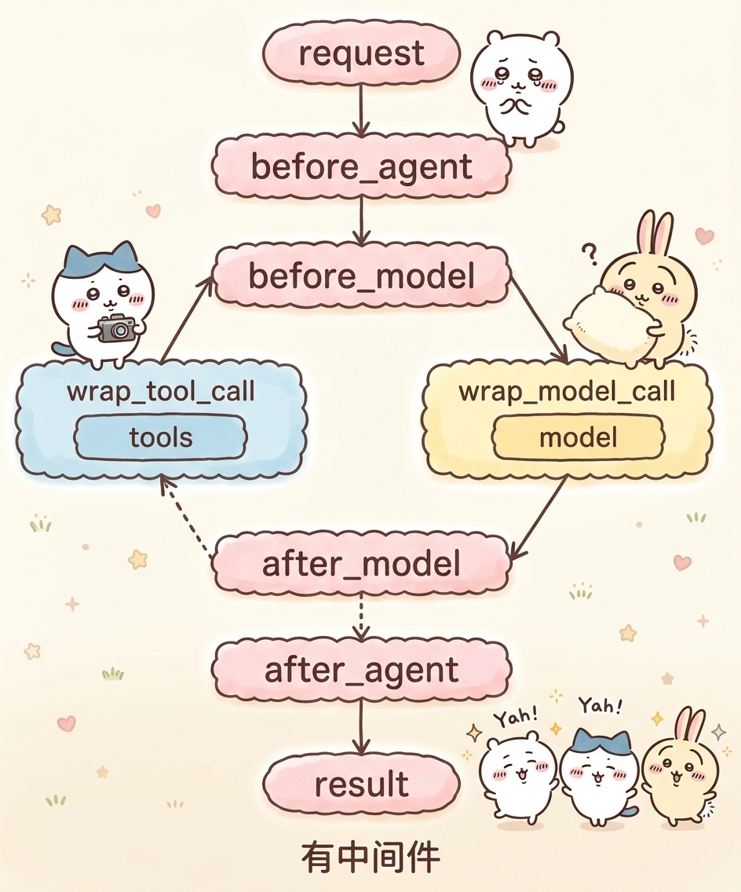

# Agent的middleware中间件

# middleware中间件

中间件的作用是对智能体的每一步工作进行控制和自定义的执行。

作用场景：
- 日志记录、分析、调试
- 转换提示词、工具选择
- 重试、备用、提前终止等逻辑控制
- 安全防护、个人身份检测等

下面是有无中间件的架构对比：

无中间件



有中间件



## 代码实践

```python
from langchain.agents import create_agent, AgentState
from langchain.agents.middleware import after_agent, after_model, before_agent, before_model, wrap_model_call, wrap_tool_call
from langchain_openai import ChatOpenAI
from langchain_core.tools import tool
from langgraph.runtime import Runtime
from dotenv import load_dotenv
import os

load_dotenv()
api_key = os.getenv("LLM_API_KEY")
base_url = "https://dashscope.aliyuncs.com/compatible-mode/v1"


@tool(description="查询天气，传入城市名称字符串，返回字符串天气信息")
def get_weather(city: str) -> str:
    return f"{city}天气：晴天"


"""
1. agent执行前
2. agent执行后
3. model执行前
4. model执行后
5. 工具执行中
6. 模型执行中
"""


@before_agent
def log_before_agent(state: AgentState, runtime: Runtime) -> None:
    # agent执行前会调用这个函数并传入state和runtime两个对象
    print(f"[before agent]agent启动，并附带{len(state['messages'])}消息")


@after_agent
def log_after_agent(state: AgentState, runtime: Runtime) -> None:
    print(f"[after agent]agent结束，并附带{len(state['messages'])}消息")


@before_model
def log_before_model(state: AgentState, runtime: Runtime) -> None:
    print(f"[before_model]模型即将调用，并附带{len(state['messages'])}消息")


@after_model
def log_after_model(state: AgentState, runtime: Runtime) -> None:
    print(f"[after_model]模型调用结束，并附带{len(state['messages'])}消息")


@wrap_model_call
def model_call_hook(request, handler):
    print("模型正在调用")
    return handler(request)


@wrap_tool_call
def monitor_tool(request, handler):
    print(f"工具执行: {request.tool_call['name']}")
    print(f"工具执行传入参数: {request.tool_call['args']}")

    return handler(request)


agent = create_agent(
    model=ChatOpenAI(model="qwen3.5-plus", api_key = api_key, base_url=base_url),
    tools=[get_weather],
    middleware=[log_before_agent, log_after_agent, log_before_model, log_after_model, model_call_hook, monitor_tool]
)

res = agent.invoke({"messages": [{"role": "user", "content": "深圳今天天气如何呀，如何穿衣"}]})
print("=============\n", res)
```

运行结果：

```bash title="运行结果"
[before agent]agent启动，并附带1消息
[before_model]模型即将调用，并附带1消息
模型正在调用
[after_model]模型调用结束，并附带2消息
工具执行: get_weather
工具执行传入参数: {'city': '深圳'}
[before_model]模型即将调用，并附带3消息
模型正在调用
[after_model]模型调用结束，并附带4消息
[after agent]agent结束，并附带4消息
=============
{
  'messages': [
    HumanMessage(
      content='深圳今天天气如何呀，如何穿衣',
      additional_kwargs={},
      response_metadata={},
      id='d0b92dd0-f735-4d7d-8640-55bbdcaed0d2'
    ),
    AIMessage(
      content='',
      additional_kwargs={'refusal': None},
      response_metadata={
        'token_usage': {
          'completion_tokens': 66,
          'prompt_tokens': 282,
          'total_tokens': 348,
          'completion_tokens_details': {
            'reasoning_tokens': 36
          }
        },
        'model_name': 'qwen3.5-plus',
        'finish_reason': 'tool_calls'
      },
      id='lc_run--019cb444-c296-7900-8a53-2b641b1a2867-0',
      tool_calls=[
        {
          'name': 'get_weather',
          'args': {'city': '深圳'},
          'id': 'call_6e8cd2bf8aca4b6fbd16100b',
          'type': 'tool_call'
        }
      ],
      usage_metadata={'input_tokens': 282, 'output_tokens': 66, 'total_tokens': 348}
    ),
    ToolMessage(
      content='深圳天气：晴天',
      name='get_weather',
      id='44190d08-b27e-4b54-890b-7d5447147bc5',
      tool_call_id='call_6e8cd2bf8aca4b6fbd16100b'
    ),
    AIMessage(
      content='深圳今天天气晴朗，阳光明媚。\n\n**穿衣建议：**\n*   **推荐穿搭：** 建议穿着透气性好的短袖T恤、衬衫或薄款连衣裙。\n*   **防晒措施：** 紫外线可能较强，出门请记得涂抹防晒霜，佩戴墨镜或遮阳帽。\n*   **早晚温差：** 虽然白天温暖，但早晚可能稍有凉意，如果怕冷可以随身带一件薄外套备用。\n\n祝您今天心情愉快！',
      additional_kwargs={'refusal': None},
      response_metadata={
        'token_usage': {
          'completion_tokens': 130,
          'prompt_tokens': 329,
          'total_tokens': 459,
          'completion_tokens_details': {
            'reasoning_tokens': 30
          }
        },
        'model_name': 'qwen3.5-plus',
        'finish_reason': 'stop'
      },
      id='lc_run--019cb444-ca95-77f3-b55f-2982a287256e-0',
      tool_calls=[],
      usage_metadata={'input_tokens': 329, 'output_tokens': 130, 'total_tokens': 459}
    )
  ]
}
```