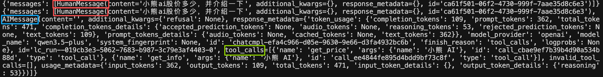

# Agent的流式输出

## agent的stream

通过`create_agent`方法可以创建Agent对象，其也是`Runnable`接口的子类实现，所以也拥有：

- `invoke`执行，一次性得到完整结果
- `stream`执行，流式得到结果

```python
for chunk in agent.stream({
    "messages": [{"role": "user", "content": "Search for AI news and summarize the findings"}]
}, stream_mode="values"):
    # 每个块都包含该时刻的完整状态，所以取最后一条，即为最新
    latest_message = chunk["messages"][-1]
    if latest_message.content:
        print(f"Agent: {latest_message.content}")
    elif latest_message.tool_calls:
        print(f"Calling tools: {[tc['name'] for tc in latest_message.tool_calls]}")
```

## 代码实践

直接将返回的chunk打印出来可以看到：


可以通过`chunk['messages'][-1]`取每个chunk中message列表的最后一条消息并打印出工具信息，完整代码：

```python
from langchain.agents import create_agent
# from langchain_community.chat_models import ChatTongyi
from langchain_openai import ChatOpenAI
from langchain_core.tools import tool
from dotenv import load_dotenv
import os

load_dotenv()
api_key = os.getenv("LLM_API_KEY")
base_url = "https://dashscope.aliyuncs.com/compatible-mode/v1"

@tool(description="获取股价，传入股票名称，返回字符串信息")
def get_price(name: str) -> str:
    return f"股票{name}的价格是20元"

@tool(description="获取股票信息，传入股票名称，返回字符串信息")
def get_info(name: str) -> str:
    return f"股票{name}，是一家A股上市公司，专注于IT职业教育。"

agent = create_agent(
    model=ChatOpenAI(model="qwen3.5-plus", api_key=api_key, base_url=base_url),
    tools=[get_price, get_info],
    system_prompt="你是一个智能助手，可以回答股票相关问题，记住告诉我思考过程，让我知道你为什么调用某个工具"
)

for chunk in agent.stream(
    {"messages": [{"role": "user", "content": "小熊ai股价多少，并介绍一下"}]},
    stream_mode="values"
):
    # print(chunk)
    latest_message = chunk['messages'][-1]

    if latest_message.content:
        print(type(latest_message).__name__, latest_message.content)

    try:
        if latest_message.tool_calls:
            print(f"工具调用：{[tc['name'] for tc in latest_message.tool_calls]}")
    except AttributeError as e:
        pass
```
