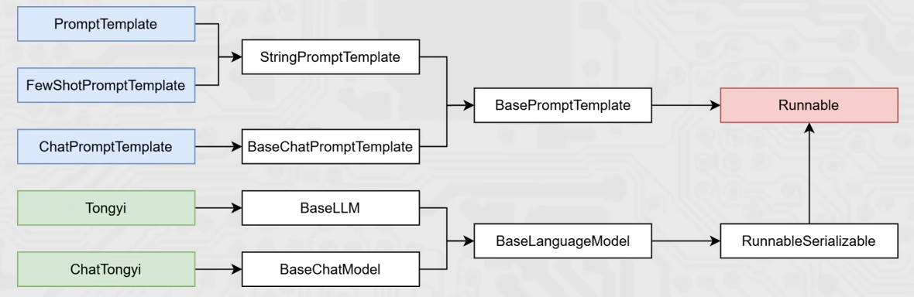

# Chain链

## 简介

「**将组件串联，上一个组件的输出作为下一个组件的输入**」是LangChain链（尤其是|管道链）的核心工作原理，这也是链式调用的核心价值：实现数据的自动化流转与组件的协同工作，如下。

```python
chain = prompt_template | model
```

核心前提：即Runnable子类对象才能入链（以及Callable、Mapping接口子类对象也可加入[后续了解用的不多]）。

我们目前所学习到的组件，均是Runnable接口的子类，如下类的继承关系：



## 流程

```python
from langchain_core.prompts import ChatPromptTemplate, MessagesPlaceholder
from langchain_community.chat_models.tongyi import ChatTongyi
from langchain_core.runnables.base import RunnableSerializable

chat_prompt_template = ChatPromptTemplate.from_messages([
    ("system", "你是一个边塞诗人，可以作诗。"),
    MessagesPlaceholder("history"),
    ("human", "请再来一首唐诗，无需额外输出"),
])

history_data = [
    ("human", "你来写一个唐诗"),
    ("ai", "床前明月光，疑是地上霜，举头望明月，低头思故乡"),
    ("human", "好诗再来一个"),
    ("ai", "锄禾日当午，汗滴禾下锄，谁知盘中餐，粒粒皆辛苦"),
]

model = ChatTongyi(model="qwen3-max")

chain: RunnableSerializable = chat_prompt_template | model
print(type(chain))

# Runnable接口，invoke执行
res = chain.invoke({"history": history_data})
print(res.content)

# Runnable接口，stream执行
for chunk in chain.stream({"history": history_data}):
    print(chunk.content, end="", flush=True)
```

1. 通过` | `链接提示词模板对象和模型对象
2. 返回值chain对象是`RunnableSerializable`对象
   - 是`Runnable`接口的直接子类
   - 也是绝大多数组件的父类

3. 通过`invoke`或`stream`进行阻塞执行或流式执行

组成的链在执行上有：上一个组件的输出作为下一个组件的输入的特性。

所以有如下执行流程：


## 代码实践

```python
import os
from langchain_core.prompts import ChatPromptTemplate, MessagesPlaceholder
from langchain_community.chat_models.tongyi import ChatTongyi
from dotenv import load_dotenv

load_dotenv()

LLM_API_KEY = os.getenv("LLM_API_KEY")

chat_prompt_template = ChatPromptTemplate.from_messages([
    ("system", "你是一个边塞诗人，可以作诗。"),
    MessagesPlaceholder("history"),
    ("human", "请再来一首唐诗"),
])

history_data = [
    ("human", "你来写一个唐诗"),
    ("ai", "床前明月光，疑是地上霜，举头望明月，低头思故乡"),
    ("human", "好诗再来一个"),
    ("ai", "锄禾日当午，汗滴禾下锄，谁知盘中餐，粒粒皆辛苦"),
]

model = ChatTongyi(model="qwen3-max",api_key=LLM_API_KEY)

# 组成链，要求每一个组件都是Runnable接口的子类
chain = chat_prompt_template | model

# 通过链去调用invoke或stream
# res = chain.invoke({"history": history_data})
# print(res.content)

# 通过stream流式输出
for chunk in chain.stream({"history":history_data}):
    print(chunk.content, end="", flush=True)
```

## 总结

LangChain中链是一种将各个组件串联在一起，按顺序执行，前一个组件的输出作为下一个组件的输入。

- 可以通过 ` | `符号来让各个组件形成链
- 成链的各个组件，需是`Runnable`接口的子类
- 形成的链是`RunnableSerializable`对象（`Runnable`接口子类）
- 可通过链调用`invoke`或`stream`触发整个链条的执行
