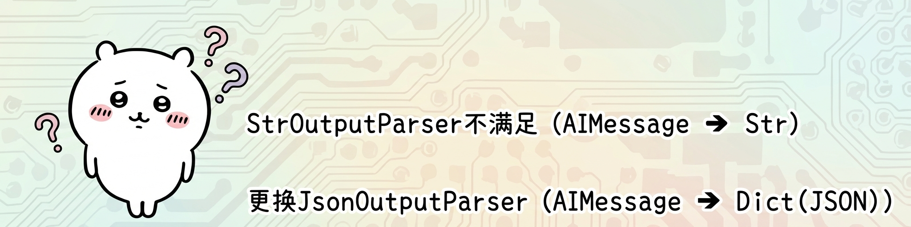

# JsonOutputParser&多模型执行链

## JsonOutParser

```python
chain = prompt | model | parser | model | parser
```

在前面我们完成了这样的需求去构建多模型链，不过这种做法并不标准，因为：
<mark style={{backgroundColor: '#ff9900', padding: '0 4px', borderRadius: '3px'}}>上一个模型的输出，没有被处理就输入下一个模型。</mark>

正常情况下我们应该有如下处理逻辑：

invoke | stream 初始输入 → 提示词模板 → 模型 → <span style={{color: 'red'}}>数据处理</span> → <span style={{color: 'red'}}>提示词模板</span> → 模型 → 解析器 → 结果

即：

上一个模型的输出结果，应该作为提示词模版的输入，构建下一个提示词，用来二次调用模型。

根据输出和输入的要求:

- 模型的输出为: `AIMessage`类对象
- 提示词模板要求输入如下代码:

```python
def invoke(
    self, input: dict, config: RunnableConfig | None = None, **kwargs: Any
) -> PromptValue:
```

其中 <span style={{color: 'red'}}>dict</span> 是提示词模板要求的输入类型

所以, 我们需要完成:
将模型输出的`AIMessage` ➔ 转为字典 ➔ 注入第二个提示词模板中, 形成新的提示词 (`PromptValue`对象)



## JsonOutputParser完成多模型链

```python
import os
from langchain_core.output_parsers import StrOutputParser, JsonOutputParser
from langchain_community.chat_models.tongyi import ChatTongyi
from langchain_core.prompts import PromptTemplate
from dotenv import load_dotenv

load_dotenv()
LLM_API_KEY = os.getenv("LLM_API_KEY")

# 创建所需的解析器
str_parser = StrOutputParser()
json_parser = JsonOutputParser()

# 模型创建
model = ChatTongyi(model="qwen3-max",api_key=LLM_API_KEY)

# 第一个提示词模板
first_prompt = PromptTemplate.from_template(
    "我邻居姓：{lastname}，刚生了{gender}，请帮忙起名字，"
    "并封装为JSON格式返回给我。要求key是name，value就是你起的名字，请严格遵守格式要求。"
)

# 第二个提示词模板
second_prompt = PromptTemplate.from_template(
    "姓名：{name}，请帮我解析含义。"
)

# 构建链   (AIMessage("{name: 张若曦}"))
chain = first_prompt | model | json_parser | second_prompt | model | str_parser

for chunk in chain.stream({"lastname": "张", "gender": "女儿"}):
    print(chunk, end="", flush=True)
```

## 总结

在构建链的时候要注意整体兼容性，注意前后组件的输入和输出要求。

- 模型输入：`PromptValue`或字符串或序列（BaseMessage、list、tuple、str、dict）。
- 模型输出：`AIMessage`
- 提示词模板输入：要求是字典
- 提示词模板输出：`PromptValue`对象
- StrOutputParser：`AIMessage`输入、`str`输出
- JsonOutputParser：`AIMessage`输入、`dict`输出


