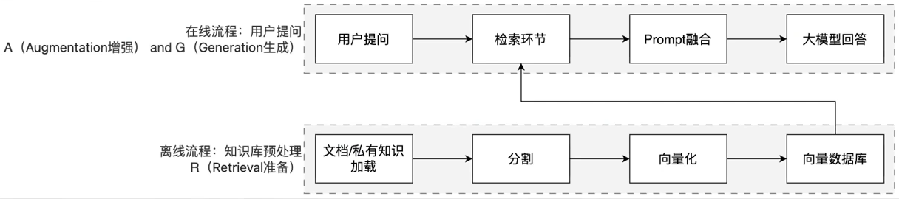
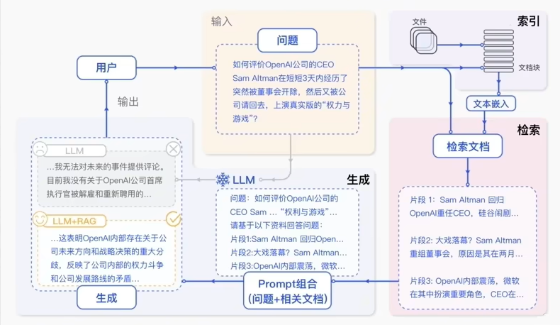

# RAG 介绍

## RAG 是什么

RAG（Retrieval-Augmented Generation）即检索增强生成，为大模型提供了从特定数据源检索到的信息，以此来修正和补充生成的答案。可以总结为一个公式：RAG = 检索技术 + LLM 提示

## 为什么需要 RAG

通用基础大模型存在以下问题：

- LLM 的知识不是实时的，模型训练好后不具备自动更新知识的能力，会导致部分信息滞后
- LLM 领域知识是缺乏的，大模型的知识来源于训练数据，这些数据主要来自公开的互联网和开源数据集，无法覆盖特定领域或高度专业化的内部知识
- 幻觉问题，LLM 有时会在回答中生成看似合理但实际上是错误的信息
- 数据安全性

## RAG 核心架构

简单来说，RAG工作分为两条线：离线准备线 | 在线服务线

## RAG 标准流程

RAG 标准流程由索引（Indexing）、检索（Retriever）和生成（Generation）三个核心阶段组成。

### 工作流程图解

### 索引阶段

通过处理多种来源、多种格式的文档提取其中文本，将其切分为标准长度的文本块（chunk），并进行嵌入向量化（embedding），向量存储在向量数据库（vector database）中。

- 加载文件
- 内容提取
- 文本分割，形成 chunk
- 文本向量化
- 存向量数据库

### 检索阶段

用户输入的查询（query）被转化为向量表示，通过相似度匹配从向量数据库中检索出最相关的文本块。

### 生成阶段

检索到的相关文本与原始查询共同构成提示词（Prompt），输入大语言模型（LLM），生成精确且具备上下文关联的回答。

- 匹配出的文本作为上下文和问题一起添加到 prompt 中
- 提交给 LLM 生成答案
- query 向量化
- 在文本向量中匹配出与问句向量相似的 top_k 个

## 总结

模型本质上就是用户输入，模型给出输出，用户能做的就是在输入上做功夫。

RAG 就是在向模型提问之前基于已有的知识库或文档内容做检索，确保向模型提问的内容更精准以及包含足够的信息量用以提供给模型。

**RAG 的核心价值**：

- 解决知识实效性问题：大模型的训练数据有截止时间，RAG 可以接入最新文档（如公司财报、政策文件），让模型输出 "与时俱进"。
- 降低模型幻觉：模型的回答基于检索到的事实性资料，而非纯靠自身记忆，大幅减少编造信息的概率。
- 无需重新训练模型：相比微调（Fine-tuning），RAG 只需更新知识库，成本更低、效率更高。
