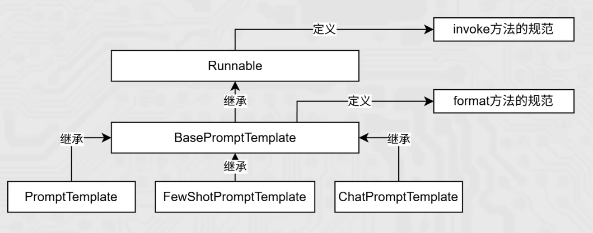

# 模板类的format和invoke方法

在PromptTemplate（通用提示词模板）和FewShotPromptTemplate（FewShot提示词模板）的使用中，我们使用了如下：

## 模板对象的format方法

```python
prompt_template = PromptTemplate.from_template(
    "我的邻居姓{lastname}，刚生了{gender}，你帮我起个名字，简单回答。"
)
# 调用.format方法注入信息即可
prompt_text = prompt_template.format(lastname="张", gender="女儿")

model = Tongyi(model="qwen-max")
res = model.invoke(input=prompt_text)
print(res)
```

## 模板对象的invoke方法

```python
few_shot_template = FewShotPromptTemplate(
    example_prompt=example_template,      # 示例数据的模板
    examples=examples_data,               # 示例的数据（用来注入动态数据的），list内套dict
    prefix="告知我单词的反义词，我提供如下的示例：",          # 示例之前的提示
    suffix="基于前面的示例告知我，{input_word}的反义词是？", # 示例之后的提示
    input_variables=['input_word']        # 声明在前缀或后缀中所需要注入的变量名
)

prompt_text = few_shot_template.invoke(input={"input_word": "左"}).to_string()
print(prompt_text)
```

PromptTemplate、FewShotPromptTemplate、ChatPromptTemplate（后续学习）都拥有format和invoke这2类方法。



## format和invoke的区别

| 区别 | format | invoke |
| ---- | ---- | ---- |
| 功能 | 纯字符串替换，解析占位符生成提示词 | Runnable 接口标准方法，解析占位符生成提示词 |
| 返回值 | 字符串 | PromptValue 类对象 |
| 传参 | `.format(k=v, k=v, ...)` | `.invoke({"k":v, "k":v, ...})` |
| 解析 | 支持解析 `{}` 占位符 | 支持解析 `{}` 占位符和 MessagesPlaceholder 结构化占位符 |

## 实践代码

```python
from langchain_core.prompts import PromptTemplate
from langchain_core.prompts import FewShotPromptTemplate
from langchain_core.prompts import ChatPromptTemplate

"""
PromptTemplate -> StringPromptTemplate -> BasePromptTemplate -> RunnableSerializable -> Runnable
FewShotPromptTemplate -> StringPromptTemplate -> BasePromptTemplate -> RunnableSerializable -> Runnable
ChatPromptTemplate -> BaseChatPromptTemplate -> BasePromptTemplate -> RunnableSerializable -> Runnable
"""

template = PromptTemplate.from_template("我的邻居是: {lastname}, 最喜欢: {hobby}")

res = template.format(lastname="张大明", hobby="钓鱼")
print(res, type(res))

res2 = template.invoke({"lastname": "周杰伦", "hobby": "唱歌"})
print(res2, type(res2))
```
