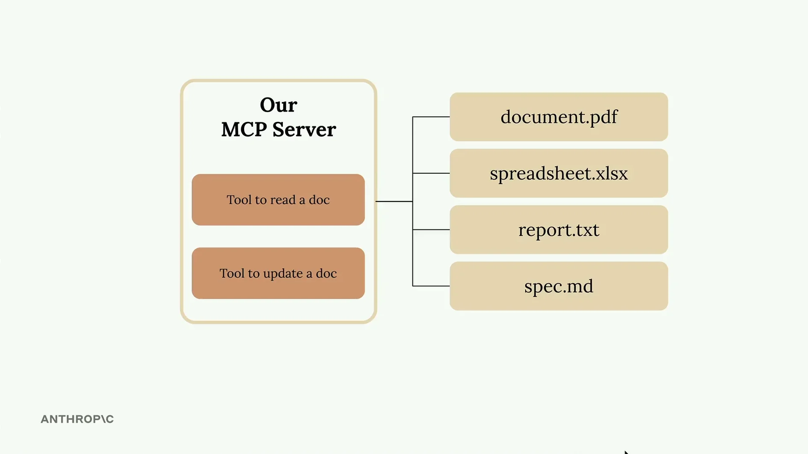

# 使用 MCP 定义工具

当您使用官方 Python SDK 时，构建 MCP 服务器会变得更加简单。您不必手动编写复杂的 JSON 模式，而是可以使用装饰器定义工具，让 SDK 来处理繁重的工作。



在这个示例中，我们将创建一个文档管理服务器，它具有两个核心工具：一个用于读取文档，另一个用于更新文档。所有文档都以简单的字典形式存储在内存中，其中键是文档 ID，值是内容。

## 设置 MCP 服务器

Python MCP SDK 使服务器创建变得简单直接。您只需一行代码即可初始化一个服务器：

```python
from mcp.server.fastmcp import FastMCP

mcp = FastMCP("DocumentMCP", log_level="ERROR")
```

您的文档可以存储在一个简单的字典结构中：

```python
docs = {
    "deposition.md": "This deposition covers the testimony of Angela Smith, P.E.",
    "report.pdf": "The report details the state of a 20m condenser tower.",
    "financials.docx": "These financials outline the project's budget and expenditures",
    "outlook.pdf": "This document presents the projected future performance of the system",
    "plan.md": "The plan outlines the steps for the project's implementation.",
    "spec.txt": "These specifications define the technical requirements for the equipment"
}
```

## 使用装饰器定义工具

SDK 使用装饰器来定义工具。您不必手动编写 JSON 模式，而是可以使用 Python 类型提示和字段描述。SDK 会自动生成 Claude 能够理解的正确模式。

## 创建文档读取工具

第一个工具通过 ID 读取文档内容。以下是完整的实现：

```python
@mcp.tool(
    name="read_doc_contents",
    description="Read the contents of a document and return it as a string."
)
def read_document(
    doc_id: str = Field(description="Id of the document to read")
):
    if doc_id not in docs:
        raise ValueError(f"Doc with id {doc_id} not found")
    
    return docs[doc_id]
```

装饰器指定了工具名称和描述，而函数参数定义了所需的参数。来自 Pydantic 的 `Field` 类提供了参数描述，帮助 Claude 理解每个参数的预期内容。

## 构建文档编辑工具

第二个工具对文档执行简单的查找和替换操作：

```python
@mcp.tool(
    name="edit_document",
    description="Edit a document by replacing a string in the documents content with a new string."
)
def edit_document(
    doc_id: str = Field(description="Id of the document that will be edited"),
    old_str: str = Field(description="The text to replace. Must match exactly, including whitespace."),
    new_str: str = Field(description="The new text to insert in place of the old text.")
):
    if doc_id not in docs:
        raise ValueError(f"Doc with id {doc_id} not found")
    
    docs[doc_id] = docs[doc_id].replace(old_str, new_str)
```

此工具接受三个参数：文档 ID、要查找的文本以及替换文本。该实现包括对缺失文档的错误处理，并执行简单的字符串替换。

## SDK 方法的主要优势

- 无需手动编写 JSON 模式
- 类型提示提供自动验证
- 清晰的参数描述帮助 Claude 理解工具用法
- 错误处理与 Python 异常自然集成
- 工具注册通过装饰器自动完成

MCP Python SDK 将工具创建从复杂的模式编写工作转变为简单的 Python 函数定义。这种方法使构建和维护 MCP 服务器变得更加容易，同时确保 Claude 接收到格式正确的工具规范。
