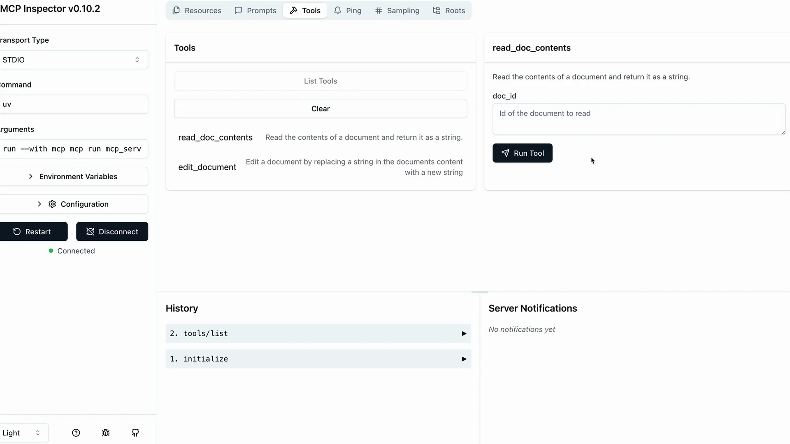

# 服务器检查器

在构建 MCP 服务器时，您需要一种方法来测试您的功能，而无需连接到完整的应用程序。Python MCP SDK 包含一个内置的基于浏览器的检查器，让您可以实时调试和测试您的服务器。

## 启动检查器

首先，确保您的 Python 环境已激活（请查看您项目的 README 以获取确切的命令）。然后使用以下命令运行检查器：

```bash
mcp dev mcp_server.py
```

这将启动一个开发服务器，并为您提供一个本地 URL，通常类似于 `http://127.0.0.1:6274`。在浏览器中打开此 URL 即可访问 MCP Inspector。

## 使用检查器界面

该检查器界面正在积极开发中，因此您使用时可能会看到不同的外观。但是，核心功能保持一致。请留意以下关键元素：

- 一个用于启动您的 MCP 服务器的**连接（Connect）**按钮
- 用于**资源（Resources）**、**工具（Tools）**、**提示（Prompts）**和其他功能的导航标签
- 一个工具列表和测试面板

首先点击连接按钮以初始化您的服务器。您将看到连接状态从"已断开（Disconnected）"变为"已连接（Connected）"。

## 测试您的工具

导航到工具部分，点击"列出工具（List Tools）"以查看服务器中所有可用的工具。当您选择一个工具时，右侧面板会显示其详细信息和输入字段。



例如，要测试一个文档读取工具：

1. 选择 `read_doc_contents` 工具
2. 输入一个文档 ID（例如"deposition.md"）
3. 点击"运行工具（Run Tool）"
4. 检查结果是否成功以及预期输出

检查器会同时显示成功状态和实际返回的数据，使您能够轻松验证工具是否正常工作。

## 测试工具交互

您可以按顺序测试多个工具，以验证复杂的工作流程。例如，在使用编辑工具修改文档后，立即测试读取工具以确认更改已正确应用。

检查器会在工具调用之间维护您的服务器状态，因此编辑内容会持续保留，您可以验证 MCP 服务器的完整功能。

## 开发工作流程

MCP Inspector 成为您开发过程中不可或缺的一部分。您无需编写单独的测试脚本或连接到完整的应用程序，而是可以：

- 快速迭代工具实现
- 测试边缘情况和错误条件
- 验证工具交互和状态管理
- 实时调试问题

这种即时反馈循环使 MCP 服务器开发变得更加高效，并有助于在开发过程中及早发现问题。
