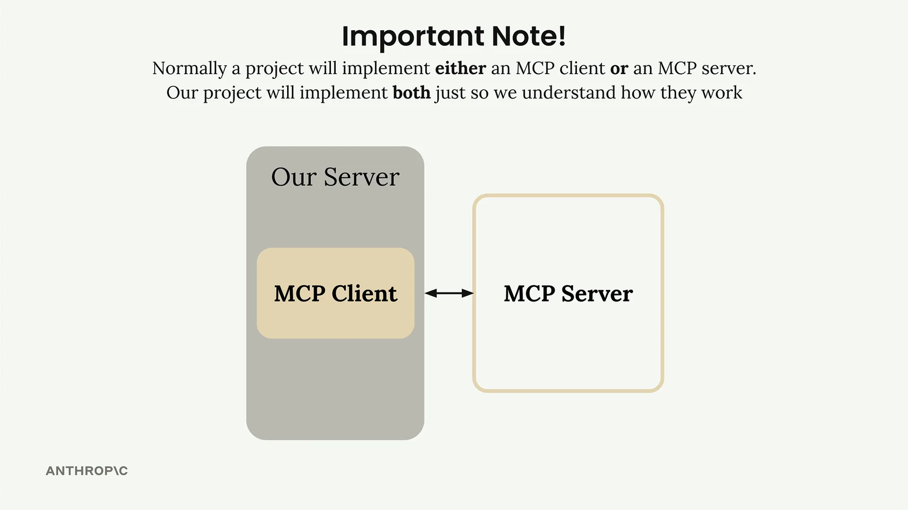
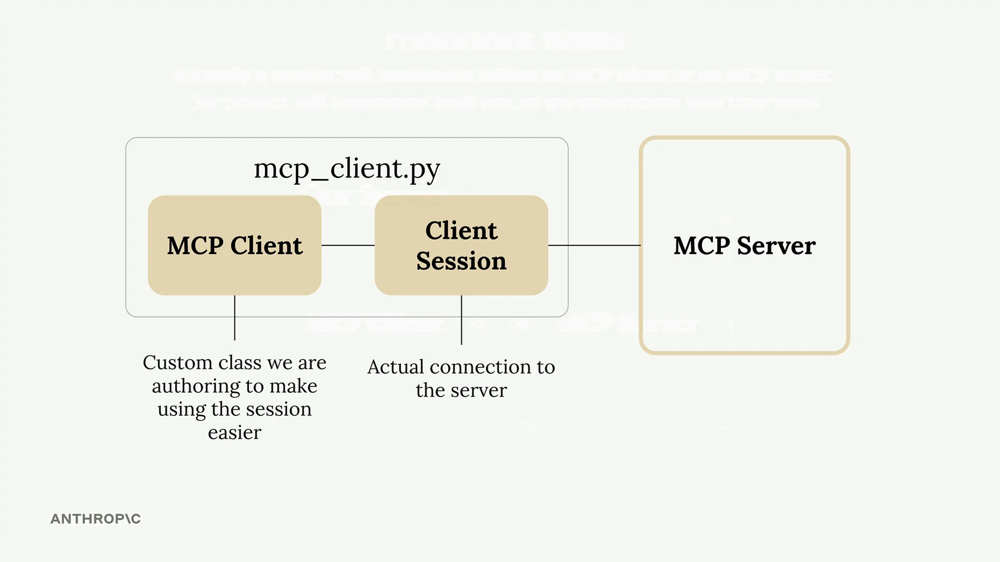
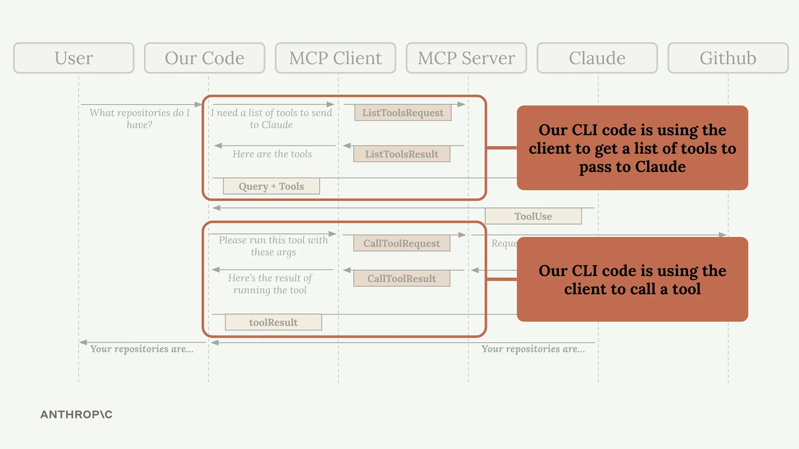

# 实现客户端

现在我们的 MCP 服务器已经正常工作，接下来是构建客户端的时候了。客户端是让我们的应用程序代码能够与 MCP 服务器通信并访问其功能的部分。

## 理解客户端架构

在大多数实际项目中，您通常只会实现 MCP 客户端或 MCP 服务器——而不是两者都实现。我们在这个项目中同时构建两者，只是为了让您看到它们如何协同工作。



MCP 客户端由两个主要组件组成：

- **MCP Client** - 我们创建的一个自定义类，用于让使用会话更加方便
- **Client Session** - 与服务器的实际连接（属于 MCP Python SDK 的一部分）



客户端会话需要仔细的资源管理——我们需要在完成后正确清理连接。这就是为什么我们将其封装在自己的类中，以自动处理所有清理工作。

## 客户端如何融入我们的应用程序

还记得我们的应用程序流程图吗？客户端使我们的代码能够在两个关键点与 MCP 服务器进行交互：



我们的 CLI 代码使用客户端来：

- 获取要发送给 Claude 的可用工具列表
- 在 Claude 请求时执行工具

## 实现核心客户端函数

我们需要实现两个基本函数：`list_tools()` 和 `call_tool()`。

### List Tools 函数

此函数从 MCP 服务器获取所有可用工具：

```python
async def list_tools(self) -> list[types.Tool]:
    result = await self.session().list_tools()
    return result.tools
```

这很简单——我们访问我们的会话（与服务器的连接），调用内置的 `list_tools()` 方法，并从结果中返回工具。

### Call Tool 函数

此函数在服务器上执行特定工具：

```python
async def call_tool(
    self, tool_name: str, tool_input: dict
) -> types.CallToolResult | None:
    return await self.session().call_tool(tool_name, tool_input)
```

我们将工具名称和输入参数（由 Claude 提供）传递给服务器，并返回结果。

## 测试客户端

客户端文件底部包含一个简单的测试工具。您可以直接运行它来验证一切是否正常工作：

```bash
uv run mcp_client.py
```

这将连接到您的 MCP 服务器并打印出可用的工具。您应该会看到显示您的工具定义的输出，包括描述和输入模式。

## 整合所有内容

一旦实现了客户端函数，您就可以通过运行主应用程序来测试完整的流程：

```bash
uv run main.py
```

尝试询问：

:::info[用户提示]
report.pdf 文档的内容是什么？
:::

以下是幕后发生的事情：

1. 您的应用程序使用客户端获取可用工具
2. 这些工具与您的问题一起发送给 Claude
3. Claude 决定使用 read_doc_contents 工具
4. 您的应用程序使用客户端执行该工具
5. 结果返回给 Claude，然后 Claude 会回复您

客户端充当您的应用程序逻辑与 MCP 服务器功能之间的桥梁，使将强大的工具集成到您的 AI 工作流程中变得轻松简单。
