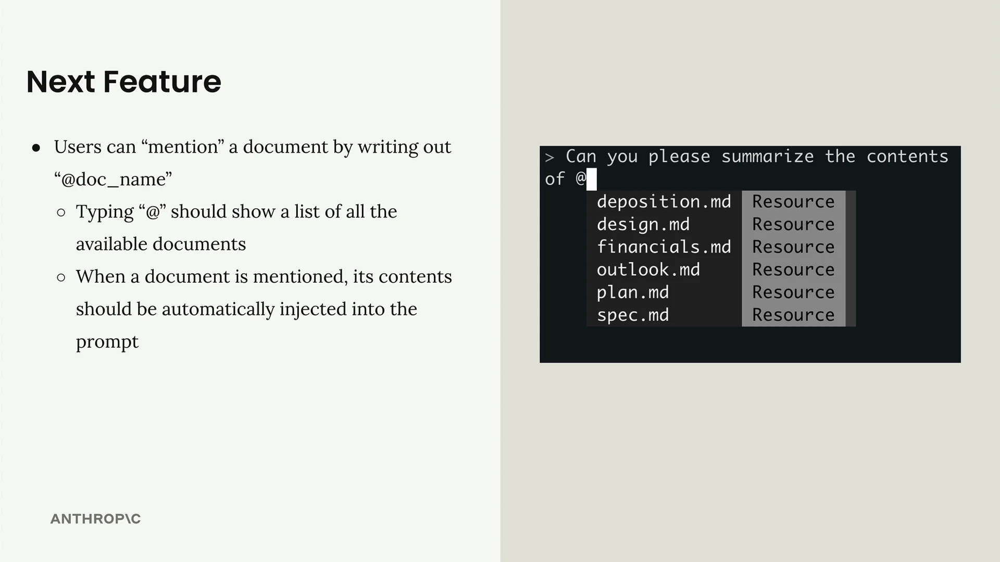
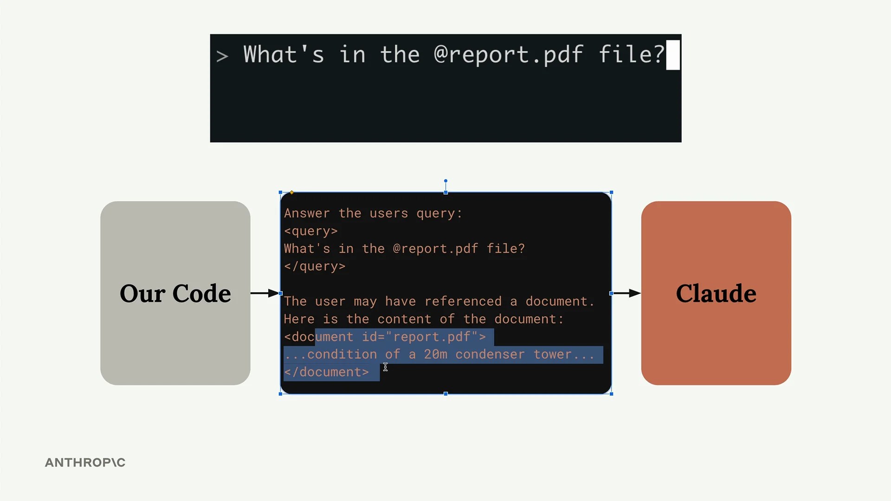
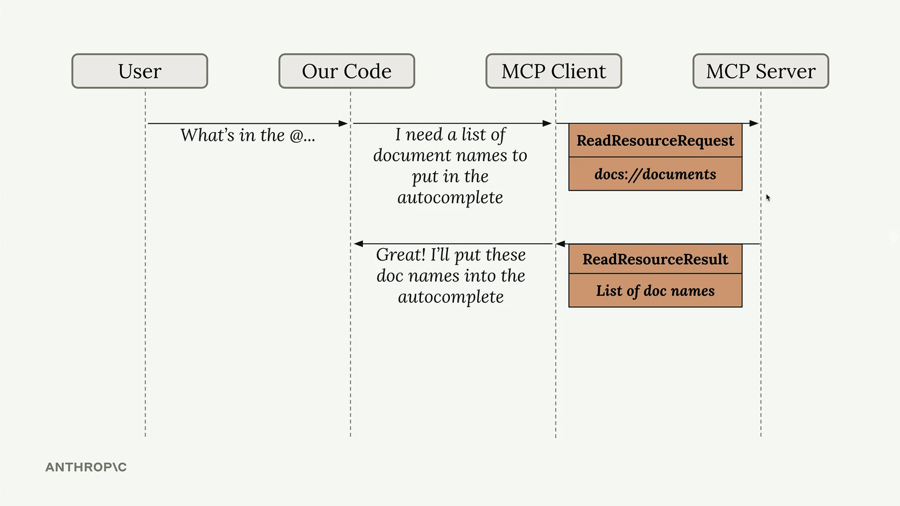
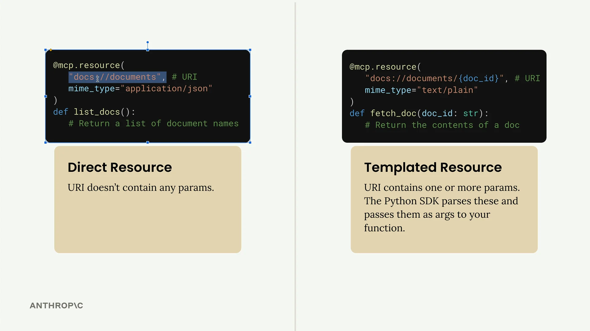
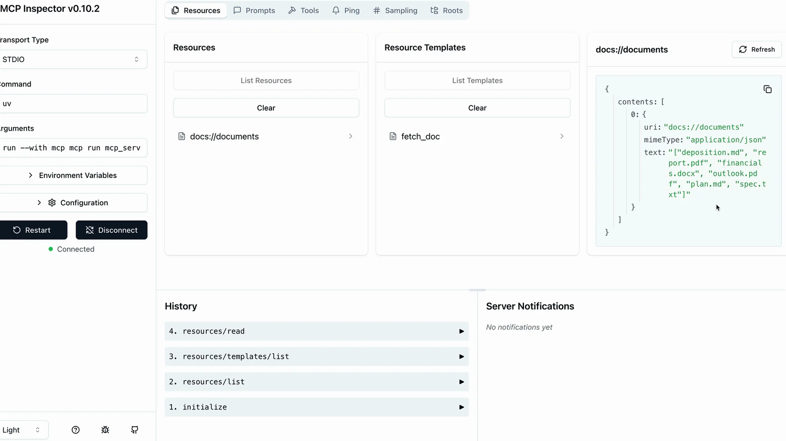

# 定义资源

MCP 服务器中的资源（Resources）允许您向客户端公开数据，类似于典型 HTTP 服务器中的 GET 请求处理程序。它们非常适合需要获取信息而不是执行操作的场景。

## 通过示例理解资源

假设您想构建一个文档提及功能，用户可以输入 `@document_name` 来引用文件。这需要两个操作：

- 获取所有可用文档的列表（用于自动补全）
- 获取特定文档的内容（当被提及时）



当用户提及某个文档时，您的系统会自动将该文档的内容注入到发送给 Claude 的提示中，从而消除了 Claude 需要使用工具来获取信息的必要性。



## 资源的工作原理

资源遵循请求-响应模式。当您的客户端需要数据时，它会发送一个带有 URI 的 `ReadResourceRequest` 来标识它想要的资源。MCP 服务器处理此请求并在 `ReadResourceResult` 中返回数据。


流程如下：您的代码向 MCP 客户端请求资源，客户端将请求转发给 MCP 服务器。服务器处理该 URI，运行相应的函数，并返回结果。



## 资源的类型

资源有两种类型：

### 直接资源

直接资源具有永不改变的静态 URI。它们非常适合不需要参数的操作。

```python
@mcp.resource(
    "docs://documents",
    mime_type="application/json"
)
def list_docs() -> list[str]:
    return list(docs.keys())
```

### 模板化资源

模板化资源在其 URI 中包含参数。Python SDK 会自动解析这些参数，并将它们作为关键字参数传递给您的函数。

```python
@mcp.resource(
    "docs://documents/{doc_id}",
    mime_type="text/plain"
)
def fetch_doc(doc_id: str) -> str:
    if doc_id not in docs:
        raise ValueError(f"Doc with id {doc_id} not found")
    return docs[doc_id]
```



## 实现细节

资源可以返回任何类型的数据——字符串、JSON、二进制数据等。使用 `mime_type` 参数向客户端提示您返回的数据类型：

- `"application/json"` 用于结构化数据
- `"text/plain"` 用于纯文本
- `"application/pdf"` 用于二进制文件

MCP Python SDK 会自动序列化您的返回值。您不需要手动将对象转换为 JSON 字符串——只需返回数据结构，让 SDK 处理序列化即可。

## 测试您的资源

您可以使用 MCP Inspector 测试资源。使用以下命令启动您的服务器：

```bash
uv run mcp dev mcp_server.py
```

然后在浏览器中连接到 inspector。您将看到两个部分：

- **Resources** - 列出您的直接/静态资源
- **Resource Templates** - 列出您的模板化资源



点击任意资源进行测试。对于模板化资源，您需要为参数提供值。inspector 会向您展示客户端将接收到的确切响应结构，包括 MIME 类型和序列化数据。

资源提供了一种干净的方式，从您的 MCP 服务器公开只读数据，使客户端能够轻松获取信息，而无需处理工具调用的复杂性。
