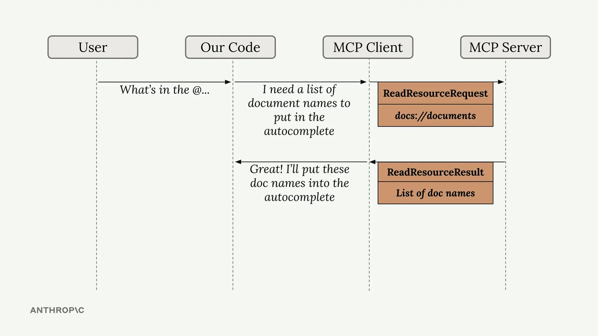

# 访问资源

MCP 中的资源允许您的服务器公开可以直接包含在提示中的信息，而不需要通过工具调用来访问数据。这创建了一种更高效的方式来为 AI 模型提供上下文。



上图展示了资源的工作方式：当用户输入类似"What's in the @..."的内容时，我们的代码会将其识别为资源请求，向 MCP 服务器发送 ReadResourceRequest，并获取包含实际内容的 ReadResourceResult。

## 实现资源读取

要在您的 MCP 客户端中启用资源访问，您需要实现一个 `read_resource` 函数。首先，添加必要的导入：

```python
import json
from pydantic import AnyUrl
```

核心函数向 MCP 服务器发出请求，并根据其 MIME 类型处理响应：

```python
async def read_resource(self, uri: str) -> Any:
    result = await self.session().read_resource(AnyUrl(uri))
    resource = result.contents[0]

    if isinstance(resource, types.TextResourceContents):
        if resource.mimeType == "application/json":
            return json.loads(resource.text)

    return resource.text
```

## 理解响应结构

当您请求一个资源时，服务器会返回一个带有 `contents` 列表的结果。我们访问第一个元素，因为我们通常一次只需要一个资源。响应包括：

- 实际内容（文本或数据）
- 一个告诉我们如何解析内容的 MIME 类型
- 关于该资源的其他元数据

## 内容类型处理

该函数会检查 MIME 类型以确定如何处理内容：

- 如果是 `application/json`，则将文本解析为 JSON 并返回解析后的对象
- 否则，返回原始文本内容

这种方法可以无缝处理结构化数据（如 JSON）和纯文本文档。

## 测试资源访问

实现完成后，您可以通过您的 CLI 应用程序测试资源功能。当您输入"@"并跟上一个资源名称时，系统将：

1. 在自动完成列表中显示可用的资源
2. 让您使用方向键和空格键选择一个资源
3. 将资源内容直接包含在您的提示中
4. 将所有内容发送给 AI 模型，而无需额外的工具调用

与让 AI 模型进行单独的工具调用来访问文档内容相比，这创造了更流畅的用户体验。资源内容成为初始上下文的一部分，从而能够立即对数据做出响应。
