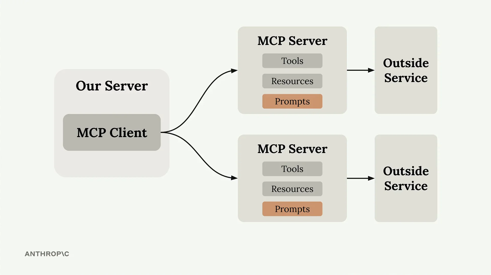
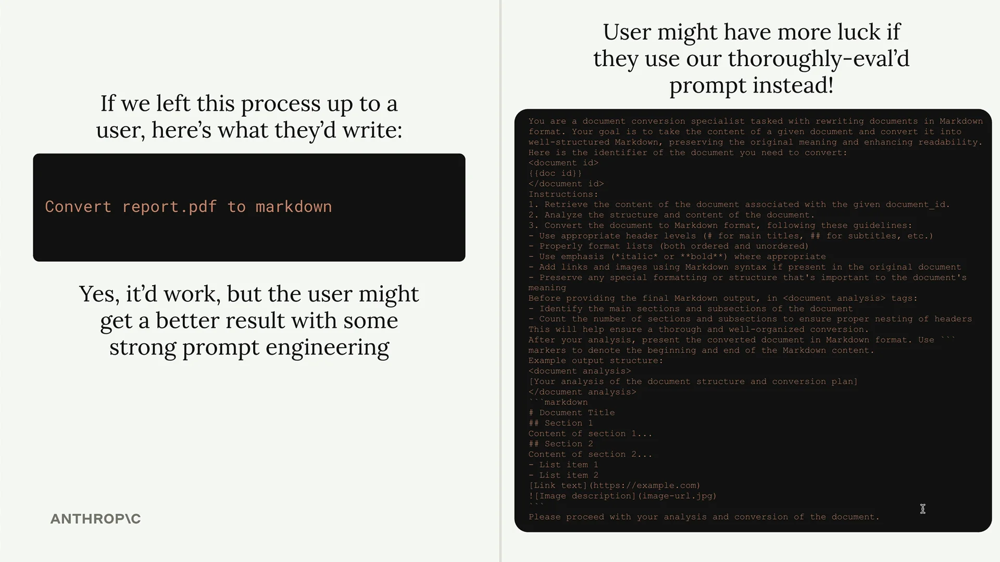
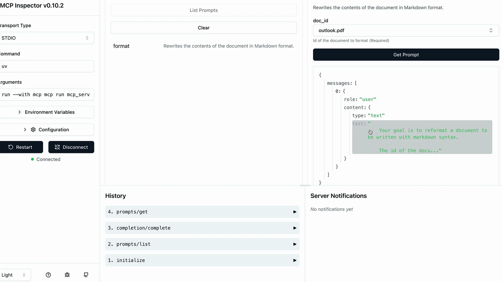

# 定义提示

MCP 服务器中的提示让您能够定义预构建的、高质量的指令，客户端可以使用这些指令，而不必从零开始编写自己的提示。可以将它们视为精心制作的模板，比用户自己想出来的效果更好。



## 为什么使用提示？

这里有一个关键的洞察：用户已经可以直接要求 Claude 完成大多数任务。例如，用户可以输入"将 report.pdf 重新格式化为 markdown"并获得不错的结果。但如果您提供一个经过充分测试的专业提示，能够处理边缘情况并遵循最佳实践，他们将获得更好的结果。

作为 MCP 服务器的作者，您可以花时间精心制作、测试和评估在不同场景下都能稳定工作的提示。用户可以从这种专业知识中受益，而不必自己成为提示工程专家。



## 构建一个格式化命令

让我们实现一个实际的例子：一个将文档转换为 markdown 的格式化命令。用户将输入 `/format doc_id`，并获得其文档的专业格式化 markdown 版本。

工作流程如下：

- 用户输入 `/` 以查看可用命令
- 他们选择 `format` 并指定一个文档 ID
- Claude 使用您预先构建的提示来读取并重新格式化文档
- 结果是带有正确标题、列表和格式的干净 markdown

## 定义提示

提示使用与工具和资源类似的装饰器模式：

```python
@mcp.prompt(
    name="format",
    description="Rewrites the contents of the document in Markdown format."
)
def format_document(
    doc_id: str = Field(description="Id of the document to format")
) -> list[base.Message]:
    prompt = f"""
Your goal is to reformat a document to be written with markdown syntax.

The id of the document you need to reformat is:
<document_id>
{doc_id}
</document_id>

Add in headers, bullet points, tables, etc as necessary. Feel free to add in structure.
Use the 'edit_document' tool to edit the document. After the document has been reformatted...
"""

    return [
        base.UserMessage(prompt)
    ]
```

该函数返回一个消息列表，这些消息会直接发送给 Claude。您可以包含多个用户和助手消息，以创建更复杂的对话流程。

## 测试您的提示

在部署之前，使用 MCP Inspector 测试您的提示：



Inspector 会准确显示将发送给 Claude 的消息，包括变量如何插值到您的提示模板中。这让您可以在用户开始依赖它之前验证提示是否正确。

## 主要优势

- **一致性** - 用户每次都能获得可靠的结果
- **专业知识** - 您可以将领域知识编码到提示中
- **可复用性** - 多个客户端应用程序可以使用相同的提示
- **可维护性** - 在一处更新提示即可改进所有客户端

当提示专门针对您的 MCP 服务器的领域时，效果最佳。一个文档管理服务器可能有用于格式化、总结或分析文档的提示。一个数据分析服务器可能有用于生成报告或可视化的提示。

目标是提供精心制作和测试的提示，使用户更愿意使用它们，而不是从零开始编写自己的指令。
