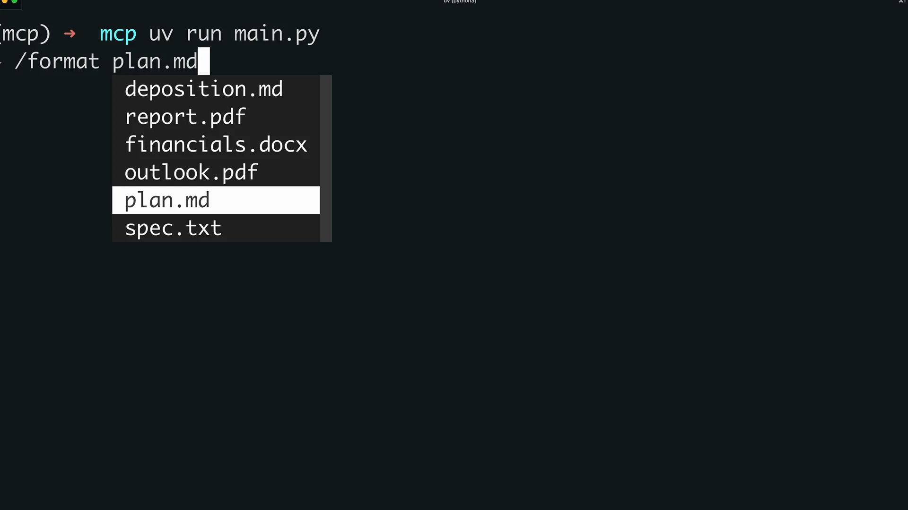
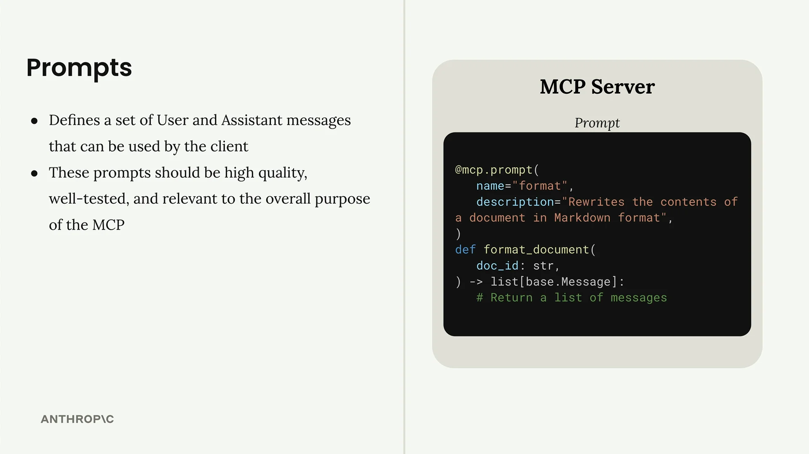

# 客户端中的提示

构建我们的 MCP 客户端的最后一步是实现提示功能。这使我们能够列出服务器上所有可用的提示，并检索填充了变量的特定提示。

## 实现列出提示

`list_prompts` 方法很简单。它调用会话的列出提示函数并返回提示：

```python
async def list_prompts(self) -> list[types.Prompt]:
    result = await self.session().list_prompts()
    return result.prompts
```

## 获取单个提示

`get_prompt` 方法更有趣，因为它处理变量插值。当您请求一个提示时，您提供的参数会作为关键字参数传递给提示函数：

```python
async def get_prompt(self, prompt_name, args: dict[str, str]):
    result = await self.session().get_prompt(prompt_name, args)
    return result.messages
```

例如，如果您的服务器有一个期望 `doc_id` 参数的 `format_document` 提示，参数字典将包含 `{"doc_id": "plan.md"}`。这个值会被插值到提示模板中。

## 实际测试提示

实现完成后，您可以通过 CLI 测试提示。当您输入斜杠（`/`）时，可用的提示会以命令的形式出现。选择像"format"这样的提示会提示您从可用文档中选择。



选择文档后，系统会将完整的提示发送给 Claude。AI 会同时接收格式化指令和文档 ID，然后使用可用工具来获取和处理内容。

## 提示的工作原理



提示定义了一组客户端可以使用的用户和助手消息。它们应该是高质量、经过充分测试的，并且与您的 MCP 服务器的用途相关。工作流程如下：

- 编写并评估与您服务器功能相关的提示
- 使用 `@mcp.prompt` 装饰器在您的 MCP 服务器中定义提示
- 客户端可以随时请求该提示
- 客户端提供的参数会成为您提示函数中的关键字参数
- 该函数返回格式化好的消息，供 AI 模型使用

这个系统创建了可重用的、参数化的提示，在通过变量实现自定义的同时保持一致性。对于您希望确保 AI 每次都能收到正确结构化指令的复杂工作流程，这尤其有用。
