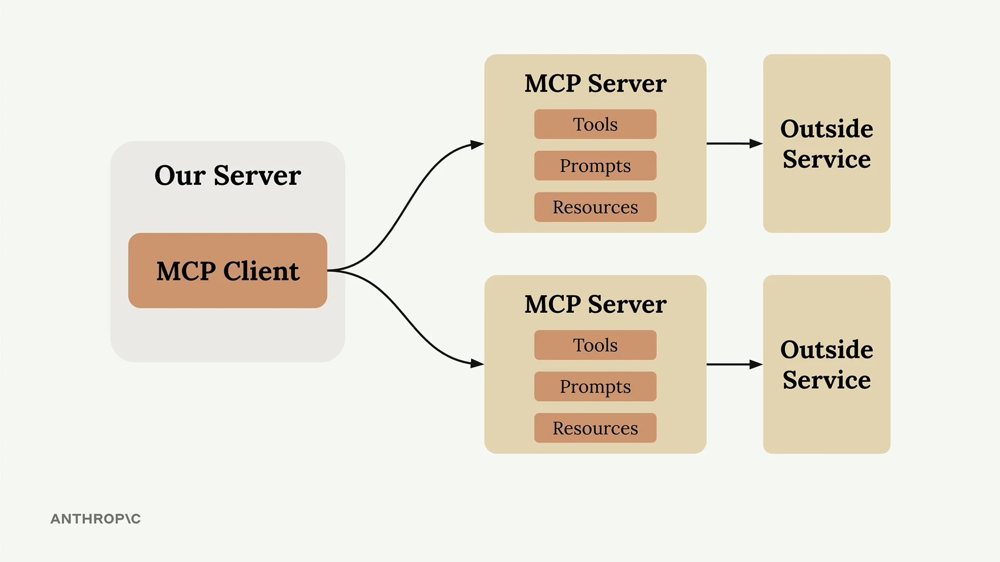
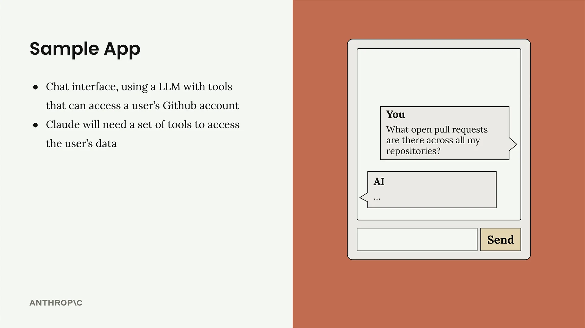
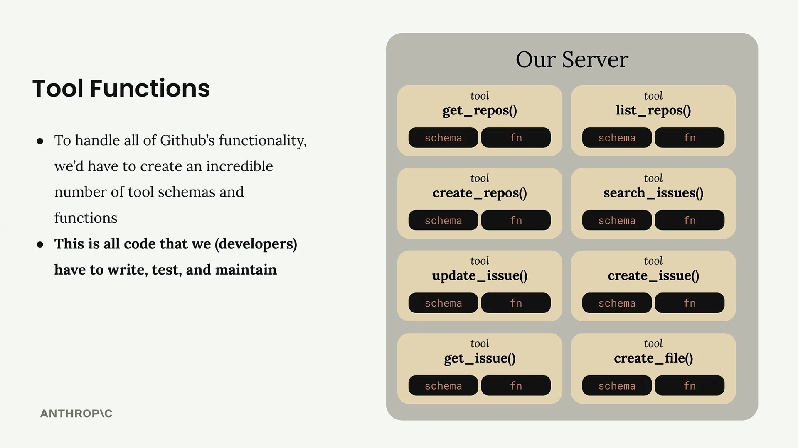
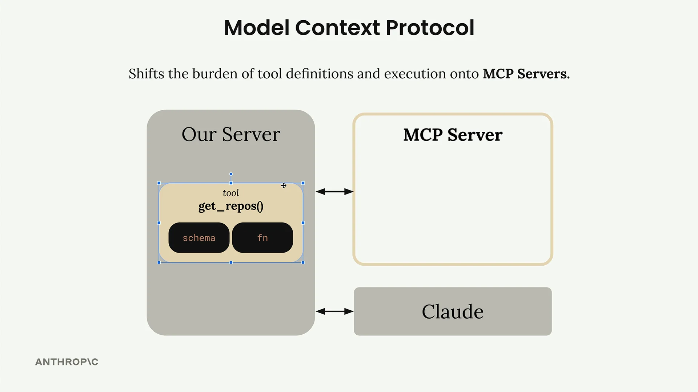
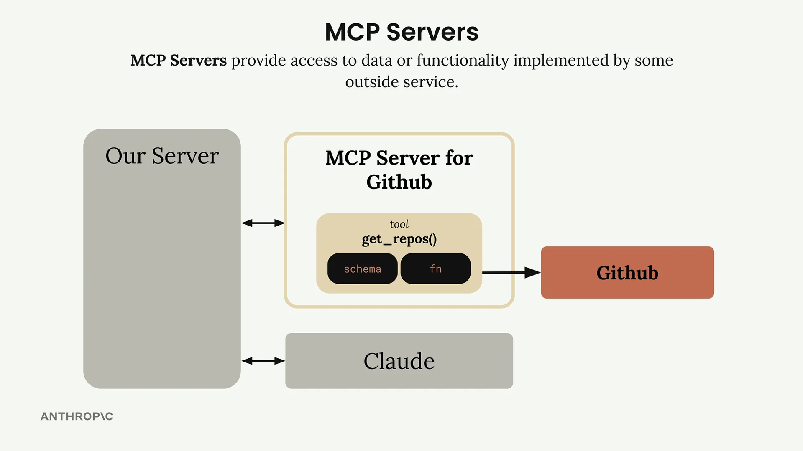

# 介绍 MCP

Model Context Protocol（MCP）是一个通信层，它为 Claude 提供上下文和工具，而无需您编写大量繁琐的集成代码。可以将其视为一种将工具定义和执行的负担从您的服务器转移到专门的 MCP 服务器的方式。

当您第一次接触 MCP 时，您会看到展示基本架构的图表：一个 MCP 客户端（您的服务器）连接到包含工具、提示和资源的 MCP 服务器。每个 MCP 服务器都充当某个外部服务的接口。

## MCP 解决的问题

假设您正在构建一个聊天界面，用户可以在其中询问 Claude 关于他们的 GitHub 数据。用户可能会问："我所有仓库中有哪些未关闭的拉取请求？"为了处理这个问题，Claude 需要工具来访问 GitHub 的 API。

GitHub 拥有庞大的功能——仓库、拉取请求、问题、项目等等。如果没有 MCP，您需要创建大量的工具模式和函数来处理 GitHub 的所有功能。

这意味着您需要自己编写、测试和维护所有这些集成代码。这需要大量的工作和持续的维护负担。

## MCP 的工作原理

MCP 通过将工具定义和执行从您的服务器转移到专用的 MCP 服务器来分担这一负担。不是由您来编写所有那些 GitHub 工具，而是由一个 GitHub 的 MCP 服务器来处理。

MCP 服务器将围绕 GitHub 的大量功能打包起来，并将其作为一组标准化的工具公开。您的应用程序连接到这个 MCP 服务器，而不是从头开始实现所有功能。

## MCP 服务器详解

MCP 服务器提供对外部服务所实现的数据或功能的访问。它们充当专门的接口，以标准化的方式公开工具、提示和资源。

在我们的 GitHub 示例中，GitHub 的 MCP 服务器包含像 `get_repos()` 这样的工具，并直接连接到 GitHub 的 API。您的服务器与 MCP 服务器通信，后者处理所有 GitHub 特定的实现细节。

## 常见问题

### 谁来编写 MCP 服务器？

任何人都可以创建 MCP 服务器实现。通常，服务提供商自己会制作他们自己的官方 MCP 实现。例如，AWS 可能会发布一个官方的 MCP 服务器，其中包含针对其各种服务的工具。

### 这与直接调用 API 有什么不同？

MCP 服务器提供已经为您定义好的工具模式和函数。如果您想直接调用 API，您将需要自己编写那些工具定义。MCP 为您节省了这部分实现工作。

### MCP 不就是和工具使用一样吗？

这是一个常见的误解。MCP 服务器和工具使用是互补但不同的概念。MCP 服务器提供已经为您定义好的工具模式和函数，而工具使用则是关于 Claude 实际如何调用这些工具。关键的区别在于谁来做这项工作——使用 MCP 时，其他人已经为您实现了这些工具。

好处很明显：您不必自己维护一套复杂的集成，而是可以利用 MCP 服务器来处理连接外部服务的繁重工作。
