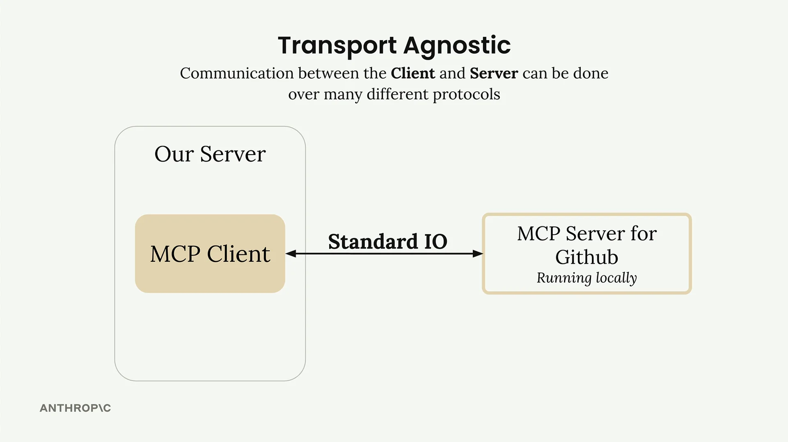
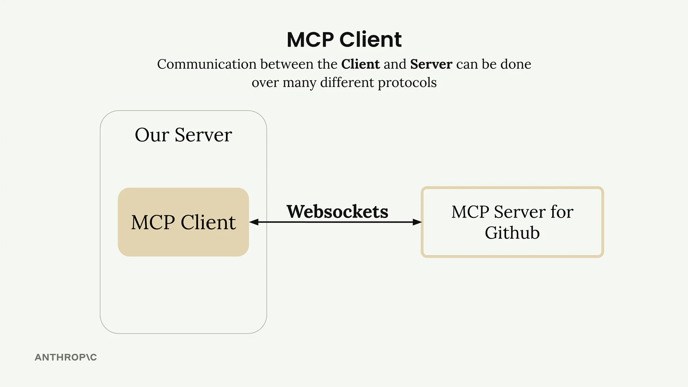
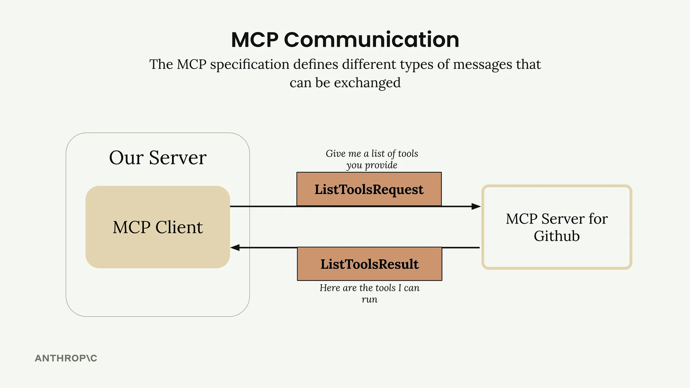
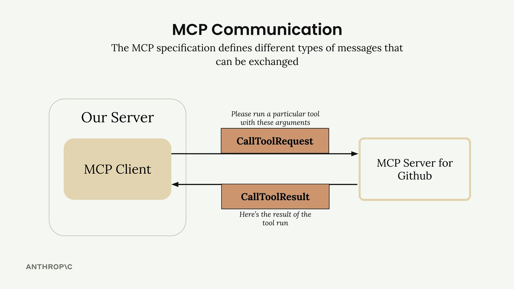
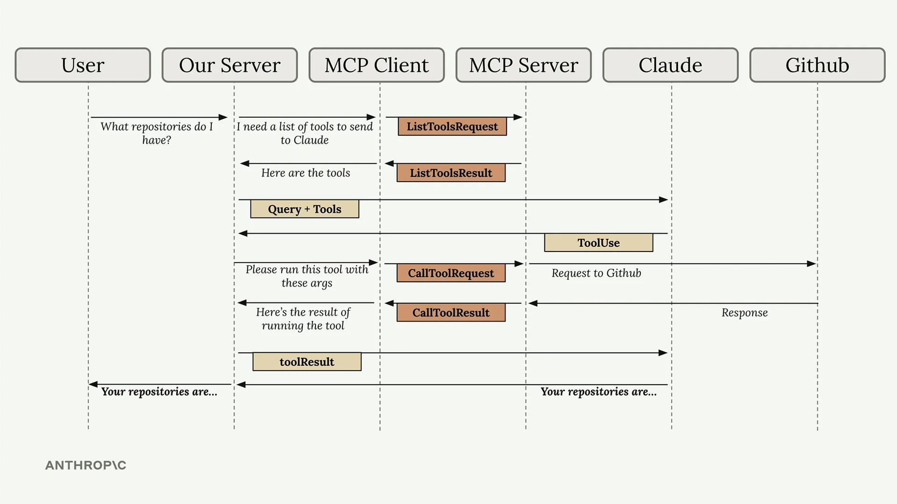

# MCP 客户端

MCP客户端充当您的服务器与MCP服务器之间的通信桥梁。它是您访问MCP服务器提供的所有工具的入口点，负责处理消息交换和协议细节，这样您的应用程序就不必亲自处理这些事情。

## 传输无关的通信

MCP的一个关键优势是传输无关——这是一种比较专业的说法，意思是客户端和服务器可以根据您的设置通过不同的协议进行通信。

最常见的设置是在同一台机器上运行MCP客户端和服务器，通过标准输入/输出进行通信。但您也可以通过以下方式连接它们：

- HTTP
- WebSockets
- 各种其他网络协议

## MCP消息类型

连接建立后，客户端和服务器会交换MCP规范中定义的特定消息类型。您将使用到的主要消息类型有：

**ListToolsRequest/ListToolsResult：** 客户端向服务器询问"您提供哪些工具？"，并获得可用工具的列表。

**CallToolRequest/CallToolResult：** 客户端要求服务器使用给定的参数运行特定工具，然后接收结果。

## 这一切是如何协同工作的

下面是一个完整的示例，展示了用户查询如何流经整个系统——从您的服务器，经过MCP客户端，到像GitHub这样的外部服务，再返回到Claude。

假设用户询问"我有哪些仓库？"以下是逐步流程：

1. **用户查询：** 用户向您的服务器提交他们的问题
2. **工具发现：** 您的服务器需要知道有哪些可用工具可以发送给Claude
3. **列出工具交换：** 您的服务器向MCP客户端询问可用工具
4. **MCP通信：** MCP客户端向MCP服务器发送`ListToolsRequest`并接收`ListToolsResult`
5. **Claude请求：** 您的服务器将用户的查询以及可用工具发送给Claude
6. **工具使用决策：** Claude判断需要调用一个工具来回答这个问题
7. **工具执行请求：** 您的服务器要求MCP客户端运行Claude指定的工具
8. **外部API调用：** MCP客户端向MCP服务器发送`CallToolRequest`，MCP服务器随后发起实际的GitHub API调用
9. **结果返回：** GitHub返回仓库数据，该数据以`CallToolResult`的形式通过MCP服务器流回
10. **工具结果返回给Claude：** 您的服务器将工具结果发送回Claude
11. **最终响应：** Claude使用仓库数据制定最终答案
12. **用户获得答案：** 您的服务器将Claude的响应传递给用户

没错，这个流程涉及很多步骤，但每个组件都有明确的职责。MCP客户端抽象掉了服务器通信的复杂性，让您可以专注于应用程序逻辑，同时仍能访问强大的外部工具和数据源。

理解这个流程至关重要，因为在接下来的章节中构建您自己的MCP客户端和服务器时，您会看到所有这些部分。
