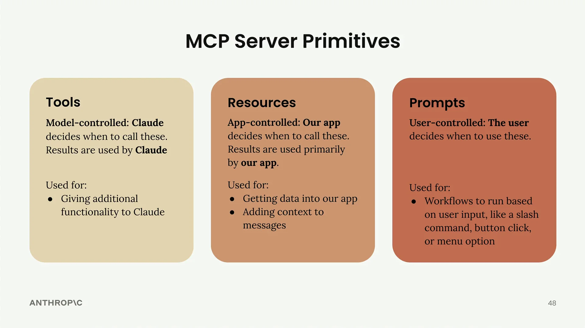

# MCP 回顾

现在我们已经构建了 MCP 服务器，让我们回顾一下三个核心服务器原语，并了解何时使用每一个。关键的洞察是，每个原语都由您应用程序堆栈的不同部分控制。

## 工具：模型控制

工具完全由 Claude 控制。AI 模型决定何时调用这些函数，并且结果由 Claude 直接用于完成任务。

工具非常适合为 Claude 提供它可以自主使用的额外能力。当您要求 Claude"使用 JavaScript 计算 3 的平方根"时，是 Claude 决定使用 JavaScript 执行工具来运行该计算。

## 资源：应用控制

资源由您的应用程序代码控制。您的应用决定何时获取资源数据以及如何使用它——通常用于 UI 元素或为对话添加上下文。

在我们的项目中，我们以两种方式使用了资源：

- 获取数据以填充 UI 中的自动完成选项
- 检索内容以用额外的上下文来增强提示

可以想想 Claude 界面中的"从 Google Drive 添加"功能——应用程序代码决定显示哪些文档，并负责将其内容注入到聊天上下文中。

## 提示：用户控制

提示由用户操作触发。用户通过 UI 交互（如按钮点击、菜单选择或斜杠命令）来决定何时运行这些预定义的工作流。

提示非常适合实现用户可以按需触发的工作流。在 Claude 的界面中，聊天输入框下方的那些工作流按钮就是提示的例子——用户可以一键启动的预定义、经过优化的工作流。

## 选择正确的原语

这里有一个快速决策指南：

- **需要为 Claude 提供新能力？** 使用工具
- **需要将数据引入您的应用以用于 UI 或上下文？** 使用资源
- **想要为用户创建预定义的工作流？** 使用提示

您可以在 Claude 的官方界面中看到这三种原语的实际应用。工作流按钮展示了提示，Google Drive 集成展示了资源的实际应用，而当 Claude 执行代码或进行计算时，它在幕后使用的是工具。

这些是高层次的指导原则，可帮助您为特定用例选择正确的原语。每一种都服务于您应用程序堆栈的不同部分——工具服务于模型，资源服务于您的应用，而提示服务于您的用户。
