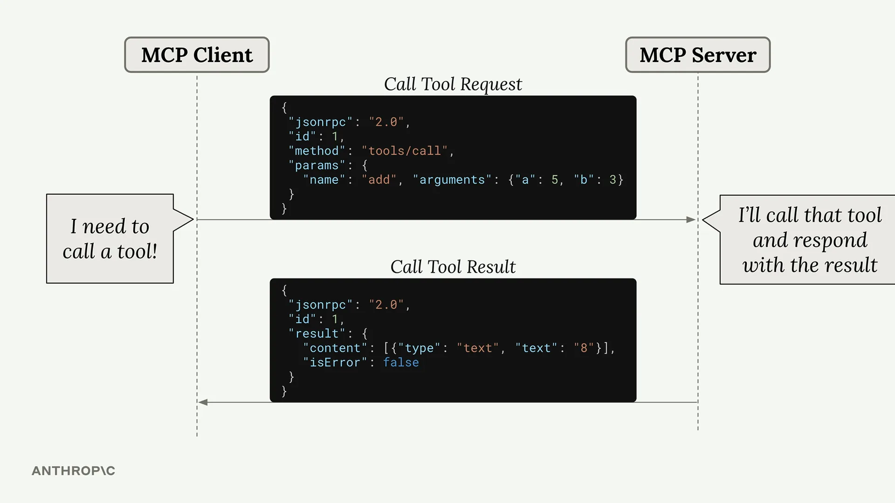
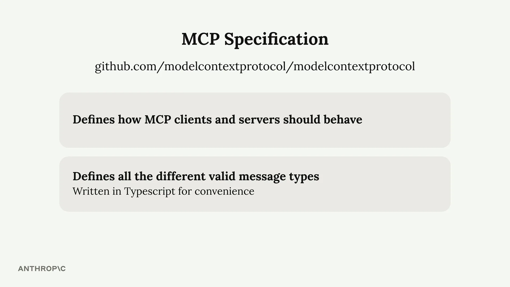
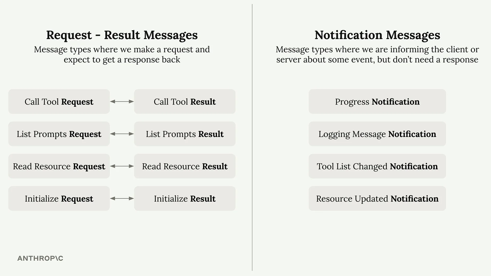

# JSON 消息类型

MCP（Model Context Protocol）使用 JSON 消息来处理客户端和服务器之间的通信。理解这些消息类型对于使用 MCP 至关重要，尤其是在处理不同的传输方法（如可流式传输的 HTTP 传输）时。

## 消息格式

所有 MCP 通信都通过 JSON 消息进行。每种消息类型都有特定的用途——无论是调用工具、列出可用资源，还是发送有关系统事件的通知。

这是一个典型的例子：当 Claude 需要调用 MCP 服务器提供的工具时，客户端会发送一条"Call Tool Request"（调用工具请求）消息。服务器处理此请求，运行该工具，并以包含输出的"Call Tool Result"（调用工具结果）消息作出响应。

## MCP 规范

完整的消息类型列表定义在 GitHub 上的官方 MCP 规范仓库中。该规范与各种 SDK 仓库（如 Python 或 TypeScript SDK）是分开的，是 MCP 应如何运作的权威来源。

为方便起见，消息类型是用 TypeScript 编写的——这并不是因为它们会作为 TypeScript 代码执行，而是因为 TypeScript 提供了一种清晰的方式来描述数据结构和类型。

## 消息类别

MCP 消息分为两大类：

### 请求-结果消息

这些消息总是成对出现。您发送一个请求，并期望得到一个结果返回：

- **Call Tool Request** → **Call Tool Result**
- **List Prompts Request → List Prompts Result**
- **Read Resource Request → Read Resource Result**
- **Initialize Request → Initialize Result**

### 通知消息

这些是单向消息，用于通知事件，但不需要响应：

- **Progress Notification**（进度通知） - 关于长时间运行操作的更新
- **Logging Message Notification**（日志消息通知） - 系统日志消息
- **Tool List Changed Notification**（工具列表变更通知） - 当可用工具发生变化时
- **Resource Updated Notification**（资源更新通知） - 当资源被修改时

## 客户端消息与服务器消息

MCP 规范按发送者来组织消息：

**客户端消息**包括客户端发送给服务器的请求（如工具调用）以及客户端可能发送的通知。

**服务器消息**包括服务器发送给客户端的请求以及服务器广播的通知。

## 为什么这很重要

理解服务器可以向客户端发送消息这一点，在使用不同的传输方法时尤为重要。某些传输方式，例如可流式传输的 HTTP 传输，对哪些类型的消息可以在哪些方向上流动存在限制。

关键的认识是，MCP 被设计为一种双向协议——客户端和服务器都可以发起通信。当您需要为特定用例选择合适的传输方法时，这一点变得至关重要。
