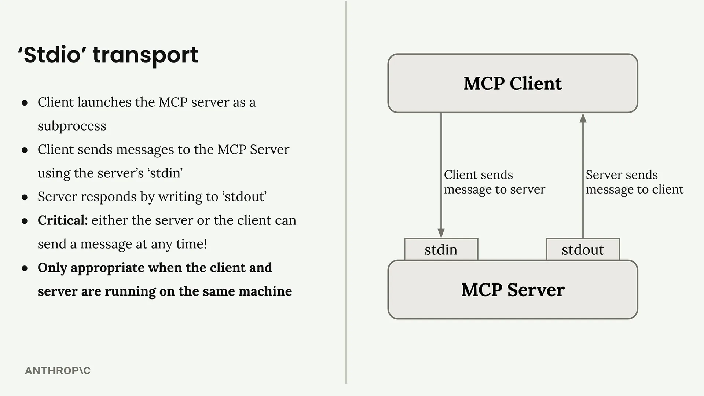
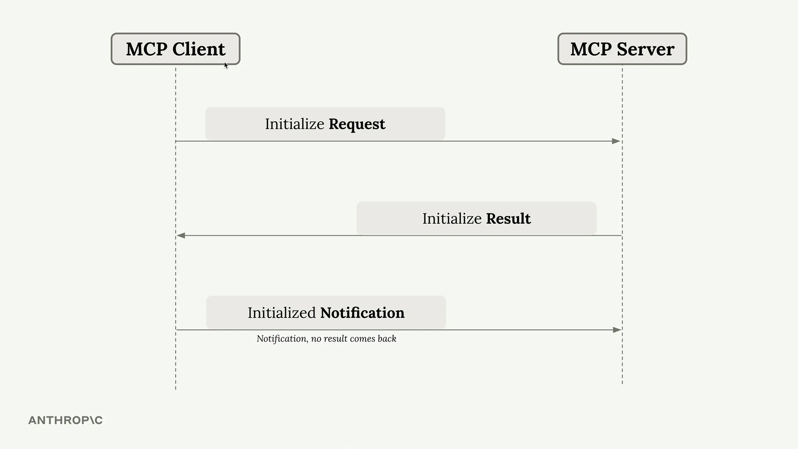
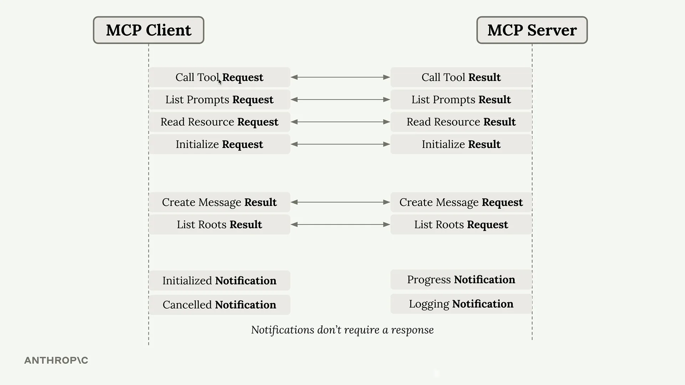
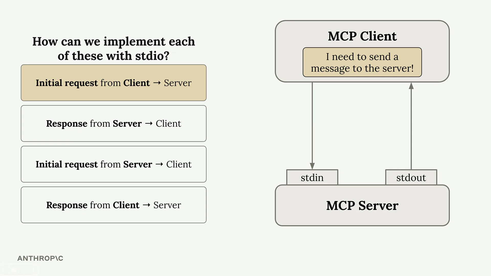

# STDIO 传输

MCP 客户端和服务器通过交换 JSON 消息进行通信，但这些消息实际上是如何传输的呢？所使用的通信通道被称为**传输（transport）**，实现方式有多种——从 HTTP 请求到 WebSocket，甚至是将 JSON 写在明信片上（不过最后这种方式不建议用于生产环境）。

## Stdio 传输

当您刚开始开发 MCP 服务器或客户端时，最常用的传输方式是**stdio 传输**。这种方法很直接：客户端将 MCP 服务器作为子进程启动，并通过标准输入和输出流进行通信。

其工作原理如下：

- 客户端使用服务器的 `stdin` 向服务器发送消息
- 服务器通过写入 `stdout` 进行响应
- 服务器或客户端都可以随时发送消息
- 仅当客户端和服务器运行在同一台机器上时才有效

## 实际观察 Stdio 的运行

您实际上可以直接从终端测试 MCP 服务器，而无需编写单独的客户端。当您使用 `uv run server.py` 运行服务器时，它会监听 stdin 并将响应写入 stdout。这意味着您可以直接将 JSON 消息粘贴到终端中，并立即看到服务器的响应。

终端输出显示了完整的消息交换过程，包括初始化和工具调用的示例消息。

## MCP 连接序列

每个 MCP 连接都必须以特定的三消息握手开始：

1. **Initialize Request（初始化请求）** - 客户端首先发送此消息
2. **Initialize Result（初始化结果）** - 服务器以其能力进行响应
3. **Initialized Notification（已初始化通知）** - 客户端确认（不期望收到响应）

只有在完成此握手之后，您才能发送其他请求，例如工具调用或提示列表。

## 消息类型与流向

MCP 支持多种消息类型，这些消息可以双向流动：

关键点在于，有些消息需要响应（请求 → 结果），而有些则不需要（通知）。客户端和服务器都可以随时发起通信。

## 四种通信场景

对于任何传输方式，您都需要处理四种不同的通信模式：

- **客户端 → 服务器请求**：客户端写入 stdin
- **服务器 → 客户端响应**：服务器写入 stdout
- **服务器 → 客户端请求**：服务器写入 stdout
- **客户端 → 服务器响应**：客户端写入 stdin

stdio 传输的精妙之处在于其简洁性——任何一方都可以随时使用这两个通道发起通信。

## 为什么这很重要

理解 stdio 传输至关重要，因为它代表了双向通信无缝衔接的"理想"情况。当我们转向其他传输方式（如 HTTP）时，会遇到一些限制，即服务器并不总能向客户端发起请求。stdio 传输为我们理解完整 MCP 通信的样貌提供了基准，之后我们才能应对其他传输方式的各种限制。

对于开发和测试而言，stdio 传输是完美的选择。而对于需要客户端和服务器运行在不同机器上的生产部署场景，您需要考虑其他传输选项，并权衡它们各自的利弊。
