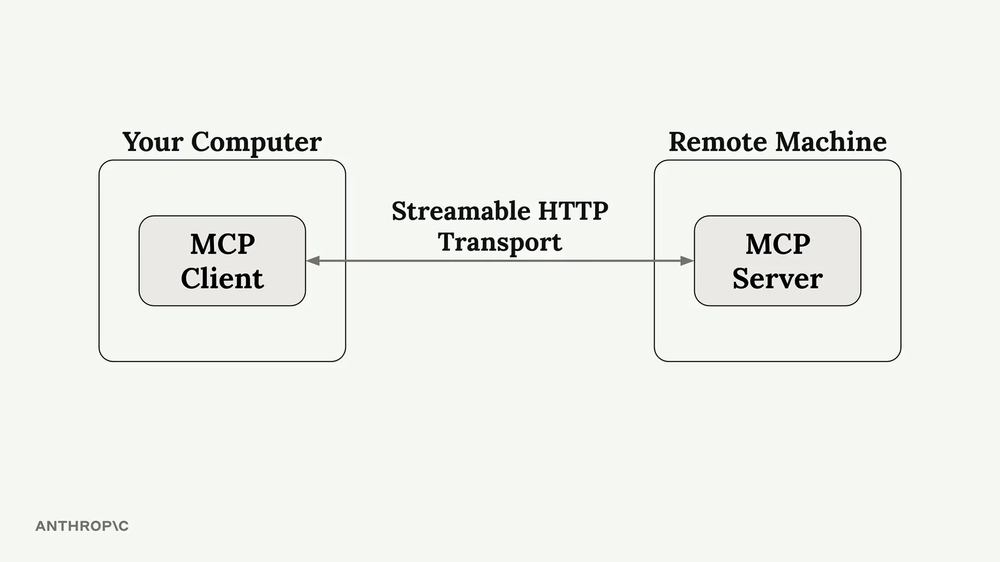
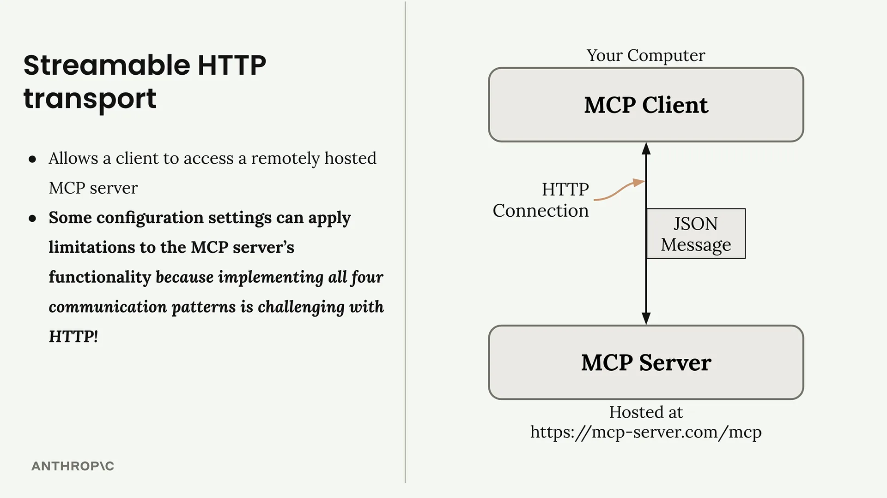
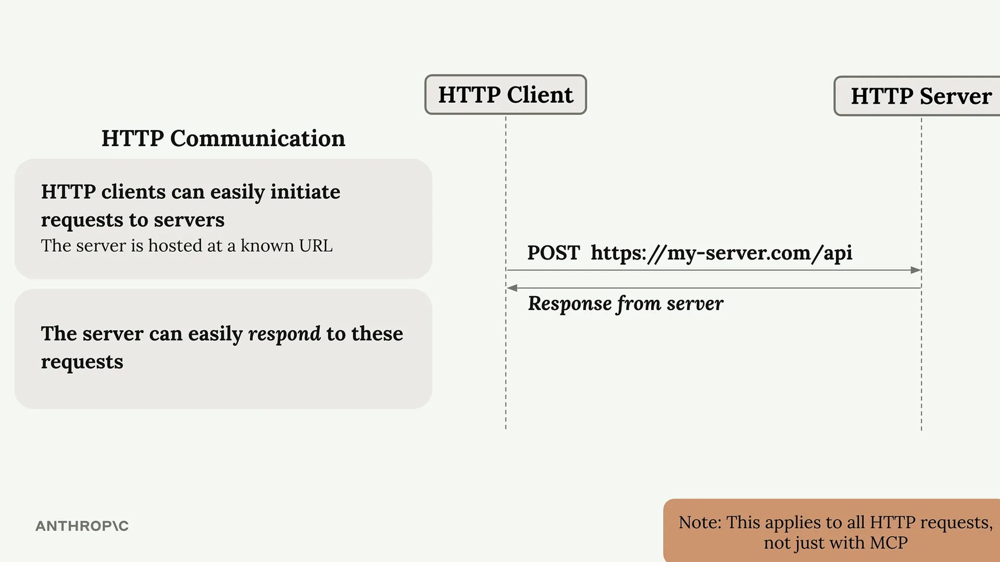
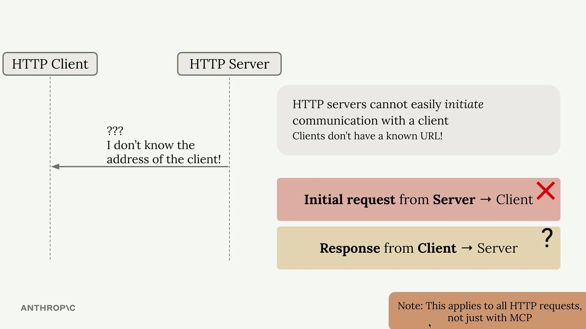
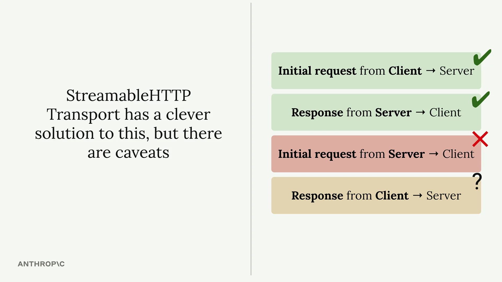

# 可流式传输的 HTTP 传输

可流式传输的 HTTP 传输使 MCP 客户端能够通过 HTTP 连接连接到远程托管的服务器。与要求客户端和服务器位于同一台机器上的标准 I/O 传输不同，这种传输为任何人都可以访问的公共 MCP 服务器开辟了可能性。

然而，有一个重要的注意事项：某些配置设置可能会显著限制您的 MCP 服务器的功能。如果您的应用程序在本地使用标准 I/O 传输时运行完美，但在使用 HTTP 传输部署时出现故障，这很可能就是罪魁祸首。

## 重要的配置设置

两个关键设置控制着可流式传输的 HTTP 传输的行为方式：

- `stateless_http` - 控制连接状态管理
- `json_response` - 控制响应格式处理

默认情况下，这两个设置都是 `false`，但某些部署场景可能会强制您将它们设置为 `true`。启用后，这些设置可能会破坏核心功能，如进度通知、日志记录和服务器发起的请求。

## HTTP 通信的挑战

要理解为什么存在这些限制，我们需要回顾一下 HTTP 通信的工作原理。在标准 HTTP 中：

- 客户端可以轻松地向服务器发起请求（服务器有一个已知的 URL）
- 服务器可以轻松地响应这些请求
- 服务器无法轻松地向客户端发起请求（客户端没有已知的 URL）
- 从客户端返回到服务器的响应模式会出现问题

## 受影响的 MCP 消息类型

这种 HTTP 限制影响特定的 MCP 通信模式。以下消息类型在使用纯 HTTP 时难以实现：

- **服务器发起的请求：** 创建消息请求、列出根目录请求
- **通知：** 进度通知、日志通知、初始化通知、取消通知

这些正是当您启用限制性 HTTP 设置时会出现故障的功能。进度条消失，日志记录停止工作，服务器发起的采样请求失败。

## 可流式传输的 HTTP 解决方案

可流式传输的 HTTP 传输确实提供了一个巧妙的解决方案来规避 HTTP 的限制，但它也伴随着权衡。当您被迫使用 `stateless_http=True` 或 `json_response=True` 时，您实际上是在告诉传输层在 HTTP 的约束范围内运行，而不是绕过这些约束。

理解这些限制有助于您就以下方面做出明智的决策：

- 针对不同的部署场景使用哪种传输方式
- 如何设计您的 MCP 服务器以优雅地处理 HTTP 约束
- 何时为了远程托管的好处而接受功能的减少

关键在于了解这些限制的存在，并据此规划您的 MCP 服务器架构。如果您的应用程序严重依赖服务器发起的请求或实时通知，您可能需要重新考虑您的传输选择，或实现替代的通信模式。
