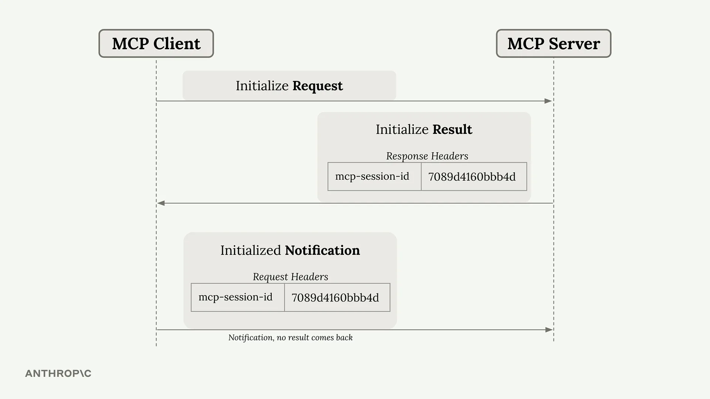
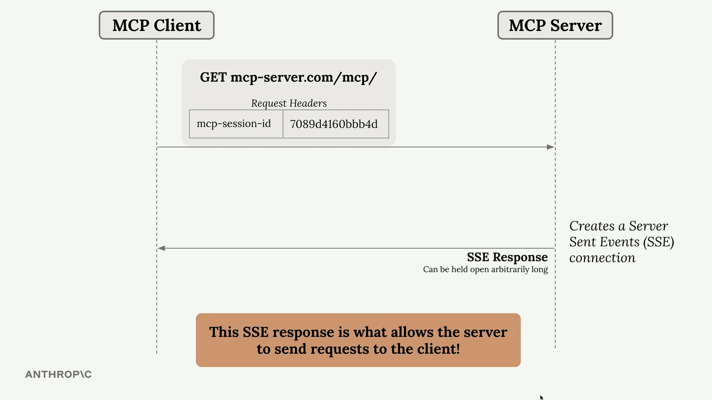
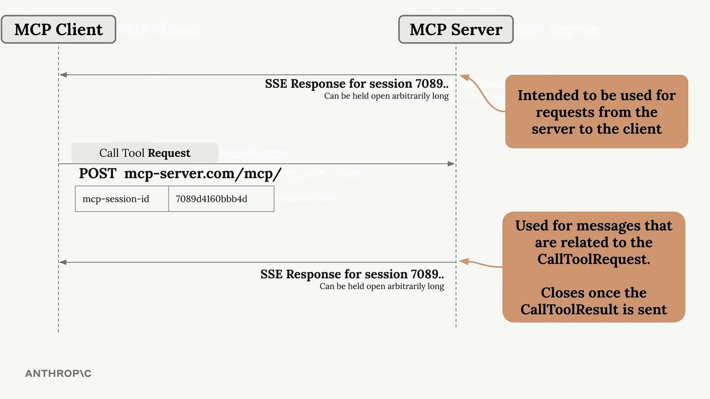
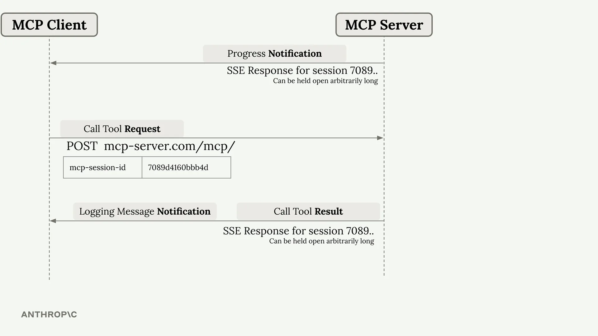

# 深入理解 StreamableHTTP

StreamableHTTP 是 MCP 针对一个根本性问题的解决方案：某些 MCP 功能需要服务器向客户端发起请求，但 HTTP 使这一点变得具有挑战性。让我们来探讨 StreamableHTTP 如何绕过这一限制，以及您何时可能需要打破这种变通方案。

## 核心问题

一些 MCP 功能，如采样（sampling）、通知（notifications）和日志记录（logging），依赖于服务器向客户端发起请求。然而，HTTP 的设计是让客户端向服务器发起请求，而不是反过来。StreamableHTTP 通过使用服务器发送事件（Server-Sent Events，SSE）的巧妙变通方案解决了这个问题。

## StreamableHTTP 的工作原理

这一机制通过一个多步骤的过程实现，该过程在客户端和服务器之间建立持久连接。

### 初始连接建立

该过程的开始与任何 MCP 连接相同：

- 客户端向服务器发送一个 `Initialize Request`（初始化请求）
- 服务器以包含特殊 `mcp-session-id` 头的 `Initialize Result`（初始化结果）作为响应
- 客户端发送带有会话 ID 的 `Initialized Notification`（已初始化通知）

这个会话 ID 至关重要——它唯一标识了客户端，并且必须包含在所有后续请求中。

### SSE 变通方案

初始化完成后，客户端可以发起一个 GET 请求来建立服务器发送事件连接。这会创建一个长期存在的 HTTP 响应，服务器可以随时使用它向客户端流式传输消息。

这个 SSE 连接是实现服务器到客户端通信的关键。服务器现在可以通过这个持久通道发送请求、通知和其他消息。

## 工具调用与双 SSE 连接

当客户端发起工具调用时，情况会变得更加复杂。系统会创建两个独立的 SSE 连接：

- **主 SSE 连接：** 用于服务器发起的请求，并无限期保持打开状态
- **工具专用 SSE 连接：** 为每次工具调用创建，并在工具结果发送后自动关闭

### 消息路由

不同类型的消息会通过不同的连接进行路由：

- **进度通知：** 通过主 SSE 连接发送
- **日志消息和工具结果：** 通过工具专用 SSE 连接发送

## 打破变通方案的配置标志

StreamableHTTP 包含两个重要的配置选项：

- `stateless_http`
- `json_response`

将这些设置为 `True` 可能会破坏 SSE 变通机制。在某些场景下，您可能希望启用这些标志，但这样做会限制依赖于服务器到客户端通信的完整 MCP 功能。

## 关键要点

StreamableHTTP 比其他 MCP 传输方式更复杂，因为它必须绕过 HTTP 的限制。基于 SSE 的变通方案使完整的 MCP 功能能够在 HTTP 上运行，但理解双连接模型对于调试和优化至关重要。

在使用 StreamableHTTP 构建 MCP 应用程序时，请记住：初始化之后的所有请求都需要会话 ID，并且系统会自动管理多个 SSE 连接，以处理不同类型的服务器到客户端通信。
