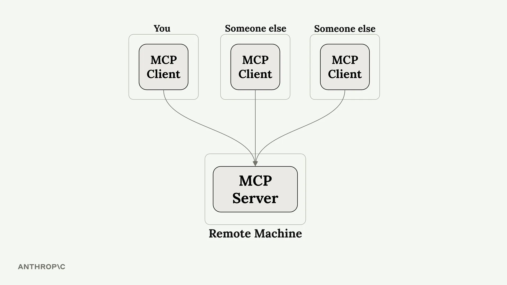
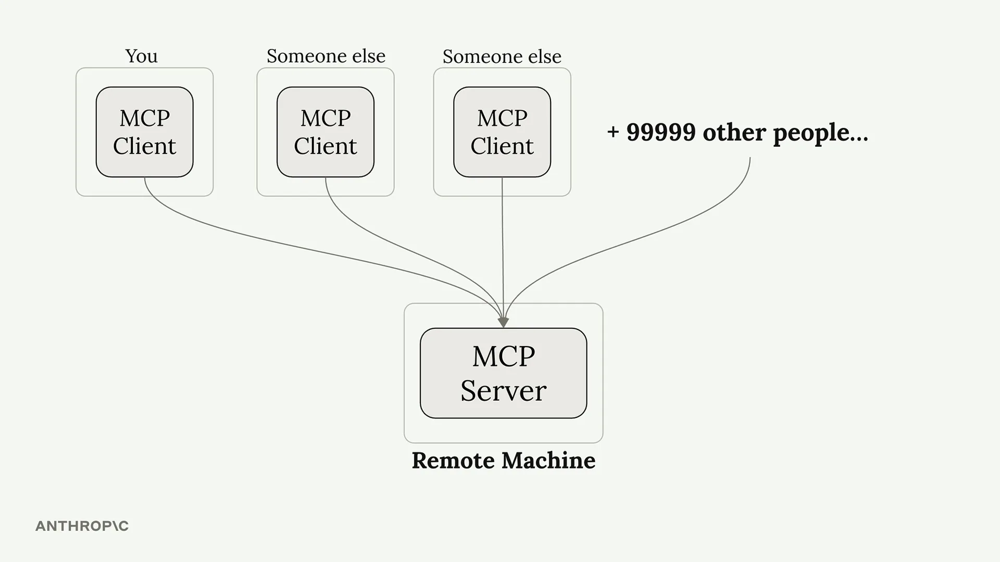
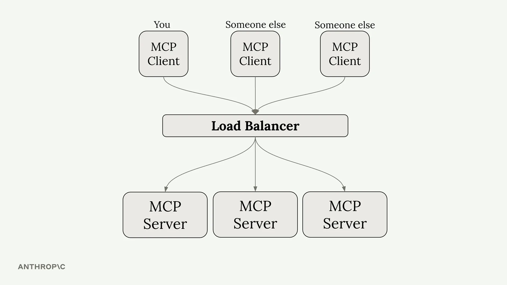
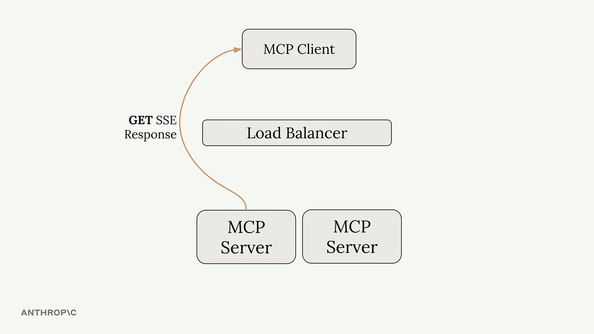
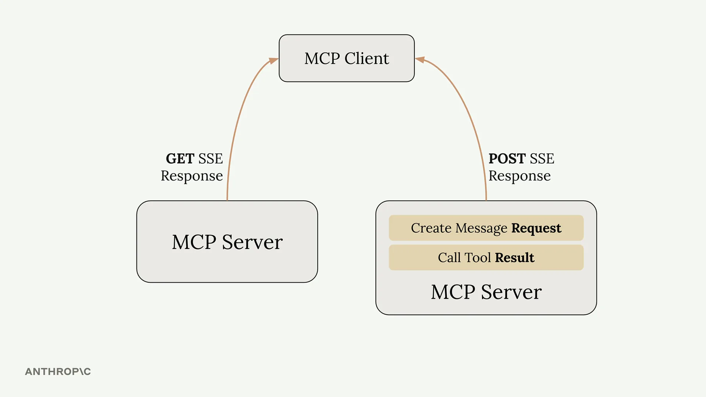
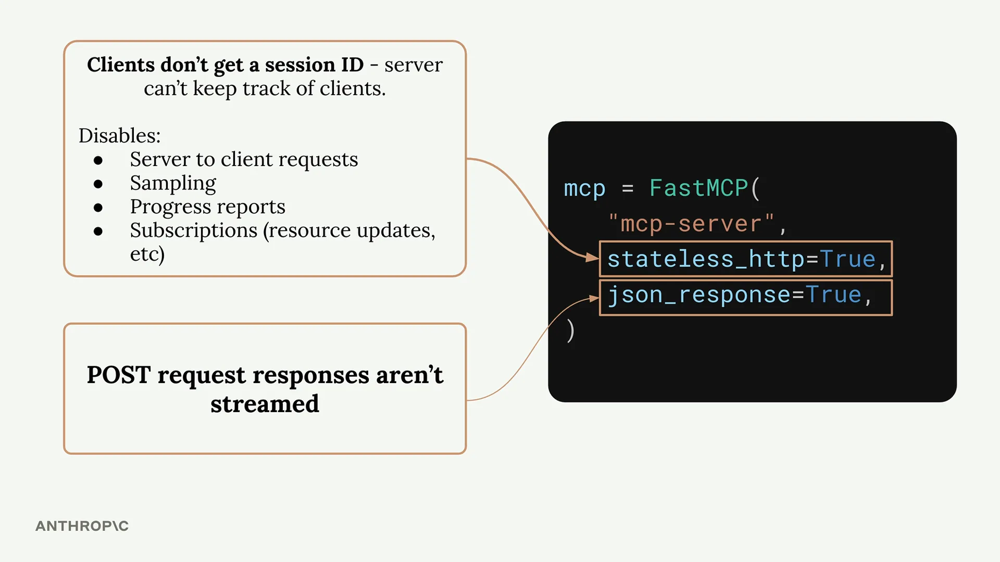
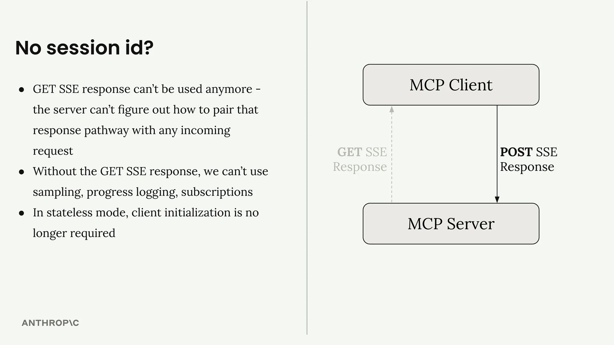

# 状态与 StreamableHTTP 传输

MCP 服务器中的 `stateless_http` 和 `json_response` 标志控制着服务器行为的基本方面。理解何时以及为何使用它们至关重要，尤其是当您计划扩展服务器规模或将其部署到生产环境时。

## 何时需要无状态 HTTP

想象您构建了一个变得流行的 MCP 服务器。最初，您可能只有少数几个客户端连接到单个服务器实例：

随着服务器的发展，您可能会有数千个客户端尝试连接。运行单个服务器实例将无法扩展以处理所有这些流量：

典型的解决方案是水平扩展——在负载均衡器后面运行多个服务器实例：

但这正是事情变得复杂的地方。请记住，MCP 客户端需要两个独立的连接：

- 一个用于接收服务器到客户端请求的 GET SSE 连接
- 用于调用工具和接收响应的 POST 请求

使用负载均衡器时，这些请求可能会被路由到不同的服务器实例。如果您的工具需要使用 Claude（通过采样），处理 POST 请求的服务器就需要与处理 GET SSE 连接的服务器进行协调。这就产生了服务器之间复杂的协调问题。

## 无状态 HTTP 如何解决这个问题

设置 `stateless_http=True` 可以消除这个协调问题，但会带来显著的权衡：

启用无状态 HTTP 时：

- **客户端不会获得会话 ID** —— 服务器无法跟踪单个客户端
- **没有服务器到客户端的请求** —— GET SSE 通道变得不可用
- **没有采样** —— 无法使用 Claude 或其他 AI 模型
- **没有进度报告** —— 无法在长时间操作期间发送进度更新
- **没有订阅** —— 无法通知客户端资源更新

不过，有一个好处：**不再需要客户端初始化**。客户端可以直接发出请求，而无需初始的握手过程。

## 理解 JSON 响应

`json_response=True` 标志更简单——它只是禁用了 POST 请求响应的流式传输。工具执行时，您不会收到多条 SSE 消息，而是只以纯 JSON 形式获得最终结果。

禁用流式传输后：

- 没有中间进度消息
- 执行期间没有日志语句
- 只有最终的工具结果

## 何时使用这些标志

**在以下情况下使用无状态 HTTP：**

- 您需要使用负载均衡器进行水平扩展
- 您不需要服务器到客户端的通信
- 您的工具不需要 AI 模型采样
- 您想要最小化连接开销

**在以下情况下使用 JSON 响应：**

- 您不需要流式响应
- 您更喜欢更简单的非流式 HTTP 响应
- 您正在与期望纯 JSON 的系统集成

## 开发环境与生产环境

如果您在本地使用标准 I/O 传输进行开发，但计划使用 HTTP 传输进行部署，请使用与生产环境相同的传输方式进行测试。有状态模式和无状态模式之间的行为差异可能很显著，最好在开发期间发现任何问题，而不是在部署之后。

这些标志从根本上改变了您的 MCP 服务器的运作方式，因此请根据您具体的扩展和功能需求来选择它们。
