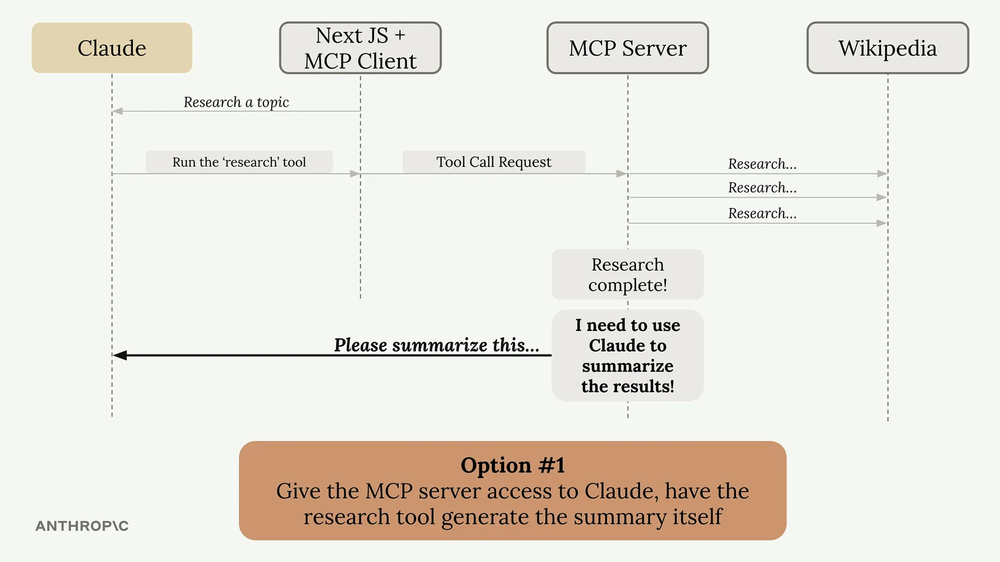
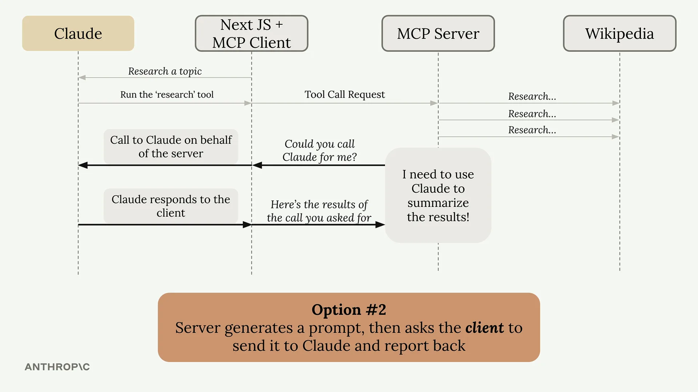

# Sampling

Sampling（采样）允许服务器通过已连接的 MCP 客户端访问像 Claude 这样的语言模型。服务器不直接调用 Claude，而是请求客户端代表它进行调用。这将文本生成的责任和成本从服务器转移到了客户端。

## Sampling 解决的问题

假设您有一个 MCP 服务器，其中有一个研究工具可以从 Wikipedia 获取信息。在收集完所有数据后，您需要将其总结成一份连贯的报告。您有两个选择：



**选项1：** 让 MCP 服务器直接访问 Claude。服务器需要拥有自己的 API 密钥，处理身份验证、管理成本，并实现所有 Claude 集成代码。这种方式可行，但会增加大量复杂性。



**选项2：** 使用 sampling。服务器生成一个提示并询问客户端"您能代我调用 Claude 吗？"客户端已经与 Claude 建立了连接，因此会进行调用并返回结果。

## Sampling 的工作原理

流程很简单：

- 服务器完成其工作（例如获取 Wikipedia 文章）
- 服务器创建一个请求文本生成的提示
- 服务器向客户端发送一个 sampling 请求
- 客户端使用提供的提示调用 Claude
- 客户端将生成的文本返回给服务器
- 服务器在其响应中使用生成的文本

## Sampling 的优势

- **降低服务器复杂性：** 服务器不需要直接与语言模型集成
- **转移成本负担：** 由客户端支付令牌使用费用，而非服务器
- **无需 API 密钥：** 服务器不需要 Claude 的凭证
- **非常适合公共服务器：** 您不希望公共服务器为每个用户累积 AI 成本

## 实现方式

设置 sampling 需要在双方都编写代码：

### 服务器端

在您的工具函数中，使用 `create_message` 函数来请求文本生成：

```python
@mcp.tool()
async def summarize(text_to_summarize: str, ctx: Context):
    prompt = f"""
    Please summarize the following text:
    {text_to_summarize}
    """

    result = await ctx.session.create_message(
        messages=[
            SamplingMessage(
                role="user",
                content=TextContent(
                    type="text",
                    text=prompt
                )
            )
        ],
        max_tokens=4000,
        system_prompt="You are a helpful research assistant",
    )

    if result.content.type == "text":
        return result.content.text
    else:
        raise ValueError("Sampling failed")
```

### 客户端

创建一个处理服务器请求的 sampling 回调函数：

```python
async def sampling_callback(
    context: RequestContext, params: CreateMessageRequestParams
):
    # 使用 Anthropic SDK 调用 Claude
    text = await chat(params.messages)

    return CreateMessageResult(
        role="assistant",
        model=model,
        content=TextContent(type="text", text=text),
    )
```

然后在初始化客户端会话时传入此回调函数：

```python
async with ClientSession(
    read,
    write,
    sampling_callback=sampling_callback
) as session:
    await session.initialize()
```

## 何时使用 Sampling

在构建可公开访问的 MCP 服务器时，sampling 最有价值。您不希望随机用户以您的成本无限制地生成文本。通过使用 sampling，每个客户端都为自己的 AI 使用付费，同时仍能享受您服务器的功能。

这种技术本质上将 AI 集成的复杂性从您的服务器转移到了客户端，而客户端通常已经具备了必要的连接和凭证。
