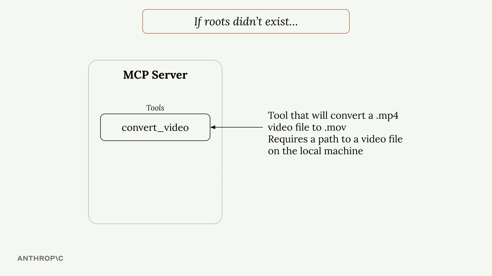
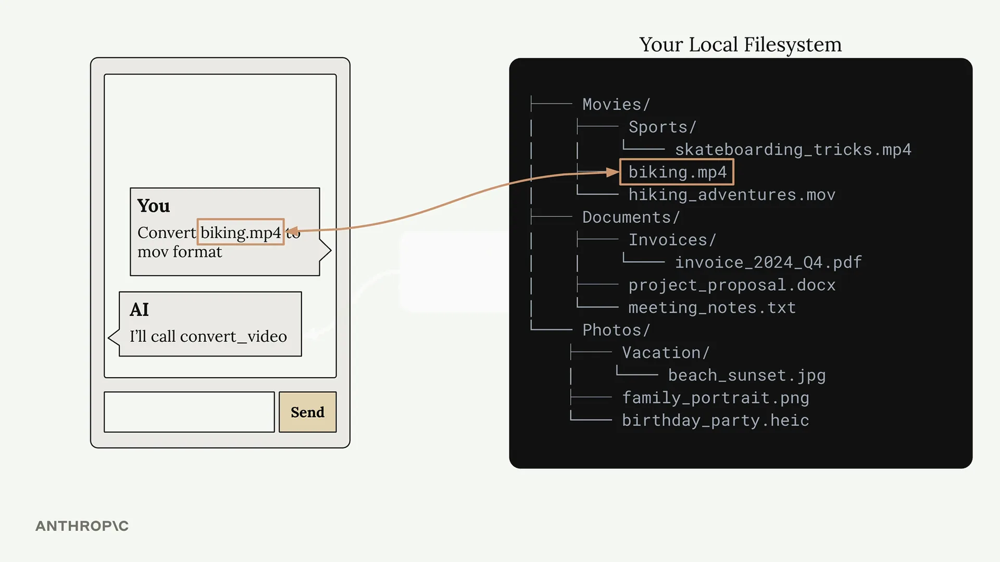

# Roots

Roots（根目录）是一种授予 MCP 服务器访问本地计算机上特定文件和文件夹权限的方式。您可以将其视为一种权限系统，它表示"嘿，MCP 服务器，你可以访问这些文件"——但它们的作用远不止授予权限。

## Roots 解决的问题

如果没有 roots，您会遇到一个常见问题。假设您有一个带有视频转换工具的 MCP 服务器，该工具接受文件路径并将 MP4 转换为 MOV 格式。

当用户要求 Claude "将 biking.mp4 转换为 mov 格式"时，Claude 只会用文件名来调用该工具。但问题在这里——Claude 无法搜索您整个文件系统来找到该文件实际所在的位置。

您的文件系统可能很复杂，文件分散在不同的目录中。用户知道 biking.mp4 文件在他们的 Movies 文件夹中，但 Claude 没有这个上下文信息。

您可以通过要求用户始终提供完整路径来解决这个问题，但这并不是很用户友好。没有人想每次都输入完整的文件路径。

## Roots 的实际应用

以下是使用 roots 后工作流程的变化：

1. 用户要求转换一个视频文件
2. Claude 调用 `list_roots` 来查看它可以访问哪些目录
3. Claude 在可访问的目录上调用 `read_dir` 来查找该文件
4. 一旦找到，Claude 就会用完整路径调用转换工具

这一切都是自动发生的——用户仍然可以只说"转换 biking.mp4"，而不需要提供完整路径。

## 安全性与边界

Roots 还通过限制访问来提供安全性。如果您只授予对 Desktop 文件夹的访问权限，MCP 服务器就无法访问其他位置的文件，比如 Documents 或 Downloads。

当 Claude 尝试访问已批准 roots 之外的文件时，它会收到一个错误，并可以告知用户该文件在当前服务器配置下无法访问。

## 实现细节

MCP SDK 不会自动强制执行 root 限制——您需要自己实现这一点。一种典型的模式是创建一个辅助函数，比如 `is_path_allowed()`，它会：

- 接收一个请求的文件路径
- 获取已批准 roots 的列表
- 检查请求的路径是否落在其中一个 roots 范围内
- 返回 true/false 以表示访问权限

然后，您需要在任何访问文件或目录的工具中调用此函数，在执行实际的文件操作之前进行检查。

## 主要优势

- **用户友好** - 用户不需要提供完整的文件路径
- **聚焦搜索** - Claude 只在已批准的目录中查找，使文件发现更快速
- **安全性** - 防止意外访问已批准区域之外的敏感文件
- **灵活性** - 您可以通过工具提供 roots，或直接将其注入到提示中

Roots 通过为 Claude 提供查找文件所需的上下文，同时在其可访问范围周围保持清晰的边界，使 MCP 服务器变得更强大、更安全。
