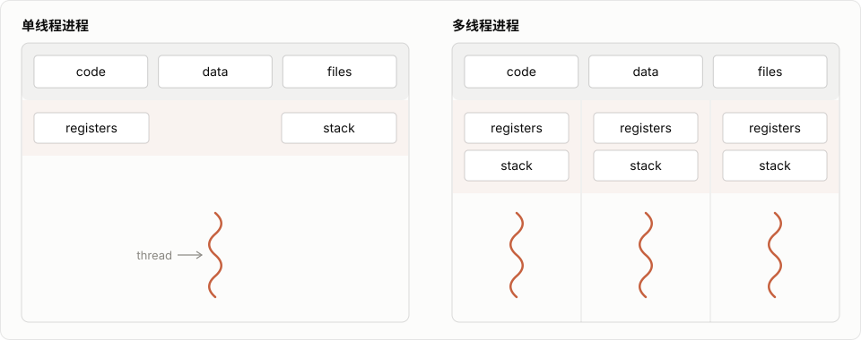

# GIL

这篇文章我们来讲 GIL，G-I-L，也就是下面的 Global Interpreter Lock。那讲 GIL 之前，我们首先要理清一个概念：什么是线程？

## 线程与进程

线程是操作系统进行计算和调度的一个最小的单位。我们可以简单地理解为，我们的程序都是运行在线程里的。每一个线程有属于自己的上下文。那进程是比线程更大一点的单位，每一个进程有自己的内存之类的。一个进程可以有好几个线程，这些线程会共享这个进程有的内存，就是这些线程都可以读写同样的变量，你可以这么理解。



那有关进程跟线程，这是一个非常大的话题。大家如果感兴趣的话，自己去研究一下。这不是我们今天的重点，我们只是需要它作为一个背景资料。

## 竞争冒险

那当一个进程有不止一个线程的时候，就会出现一种情况，叫做 racing，或者叫竞争冒险。因为一个进程中的若干线程，它们既有可能同时运行，也有可能交替运行。但不管是同时运行还是交替运行，你都没有办法控制它们之间的相对顺序。

我们举个例子，假设两个线程都在运行下面这个函数。我们说线程 1 跟线程 2，假设它们两个都成功地把 a 初始化成 1 了。注意，它们两个是共享 a 这个变量的，这是线程的特点。

```python
a = 1
if a > 0:
    a -= 1
```

那假设线程 1 先来判断这个 if a 大于 0，它发现这个是 True，对不对？然后它就进入了这个 if statement。这个时候线程 2 开始判断了，在线程 1 有能力运行 a 减等于 1 之前，线程 2 也判断 if a 大于 0。线程 2 也发现 a 是 1，大于 0，没错，线程 2 就也进这个 if block 了。由于它们两个线程都进了这个 if block，所以 a 被减了两次。而上面这个程序，显然它的目的应该是把 a 减到 0 为止。

| 顺序 | 线程 1 | 线程 2 | a |
| ---- | ---- | ---- | ---- |
| 1 | `if a > 0` 为 True | | 1 |
| 2 | | `if a > 0` 为 True | 1 |
| 3 | `a -= 1` | | 0 |
| 4 | | `a -= 1` | -1 |

那在更多的情况下，可能是线程 1 运行，然后 if a 大于 0，a 减等于 1，然后 a 就变成 0 了。这个时候线程 2 再来判断 if a 大于 0 的时候，它就发现 a 不大于 0 了，然后它又跳过这个 if block 了。

那像这种由于线程之间的相对运行顺序不同，导致着结果不同的情况，我们就叫做 racing condition，或者叫做竞争冒险。

## Python 如何释放内存

好，那接下来我们说回 Python。如果你学过 C 跟 C++ 的话，你会知道，在 C 跟 C++ 里面，你是需要显式地去分配和释放内存的。如果你光分配不释放，随着你程序的运行，你占用的内存就会越来越多，你的内存就会爆炸，对吧？

但是在 Python 里面，你并不需要显式地去分配跟释放内存。所有的 Python object，包括 list、dict 这种东西，你拿来直接用就可以了。那你不用做这些烦心事，是因为 Python 的解释器的 memory management，帮你做了这件事。

Python 是怎么做到自动分配，尤其是释放内存的呢？为什么要说“尤其”呢？因为分配比较容易，对吧？我需要内存，我拿就行了。关键是什么时候可以释放它。

那 Python 使用的机制呢，叫做 reference count，引用计数。它的原理呢，也并不难理解。就是每一个 Python object，它都数着有多少的地方用到了自己。每有一个新的地方用到了自己，它就把自己的引用计数加 1。然后这个地方不用了，或者说这个 object 没有了，我的引用计数就减 1。这样，只要你数数数得是对的，我就可以知道什么时候我的引用计数到 0 了。那就没有人需要我了，我自己就可以把我这块内存释放掉了。

大家可以看这里，这个 `ob_refcnt`，就是这个 `PyObject` 的引用计数保存的地方。

```c title="Include/object.h" showLineNumbers=105 {3}
typedef struct _object {
    _PyObject_HEAD_EXTRA
    Py_ssize_t ob_refcnt;
    PyTypeObject *ob_type;
} PyObject;
```

这里这个 `_Py_DECREF` 函数，也是比较好读啊，就是把这个 ref count 减 1，然后如果它到 0 了的话，就把它 dealloc 掉。

```c title="Include/object.h" showLineNumbers=432 {10,18}
static inline void _Py_DECREF(
#ifdef Py_REF_DEBUG
    const char *filename, int lineno,
#endif
    PyObject *op)
{
#ifdef Py_REF_DEBUG
    _Py_RefTotal--;
#endif
    if (--op->ob_refcnt != 0) {
#ifdef Py_REF_DEBUG
        if (op->ob_refcnt < 0) {
            _Py_NegativeRefcount(filename, lineno, op);
        }
#endif
    }
    else {
        _Py_Dealloc(op);
    }
}
```

## 引用计数的竞争冒险

这个事情本身不难理解，对吧？就是数数嘛。但是结合我们刚才说的那个竞争冒险的事情，我们可以想一下，如果一个进程里有多个线程在运行的话，这里就会有一个竞争冒险的问题。因为这个减减 `ob_refcnt`，它并不是 atomic 的。atomic 的意思呢，就是说我在运行的时候，不会被其他的线程打断。

这个减减，虽然在 C 里面看起来像是一个操作符，但实际上也要把这个 ref count 的信息读出来，减 1，再存回去。那在这三个步骤中间，就有可能有其他的线程过来，在你存回去之前，也做这件事。那这种情况的发生，就有可能让你数数数错，多数了一个，少数了一个呀，这都是有可能的。那一旦你数数数不明白了，是不是你就没有办法保证你的每一个 Python object 都可以正确地被释放？那你就会出现非常严重的内存泄漏的问题。

| 顺序 | 线程 1 | 线程 2 | ob_refcnt |
| ---- | ---- | ---- | ---- |
| 1 | 读出 2 | | 2 |
| 2 | | 读出 2 | 2 |
| 3 | 减 1，存回 1 | | 1 |
| 4 | | 减 1，存回 1 | 1（本该是 0） |

## 用锁避免竞争冒险

那在线程中，一般来说是怎么解决这个问题的呢？最常用的方法叫做加锁。加锁是什么意思呢？就是我要保证这一段程序，只有我一个线程在运行，其他的线程不可以进入这段程序。你可以理解为，对吧，你上厕所的时候有一个隔间，你进去之后，你先把门插上，然后你在里面干什么事别管，剩下的人想进这个门，要先排队，等你出来之后，他才能进去。那通过锁这个机制呢，它就可以解决这种竞争冒险的问题。

那我下面给出的是一个伪代码，我没有给出来一个能运行的这个 multithreading 的程序，大家理解一下就行。就是在这个 if 之前，我先锁住它。这样，我在运行 if a 大于零、a 减等于 1 的时候，其他的线程是不能进入到这一个代码之内的。它们需要等我 release 了这个 lock 之后，它才能再运行这一段程序。

```python
a = 1
lock.acquire()
if a > 0:
    a -= 1
lock.release()
```

## GIL 如何保证线程安全

那让我们回到 Python。这个时候你肯定说，这个简单，对不对？我只需要在这个 if 外面加一个锁就可以了。但是啊，Python 不光是这个 reference count 有这个问题，它所有跟 Python object 有关的代码，都有可能会存在这个问题，都有可能有若干的线程同时尝试去读或者写这个 Python object 的数据。所以说，当时设计 Python 的这些设计者们决定，给 Python 设计一个全局的锁，也就是我们所谓的 GIL。

```c title="Python/ceval.c" showLineNumbers=1405 {26-28}
        if (_Py_atomic_load_relaxed(eval_breaker)) {
            opcode = _Py_OPCODE(*next_instr);
            if (opcode == SETUP_FINALLY ||
                opcode == SETUP_WITH ||
                opcode == BEFORE_ASYNC_WITH ||
                opcode == YIELD_FROM) {
                /* Few cases where we skip running signal handlers and other
                   pending calls:
                   - If we're about to enter the 'with:'. It will prevent
                     emitting a resource warning in the common idiom
                     'with open(path) as file:'.
                   - If we're about to enter the 'async with:'.
                   - If we're about to enter the 'try:' of a try/finally (not
                     *very* useful, but might help in some cases and it's
                     traditional)
                   - If we're resuming a chain of nested 'yield from' or
                     'await' calls, then each frame is parked with YIELD_FROM
                     as its next opcode. If the user hit control-C we want to
                     wait until we've reached the innermost frame before
                     running the signal handler and raising KeyboardInterrupt
                     (see bpo-30039).
                */
                goto fast_next_opcode;
            }

            if (eval_frame_handle_pending(tstate) != 0) {
                goto error;
            }
        }
```

那 1430 行这行代码呢，是在我们之前提到过的 [ceval.c 里面那个 main loop](./虚拟机.mdx#执行循环) 里面。它的作用就是拿到这个 global 锁。我们可以进去看一下，这个函数里面呢，就是这样的啊：

```c title="Python/ceval.c" showLineNumbers=1007 {7,11}
    /* GIL drop request */
    if (_Py_atomic_load_relaxed(&ceval2->gil_drop_request)) {
        /* Give another thread a chance */
        if (_PyThreadState_Swap(&runtime->gilstate, NULL) != tstate) {
            Py_FatalError("tstate mix-up");
        }
        drop_gil(ceval, ceval2, tstate);

        /* Other threads may run now */

        take_gil(tstate);

#ifdef EXPERIMENTAL_ISOLATED_SUBINTERPRETERS
        (void)_PyThreadState_Swap(&runtime->gilstate, tstate);
#else
        if (_PyThreadState_Swap(&runtime->gilstate, tstate) != NULL) {
            Py_FatalError("orphan tstate");
        }
#endif
    }
```

如果它收到了 drop 的信息的话，它会先 drop，然后 take。这个函数可以保证在它运行完之后，当前的这个线程会拿到 GIL 锁。

那通过这种机制，Python 可以保证每一个 bytecode 在运行的时候，都是拿到线程锁的。换言之，没有 bytecode 可以被其他的线程所打断。这样的话，你在每一个 bytecode 里面运行的 C 程序，就都是线程安全的。你可以在里面大胆地去增加 reference count，减少 reference count，你都不用管锁的事，因为你已经知道锁被拿住了。

## GIL 的好处

那这种全局锁有什么好处呢？好处还是非常多的。你们可能今天会看到很多人诟病，说这个 Python 的 GIL 是阻止 Python 前进的这么一个桎梏。但是它最开始这么设计，绝对是有它的初衷的，它的好处非常多。

第一，这是一个非常简单的设计。你如果真正写比较大的项目就知道，简单真的是一个很重要的事。越简单的程序，你越有可能写对，你在维护上所需要的努力就越小。而这种全局锁，相对于你可能每一个 object 都实现一个自己的锁，要简单非常多。

第二，由于只有一个线程锁，它避免了死锁的问题。死锁是什么呢？我们在这里也不过多地介绍。但是你要知道，当你一个线程里面有两个以上的锁的时候，它就有可能会造成死锁。

第三，对于单线程的程序，或者是没法并行的多线程程序，这种全局锁的性能是非常优秀的。大家可以想到，这个要锁这件事显然是需要一些时间成本，对吧？那全局锁就保证了，你在每一次运行一个 bytecode 的时候，至多只需要要一次锁。但是如果你是那种，比如每一个 object 都有自己的锁的话，你一个 bytecode，由于你要 access 很多个 object，你就可能要拿很多次锁。

最后呢，就是它让你给这个 Python 代码写 <Term tip={<>用 C 语言写、编译成 <code>.so</code> / <code>.pyd</code> 后能在 Python 里直接 <code>import</code> 的模块，常用来加速计算或包装现成的 C 库，NumPy 的核心就是这样写的。<br />比如用 C 写一个 <code>add(a, b)</code>，编译成 <code>mymod</code> 后，<code>import mymod</code> 再调用 <code>mymod.add(2, 3)</code> 得到 5，加法是在 C 里完成的。<br />这类代码会直接读写 Python 对象和引用计数，并默认运行时拿着 GIL。</>}>C extension</Term> 变得容易了很多。因为你可以确定，在每一个 bytecode 运行的时候，没有线程的竞争冒险问题。这样，你在你的 C 代码里面去修改 Python object 的时候，你就不用管那些乱七八糟的锁，让这个第三方开发者的编程变得容易了很多。那其实有人说，Python 能有今天的成绩，跟它的 C extension 开发比较容易，也是有密切的关系的。

那以上种种的优势，就是至今 GIL 仍然存在在 Python 里的原因。古往今来，也不是没有人尝试从 Python 里拿走 GIL，但是没有一次尝试是可以保证 Python 在单进程、单线程下的运行速度不受到影响的。

当然了，还有一个非常严重的问题，就是所谓的 backward compatibility，也就是所谓向后兼容。就是我之前写的 C extension，都默认我现在是有线程锁的。你现在把这个东西拿掉了，那我那个东西很有可能就不好使了。

## GIL 与多核 CPU

好，那我们说了这个 GIL 天使的一面，那它被这么多人诟病，它自然有恶魔的一面，对吧？我们就来说说 GIL 给 Python 带来的很严重的一个问题。

那在说这个问题之前呢，我们首先要回顾一下 Python 的历史。很多人会觉得 Python 是一个比较新兴的语言，其实 Python 比 Java 还要大。它是上个世纪 90 年代初期被开发出来的。在那个年代呢，多核这种东西几乎不存在。多线程存在的意义，就是这些线程可以轮流执行，不会因为某一个线程计算量过大，而卡住了其他的事情。它就是一个切片并行的理念。所以在那个年代呢，它本来就只有一块 CPU，本来就只能运行一个线程的代码，所以这个 global 的 interpreter lock 呢，没什么影响。

但是啊，进入了 21 世纪之后呢，多核现在已经是电脑的标配了。就每一个电脑都有很多个 CPU 核心，然后它们可以同时进行计算。也就是说，一个进程的若干线程，可以同时在若干的 CPU 核上一起跑，通过这种并行，来增加你程序运行的速度。我本来要算 100 个数，对吧？但是我有 4 个 CPU，我让每个 CPU 算 25 个数，这不速度乘了 4 吗？

那在这种情况下，GIL 就出现了严重的水土不服。因为它每一个 interpreter，只允许一个线程运行它的 bytecode。所以说，你不管有多少个线程，只能有一个线程在实际地运行 Python 代码。这就导致了 Python 的多线程，没有办法利用多核来增加自己的运算速度。那这个问题在 Python 刚被发明的时候，它还不是一个问题。但是到现在来看呢，它变成了一个大问题。这就是时代的改变对语言造成的影响。

## 绕开 GIL 的方法

那 Python 在这个多核 CPU 时代就一无是处了吗？显然不是，Python 依然是生机勃勃的。为什么呢？因为 Python 有其他的方式来避开这个计算的问题。

### 用多进程

那相对来说，最简单也最 Python 的呢，就是用 multiprocessing，也就是用多进程来解决这个问题。就虽然你一个进程没有办法利用多个 CPU，但是我可以有好多个进程啊。使用多进程就可以避开 GIL 这个问题，然后利用多核的 CPU 给自己的程序加速。

```python run
from multiprocessing import Pool

def f(x):
    return x*x

if __name__ == '__main__':
    with Pool(5) as p:
        print(p.map(f, [1, 2, 3]))
```

```output exit=0
[1, 4, 9]
```

### 在 C extension 里用多线程

那第二种方式呢，是你可以通过自己写 C extension，然后在 C 里面去做多线程。就是你的多个线程是运行的 C 代码，而不是 Python 代码。当然了，你就要自己去解决那边的这个竞争冒险问题。包括如果你多个 C 线程，同时尝试 access Python 的 object 的话，你就要更小心一点。

### 换用没有 GIL 的解释器

那当然了，你也可以尝试用一些没有 GIL 的 Python 解释器。这个事儿我们在之前的某一篇文章也提到过，像 Jython 啊，包括 IronPython 啊，好像都是没有 GIL 的，但是 PyPy 是有的。

好，那这篇文章简单地跟大家介绍了一下 GIL，希望对大家有所帮助。
