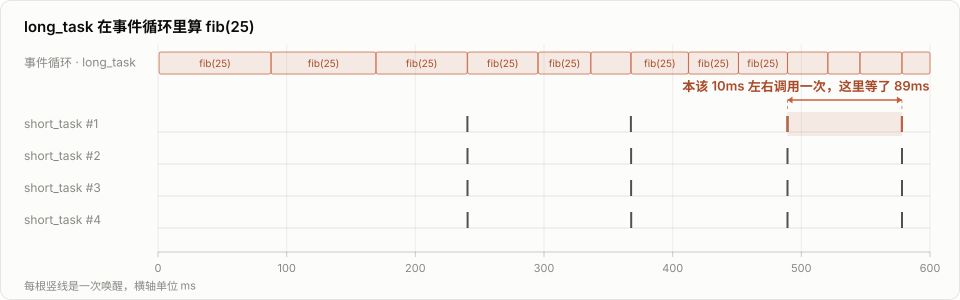
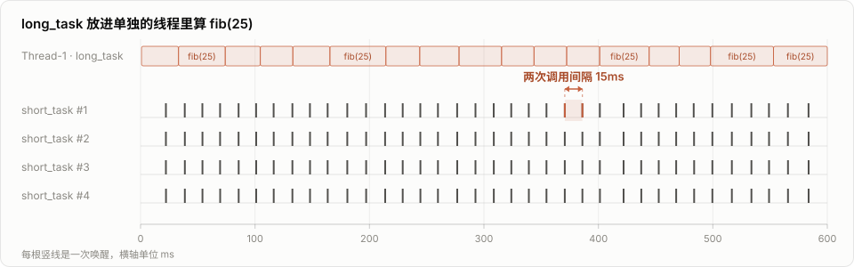

# 多线程

如果你是 Python 的使用者，这些话你肯定听到过无数次：Python 的多线程是假的，Python 的多线程是鸡肋，Python 的多线程没有意义。说这些话的人其中有挺大一部分，也无非就是知道一个 <Term tip="全局解释器锁（Global Interpreter Lock）：同一时刻只允许一个线程执行 Python 字节码，所以纯计算的代码没法靠多线程用上多核。">GIL</Term>，甚至 GIL 到底 lock 的是什么，可能也不那么清楚。Python 的多线程确实有它的问题，但是说多线程没有意义，显然就言过其实了。今天我们就来聊聊 Python 的多线程，能干啥？

## 多线程最初要解决的问题

很多人可能觉得多线程唯一的价值就是利用多核 CPU 提升程序的运行速度。但是实际上，第一个多核 CPU，IBM 的 POWER4，出现在 2001 年。而在个人电脑上，我们更熟悉的英特尔、AMD，是在 2005 年才推出的它们的第一款多核 CPU。可是，多线程这个概念，在上个世纪五六十年代就已经出现了。那这中间接近半个世纪的时间里，多线程都是没有意义的吗？

多线程出现之初啊，解决的核心问题是，在不显式地切换任务的情况下，让 CPU 可以同时处理若干个任务。而这个价值，直至今日，依然存在。这里主要有两件事，值得一提。

## I/O 瓶颈任务的等待时间

第一个是我们相对讨论得更多的，叫做 I/O 瓶颈任务。什么意思呢？就是在单线程的情况下，我们正常写程序，对吧？在遇到比较慢的 I/O 任务，比如说这个文件读取啊、网络传输之类的事情的时候，是需要原地干等着的，对吧？要等这个 I/O 任务完成了，才能接着做下面的事情。那在这段时间，CPU 实际上就在闲着，是吧？那通过多线程呢，我们可以把这段闲着的时间给利用起来，干点别的。

我们给大家举个例子啊。大家看这边我写了一个非常简单的爬虫程序，它的核心代码就在这个 `run` 函数里面，对于你给它的每一个单词，下载它的 wiki page。这里我们简单地做了两个方案。第一个方案是把所有的单词用一个线程来下载，第二个方案是把这些单词平均分成两份，然后用两个线程来下载。下面我们就做了一个非常简陋的计时程序，算一算需要多长时间。

```python run
import threading
import time

import requests

WORDS = ["Python", "Thread", "Coroutine", "Socket", "Queue", "Decorator"]
HEADERS = {"User-Agent": "Mozilla/5.0 (compatible; wiki-demo/1.0)"}


def run(words):
    for word in words:
        requests.get(f"https://en.wikipedia.org/wiki/{word}", headers=HEADERS)


def one_thread():
    run(WORDS)


def two_threads():
    half = len(WORDS) // 2
    threads = [
        threading.Thread(target=run, args=(WORDS[:half],)),
        threading.Thread(target=run, args=(WORDS[half:],)),
    ]
    for t in threads:
        t.start()
    for t in threads:
        t.join()


for name, func in [("单线程", one_thread), ("两个线程", two_threads)]:
    start = time.perf_counter()
    func()
    print(f"{name}: {time.perf_counter() - start:.2f} 秒")
```

```output exit=0
单线程: 3.87 秒
两个线程: 2.16 秒
```

多运行几次我们可以看到，单线程的时候差不多是三秒多，而两个线程大概是两秒左右。算下来差不多两个线程比一个线程快了一倍。这个就是在 I/O 瓶颈下，多线程对程序的提速效果。

## 协程的显式放权

当然对于 I/O 瓶颈的任务，我们现在经常可以使用协程，也就是 [asyncio](./asyncio.md) 来完成。协程相对线程更轻，而且由于是单线程，没有竞争冒险的问题，所以在网络传输的应用里面使用的比例越来越高了。

那协程的出现就宣判了多线程的死刑吗？也不是啊。尽管协程有着很多优质的特性，但是它也有一个无法回避的问题，就是必须要显式地放权。在 Python 中就是必须要通过 `await` 的形式，去把控制权交还给 event loop。

在有些情况下，比如你所有的程序本质上都是大量的 I/O 操作的时候，这不是个问题，因为每一个协程的 task 都会频繁地放权。

但是有些情况下，单纯的协程就不太好用。比如你有一个大量计算的任务，但是不着急，可以慢慢做，又有很多小的任务需要在低延迟下解决。这个时候怎么处理协程的调度，就是一个麻烦的事情。

## 人工放权点的代价

如果你不做任何处理，你的协程就会陷入到计算任务中出不来，没法及时地处理那些需要低延迟的小任务。可如果你在计算任务中人工安置一些放权点，又会让你这个任务看起来很奇怪。

下面这段程序就是这么一个场景：`long_task` 是那个慢慢做也没关系的计算任务，我们用递归的 `fib(25)` 来代替；`short_task` 是需要低延迟的小任务，每 10 毫秒要被叫醒一次，一共有四个。为了能在计算的中途放权，`fib` 被写成了 coroutine function，每一层递归都得 `await` 一次，注释掉的那行就是人工安置的放权点。

```python
import asyncio


async def long_task():
    async def fib(n):
        if n <= 1:
            return 1
        # await asyncio.sleep(0)
        return await fib(n - 1) + \
            await fib(n - 2)

    while True:
        await fib(25)
        await asyncio.sleep(0)


async def short_task():
    while True:
        await asyncio.sleep(0.01)


async def main():
    task_list = [short_task() for _ in range(4)]
    task_list.append(long_task())
    await asyncio.gather(*task_list)


asyncio.run(main())
```

更何况这还需要你对这个任务的消耗时间足够了解。

## 别人的函数没法放权

不仅如此，如果你调用的是别人的函数，你是没法在别人的函数里面放权的。

```python
import asyncio


def fib(n):
    if n <= 1:
        return 1
    return fib(n - 1) + fib(n - 2)


async def long_task():
    while True:
        # imported from library
        fib(25)
        await asyncio.sleep(0)


async def short_task():
    while True:
        await asyncio.sleep(0.01)


async def main():
    task_list = [short_task() for _ in range(4)]
    task_list.append(long_task())
    await asyncio.gather(*task_list)


asyncio.run(main())
```

`fib` 这次是个普通函数，从别的库里拿来的，你改不了它，也就没法往里面塞放权点。于是 `long_task` 每进去一次，事件循环就得等它整个算完才能回来。

这件事对 `short_task` 的影响有多大呢？我们把上面这段程序改一下，让它只跑 1.2 秒就停，并且记下每次 `short_task` 被唤醒的时刻。

```python run
import asyncio
import statistics
import time


def fib(n):
    if n <= 1:
        return 1
    return fib(n - 1) + fib(n - 2)


start = time.perf_counter()
ticks = []


async def long_task():
    while time.perf_counter() - start < 1.2:
        fib(25)
        await asyncio.sleep(0)


async def short_task(i):
    while time.perf_counter() - start < 1.2:
        await asyncio.sleep(0.01)
        ticks.append((i, time.perf_counter() - start))


async def main():
    task_list = [short_task(i) for i in range(4)]
    task_list.append(long_task())
    await asyncio.gather(*task_list)


asyncio.run(main())

first = [t for i, t in ticks if i == 0]
gaps = [b - a for a, b in zip(first, first[1:])]
print(f"1.2 秒里 short_task 被唤醒了 {len(first)} 次")
print(f"两次唤醒的间隔：中位 {statistics.median(gaps) * 1000:.0f} ms，最长 {max(gaps) * 1000:.0f} ms")
```

```output exit=0 {2}
1.2 秒里 short_task 被唤醒了 11 次
两次唤醒的间隔：中位 95 ms，最长 173 ms
```

说好每 10 毫秒来一次的任务，实际上要将近 100 毫秒才轮得到一次。把其中一次运行的前 600 毫秒画成时间轴，这件事就更直观了：



最上面那条是 `long_task`，每个方块是一次 `fib(25)` 的计算；下面四条是四个 `short_task`，每根竖线代表它被唤醒了一次。本该 10 毫秒左右调用一次的任务，这里等了 89 毫秒，中间隔着好几次完整的 `fib`。

## 线程的抢占式切换

那多线程的存在就可以比较好地解决这种问题。由于操作系统的底层机制会自动帮你切换线程，你就不需要担心一个任务把 CPU 占死，然后其他人喝不到汤的情况。

```python
import asyncio
import threading


def fib(n):
    if n <= 1:
        return 1
    return fib(n - 1) + fib(n - 2)


def long_task():
    while True:
        fib(25)


async def short_task():
    while True:
        await asyncio.sleep(0.01)


async def main():
    task_list = [short_task() for _ in range(4)]
    t = threading.Thread(target=long_task)
    t.start()
    await asyncio.gather(*task_list)


asyncio.run(main())
```

`long_task` 不再是协程，它被丢进了一条自己的线程里，`fib` 也还是那个没法放权的普通函数。我们用同样的办法量一下 `short_task` 这次等了多久。

```python run
import asyncio
import statistics
import threading
import time


def fib(n):
    if n <= 1:
        return 1
    return fib(n - 1) + fib(n - 2)


start = time.perf_counter()
ticks = []
stop = False


def long_task():
    while not stop:
        fib(25)


async def short_task(i):
    while time.perf_counter() - start < 1.2:
        await asyncio.sleep(0.01)
        ticks.append((i, time.perf_counter() - start))


async def main():
    threading.Thread(target=long_task).start()
    await asyncio.gather(*[short_task(i) for i in range(4)])


asyncio.run(main())
stop = True

first = [t for i, t in ticks if i == 0]
gaps = [b - a for a, b in zip(first, first[1:])]
print(f"1.2 秒里 short_task 被唤醒了 {len(first)} 次")
print(f"两次唤醒的间隔：中位 {statistics.median(gaps) * 1000:.0f} ms，最长 {max(gaps) * 1000:.0f} ms")
```

```output exit=0 {2}
1.2 秒里 short_task 被唤醒了 76 次
两次唤醒的间隔：中位 15 ms，最长 18 ms
```

从将近 100 毫秒回到了 15 毫秒，而且最长的一次也只有 18 毫秒。同样画成时间轴，`long_task` 那条几乎没变，`short_task` 却密了一个数量级：



两次调用间隔 15 毫秒。计算还是那些计算，`fib` 也还是那个不放权的 `fib`，区别只是这回由操作系统来决定什么时候把 CPU 让出来，不用我们在代码里安排。

## run_in_executor 的本质

当然了，你现在可以在 asyncio 里面用这个 `run_in_executor` 来解决这个问题。但是我们要知道这个解决方案的背后，它的本质它就是多线程，当然也有可能是多进程。

```python
import asyncio


def fib(n):
    if n <= 1:
        return 1
    return fib(n - 1) + fib(n - 2)


async def long_task():
    while True:
        await asyncio.get_event_loop().run_in_executor(None, fib, 25)
        await asyncio.sleep(0)


async def short_task():
    while True:
        await asyncio.sleep(0.01)


async def main():
    task_list = [short_task() for _ in range(4)]
    task_list.append(long_task())
    await asyncio.gather(*task_list)


asyncio.run(main())
```

说了这么多就是想告诉大家，尽管由于 GIL 的存在，Python 没有办法像其他的一些语言一样，通过多线程来利用多核，提升计算瓶颈的程序运行速度，但是 Python 当中的多线程也完全是有其存在价值的。

你需要去了解它能做什么，不能做什么，有什么优势，有什么劣势，然后在不同的场景下使用合适的工具，而不是人云亦云，抱着网上听来的只言片语，奉为圭臬。
