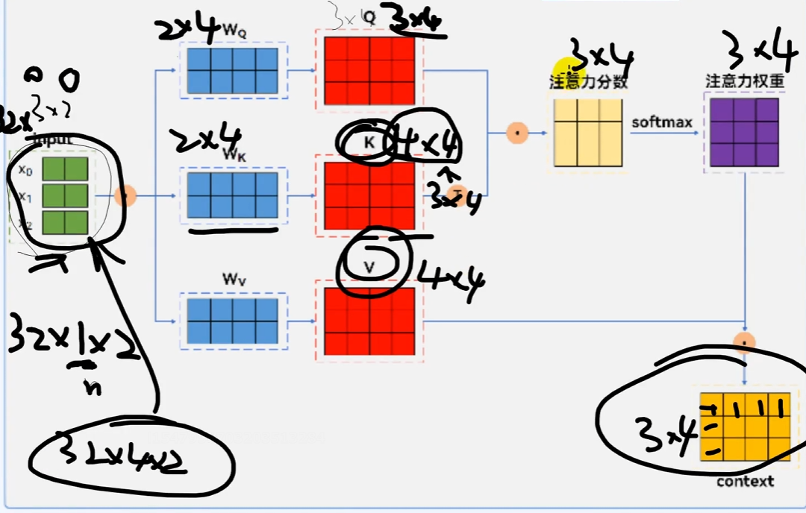

# 参数高效微调

## 1. 定义与背景

参数高效微调 (Parameter-Efficient Fine-Tuning, PEFT) 是一种针对大规模预训练模型（如 GPT、Qwen、DeepSeek等）的优化策略。其核心思想是通过仅调整少量参数或引入额外的轻量级模块，来实现对新任务的快速适配，而无需对整个模型进行重新训练。这种方法在资源受限的场景中表现出色，显著降低了计算成本和存储需求，同时避免了传统微调方法可能导致的过拟合问题。

### 背景

随着深度学习模型规模的不断增大，例如resnet18才11.7M参数，但是现在大模型几乎很少有几千万参数的存在。所以传统的全参数微调（Full Fine-Tuning）方法面临以下挑战：

- **高计算成本**：需要更新数十亿甚至上百亿、上千亿个参数，消耗大量GPU/TPU/NPU资源
- **高存储需求**：每个任务都需要保存一份完整的模型副本，占用大量存储空间
- **易过拟合**：在小数据集上微调时，容易导致模型性能下降

PEFT 的出现为这些问题提供了一种高效的解决方案，使大模型能够更广泛地应用于实际场景。

## 2. 为什么要参数高效微调？

### 2.1 传统微调的局限性

- **资源消耗大**：传统微调需要更新模型的所有参数，计算和存储开销巨大
- **任务间干扰**：当模型需要适配多个任务时，全参数微调可能导致不同任务之间的冲突
- **难以扩展**：对于大规模模型，全参数微调的可扩展性较差，尤其在多任务场景下

### 2.2 PEFT 的优势

- **低资源需求**：仅需更新少量参数或引入轻量级模块，显著降低计算和存储成本
- **任务隔离性**：通过冻结原始模型参数，避免任务间的干扰，提升模型的鲁棒性
- **快速部署**：适用于资源受限环境（如边缘设备），支持快速迭代和部署

## 3. 参数高效微调的常用方法

以下是几种主流的 PEFT 方法及其特点：

### 3.1 BitFit

来自论文 [https://arxiv.org/abs/2106.10199](https://arxiv.org/abs/2106.10199)

BitFit 是一种稀疏微调方法，其核心思想是仅更新模型中的偏置（bias）参数，而保持权重（weight）参数不变

- **优点**：参数更新量极小，适合资源极度受限的场景
- **缺点**：可能无法充分捕捉复杂任务的特征

### 3.2 提示微调 (Prompt Tuning)

Prompt Tuning 是通过优化输入的“提示”（Prompt）来调整模型行为的方法。它使用一组可训练的嵌入向量作为“软提示”，并通过优化这些嵌入向量来引导模型完成特定任务

软提示：在输入序列的开头或特定位置插入一组随机初始化的嵌入向量，这些向量被称为“软提示”

硬提示：人输入的prompt

- **特点**:
  - 提示向量以嵌入形式存在，而非自然语言文本
  - 仅需优化少量提示参数，原始模型参数保持冻结
- **应用场景**：分类、生成等任务。

#### 软提示的实现步骤

**(1)初始化软提示**  

- **嵌入向量的形状**: 假设我们希望插入 $n$ 个软提示向量，每个向量的维度为 $d$（与模型的词嵌入维度一致）。那么软提示的形状为 $[n, d]$
- **随机初始化**: 这些嵌入向量通常使用标准正态分布或其他初始化方法（如均匀分布）进行随机初始化

例如，在 PyTorch 中可以这样实现：

```python
import torch
import torch.nn as nn

# 假设词嵌入维度为 768，软提示长度为 10
soft_prompt_length = 10
embedding_dim = 768

# 随机初始化软提示
soft_prompt = nn.Parameter(torch.randn(soft_prompt_length, embedding_dim))
```

**(2)将软提示插入输入序列**  

- **原始输入**：预训练模型的输入通常是经过分词器（Tokenizer）处理后的标记序列（Token Sequence），其形状为 $[B, L, d]$，其中：
  - $B$ 是批大小 (Batch Size)
  - $L$ 是序列长度 (Sequence Length)
  - $d$ 是词嵌入维度 (Embedding Dimension)
- **插入位置**：软提示通常被插入到输入序列的开头（或特定位置），例如，将其拼接给原始输入序列的前面

以下是一个简单的代码示例：

```python
# 假设输入序列的形状为 [B, L, d]
input_embeddings = ...  # 模型的原始输入，形状为 [B, L, d]

# 扩展软提示以匹配批量大小
batch_size = input_embeddings.size(0)
expanded_soft_prompt = soft_prompt.unsqueeze(0).expand(batch_size, -1, -1) # 形状为 [B, n, d]

# 拼接软提示和原始输入
final_input_embeddings = torch.cat([expanded_soft_prompt, input_embeddings], dim=1) # 形状为 [B, n+L, d]
```

**(3)输入到模型**  

将拼接后的嵌入向量作为模型的输入，传递给预训练模型进行前向传播

### 3.3 前缀微调 (Prefix Tuning)

论文：[https://arxiv.org/pdf/2101.00190.pdf](https://arxiv.org/pdf/2101.00190.pdf)

Prefix Tuning核心思想是在模型的输入中添加一组可训练的前缀向量 (Prefix Vectors)，这些向量作为任务特定的上下文信息，帮助模型适应新任务。与Prompt Tuning不同的是，Prefix Tuning的前缀向量是通常被插入到Transformer模型的每一层，而不仅仅是输入层。

- **特点**:
  - 前缀向量可以看作是模型输入的一部分，影响模型的输出
  - 相较于Prompt Tuning更灵活，适用于生成式任务（如对话、翻译）
- **优势**：在生成任务中表现优异，同时保留了原始模型的通用性


:::info 为什么加载kv而不是q？
Query(q):表示当前需要关注的内容，通常由<mark>输入序列</mark>的每个token生成  
Key(k)和Value(v):表示上下文信息或记忆的内容，用于与query进行匹配和提取相关信息  
如果将前缀向量添加到query中，会改变模型对输入序列的关注方式，可能会导致模型偏离原始输入的语义  
:::

#### 前缀微调的实现步骤

**(1)初始化前缀向量**  

- **前缀向量的形状**：假设我们希望为每个Transformer层插入 $n$ 个前缀向量，每个向量的维度为 $d$（与模型的隐藏层维度一致），那么前缀向量的形状为 $[L, n, d]$，其中：
  - $L$ 是Transformer层数
  - $n$ 是每层前缀向量的数量
  - $d$ 是隐藏层维度
- **随机初始化**：这些前缀向量通常使用标准正态分布或其他初始化方法进行随机初始化

示例代码：

```python
import torch
import torch.nn as nn

# 假设 Transformer 层数为 12，每层前缀向量数量为 10，隐藏层维度为 768
num_layers = 12
prefix_length = 10
hidden_dim = 768

# 随机初始化前缀向量
prefix_vectors = nn.Parameter(torch.randn(num_layers, prefix_length, hidden_dim))
```

**(2)将前缀向量插入Transformer层**  

- **Transformer的结构**：Transformer模型的每一层包含两个主要部分：
  - **自注意力机制 (Self-Attention)**：计算输入序列的注意力权重
  - **前馈网络 (Feed-Forward Network, FFN)**：对注意力输出进行非线性变换
  - **插入位置**：前缀向量被插入到每一层的自注意力机制中，作为额外的上下文信息

具体来说，前缀向量通过以下方式影响 Transformer 层：

1.**扩展键值对 (Key-Value Pairs)**：将前缀向量作为额外的键（Key）和值（Value），与原始输入序列的键值对拼接  
2.**更新注意力计算**：在自注意力机制中，前缀向量会参与注意力权重的计算，从而影响模型的输出

示例代码：

```python
# 假设输入序列的形状为 [B, L, d]
input_embeddings = ... # 模型的原始输入，形状为 [B, L, d]

# 扩展前缀向量以匹配批量大小
batch_size = input_embeddings.size(0)
expanded_prefix_vectors = prefix_vectors.unsqueeze(1).expand(-1, batch_size, -1, -1) # 形状为 [L, B, n, d]

# 在每一层的自注意力机制中插入前缀向量
for layer_idx, layer in enumerate(transformer_layers):
    # 获取当前层的键值对
    key, value = layer.compute_key_value(input_embeddings)

    # 拼接前缀向量
    prefix_key, prefix_value = expanded_prefix_vectors[layer_idx].chunk(2, dim=-1) # 将前缀向量拆分为 key 和 value
    extended_key = torch.cat([prefix_key, key], dim=1) # 形状为 [B, n+L, d]
    extended_value = torch.cat([prefix_value, value], dim=1) # 形状为 [B, n+L, d]

    # 更新注意力计算
    attention_output = layer.self_attention(extended_key, extended_value)
```

**(3) 输入到模型**  

将修改后的键值对传递给 Transformer 模型的每一层，完成前向传播

### 3.4 P-Tuning

P-Tuning 是一种基于“软提示”的微调方法，其核心思想是通过引入一组可学习的“软提示”（Soft Prompt）嵌入向量来调整预训练语言模型的行为。与传统的硬提示（Hard Prompt，即直接在输入文本中添加自然语言提示）不同，P-Tuning 的软提示是以连续的嵌入向量形式存在，并且这些嵌入向量是通过训练优化得到的。

- **与 Prompt Tuning 的区别**：Prompt Tuning 直接使用随机初始化的嵌入向量作为软提示，而 P-Tuning 使用一个小的神经网络（称为“提示生成器”）动态生成软提示，从而增强软提示的表现力。
- **复杂性**：Prompt Tuning 的实现较为简单，仅限于输入层；而 P-Tuning 的实现更加复杂，可能涉及多层优化或动态调整机制。
- **适用场景**：Prompt Tuning 更适合简单任务（如分类），而 P-Tuning 更适合复杂任务（如生成式任务）。

#### P-Tuning 实现步骤

**(1) 初始化软提示**  

- **软提示的形状**：假设我们希望插入 $n$ 个软提示向量，每个向量的维度为 $d$（与模型的词嵌入维度一致），那么软提示的形状为 $[n, d]$。
- **随机初始化**：这些嵌入向量通常使用标准正态分布或其他初始化方法（如均匀分布）进行随机初始化。
- **提示生成器**：P-Tuning 的软提示通常由一个小型神经网络（提示生成器）动态生成，而不是直接随机初始化。

示例代码：

```python
import torch
import torch.nn as nn

# 假设词嵌入维度为 768，软提示长度为 10
soft_prompt_length = 10
embedding_dim = 768

# 提示生成器：一个小型的神经网络用于生成软提示
class PromptGenerator(nn.Module):
    def __init__(self, task_embedding_dim, hidden_dim, soft_prompt_length, embedding_dim):
        super(PromptGenerator, self).__init__()
        self.fc1 = nn.Linear(task_embedding_dim, hidden_dim)
        self.relu = nn.ReLU()
        self.fc2 = nn.Linear(hidden_dim, soft_prompt_length * embedding_dim)

    def forward(self, task_embedding):
        x = self.fc1(task_embedding)
        x = self.relu(x)
        x = self.fc2(x)
        return x.view(soft_prompt_length, embedding_dim)

# 初始化提示生成器
task_embedding_dim = 128  # 任务相关的嵌入维度
hidden_dim = 256
prompt_generator = PromptGenerator(task_embedding_dim, hidden_dim, soft_prompt_length, embedding_dim)

# 输入任务相关的嵌入（例如任务 ID 或任务特征）
task_embedding = torch.randn(task_embedding_dim)
soft_prompt = prompt_generator(task_embedding) # 动态生成软提示
```

**(2) 将软提示插入输入序列**  

- **原始输入**：预训练模型的输入通常是经过分词器（Tokenizer）处理后的标记序列（Token Sequence），其形状为 $[B, L, d]$，其中：
  - $B$ 是批大小 (Batch Size)。
  - $L$ 是序列长度 (Sequence Length)。
  - $d$ 是词嵌入维度 (Embedding Dimension)。
- **插入位置**：软提示通常被插入到输入序列的开头（或特定位置），例如，将其拼接给原始输入序列的前面。

以下是一个简单的代码示例：

```python
# 假设输入序列的形状为 [B, L, d]
input_embeddings = ...  # 模型的原始输入，形状为 [B, L, d]

# 扩展软提示以匹配批量大小
batch_size = input_embeddings.size(0)
expanded_soft_prompt = soft_prompt.unsqueeze(0).expand(batch_size, -1, -1) # 形状为 [B, n, d]

# 拼接软提示和原始输入
final_input_embeddings = torch.cat([expanded_soft_prompt, input_embeddings], dim=1) # 形状为 [B, n+L, d]
```

**(3) 输入到模型**  

将拼接后的嵌入向量作为模型的输入，传递给预训练模型（如 BERT、GPT 等）进行前向传播。

## 总结

- **Prompt Tuning** 是一种简单高效的微调方法，适合资源受限场景和简单任务。它的实现方式直接且易于理解，但表现力相对有限。
- **P-Tuning** 则通过引入提示生成器等机制增强了软提示的表现力，适合复杂任务（如生成式任务）和对性能要求较高的场景。虽然其实现复杂度和计算成本略高，但在生成式任务中表现出色。

根据具体任务需求和资源限制，可以选择合适的微调方法：

- 如果任务简单且资源有限，推荐使用 Prompt Tuning。
- 如果任务复杂且需要更高的模型表现力，推荐使用 P-Tuning。

### 3.5 适配器 (Adapter)

适配器 (Adapter) 是一种参数高效微调 (PEFT) 方法，其核心思想是在预训练模型的某些层之间插入小型的“适配器模块” (Adapter Module)。这些模块包含少量可训练参数，用于捕获任务特定的信息，而原始模型的参数保持冻结。适配器方法通过模块化设计实现了高效的多任务学习和任务扩展。

#### 1.核心思想

适配器的核心思想是将任务特定的调整限制在小型模块中，而不是对整个模型进行微调。这种方法具有以下优势：

- **低资源需求**：仅需训练少量参数，显著降低计算和存储成本。
- **任务隔离性**：不同任务可以使用独立的适配器模块，避免任务间的干扰。
- **模块化设计**：适配器模块可以轻松插入到现有模型中，支持任务扩展和复用。

#### 2.适配器的结构

适配器模块通常是一个轻量级的神经网络，其结构简单且参数量少。典型的适配器模块包括以下组件：

(1)**降维层 (Down Projection Layer)**

- 将输入特征映射到一个低维空间，减少计算复杂度
- 例如，假设输入维度为 $d$，降维后的维度为 $r (r \ll d)$，则该层的参数量为 $d \times r$

(2)**非线性激活函数**

- 在降维后的特征上应用非线性激活函数（如 ReLU），增强表达能力

(3)**升维层 (Up Projection Layer)**

- 将低维特征映射回原始维度，恢复特征表示
- 参数量为 $r \times d$

(4)**残差连接 (Residual Connection)**：
    - 将适配器模块的输出与原始输入相加，确保信息流动并保留原始特征。

适配器模块的典型结构如下：

$$
Output = Input + W_{up}(ReLU(W_{down}(Input)))
$$

其中：

- $W_{down}$: 降维层的权重矩阵，形状为 $[d, r]$。
- $W_{up}$: 升维层的权重矩阵，形状为 $[r, d]$。
- $r$: 瓶颈维度 (Bottleneck Dimension)，通常远小于 $d$。

#### 3.实现步骤

**(1)插入适配器模块**  

适配器模块被插入到预训练模型的每一层（或部分层）中，通常位于 Transformer 层的前馈网络（Feed-Forward Network, FFN）之后。插入位置的选择取决于具体任务需求。

示例代码：

```python
import torch
import torch.nn as nn

class Adapter(nn.Module):
    def __init__(self, input_dim, bottleneck_dim):
        super(Adapter, self).__init__()
        self.down_proj = nn.Linear(input_dim, bottleneck_dim)
        self.up_proj = nn.Linear(bottleneck_dim, input_dim)
        self.activation = nn.ReLU()

    def forward(self, x):
        residual = x
        x = self.down_proj(x)
        x = self.activation(x)
        x = self.up_proj(x)
        return x + residual # 残差连接

# 假设 Transformer 层的隐藏层维度为 768，瓶颈维度为 64
input_dim = 768
bottleneck_dim = 64

# 初始化适配器模块
adapter = Adapter(input_dim, bottleneck_dim)

# 修改Transformer层的前向传播以包含适配器
class LLMLayer(BertLayer):
    def __init__(self, config):
        super().__init__(config)
        input_dim = 768 # 假设隐藏层维度
        bottleneck_dim = 64 # 假设瓶颈维度
        self.adapter = Adapter(input_dim, bottleneck_dim) # 添加适配器

    def forward(self, hidden_states, ...): # 简化参数，实际需匹配原方法
        # 原Transformer层的计算（如自注意力、FFN）
        hidden_states = super().forward(hidden_states, ...) [0]

        # 插入适配器
        hidden_states = self.adapter(hidden_states)
        return hidden_states
```

**(2)冻结原始模型参数**  

在训练过程中，预训练模型的所有参数保持冻结，仅训练适配器模块的参数。这样可以避免对原始模型的破坏，同时大幅降低训练成本。

示例代码：

```python
# 冻结预训练模型参数，但保留适配器参数可训练
for name, param in model.named_parameters():
    if "adapter" not in name: # 仅冻结非适配器参数
        param.requires_grad = False

# 仅训练适配器模块参数
# 优化器仅包含适配器参数
optimizer = torch.optim.Adam(
    [param for name, param in model.named_parameters() if "adapter" in name],
    lr=1e-4
)
```

**(3)训练适配器模块**  

通过反向传播更新适配器模块的参数，使其逐渐适应目标任务。训练流程与传统微调类似，但计算开销显著降低。

```python
# 训练循环
for batch in dataloader:
    optimizer.zero_grad()
    inputs = tokenizer(batch['text'], return_tensors='pt',
                       padding=True)
    outputs = model(**inputs).logits # 假设任务为分类，logits为输出
    loss = loss_function(outputs, batch['labels']) # 确保标签形状匹配
    loss.backward()
    optimizer.step()
```

### 3.6 低秩适配 (Low-Rank Adaptation, LoRA)

低秩适配（LoRA）是一种基于低秩分解的参数高效微调（PEFT）方法。其核心思想是将需要调整的权重矩阵分解为两个低秩矩阵，并仅训练这些低秩矩阵，而原始模型的权重保持冻结。这种方法通过低秩近似显著减少了需要训练的参数数量，同时保持了较高的任务性能。

#### 1.核心

在深度学习模型中，许多权重矩阵（如全连接层或注意力机制中的权重）通常具有高维度。直接微调这些矩阵会导致巨大的计算和存储开销。LoRA 的核心思想是利用线性代数中的**低秩分解**技术，将权重矩阵的变化量表示为两个低秩矩阵的乘积：

$$
\Delta W = A \cdot B
$$

其中：

- $\Delta W$: 权重矩阵的变化量。
- $A$: 形状为 $[d, r]$ 的低秩矩阵。
- $B$: 形状为 $[r, k]$ 的低秩矩阵。
- $r$: 低秩维度 (Rank)，通常远小于 $d$ 和 $k$。

通过这种方式，原本需要更新的 $d \times k$ 个参数被压缩为 $d \times r + r \times k$ 个参数，从而大幅降低了训练成本。

#### 2.实现步骤

**(1)分解权重矩阵**  

对于需要微调的权重矩阵 $W$，LoRA 将其变化量 $\Delta W$ 表示为两个低秩矩阵 $A$ 和 $B$ 的乘积：

$$
W_{new} = W + \Delta W = W + A \cdot B
$$

其中：

- $W$: 原始权重矩阵，保持冻结
- $A$ 和 $B$: 低秩矩阵，作为可训练参数。

示例代码：

```python
class LoRALayer(nn.Module):
    def __init__(self, original_layer, rank):
        super().__init__()
        self.original_layer = original_layer # 原始连接的层
        input_dim = original_layer.weight.shape[1]
        output_dim = original_layer.weight.shape[0]
        self.A = nn.Parameter(torch.randn(input_dim, rank)) # 低秩矩阵A
        self.B = nn.Parameter(torch.randn(rank, output_dim)) # 低秩矩阵B

    def forward(self, x):
        # 原始权重的前向计算
        original_output = self.original_layer(x)
        # 低秩调整部分
        delta_w = torch.matmul(self.A, self.B)
        return original_output + torch.matmul(x, delta_w)
```

**(2)插入 LoRA 层到模型中**  

遍历模型结构，将目标层替换为包含 LoRA 的层。

```python
# 替换注意力层的全连接层为LoRA层
for layer in model.encoder.layer:
    attn = layer.attention.self
    # 假设替换query层
    original_query = attn.query
    lora_query = LoRALayer(original_query, rank=8)
    attn.query = lora_query
```

**(3)冻结原始模型参数**  

在训练过程中，预训练模型的所有参数保持冻结，仅训练低秩矩阵 $A$ 和 $B$。这样可以避免对原始模型的破坏，同时显著降低训练成本。

示例代码：

```python
# 冻结所有原始参数
for param in model.parameters():
    param.requires_grad = False

# 解冻LoRA参数（假设LoRA层已正确插入）
for param in model.parameters():
    if hasattr(param, "A") or hasattr(param, "B"):
        param.requires_grad = True

# 优化器仅包含LoRA参数
optimizer = torch.optim.Adam(
    [param for name, param in model.named_parameters() if "A" in name or "B" in name],
    lr=1e-4
)
```

**(4)训练低秩矩阵**  

通过反向传播更新低秩矩阵 $A$ 和 $B$，使其逐渐适应目标任务。训练流程与传统微调类似，但计算开销显著降低。

示例代码：

```python
# 训练循环
for batch in dataloader:
    optimizer.zero_grad()
    inputs = tokenizer(batch['text'], return_tensors='pt',
                       padding=True, truncation=True)
    outputs = model(**inputs)
    logits = outputs.logits

    # 计算损失
    loss = loss_function(logits, batch['labels'])

    # 反向传播和优化
    loss.backward()
    optimizer.step()
```

#### 3.特点与优势

- **低资源需求**：通过低秩分解，LoRA 显著减少了需要训练的参数数量。例如，对于一个 $1024 \times 1024$ 的权重矩阵，如果选择 $r=8$，则需要训练的参数量从 $1024 \times 1024 = 1,048,576$ 减少到 $1024 \times 8 + 8 \times 1024 = 16,384$。
- **高效性**：由于训练参数量大幅减少，LoRA 在超大规模模型（如 GPT-3、PaLM）上表现出色，能够在极低资源消耗下实现高效微调。
- **任务性能**：尽管参数量减少，LoRA 通过低秩近似仍能保持较高的任务性能，尤其适合生成式任务（如对话、翻译）。
- **灵活性**：LoRA 可以应用于各种类型的权重矩阵（如全连接层、注意力机制中的权重等），适用范围广泛。

#### 4.典型应用

LoRA方法特别适合以下场景：

- **超大规模模型微调**：在资源受限的情况下，LoRA 能够高效微调超大规模语言模型（如 GPT-3、PaLM）。
- **多任务学习**：不同任务可以使用独立的低秩矩阵，避免任务间的干扰。
- **领域适配**：在特定领域（如医学、法律）中插入 LoRA 模块，提升模型在领域内的表现。

#### 5.注意事项

- **低秩维度的选择**：低秩维度 $r$ 是一个超参数，通常需要根据任务复杂性和实验效果进行调整。较大的 $r$ 提升性能但增加参数数量，较小的 $r$ 则降低性能。
- **权重初始化**：低秩矩阵的初始化可能影响训练的收敛速度和最终性能，建议使用正交初始化或其他合适的初始化方法。
- **适用范围**：LoRA 更适合权重矩阵较大的场景，对于小型模型可能效果有限。

## 对比与总结

| 方法          | 核心思想         | 参数更新量 | 适用场景     | 优缺点                     |
| :------------ | :--------------- | :--------- | :----------- | :--------------------------- |
| BitFit        | 更新偏置参数     | 极少       | 资源受限场景 | 简单但表达能力有限           |
| Prompt Tuning | 优化输入提示     | 较少       | 分类、生成任务 | 表现稳定，但设计复杂         |
| Prefix Tuning | 添加可训练前缀向量 | 中等       | 生成式任务   | 灵活但计算成本略高           |
| P-Tuning      | 输入层加入软提示 | 较少       | 小数据集任务 | 轻量化，适合资源有限场景     |
| Adapter       | 插入适配器模块   | 中等       | 多任务学习   | 模块化设计，扩展性强       |
| LoRA          | 低秩分解参数矩阵 | 极少       | 超大规模模型微调 | 高效且性能优异           |
