# Transformer

## Encoder-Decoder

### NLP任务分类

**1.N对1**  
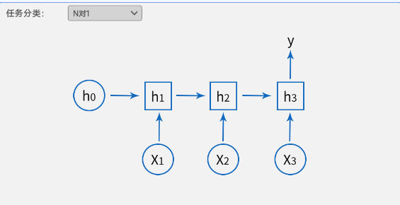  
在N对1的任务中，系统接收多个输入元素（N个），但只产生一个输出。这种类型的任务通常涉及整合或总结多个输入点的信息。典型的例子包括：

- 文本摘要：从多个句子或段落中提取关键信息，生成一个摘要
- 情感分析：分析一段文本（可能包含多个句子）,确定其整体情感倾向，如正面、负面或中立（或者商品的评分评价）
- 语言模型：在给定一系列词（如一个句子）的情况下，预测下一个最可能的词

**2.1对N**  
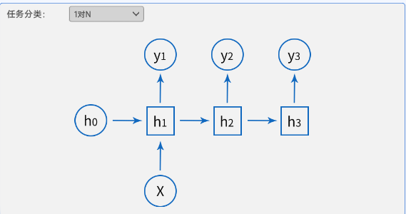  
在1对N的任务中，单个输入会产生多个输出。这类任务通常涉及从一个输入生成或推断出多个相关的信息点。例如：

- 机器翻译：将一个语言的文本翻译成多种其他语言
- 关键词生成：从一段文本中生成一系列关键词或标签
- 图像描述：根据一张图片生成多个描述性句子（虽然这也涉及到计算机视觉）

**3.N对M**  
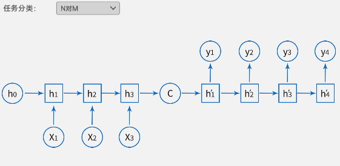  
N对M的任务涉及多个输入和多个输出，通常每个输入都对应一个输出。这类任务常见于序列到序列的模型中，如：

- 序列标注：例如，在自然语言处理中，对每个词进行词性标注
- 机器翻译（序列级）：将一种语言的文本序列翻译成另一种语言的等价文本序列，其中每个输入单元（如词或短语）对应一个输出单元
- 对话系统：在一个对话中，每个输入句子（如用户的问题）对应一个输出句子（如系统的回答）

:::info 在解释Encoder-Decoder的结构之前，先来回顾一下RNN是如何处理序列信息的
:::

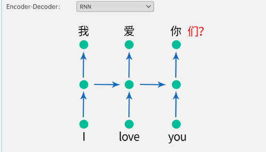  
RNN 在处理序列数据时，每个时间步都生成一个输出并更新隐藏状态，然而，对于 N 对 M 的任务（例如，机器翻译，其中输入和输出句子的长度可能不同），RNN 可能会遇到困难。例如，当 RNN 处理英语句子时，它在每个时间步都会产生一个输出和更新隐藏状态，但当转换到中文句子时，由于长度不同，RNN 可能会在某个时间步处于“失步”，如图中的“们”，导致无法有效对齐英语和中文之间的对应关系。

因此传统的 RNN 结构可能会在处理不同长度的序列时失去对应关系，使得模型难以正确学习源语言和目标语言之间的映射关系。

### 编码器-解码器

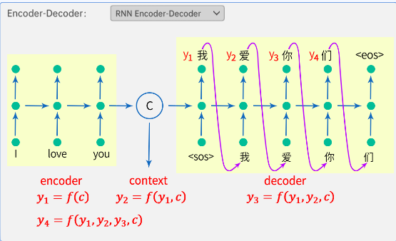  
考虑到实际中大量存在输入输出长度不相等的情况，如机器翻译、语音识别、问答系统等。此时就需要一种结构实现设计一种映射可变长序列至另一个可变长序列的网络结构。要注意的是Encoder-Decoder是一种特殊的结构并不是RNN的变体

Encoder-Decoder的工作过程就可以类比为压缩和解压的过程，我们首先将一段序列放入编码器Encoder进行压缩得到能表示这段序列的上下文表示context，然后将 context放入解码器Decoder进行解压而得到另一个序列

**Encoder**  
编码器通常由循环神经网络（RNN）或者其变体（如长短时记忆网络LSTM）构成。

编码器的输入是原始序列，编码器的主要任务是将输入序列映射为一个固定维度的表示c(context)，捕捉输入序列的语义信息。

在RNN Encoder-Decoder中，编码器在每个时间步处理输入序列的一个元素，并在整个序列处理过程中逐步更新其隐藏状态

**Decoder**  
解码器同样可以使用 RNN 结构，解码器的输入有两个，一个是来自编码器编码后的固定维度的表示c(context)，另一个来自上一时间步的输出。

注意：这里要了解到两个新概念：`<sos>`（Start of Sequence）和 `<eos>`（End of Sequence），它俩是特殊的标记，用于表示序列的开始和结束。

1. `<sos>`（Start of Sequence）：这个标记表示序列的开始。在训练阶段，模型可以看到 `<sos>` 标记并知道开始生成序列的内容。在预测阶段，一旦生成了 `<sos>` 标记，模型就开始生成实际的序列内容。
2. `<eos>`（End of Sequence）：这个标记表示序列的结束。在训练和预测阶段，当模型生成 `<eos>` 标记时，它知道当前序列已经完成，不再需要继续生成。

以下是一个简单的例子，说明如何在序列中使用 `<sos>` 和 `<eos>`：

原始序列：Hello, how are you?

处理后的序列：`<sos>` Hello, how are you? `<eos>`

解码器的任务是根据编码器生成的表示，逐步生成输出序列。在 RNN Encoder-Decoder 中，解码器在每个时间步生成一个元素，并根据先前的生成元素和编码器的表示来决定下一个元素。

也就是说 $y_1$ 完全依赖于 $c$，即预测“我”字时只需要 $c$ 的信息。$y_2$ 依赖于 $y_1$ 和 $c$，即预测“爱”字时需要“我”的信息和 $c$ 的信息，以此类推，因此有如下公式：

$$
\begin{align*}
y_1 &= f(c) \\
y_2 &= f(y_1, c) \\
y_3 &= f(y_1, y_2, c) \\
y_4 &= f(y_1, y_2, y_3, c)
\end{align*}
$$

**Teacher-forcing**  
在序列生成任务中，尤其是在训练过程中，Teacher-forcing是一种训练技术，它有助于加速模型的收敛并提高生成质量。让我们详细了解Teacher-forcing  
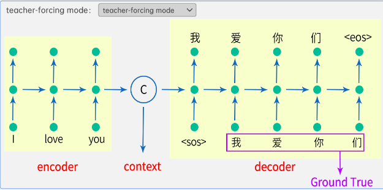  
**Free-running mode**  
在Free-running mode中，模型在生成序列时完全依赖于先前生成的标记，而不考虑真实的目标序列。换句话说，模型在生成每个时刻的标记时，将前一个时刻生成的标记作为输入，而不是使用真实的目标标记作为输入

这种方式可能会导致错误在生成序列中逐渐累积，因为模型在生成每个标记时都是基于其之前生成的标记。但是这种模式更接近于实际应用中模型自主生成序列的情况

:::tip 当然我们现在一般用 Scheduled Sampling
在训练初期主要依赖真实标签（类似Teacher-forcing），随着训练进行，逐步增加使用模型自身预测结果作为输入的比例，从而平衡训练稳定性和推理适应性
它的关键在于通过概率调度策略，让模型在训练过程中逐渐适应推理时 “依赖自身输出” 的模式，从而缓解Teacher-forcing导致的训练与推理差异（曝光偏差）
:::

**曝光偏差**  
曝光偏差主要出现在序列生成任务中，是由于**模型训练和推理阶段数据输入方式不同**，所导致的模型性能问题  

产生原因：  
在基于序列生成的模型（如机器翻译、文本生成等）训练时，常采用Teacher - forcing技术，即每一步都将真实的目标标记（标签）作为下一个时间步的输入。比如在训练一个翻译模型时，翻译英文句子“I love you”，模型生成第一个词“我”后，在生成第二个词“爱”的时候，会直接把“爱”这个真实的目标词作为输入，帮助模型生成下一个词

然而在推理阶段，模型没有真实的目标标记可依赖，只能使用自己上一个时间步生成的结果作为输入，去生成下一个词。这就导致训练和推理时模型接收的输入数据分布存在差异,这种差异就是曝光偏差产生的根源

## 注意力机制

### 案例引入

首先，让我们考虑一个购买衣物的情景。在购物时，通常会根据自身的尺寸，比如腰围和胸围，来对照商家提供的尺码对照表。在下面的例子中，最左侧的腰围代表我们的个人尺寸（query），而右侧的两列则是商家提供的对照表(key、value)
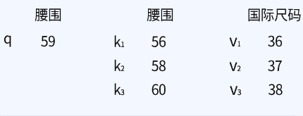  
为了更便捷地解决这一问题，让我们回顾一下我们之前学过的线性回归知识  

#### 方案一

我们首先可以使用一条直线来拟合商家提供的对照表中的腰围和国际尺码的数据，其中腰围作为$x$轴，国际尺码作为$y$轴。通过这个拟合直线，我们可以在整个腰围范围内估计相应的国际尺码。举例来说，当我们持有自身的腰围尺寸$q = 59$时，通过直线拟合上的点，我们可以找到对应的国际尺码
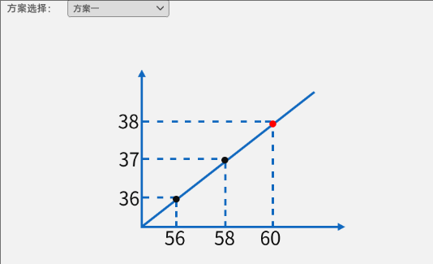  

#### 方案二

让我们尝试另一种方法。

假设有一个人的腰围为59，我们想要确定他的国际尺码。我们可以通过比较腰围59与对照表中不同腰围值$k$的距离来进行估计。

例如，对于查询值$q$为59，它与$k_2$和$k_3$更为接近，从这些距离中，我们推断这个人的国际尺码应该$k_2$和$k_3$对应的$v_2$和$v_3$之间，即37到38之间。我们观察到它到$k_2$和$k_3$之间的距离是相等的。

然而，为了得到更精确的数值，所以需要使用数学的方式去进行计算：与$k_2$的距离为$(59 - 58)^2$，与$k_3$的距离为$(59 - 60)^2$。这时，我们可以应用加权求和的思想来估计国际尺码的值，取：

$$
0.5 \times 37 + 0.5 \times 38 = 37.5
$$

换一种表达方式，当我们在对照表上进行观察时，我们知道自己的腰围是59，那么首先注意到的是腰围的查询表，并且会注意离59较近的所在的范围，这里是58到60之间。然后，由于发现查询值到$k_2$和$k_3$之间的距离是相等的，我们在这两个关键点上均匀分配**注意力**。因此，基于这种思想，我们将距离$1$称为**注意力分数**，而加权求和中的权重$0.5$则被称为**注意力权重**。  
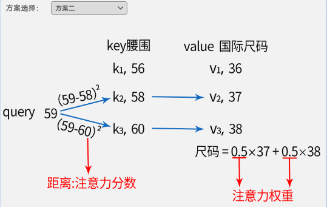  

#### 方案三

在实际应用中，我们在查看对照表时，并不会“仅仅”注意到查询值所在的范围，还会关注其他数值，比如在这里的$k_1$。然而，由于查询值$q$与$k_1$的距离较远$(59 - 56)^2 = 9$，我们的注意力不会非常集中在$k_1$上，而更倾向于集中在$k_2$和$k_3$上。换句话说，$k_1$具有较少的注意力分数和注意力权重。

因此，我们可以使用$\alpha(q, k_1)$、$\alpha(q, k_2)$、$\alpha(q, k_3)$分别表示查询值$q$对于不同$k$的注意力权重。这样，我们可以通过以下等式计算尺码：

$$
Size = \alpha(q, k_1) \cdot v_1 + \alpha(q, k_2) \cdot v_2 + \alpha(q, k_3) \cdot v_3
$$

回顾注意力权重的定义，注意力权重想得到一个概率，并且它们的和还需要为1，自然而然就想到了：**Softmax函数**

实际上，注意力权重是将注意力分数经过 softmax() 函数得到的。而注意力分数则是查询值$q$与$k$之间的距离。因此，可以得到注意力权重的公式为：

$$
\alpha(q, k_i) = softmax[-(q - k_i)^2]
$$

其中$-(q - k_i)^2$表示注意力分数，$softmax[-(q - k_i)^2]$表示通过 softmax 函数得到的注意力权重，使得距离越近的地方，注意力分数越大，相应的注意力权重也越大；反之，距离越远，注意力分数越小，注意力权重也越小。使用 softmax 的原因在于将注意力分数转化为可以正确表示概率的权重  
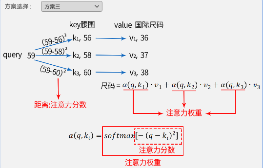  

## 注意力方式

回顾之前在计算注意力分数时，我们通过距离来衡量两个向量之间的相似性。具体而言，距离越近的地方，注意力分数越大，相应的注意力权重也越大；反之，距离越远，注意力分数越小，注意力权重也越小。尽管这种方法在低维情况下是可行的，但在高维情况下计算会变得复杂。如果我们仔细考虑，计算距离实际上就是在度量两个向量之间的相似度，距离越近，相似度越高；反之，相似度越低。根据注意力分数计算方式的不同我们得到不同的注意力机制形式，下面主要说明以下三种注意力形式

### 加性注意力

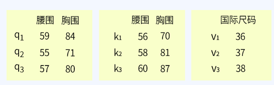  
加性注意力是注意力机制的一种形式，它通过计算两个输入向量的相似度来确定权重。对于给定的查询向量$q$、键向量$k$，加性注意力分数的计算过程如下：

$$
\alpha(q, k_i) = v^T \cdot tanh(w_k \cdot k_i + w_q \cdot q)
$$

在图中展示的加性注意力计算中，我们首先给定查询向量$q$和键向量$k$，它们都是$3 \times 2$的矩阵。这两个矩阵分别与可训练矩阵$w_q$和$w_k$相乘，得到两个$3 \times 1$的中间向量，一般称为$Q$和$K$。值得注意的是，矩阵$w_q$和$w_k$的维度可以选择为$2 \times n$，其中$n$取决于特征的维度

接下来，将这两个中间向量相加，意味着将两者提取到的输入的特征提取出来融合在一起，并通过双曲正切函数$tanh$进行非线性化处理。最终，将经过$tanh$处理的结果与可训练矩阵$v^T$相乘，得到注意力分数。这一过程中，注意力分数通过 softmax 函数进行归一化，得到注意力权重。最后，将注意力权重与value矩阵$v$相乘，得到上下文表示向量$context$  
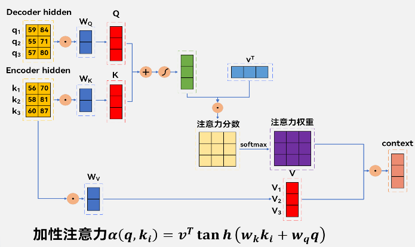  

### 点积注意力

:::info 如何计算相似度?
实数用距离、向量用余弦相似度、矩阵用点积
:::
对于给定的查询向量$q$、键向量$k$，**点积注意力分数**(距离)的计算过程如下：
$$
\alpha(q, k_i) = v \cdot k_i^T
$$
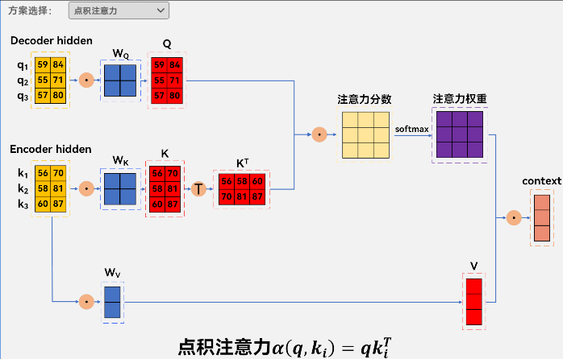  
在图中展示的点积注意力计算中，我们首先给定查询矩阵$Q$和键矩阵$K$，它们都是$3 \times 2$的矩阵。接下来，直接计算这两个矩阵的点积，得到一个$3 \times 3$的中间矩阵，即注意力分数矩阵。这个注意力分数矩阵经过softmax处理，得到注意力权重矩阵。

来判断一下查询矩阵$Q$和键矩阵$K$内积之后，得到的$3 \times 3$的矩阵结果的对应关系，可以看到：向量$q_1$和向量$k_1$，相乘相加后得到注意力分数矩阵的所上角的值，即这个位置就是向量$q_1$和向量$k_1$的相似度的值，以此类推。

在介绍点积可以做相似度处理时，说两个矩阵对应位置的结果越大，那么就越相关，通过应用softmax函数，会将这些点积的结果转换为概率分布，强调相似性高的部分。因此，点积实际上衡量了查询向量和键向量之间的相似性，这种相似性在注意力机制中用于计算权重，以确定哪些值更重要。

接下来，注意力权重再与矩阵$v$相乘，得到上下文表示向量$context$

### 缩放点积注意力

为了缓解点积注意力中可能出现的数值不稳定性，引入了缩放点积注意力。在这种形式中，除了点积得分外，还对得分进行缩放，缩放因子为键矩阵的向量的维度的平方根$\sqrt{d_k}$，其中$d_k$是键矩阵中向量的维度

$$
\alpha(q, k_i) = \frac{v \cdot k_i^T}{\sqrt{d_k}}
$$
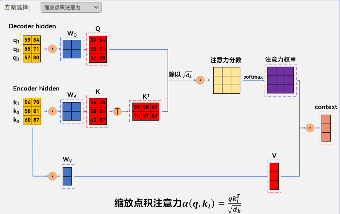  
在图中展示的缩放点积注意力分数计算中，我们同样给定了查询矩阵$Q$和键矩阵$K$，它们都是$3 \times 2$的矩阵

其中$3$表示键的个数，$2$表示键的维度，那么缩放因子（$\sqrt{d_k}$）中的（$d_k$）就等于$2$。

:::tip 为什么要除以（$\sqrt{d_k}$）？
:::

这是因为在注意力机制中，缩放因子的目的是：

- 高维时点积结果易过大，会使后续softmax函数输入值过大，导致数值上溢，且softmax在输入值大时梯度趋近于0，出现激活函数饱和，影响模型训练  
- 确保点积的结果不会因为向量维度的增加而变得过大。通过除以（$\sqrt{d_k}$），可以控制点积的范围，防止梯度爆炸或梯度消失的问题

直接计算这两个矩阵的点积，并将得到的得分除以查询向量的维度的平方根，即$\sqrt{d_k}$，其中$d_k$是**键向量k的维度**。这个经过缩放的得分经过softmax处理，得到注意力权重。注意力权重再与矩阵$v$相乘，得到上下文表示向量$context$

## soft-attention

### 引入

soft-attention是一种注意力机制，用于对输入序列的不同部分进行加权处理。在RNN中，每个时间步的隐藏状态都会根据当前输入和前一个时间步的隐藏状态进行更新。但是，这样的更新方式可能会导致长距离的依赖关系难以捕捉，而且对于不同的任务，不同的输入部分可能有不同的重要性。因此，soft-attention的作用就是让网络能够根据任务的需求，自适应地分配不同的权重给不同的输入部分，从而提高网络的性能和泛化能力

### 回顾Encoder-Decoder结构

先来回顾一下由两个RNN组成的Encoder-Decoder结构，一个是Encoder，负责将源语言的句子编码成一个固定长度的向量，另一个是Decoder，负责根据这个向量生成目标语言的句子。这个向量被称为上下文向量（context vector），它相当于是源语言句子的一个压缩表示，包含了源语言句子的全部信息。  
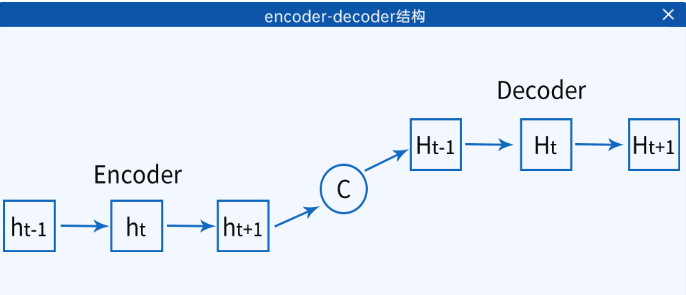  
然而，这样的表示方式有一个明显的缺点，就是无论源语言句子的长度是多少，都要用一个固定长度的向量来表示，这可能会导致信息的丢失或混淆，尤其是当源语言句子很长或者特征非常复杂时

### soft-attention结构

为了解决这个问题，soft-attention的思想是，不再使用一个固定的上下文向量，而是根据Decoder的每个时间步的状态，动态地计算一个上下文向量，这个向量是Encoder的所有隐藏状态的加权平均，即注意力机制的context，其中的权重反映了Decoder当前状态和Encoder各个状态的相关程度。这样，Decoder就可以根据自己的需要，选择性地关注Encoder的不同部分，从而生成更准确和流畅的目标语言句子
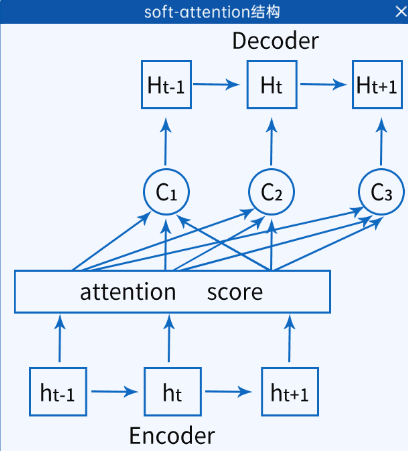  

假设$x_1, x_2, \cdots, x_t$是源语言句子的词向量，$h_1, h_2, \cdots, h_t$是**Encoder**的隐藏状态，$H_1, H_2, \cdots, H_t$是**Decoder**的隐藏状态，$y_1, y_2, \cdots, y_t$是目标语言句子的词向量，$c_1, c_2, \cdots, c_t$是根据soft-attention计算的上下文向量。具体的计算过程如下：

Encoder部分，和普通的RNN一样，根据当前输入和前一个隐藏状态，更新当前隐藏状态：

$$
h_t = f(x_t, h_{t-1})
$$

Decoder部分，首先根据前一个的输出拼接上计算出来的context做成其中一个输入，另一个输入是前一个隐藏状态，更新当前隐藏状态：

$$
H_t = g(cat(y_{t-1}, c_t), H_{t-1})
$$

:::warning 注意
第一次的$H_1$在计算时是没有上一次Decoder的隐藏状态的，那么这个隐藏状态一般是由Encoder的最后一个$h_t$代替
:::

其中，当前的上下文$c_t$是由上一次Decoder的隐藏状态$H_{t-1}$（得到Q）和Encoder的所有隐藏层$h_1$到$h_t$得到K和V经过Attention求得的。

:::warning 注意
第一次的$c_1$在计算时是没有上一次Decoder的隐藏状态的，那么这个隐藏状态一般是由Encoder的最后一个$h_t$代替
:::

然后，根据当前隐藏状态和Encoder的所有隐藏状态，计算一个注意力分布（attention distribution），表示Decoder当前状态和Encoder各个状态的相关程度即attention权重：

$$
a_{t,i} = \frac{e^{\alpha_{t,i}}}{\sum_{j=1}^d e^{\alpha_{t,j}}}
$$
其中，$\alpha_{t,j}$是注意力分数，用于衡量Decoder当前状态和Encoder第$i$个状态的匹配程度，有多种不同的定义方式，例如：

- **缩放点积注意力**：$\alpha_{t,i} = \frac{h_i \cdot H_t^T}{\sqrt{d}}$
- **加性注意力**：$\alpha_{t,i} = v^T \cdot tanh(w_k \cdot h_i + w_q \cdot H_t)$

最后，根据注意力分布和Encoder的所有隐藏状态，计算一个上下文向量，表示表示Decoder当前状态所关注的Encoder的部分

## 绝对位置编码

### 位置编码引入

这段文本主要介绍了循环神经网络（RNN）和Transformer模型在处理序列数据时的特点：

- **RNN**：借内部循环结构维持对序列顺序的记忆，能利用序列元素顺序信息
- **Transformer模型**：无状态结构，无内置对序列元素相对位置的感知能力，处理序列数据时，因序列顺序含重要信息（如自然语言处理里词语顺序，相同单词不同顺序表意不同 ），存在挑战  
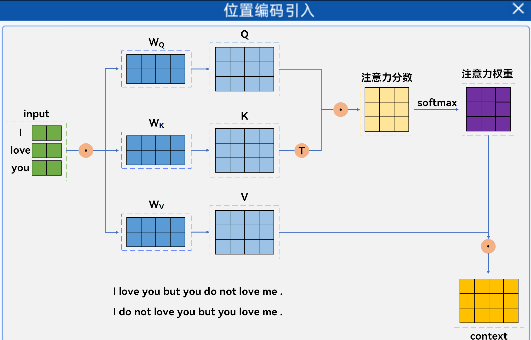  

在旧时代的NLP中，我们一般使用CNN/RNN来建模文本，其中CNN可以编码一定的绝对位置信息（很大程度上来⾃zero - padding），⽽RNN的序列依赖特性更是天生适合序列问题或者位置信息的建模。因此，在旧时代的NLP，基本无须单独做位置编码。

下⾯我们将讨论Transformer模型为对时间不敏感的原因及解决方法。

原因:

Transformer中的自注意力机制允许模型在处理序列时关注不同位置的元素，但它并不具备对元素位置的直接感知。

自注意力机制只考虑输入序列中各元素之间的相对权重，而无法区分它们在序列中的绝对位置。

对于上⾯给出的例子，句⼦中'love'出现2次，他们的初始表达是一样的，如果不加入位置的信息，那么self - attention对他们的关注度是一样的。也就是说transformer根本不知道是**我爱你**，还是**你爱我**的这种顺序关系。

因此我们需要在原始词嵌入向量的基础上加入位置编码或者称为位置嵌入向量

### 位置编码

如何在词嵌入向量中加入位置信息呢？我们最直观的做法一定是将位置信息也表示为嵌入向量直接加在原来的词嵌入向量上。也就是说：在绝对位置编码中，每个单词都有一个独立的位置嵌入向量，表示其在序列中的绝对位置。这个位置嵌入向量可以通过学习得到，也可以采用一些规则或者预定义的方式生成。但这种方式存在问题：  
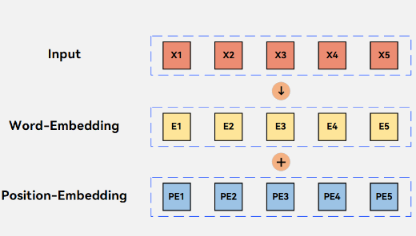

- 位置编码本身通过大量数据才能学习到
- 位置向量之间的相对关系没有被利用到

## 相对位置编码

### 正余弦位置编码

$$
\begin{cases}
PE_{(t,2i)} = \sin\left( \frac{t}{10000^{2i/d}} \right) \\
PE_{(t,2i+1)} = \cos\left( \frac{t}{10000^{2i/d}} \right)
\end{cases}
$$

- $t$：单词在序列中的位置
- $i$：编码向量的维度下标
- $d$：编码向量的总维度

#### $t$：**位置索引（Position）**

- 表示**单词在序列中的绝对位置**。
- 通常从 $0$ 开始编号。
- 例子：句子 “I love you”  
  - “I” 的 $t=0$
  - “love” 的 $t=1$
  - “you” 的 $t=2$

#### $i$：**维度索引（Dimension）**

- 表示**位置编码向量的第几维**。
- 取值范围 $0,1,2,\dots,d-1$（$d$ 是词嵌入维度）。
- 每个位置 $t$ 都有一个 $d$ 维的位置编码向量。

#### 例子（假设 $d=4$）

- 对于 $t=0$（第1个单词）：
  $$
  \begin{align*}
  PE_{(0,0)} &= \sin(0) = 0 \\
  PE_{(0,1)} &= \cos(0) = 1 \\
  PE_{(0,2)} &= \sin(0/100) = 0 \\
  PE_{(0,3)} &= \cos(0/100) = 1 \\
  \end{align*}
  $$
  位置编码向量为 $[0, 1, 0, 1]$

- 对于 $t=1$（第2个单词）：
  $$
  \begin{align*}
  PE_{(1,0)} &= \sin(1) \\
  PE_{(1,1)} &= \cos(1) \\
  PE_{(1,2)} &= \sin(0.01) \\
  PE_{(1,3)} &= \cos(0.01) \\
  \end{align*}
  $$
  位置编码向量为 $[\sin(1), \cos(1), \sin(0.01), \cos(0.01)]$

- 对于 $t=2$（第3个单词）：
  $$
  \begin{align*}
  PE_{(2,0)} &= \sin(2) \\
  PE_{(2,1)} &= \cos(2) \\
  PE_{(2,2)} &= \sin(0.02) \\
  PE_{(2,3)} &= \cos(0.02) \\
  \end{align*}
  $$
  位置编码向量为 $[\sin(2), \cos(2), \sin(0.02), \cos(0.02)]$

#### 逻辑总结

- **$t$ 决定“第几个单词”**，每个单词位置唯一
- **$i$ 决定“用什么频率编码”**，低维频率高，编码细节；高维频率低，编码全局
- **每个位置 $t$ 都有一个 $d$ 维向量**，每一维的值由 $t$ 和 $i$ 共同决定

:::danger 明确i的本质：维度组索引，而非单个维度索引
在正余弦位置编码中，每个i对应一组维度（偶数维度 + 奇数维度），而非单个维度。具体来说：
当取i时，会生成维度2i（正弦）和维度2i+1（余弦）
因此，i的取值范围是0, 1, 2, ..., (d/2 - 1)（保证2i+1 < d，覆盖所有维度）
:::

代入d=4的例子看i的取值  
当总维度d=4 时：  
i=0 → 对应维度 2×0=0（正弦）和 2×0+1=1（余弦）；  
i=1 → 对应维度 2×1=2（正弦）和 2×1+1=3（余弦）；  
此时，i=0和i=1已经覆盖了 所有4个维度（0、1、2、3），因此不需要i=2或i=3（再取的话会超出d=4的范围，比如i=2 时，2i=4，但维度最大是 d-1=3，无效）

## Layer-Normalization
