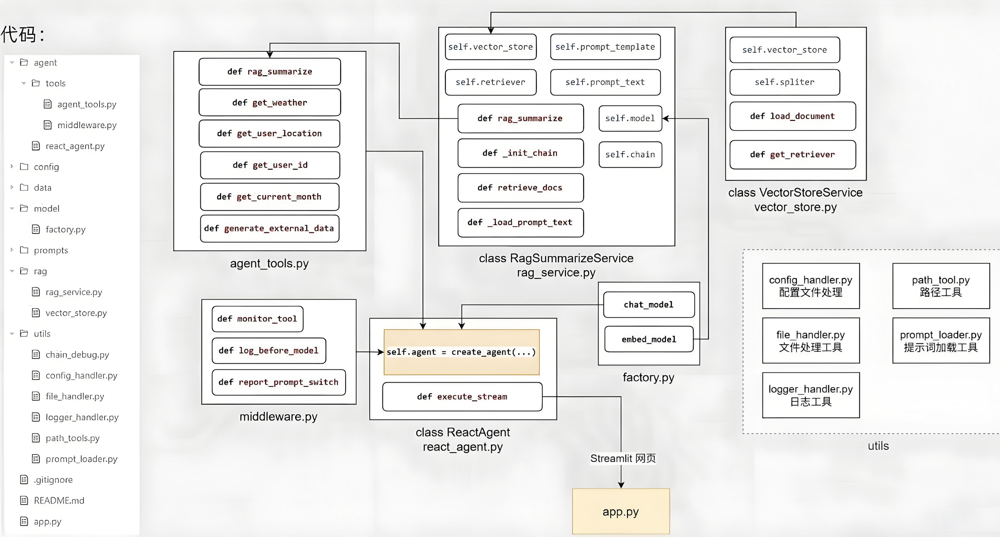

# Agent智能体项目介绍

## 简介

智扫通Agent项目是一个面向消费者（toC）的智能客服系统，旨在为用户提供全周期的扫地机器人相关服务。

（1）智能问答服务：
- 处理购买前的产品咨询（如功能、价格、对比等）。
- 解决购买后的使用问题（如操作指导、故障处理、维护建议等）。
- 基于RAG技术，从知识库中检索准确信息并生成自然语言回答，确保响应及时且可靠。

（2）使用报告与优化建议生成：
- 针对已购买用户，自动分析扫地机器人的使用数据（如清洁频率、耗材状态、错误日志等）。
- 生成个性化报告，总结使用情况并提供优化建议（如清洁计划调整、部件更换提醒等）。
- 支持用户主动查询报告或系统定期推送，帮助用户最大化产品价值。

## RAG知识库数据集

- 故障排除.txt
- 扫地机器人100问.pdf
- 扫地机器人100问2.txt
- 扫拖一体机器人100问.txt
- 维护保养.txt
- 选购指南.txt

## 项目架构

