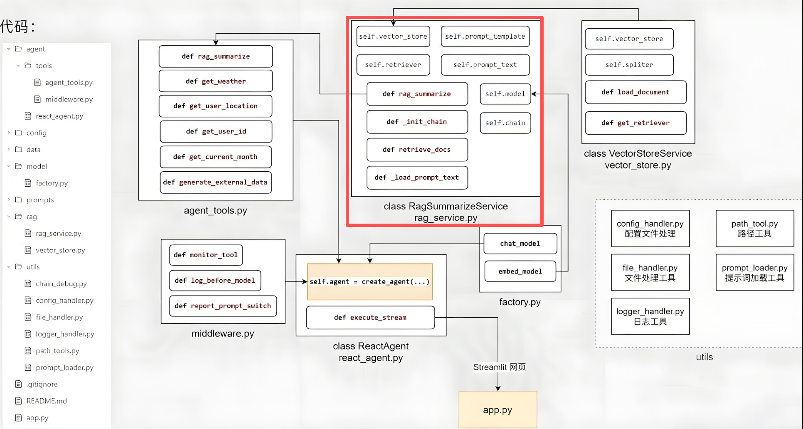

# RAG总结服务开发

## 相关代码



## 代码实践

在`rag`目录下新建一个`rag_service.py`:

```python
# 总结服务类：用户提问，搜索参考资料，将提问和参考资料交给模型，让模型总结回复
import os
import sys

sys.path.insert(0, os.path.abspath(os.path.join(os.path.dirname(__file__), '..', '..')))

from langchain_core.documents import Document
from langchain_core.output_parsers import StrOutputParser
from agent.rag.vector_store import VectorStoreService
from langchain_core.prompts import PromptTemplate
from agent.model.factory import chat_model
from agent.utils.prompt_loader import load_rag_prompts

def print_prompt(prompt):
    print("="*20)
    print(prompt.to_string())
    print("="*20)
    return prompt

class RagSummarizeService(object):
    def __init__(self):
        self.vector_store = VectorStoreService()
        self.retriever = self.vector_store.get_retriever()
        self.prompt_text = load_rag_prompts()
        self.prompt_template = PromptTemplate.from_template(self.prompt_text)
        self.model = chat_model
        self.chain = self._init_chain()

    def _init_chain(self):
        chain = self.prompt_template | print_prompt | self.model | StrOutputParser()
        return chain

    def retriever_docs(self, query: str) -> list[Document]:
        return self.retriever.invoke(query)

    def rag_summarize(self, query: str) -> str:
        context_docs = self.retriever_docs(query)

        context = ""
        counter = 0
        for doc in context_docs:
            counter += 1
            context += f"[参考资料{counter}]: {doc.page_content} | 参考源数据: {doc.metadata}\n"

        return self.chain.invoke(
            {
                "input": query,
                "context": context,
            }
        )

if __name__ == '__main__':
    rag = RagSummarizeService()
    print(rag.rag_summarize("小户型适合哪些扫地机器人"))
```
