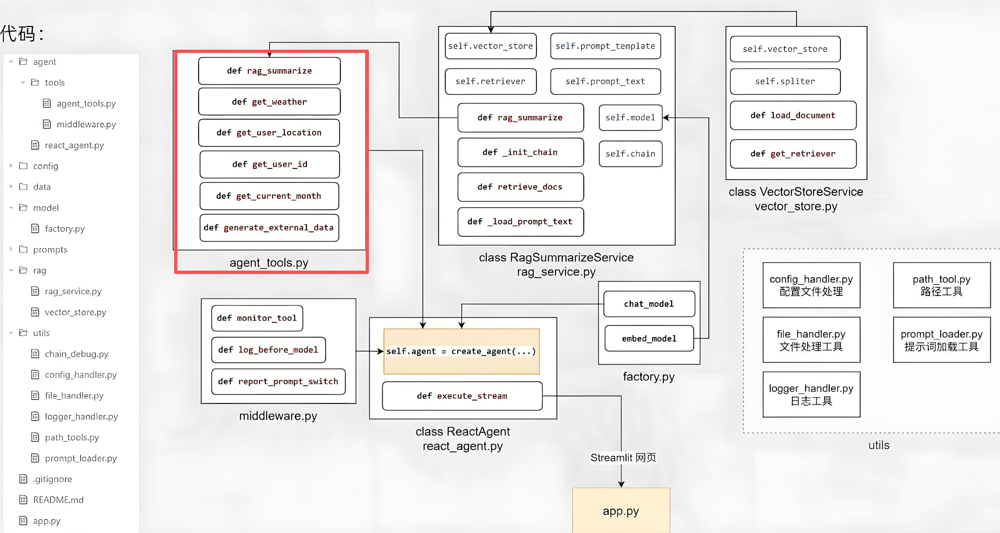

import CsvTable from '@site/src/components/CsvTable';

# Tools工具开发

## 相关代码



## 代码实践

首先在`config`目录下的`agent.yml`中写上：

```yaml
external_data_path: data/external/records.csv
```

在`data`目录下创建`external`目录，新建一个`records.csv`，准备用户相关的使用信息：

<CsvTable data={`用户ID,特征,清洁效率,耗材,对比,时间
1001,65m²单身公寓/木地板,覆盖率86%/日均清扫46m²/沙发底部漏扫,主刷剩余50天/HEPA滤网剩余20天/尘盒每日清理,本月覆盖率较上月提升2%,2025-01
1002,70m²情侣公寓/瓷砖,覆盖率88%/避障失败2次每周,边刷重度磨损/尘盒每2天清理,拖地使用率较上月提升5%,2025-01
1003,90m²养狗家庭/短毛地毯,毛发清理率92%/地毯增压16次每月,胶刷已更换/尘盒每日清理,毛发清理效率较上月提升3%,2025-01
1004,85m²养2猫/混合地面,自动回充成功率87%/猫砂处理9次每月,主刷严重缠绕/滤网需紧急更换,回充成功率较上月下降5%,2025-01
1005,120m²老人家庭/防滑砖,手动操作占比94%/定时清扫1次每周,电池衰减26%/水箱未激活,定时使用率较上月无变化,2025-01
1006,150m²别墅多层/复合地板,避障成功率74%/跨楼层失败4次每周,边刷每季度更换/集尘袋1.2个每月,避障成功率较上月下降8%,2025-01
1007,55m²独居一居室/复合地板,覆盖率91%/日均清扫36m²/沿边无死角,滤网剩余75天/尘盒每4天清理,覆盖率较上月提升1%,2025-01
1008,100m²三口之家/大理石,覆盖率87%/餐桌漏扫1次每天/避障成功率91%,主刷轻度磨损/水箱每日加水,覆盖率较上月持平,2025-01
1009,80m²养宠两居室/仿实木,宠物毛发清理率85%/自动回充成功率92%,胶刷中度缠绕/滤网剩余30天,毛发清理率较上月下降2%,2025-01
1010,130m²三代同堂四居室/通体砖,覆盖率82%/手动辅助3次每天/定时使用率60%,电池衰减16%/边刷剩余40天,覆盖率较上月下降3%,2025-01
1001,65m²单身公寓/木地板,覆盖率87%/日均清扫46m²/沙发底部漏扫,主刷剩余45天/HEPA滤网建议更换/尘盒每日清理,本月覆盖率较上月提升1%,2025-02
1002,70m²情侣公寓/瓷砖,覆盖率88%/避障失败2次每周,边刷重度磨损/尘盒每3天清理,拖地使用率较上月提升5%,2025-02
1003,90m²养狗家庭/短毛地毯,毛发清理率93%/地毯增压17次每月,胶刷剩余45天/尘盒每日清理,毛发清理效率较上月提升1%,2025-02
1004,85m²养2猫/混合地面,自动回充成功率88%/猫砂处理7次每月,主刷严重缠绕/滤网已更换,回充成功率较上月提升1%,2025-02
1005,120m²老人家庭/防滑砖,手动操作占比93%/定时清扫2次每周,电池衰减28%/水箱使用率50%,定时使用率较上月提升1次,2025-02
1006,150m²别墅多层/复合地板,避障成功率78%/跨楼层失败2次每周,边刷每季度更换/集尘袋1个每月,避障成功率较上月提升4%,2025-02
1007,55m²独居一居室/复合地板,覆盖率92%/日均清扫37m²/沿边无死角,滤网剩余70天/尘盒每4天清理,覆盖率较上月提升1%,2025-02
1008,100m²三口之家/大理石,覆盖率88%/餐桌漏扫0次每天/避障成功率92%,主刷中度磨损/水箱每日加水,覆盖率较上月提升1%,2025-02
1009,80m²养宠两居室/仿实木,宠物毛发清理率88%/自动回充成功率94%,胶刷轻度缠绕/滤网剩余20天,毛发清理率较上月提升3%,2025-02
1010,130m²三代同堂四居室/通体砖,覆盖率85%/手动辅助2次每天/定时使用率70%,电池衰减17%/边刷剩余35天,覆盖率较上月提升3%,2025-02
1001,65m²单身公寓/木地板,覆盖率88%/日均清扫48m²/沙发底部已垫高无漏扫,主刷剩余45天/HEPA滤网建议更换/尘盒每日清理,本月覆盖率较上月提升1%,2025-03
1002,70m²情侣公寓/瓷砖,覆盖率89%/避障失败1次每周,边刷中度磨损/尘盒每3天清理,拖地使用率较上月提升5%,2025-03
1003,90m²养狗家庭/短毛地毯,毛发清理率93%/地毯增压17次每月,胶刷剩余45天/尘盒每日清理,毛发清理效率较上月持平,2025-03
1004,85m²养2猫/混合地面,自动回充成功率90%/猫砂处理7次每月,主刷中度缠绕/滤网剩余60天,回充成功率较上月提升2%,2025-03
1005,120m²老人家庭/防滑砖,手动操作占比85%/定时清扫5次每周,电池衰减28%/水箱使用率50%,定时使用率较上月大幅提升,2025-03
1006,150m²别墅多层/复合地板,避障成功率85%/跨楼层失败1次每周,边刷剩余60天/集尘袋0.8个每月,避障成功率较上月提升7%,2025-03
1007,55m²独居一居室/复合地板,覆盖率93%/日均清扫38m²/沿边无死角,滤网剩余65天/尘盒每5天清理,覆盖率较上月提升1%,2025-03
1008,100m²三口之家/大理石,覆盖率89%/餐桌漏扫0次每天/避障成功率93%,主刷轻度磨损/水箱每日加水,覆盖率较上月提升1%,2025-03
1009,80m²养宠两居室/仿实木,宠物毛发清理率90%/自动回充成功率95%,胶刷轻度缠绕/滤网剩余10天,毛发清理率较上月提升2%,2025-03
1010,130m²三代同堂四居室/通体砖,覆盖率86%/手动辅助2次每天/定时使用率75%,电池衰减18%/边刷剩余25天,覆盖率较上月提升1%,2025-03`} />

<details>
<summary>点击查看原始 CSV 数据</summary>

```csv
用户ID,特征,清洁效率,耗材,对比,时间
1001,65m²单身公寓/木地板,覆盖率86%/日均清扫46m²/沙发底部漏扫,主刷剩余50天/HEPA滤网剩余20天/尘盒每日清理,本月覆盖率较上月提升2%,2025-01
1002,70m²情侣公寓/瓷砖,覆盖率88%/避障失败2次每周,边刷重度磨损/尘盒每2天清理,拖地使用率较上月提升5%,2025-01
1003,90m²养狗家庭/短毛地毯,毛发清理率92%/地毯增压16次每月,胶刷已更换/尘盒每日清理,毛发清理效率较上月提升3%,2025-01
1004,85m²养2猫/混合地面,自动回充成功率87%/猫砂处理9次每月,主刷严重缠绕/滤网需紧急更换,回充成功率较上月下降5%,2025-01
1005,120m²老人家庭/防滑砖,手动操作占比94%/定时清扫1次每周,电池衰减26%/水箱未激活,定时使用率较上月无变化,2025-01
1006,150m²别墅多层/复合地板,避障成功率74%/跨楼层失败4次每周,边刷每季度更换/集尘袋1.2个每月,避障成功率较上月下降8%,2025-01
1007,55m²独居一居室/复合地板,覆盖率91%/日均清扫36m²/沿边无死角,滤网剩余75天/尘盒每4天清理,覆盖率较上月提升1%,2025-01
1008,100m²三口之家/大理石,覆盖率87%/餐桌漏扫1次每天/避障成功率91%,主刷轻度磨损/水箱每日加水,覆盖率较上月持平,2025-01
1009,80m²养宠两居室/仿实木,宠物毛发清理率85%/自动回充成功率92%,胶刷中度缠绕/滤网剩余30天,毛发清理率较上月下降2%,2025-01
1010,130m²三代同堂四居室/通体砖,覆盖率82%/手动辅助3次每天/定时使用率60%,电池衰减16%/边刷剩余40天,覆盖率较上月下降3%,2025-01
1001,65m²单身公寓/木地板,覆盖率87%/日均清扫46m²/沙发底部漏扫,主刷剩余45天/HEPA滤网建议更换/尘盒每日清理,本月覆盖率较上月提升1%,2025-02
1002,70m²情侣公寓/瓷砖,覆盖率88%/避障失败2次每周,边刷重度磨损/尘盒每3天清理,拖地使用率较上月提升5%,2025-02
1003,90m²养狗家庭/短毛地毯,毛发清理率93%/地毯增压17次每月,胶刷剩余45天/尘盒每日清理,毛发清理效率较上月提升1%,2025-02
1004,85m²养2猫/混合地面,自动回充成功率88%/猫砂处理7次每月,主刷严重缠绕/滤网已更换,回充成功率较上月提升1%,2025-02
1005,120m²老人家庭/防滑砖,手动操作占比93%/定时清扫2次每周,电池衰减28%/水箱使用率50%,定时使用率较上月提升1次,2025-02
1006,150m²别墅多层/复合地板,避障成功率78%/跨楼层失败2次每周,边刷每季度更换/集尘袋1个每月,避障成功率较上月提升4%,2025-02
1007,55m²独居一居室/复合地板,覆盖率92%/日均清扫37m²/沿边无死角,滤网剩余70天/尘盒每4天清理,覆盖率较上月提升1%,2025-02
1008,100m²三口之家/大理石,覆盖率88%/餐桌漏扫0次每天/避障成功率92%,主刷中度磨损/水箱每日加水,覆盖率较上月提升1%,2025-02
1009,80m²养宠两居室/仿实木,宠物毛发清理率88%/自动回充成功率94%,胶刷轻度缠绕/滤网剩余20天,毛发清理率较上月提升3%,2025-02
1010,130m²三代同堂四居室/通体砖,覆盖率85%/手动辅助2次每天/定时使用率70%,电池衰减17%/边刷剩余35天,覆盖率较上月提升3%,2025-02
1001,65m²单身公寓/木地板,覆盖率88%/日均清扫48m²/沙发底部已垫高无漏扫,主刷剩余45天/HEPA滤网建议更换/尘盒每日清理,本月覆盖率较上月提升1%,2025-03
1002,70m²情侣公寓/瓷砖,覆盖率89%/避障失败1次每周,边刷中度磨损/尘盒每3天清理,拖地使用率较上月提升5%,2025-03
1003,90m²养狗家庭/短毛地毯,毛发清理率93%/地毯增压17次每月,胶刷剩余45天/尘盒每日清理,毛发清理效率较上月持平,2025-03
1004,85m²养2猫/混合地面,自动回充成功率90%/猫砂处理7次每月,主刷中度缠绕/滤网剩余60天,回充成功率较上月提升2%,2025-03
1005,120m²老人家庭/防滑砖,手动操作占比85%/定时清扫5次每周,电池衰减28%/水箱使用率50%,定时使用率较上月大幅提升,2025-03
1006,150m²别墅多层/复合地板,避障成功率85%/跨楼层失败1次每周,边刷剩余60天/集尘袋0.8个每月,避障成功率较上月提升7%,2025-03
1007,55m²独居一居室/复合地板,覆盖率93%/日均清扫38m²/沿边无死角,滤网剩余65天/尘盒每5天清理,覆盖率较上月提升1%,2025-03
1008,100m²三口之家/大理石,覆盖率89%/餐桌漏扫0次每天/避障成功率93%,主刷轻度磨损/水箱每日加水,覆盖率较上月提升1%,2025-03
1009,80m²养宠两居室/仿实木,宠物毛发清理率90%/自动回充成功率95%,胶刷轻度缠绕/滤网剩余10天,毛发清理率较上月提升2%,2025-03
1010,130m²三代同堂四居室/通体砖,覆盖率86%/手动辅助2次每天/定时使用率75%,电池衰减18%/边刷剩余25天,覆盖率较上月提升1%,2025-03
```

</details>

在项目根目录下创建`agent`目录，然后新建`tools`目录，目录下创建一个`agent_tools.py`的代码文件：

```python
import os
import sys

sys.path.insert(0, os.path.abspath(os.path.join(os.path.dirname(__file__), '..', '..')))
from langchain_core.tools import tool
from utils.path_tool import get_abs_path
from rag.rag_service import RagSummarizeService
import random
from utils.config_handler import agent_conf
from utils.logger_hander import logger


rag = RagSummarizeService()

user_ids = ["1001", "1002", "1003", "1004", "1005", "1006", "1007", "1008", "1009", "1010"]
month_arr = ["2025-01", "2025-02", "2025-03"]

external_data = {}

@tool(description="从向量存储中检索参考资料")
def rag_summarize(query: str) -> str:
    return rag.rag_summarize(query)


@tool(description="获取指定城市的天气，以消息字符串的形式返回")
def get_weather(city: str) -> str:
    return f"城市{city}天气为晴天，气温26摄氏度，空气湿度50%，南风1级，AQI21，最近6小时降雨概率极低"


@tool(description="获取用户所在城市的名称，以纯字符串形式返回")
def get_user_location() -> str:
    return random.choice(["深圳", "合肥", "杭州"])


@tool(description="获取用户的ID，以纯字符串形式返回")
def get_user_id() -> str:
    return random.choice(user_ids)


@tool(description="获取当前月份，以纯字符串形式返回")
def get_current_month() -> str:
    return random.choice(month_arr)


def generate_external_data():
    """
    {
        "user_id": {
            "month" : {"特征": xxx, "效率": xxx, ...}
            "month" : {"特征": xxx, "效率": xxx, ...}
            "month" : {"特征": xxx, "效率": xxx, ...}
            ...
        },
        "user_id": {
            "month" : {"特征": xxx, "效率": xxx, ...}
            "month" : {"特征": xxx, "效率": xxx, ...}
            "month" : {"特征": xxx, "效率": xxx, ...}
            ...
        },
        "user_id": {
            "month" : {"特征": xxx, "效率": xxx, ...}
            "month" : {"特征": xxx, "效率": xxx, ...}
            "month" : {"特征": xxx, "效率": xxx, ...}
            ...
        },
        ...
    }
    """
    if not external_data:
        external_data_path = get_abs_path(agent_conf["external_data_path"])

        if not os.path.exists(external_data_path):
            raise FileNotFoundError(f"外部数据文件{external_data_path}不存在")

        with open(external_data_path, "r", encoding="utf-8") as f:
            for line in f.readlines()[1:]:
                arr: list[str] = line.strip().split(",")

                user_id: str = arr[0].replace('"', "")
                feature: str = arr[1].replace('"', "")
                efficiency: str = arr[2].replace('"', "")
                consumables: str = arr[3].replace('"', "")
                comparison: str = arr[4].replace('"', "")
                time: str = arr[5].replace('"', "")

                if user_id not in external_data:
                    external_data[user_id] = {}

                external_data[user_id][time] = {
                    "特征": feature,
                    "效率": efficiency,
                    "耗材": consumables,
                    "对比": comparison,
                }


@tool(description="从外部系统中获取指定用户在指定月份的使用记录，以纯字符串形式返回，如果未检索到返回空字符串")
def fetch_external_data(user_id: str, month: str) -> str:
    generate_external_data()

    try:
        return external_data[user_id][month]
    except KeyError:
        logger.warning(f"[fetch_external_data]未能检索到用户: {user_id}在{month}的使用记录")
        return ""


if __name__ == '__main__':
    print(fetch_external_data("1001", "2025-01"))
    print(fetch_external_data("1005", "2025-06"))
```