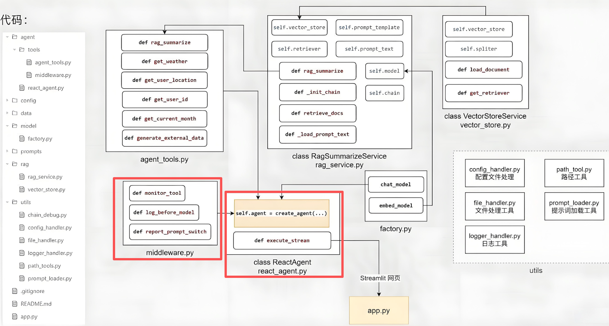

# 中间件和Agent创建

## 相关代码



## 代码实践

在`agent/tools`目录下新建一个`middleware.py`文件:

```python
from langchain.agents.middleware import AgentState, ModelRequest, before_model, dynamic_prompt, wrap_tool_call
from langchain.tools.tool_node import ToolCallRequest
from typing import Callable
from langchain_core.messages import ToolMessage
from langgraph.runtime import Runtime
from langgraph.types import Command
from utils.logger_hander import logger
from langchain.tools import tool
from utils.prompt_loader import load_report_prompts, load_system_prompts

@wrap_tool_call
def monitor_tool(
        request: ToolCallRequest,
        handler: Callable[[ToolCallRequest], ToolMessage | Command],
) -> ToolMessage | Command:
    """工具执行的监控

    :param request: 请求的数据封装
    :param handler: 执行的函数本身
    """
    logger.info(f"[tool monitor]执行工具：{request.tool_call['name']}")
    logger.info(f"[tool monitor]传入参数：{request.tool_call['args']}")

    try:
        result = handler(request)
        logger.info(f"[tool monitor]工具{request.tool_call['name']}调用成功")

        if request.tool_call['name'] == "fill_context_for_report":
            request.runtime.context["report"] = True


        return result
    except Exception as e:
        logger.error(f"工具{request.tool_call['name']}调用失败，原因：{str(e)}")
        raise e


@before_model
def log_before_model(
        state: AgentState,
        runtime: Runtime,
):
    """在模型执行前输出日志

    :param state: 整个Agent智能体中的状态记录
    :param runtime: 记录了整个执行过程中的上下文信息
    """
    logger.info(f"[log_before_model]即将调用模型，带有{len(state['messages'])}条消息。")
    logger.debug(f"[log_before_model]{type(state['messages'][-1]).__name__} | {state['messages'][-1].content.strip()}")

    return None


@dynamic_prompt # 每一次在生成提示词之前调用此函数
def report_prompt_switch(request: ModelRequest):
    """动态切换提示词"""
    is_report = request.runtime.context.get("report", False)
    if is_report:
        return load_report_prompts()

    return load_system_prompts()

@tool(description="无入参，无返回值，调用后触发中间件自动为报告生成的场景注入上下文信息，为后续提示词切换提供上下文")
def fill_context_for_report():
    return "fill_context_for_report已调用"
```

在`agent`目录下新建一个`react_agent.py`文件：

```python
import os
import sys

sys.path.insert(0, os.path.abspath(os.path.join(os.path.dirname(__file__), '..', '..')))
from langchain.agents import create_agent
from agent.model.factory import chat_model
from agent.utils.prompt_loader import load_system_prompts
from agent.agent.tools.agent_tools import (
    rag_summarize,
    get_weather,
    get_user_location,
    get_user_id,
    get_current_month,
    fetch_external_data,
)
from agent.agent.tools.middleware import fill_context_for_report
from agent.tools.middleware import monitor_tool, log_before_model, report_prompt_switch


class ReactAgent:
    def __init__(self):
        self.agent = create_agent(
            model=chat_model,
            system_prompt=load_system_prompts(),
            tools=[rag_summarize, get_weather, get_user_location, get_user_id,
                   get_current_month, fetch_external_data, fill_context_for_report],
            middleware=[monitor_tool, log_before_model, report_prompt_switch],
        )

    def execute_stream(self, query: str):
        input_dict = {
            "messages": [
                {"role": "user", "content": query},
            ]
        }

        for chunk in self.agent.stream(input_dict, stream_mode="values", context={"report": False}):
            latest_message = chunk["messages"][-1]
            if latest_message.content:
                yield latest_message.content.strip() + "\n"


if __name__ == '__main__':
    agent = ReactAgent()

    # for chunk in agent.execute_stream("扫地机器人在我所在的地区气温下如何保养"):
    for chunk in agent.execute_stream("给我生成我的使用报告"):
        print(chunk, end="", flush=True)
```