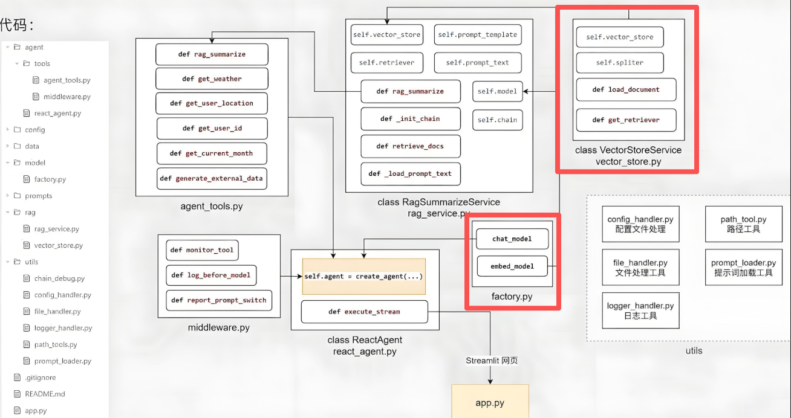

# 向量存储服务开发

## 涉及代码



## 代码实践

### `chroma.yml`

```yaml
collection_name: agent
persist_directory: chroma_db
k: 2
data_path: data
md5_hex_store: md5.txt
allow_knowledge_file_type: ["txt", "pdf"]

chunk_size: 200
chunk_overlap: 20
separators: ["\n\n", "\n", ".", "!", "?", "。", "！", "？", " ", ""]
```

### 数据集`data`

- `故障排除.txt`
- `扫地机器人100问2.txt`
- `扫描一体机器人100问.pdf`
- `扫描一体机器人100问.txt`
- `维护保养.txt`
- `选购指南.txt`

### 模型工厂

`agent`下新建一个`model`目录，创建一个`factory.py`:

```python
from abc import ABC, abstractmethod
from typing import Optional

from langchain_core.embeddings import Embeddings
from langchain_community.chat_models.tongyi import BaseChatModel
from langchain_community.embeddings import DashScopeEmbeddings
from langchain_community.chat_models.tongyi import ChatTongyi
from agent.utils.config_handler import rag_conf
from dotenv import load_dotenv
import os
load_dotenv()
api_key = os.getenv("LLM_API_KEY")


class BaseModelFactory(ABC):
    @abstractmethod
    def generator(self) -> Optional[Embeddings | BaseChatModel]:
        pass


class ChatModelFactory(BaseModelFactory):
    def generator(self) -> Optional[Embeddings | BaseChatModel]:
        return ChatTongyi(model=rag_conf["chat_model_name"], api_key=api_key)


class EmbeddingsFactory(BaseModelFactory):
    def generator(self) -> Optional[Embeddings | BaseChatModel]:
        return DashScopeEmbeddings(model=rag_conf["embedding_model_name"], dashscope_api_key=api_key)


chat_model = ChatModelFactory().generator()
embed_model = EmbeddingsFactory().generator()
```

### 知识库

`agent`下新建`rag`目录，创建`vector_store.py`:

```python
from langchain_chroma import Chroma
from langchain_core.documents import Document
import os
import sys

sys.path.insert(0, os.path.abspath(os.path.join(os.path.dirname(__file__), '..', '..')))
from agent.utils.config_handler import chroma_conf
from agent.model.factory import embed_model
from langchain_text_splitters import RecursiveCharacterTextSplitter
from agent.utils.path_tool import get_abs_path
from agent.utils.file_handler import pdf_loader, txt_loader, listdir_with_allowed_type, get_file_md5_hex
from agent.utils.logger_hander import logger


class VectorStoreService:
    def __init__(self):
        self.vector_store = Chroma(
            collection_name=chroma_conf["collection_name"],
            embedding_function=embed_model,
            persist_directory=chroma_conf["persist_directory"],
        )
        self.spliter = RecursiveCharacterTextSplitter(
            chunk_size=chroma_conf["chunk_size"],
            chunk_overlap=chroma_conf["chunk_overlap"],
            separators=chroma_conf["separators"],
            length_function=len,
        )

    def get_retriever(self):
        return self.vector_store.as_retriever(search_kwargs={"k": chroma_conf["k"]})

    def load_document(self):
        """从数据文件夹内读取数据文件，转为向量存入向量库，要计算文件的md5去重
        
        :return: None
        """

        def check_md5_hex(md5_for_check: str):
            if not os.path.exists(get_abs_path(chroma_conf["md5_hex_store"])):
                #创建文件
                open(get_abs_path(chroma_conf["md5_hex_store"]), "w", encoding="utf-8").close()
                return False           # md5 没处理过

            with open(get_abs_path(chroma_conf["md5_hex_store"]),"r", encoding="utf-8") as f:
                for line in f.readlines():
                    line = line.strip()
                    if line ==md5_for_check:
                        return True    # md5处理过

                return False           # md5没处理过

        def save_md5_hex(md5_for_check: str):
            with open(get_abs_path(chroma_conf["md5_hex_store"]), "a", encoding="utf-8") as f:
                f.write(md5_for_check + "\n")

        def get_file_documents(read_path: str):
            if read_path.endswith("txt"):
                return txt_loader(read_path)
            
            if read_path.endswith("pdf"):
                return pdf_loader(read_path)

            return []

        allowed_files_path: list[str] = listdir_with_allowed_type(
            get_abs_path(chroma_conf["data_path"]),
            tuple(chroma_conf["allow_knowledge_file_type"]),
        )

        for path in allowed_files_path:
            # 获取文件的md5
            md5_hex = get_file_md5_hex(path)

            if check_md5_hex(md5_hex):
                logger.info(f"[加载知识库]{path}内容已经存在知识库内，跳过")
                continue

            try:
                documents: list[Document] = get_file_documents(path)

                if not documents:
                    logger.warning(f"[加载知识库]{path}内没有有效文本内容，跳过")
                    continue

                split_document: list[Document] = self.spliter.split_documents(documents)

                if not split_document:
                    logger.warning(f"[加载知识库]{path}分片后没有有效文本内容，跳过")
                    continue

                # 将内容存入向量库
                self.vector_store.add_documents(split_document)

                # 记录这个已经处理好的文件的md5，避免下次重复加载
                save_md5_hex(md5_hex)

                logger.info(f"[加载知识库]{path} 内容加载成功")
            except Exception as e:
                # exc_info为True会记录详细的报错堆栈，如果为False仅记录报错信息本身
                logger.error(f"[加载知识库]{path}加载失败：{str(e)}", exc_info=True)
                continue


if __name__ == '__main__':
    vs = VectorStoreService()

    vs.load_document()

    retriever = vs.get_retriever()

    res = retriever.invoke("迷路")
    for r in res:
        print(r.page_content)
        print("-" * 20)
```