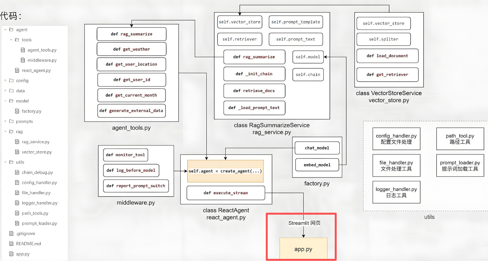

# 用户界面开发

## 相关代码



## 代码实践

在根目录下创建一个`app.py`代码文件：

```python
import time
import streamlit as st
from agent.react_agent import ReactAgent

# 标题
st.title("智扫通机器人智能客服")
st.divider()

if "agent" not in st.session_state:
    st.session_state["agent"] = ReactAgent()

if "message" not in st.session_state:
    st.session_state["message"] = []

for message in st.session_state["message"]:
    st.chat_message(message["role"]).write(message["content"])
# 用户输入提示词
prompt = st.chat_input()

if prompt:
    st.chat_message("user").write(prompt)
    st.session_state["message"].append({"role": "user", "content": prompt})

    response_messages = []
    with st.spinner("智能客服思考中..."):
        res_stream = st.session_state["agent"].execute_stream(prompt)

        def capture(generator, cache_list):
            for chunk in generator:
                cache_list.append(chunk)
                for char in chunk:
                    time.sleep(0.01)
                    yield char

        st.chat_message("assistant").write_stream(capture(res_stream, response_messages))
        st.session_state["message"].append({"role": "assistant", "content": response_messages[-1]})
        st.rerun()
```

进入到当前根目录，然后运行命令启动：

```bash
streamlit run app.py
```
