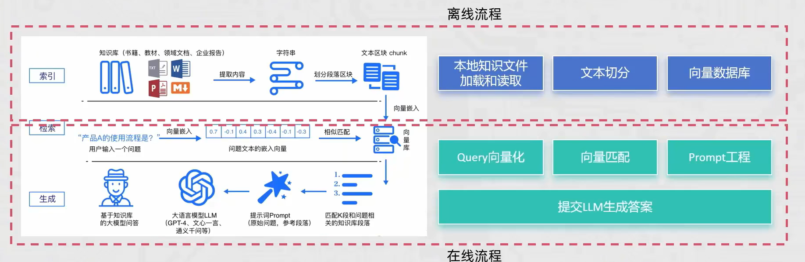
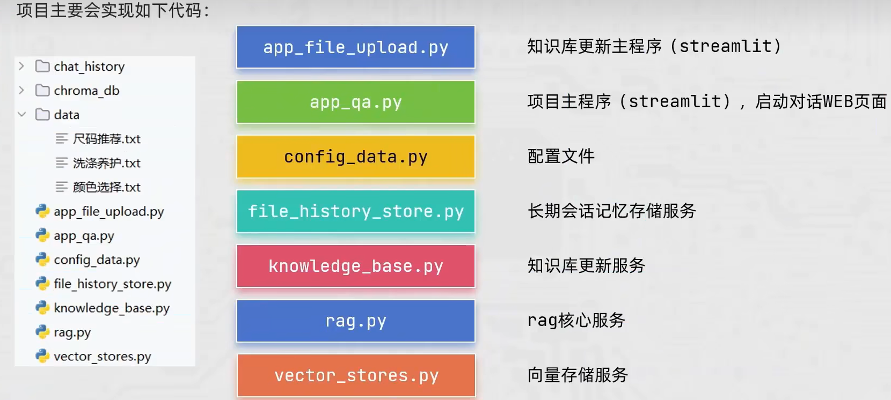
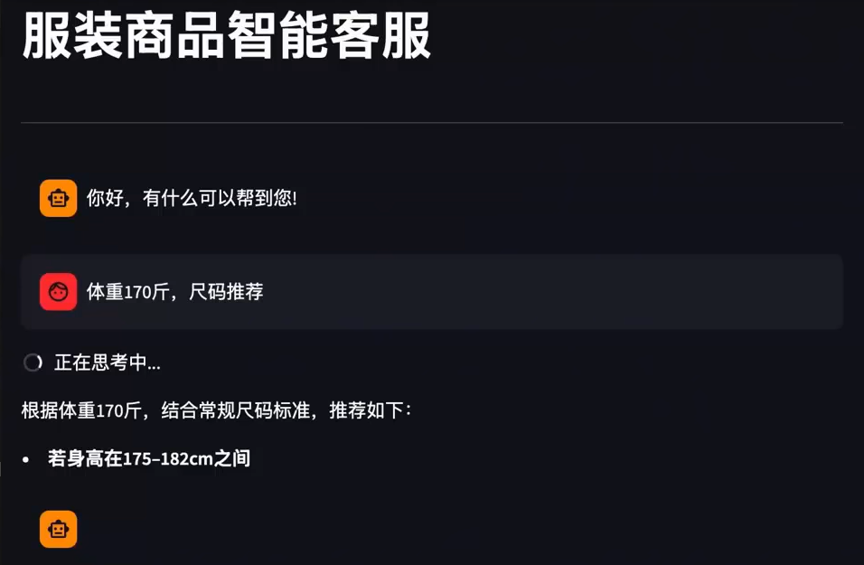

# RAG

## 项目介绍

### RAG回顾

RAG即检索、增强和生成，其主要分为2条线：

- 离线处理：向私有知识库（向量存储）源源不断添加私有知识文档。
  - 向知识库添加来自未来的知识文档（基于模型训练完成时间）
  - 向模型添加私有知识文档
  - 给出模型参考资料，规避模型幻觉（一本正经的胡说八道）
- 在线处理：用户提问会先基于私有知识库做检索，获取参考资料，同步组装新提示词询问大模型获取结果。

## 项目需求和思路

本次项目以"某东商品衣服"为例，以衣服属性构建本地知识。使用者可以**自由更新**本地知识，用户问题的答案也是**基于本地知识生成**的。

### 示意图

### 代码框架

### 实现页面

## 目录

import DocCardList from '@theme/DocCardList';

<DocCardList />
