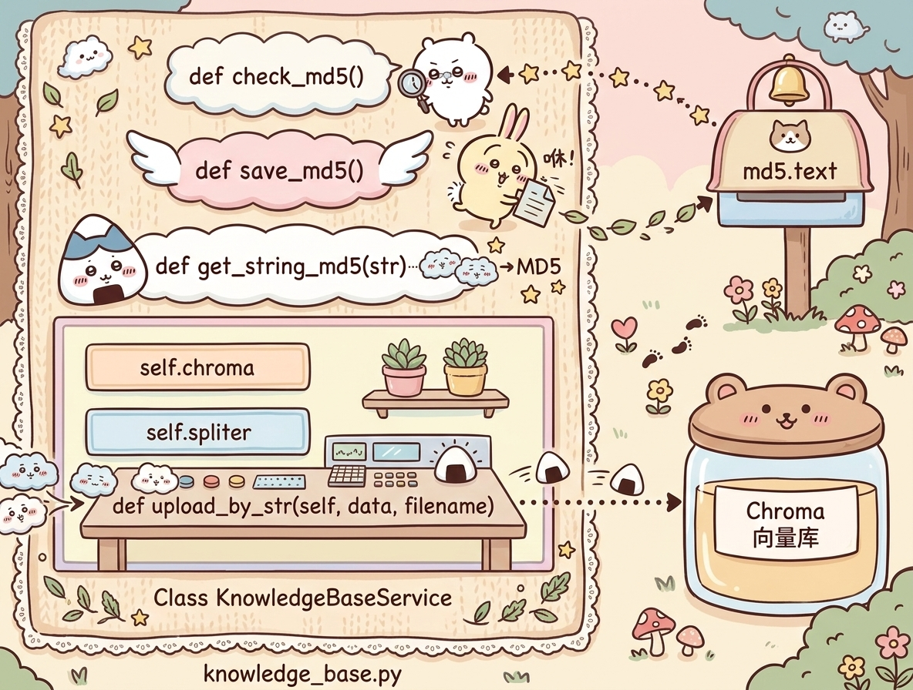

# md5工具函数开发

## 代码架构



根据架构图搭建好代码骨架，再逐步实现：

```python
# 知识库
def check_md5():
    """检查传入的md5字符串是否已经处理过了"""
    pass


def save_md5():
    """将传入的md5字符串，记录到文件内保存"""
    pass


def get_string():
    """将传入的字符串转换为md5字符串"""
    pass


class KnowledgeBaseService(object):
    def __init__(self):
        self.chroma = None     # 向量存储的实例Chroma向量库对象
        self.spliter = None    # 文本分割器的对象
    
    def upload_by_str(self, data, filename):
        """将传入的字符串，进行向量化，存储向量数据库中"""
        pass
```

## 代码实践

目录下创建配置文件`config_data.py`:

```python
md5_path = "./md5.txt"
```

完成具体的函数实现

```python
# 知识库
import os
import config_data as config
import hashlib


def check_md5(md5_str: str):
    """检查传入的md5字符串是否已经处理过了
        return False(md5未处理过)  True(已经处理过，已有记录)
    """
    if not os.path.exists(config.md5_path):
        # if进入表示文件不存在，那肯定没有处理md5
        open(config.md5_path, 'w', encoding='utf-8').close()
        return False
    else:
        for line in open(config.md5_path, 'r', encoding='utf-8').readlines():
            line = line.strip() # 处理字符串前后的空格和回车
            if line == md5_str:
                return True     # 已处理过
            
        return False
        
def save_md5(md5_str: str):
    """将传入的md5字符串，记录到文件内保存"""
    with open(config.md5_path, 'a', encoding='utf-8') as f:
        f.write(md5_str + '\n')

def get_string_md5(input_str: str, encoding='utf-8'):
    """将传入的字符串转换为md5字符串"""
    # 将字符串转换为bytes字节数组
    str_bytes = input_str.encode(encoding=encoding)

    # 创建md5对象
    md5_obj = hashlib.md5()    # 得到md5对象
    md5_obj.update(str_bytes)  # 更新内容（传入即将要转换的字节数组）
    md5_hex = md5_obj.hexdigest()
    
    return md5_hex

class KnowledgeBaseService(object):
    
    def __init__(self):
        self.chroma = None     # 向量存储的实例Chroma向量库对象
        self.spliter = None    # 文本分割器的对象
    
    def upload_by_str(self, data, filename):
        """将传入的字符串，进行向量化，存储向量数据库中"""
        pass


if __name__ == '__main__':
    r1 = get_string_md5("周杰伦")
    r2 = get_string_md5("周杰伦")
    r3 = get_string_md5("周杰伦2")

    print(r1)
    print(r2)
    print(r3)

    save_md5("7a8941058aaf4df5147042ce104568da")
    print(check_md5("7a8941058aaf4df5147042ce104568da"))
```
