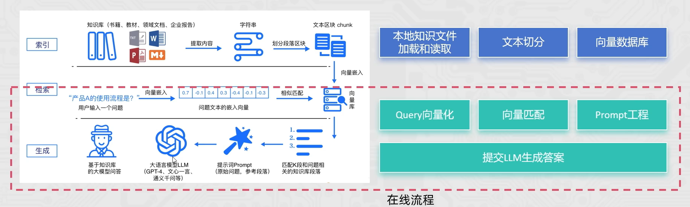
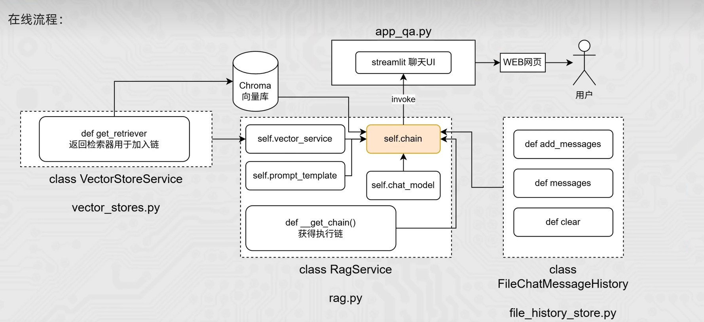

# 在线流程向量存储服务

## 在线流程



## 代码架构



## 代码实践

在配置文件`config_data.py`新增：

```python
md5_path = "./md5.txt"

# Chroma
collection_name = "rag"
persist_directory = "./chroma_db"

# spliter
chunk_size = 1000
chunk_overlap = 100
separators = ["\n\n", "\n", ".", "!", "?", "。", "！", "？", " ", ""]
max_split_char_number = 1000    # 文本分割的阈值

# highlight-start
# retriever
similarity_search_k = 1         # 检索返回匹配的文档数量
# highlight-end
```

创建代码文件`vector_stores.py`实现向量服务和返回检索器方法：

```python
import config_data as config
from langchain_chroma import Chroma

class VectorStoresService(object):

    def __init__(self, embedding):
        """
        :param embedding: 嵌入模型的传入
        """
        self.embedding = embedding

        self.vector_store = Chroma(
            collection_name=config.collection_name,
            embedding_function=self.embedding,
            persist_directory=config.persist_directory
        )

    def get_retriever(self):
        """返回向量检索器，方便加入chain"""
        return self.vector_store.as_retriever(search_kwargs={"k": config.similarity_search_k}) 

if __name__ == "__main__":
    import os
    from langchain_community.embeddings import DashScopeEmbeddings
    from dotenv import load_dotenv

    load_dotenv()

    retriever = VectorStoresService(
        DashScopeEmbeddings(model="text-embedding-v4",dashscope_api_key=os.getenv("LLM_API_KEY"))
        ).get_retriever()
    
    res = retriever.invoke("我的体重120斤，身高172，尺码推荐")
    print(res)
```
