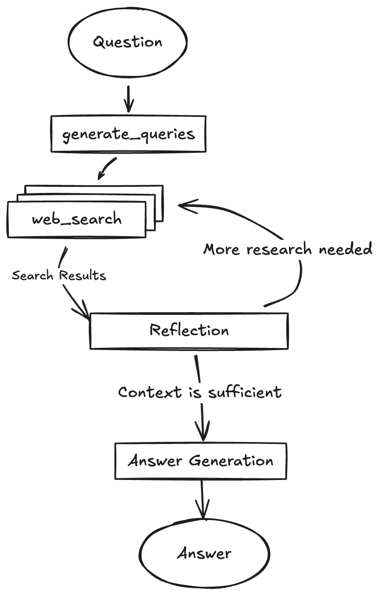

# Research-augmented智能体

## 项目流程图

## 核心流程

1. **用户提问 (前端)**：用户通过前端的聊天界面输入他们的研究问题或查询。
2. **请求传输 (前端到后端)**：前端应用将用户的查询发送到运行在后端的 **FastAPI 服务**。
3. **LangGraph 代理启动 (后端)**：后端服务接收到请求后，启动内置的 **LangGraph 智能研究代理** 来处理用户的查询。
4. **智能查询生成 (代理)**：代理首先利用**通义千问模型**，根据用户的原始问题生成一组优化的初始搜索关键词。
5. **网络信息获取 (代理)**：代理使用这些关键词，通过与**通义千问模型 (DashScope API)** 进行交互，执行“网络研究”以获取相关信息。
6. **反思与知识评估 (代理)**：代理会对获取到的信息进行反思，同样是利用**通义千问模型**来判断现有信息是否足以回答用户问题，并识别是否存在知识鸿沟或需要进一步探究的地方。
7. **迭代研究与细化 (代理)**：如果代理认为信息不足或存在鸿沟，它会根据反思结果生成新的后续查询，并重复“网络信息获取”和“反思”的步骤，形成一个迭代循环，直到达到预设的研究深度或信息充分。
8. **最终答案生成与引用 (代理)**：当研究被判断为足够时，代理会综合所有收集到的信息，再次利用**通义千问模型**生成一个完整、连贯且带有来源引用的最终答案。
9. **结果展示 (后端到前端)**：最终答案从后端发送回前端，并在用户界面上清晰地展示出来。

:::info 总结
简而言之，整个流程就是前端收集用户问题，后端启动一个基于 **LangGraph** 的**智能代理**，该代理通过与**通义千问模型**的多次交互（查询生成、信息获取、反思、答案合成）来完成一个迭代式的研究过程，最终将带有引用的答案呈现给用户。
:::
