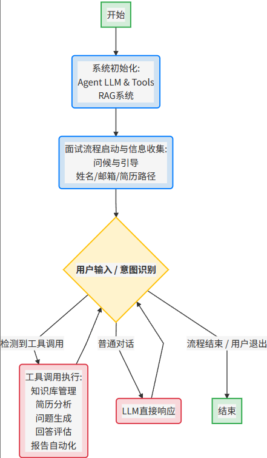

# 智能面试官

## 项目流程

智能面试官Agent的项目流程可以概括为以下几个主要阶段：

### 1. 系统初始化与准备

Agent 初始化

- **面试官Agent** 启动时，会加载核心**大语言模型（LLM）**，并集成所有预定义的**面试工具**（如简历分析、知识库管理、问题生成、回答评估等）。这些工具会与**LLM**绑定，使其能够调用外部功能。

RAG 系统初始化

- **检索增强生成（RAG）系统** 也会同步初始化，它负责设置数据加载器、文本分割器、嵌入模型（如DashScope Embedding）和FAISS向量数据库。系统还会自动发现并加载之前已建立的**知识库**。

### 2. 面试流程启动与信息收集

问候与引导

- **Agent** 开始面试时，会主动向候选人问候，并提供一个初始菜单，列出其支持的各项功能（如知识库操作、简历分析等）。

收集基本信息

- **Agent** 会引导候选人提供其姓名、邮箱和简历文件路径，为后续的个性化面试做准备。

### 3. 用户交互与工具调度

识别用户意图

- **Agent** 持续监听用户的输入。它会智能地判断用户是进行一般对话，还是有明确的**工具调用**需求（例如，用户输入 `analyze_candidate_resume("my_resume.pdf")`）。

工具执行

- 如果识别到**工具调用**：**Agent** 会将控制权交给相应的工具。例如，如果调用“简历分析”工具，**RAG系统** 会介入，加载简历、进行文本分割、生成嵌入并存储到FAISS数据库，然后 **LLM** 基于这些信息进行分析。
- 如果未识别到**工具调用**：**Agent** 将直接利用 **LLM** 进行对话响应。
- **循环交互**：无论工具执行完毕还是**LLM**给出回复，流程都会返回到等待用户输入的阶段，形成持续的交互循环。

### 4. RAG 核心功能应用（通过工具实现）

- **知识库管理**：用户可以上传面试大纲或专业文档，**RAG系统** 会将其加载、分割、嵌入并存储，构建可检索的**知识库**。
- **简历智能分析**：**Agent** 通过**RAG系统** 处理和分析候选人的简历内容，提取关键信息和技能点，为后续的个性化提问打基础。
- **个性化问题生成**：基于对候选人简历的分析，结合**知识库**中的相关知识（通过**RAG**检索），**Agent** 能生成高度匹配候选人背景和岗位要求的面试问题。
- **面试回答评估**：候选人回答问题后，**Agent** 会利用 **LLM** 并可能结合**RAG**检索到的评估标准，对回答进行评估和反馈。
- **面试报告自动化**：整个面试过程中的问答数据和评估结果会被汇总，**LLM** 生成结构化的面试报告，并可通过邮件发送给相关人员。

## 项目相关问题

1.你在项目中遇到的困难是什么？怎么解决的？  
**知识库构建与数据质量**  
困难：构建知识库需要收集高质量数据（如行业问题集、评分规则）  
场景：知识库包含面试问题，但数据杂乱（如格式不统一、问题重复），导致检索结果不准确。  
影响：AI生成的问题可能不专业，影响面试效果。  
**解决方式**  
数据准备：与老工程师合作，获取现成数据集（如Kaggle的面试问题集）或爬取招聘网站数据。  
清洗工具：用Pandas处理数据（如去重、格式化），学习基础数据清洗。  
测试验证：手动检查检索结果（如前10个问题），确保相关性。  

:::info 关于爬虫：  
**BeautifulSoup**是一个 Python 库，它能够把网页文件（HTML）或XML文件解析成一个易于操作的Python对象。  
从解析后的文档中提取数据：一旦文档被解析，您就可以使用BeautifulSoup提供的各种方法（例如 .find(), .find_all(), .select()来查找、导航和提取您想要的数据，比如文本、链接、图片等。  
:::

2.实现评分规则  

- 语义搜索（通过rag）
- 关键词匹配
- 大模型结合提示词判断回答相关性 完整性 专业性

---
