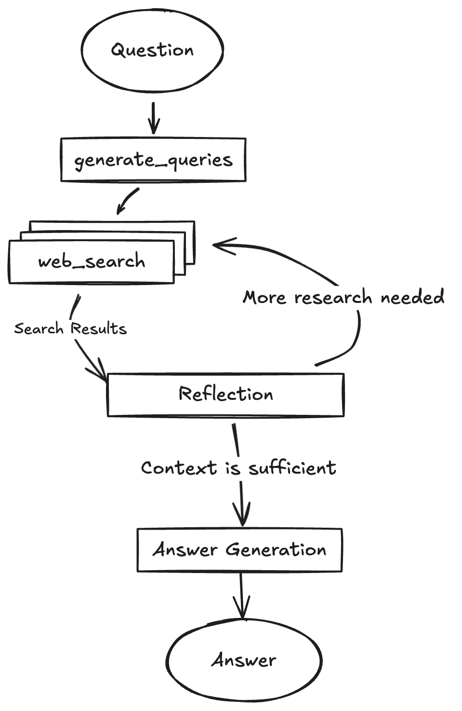

# 深度搜索

## 项目流程图

  

### 项目概述与核心价值

传统搜索引擎难以满足深度信息整合需求  

本项目旨在构建一个智能化的全栈应用，能够为用户提供针对复杂查询的**深入研究**和**带有精确引用的答案**。其核心价值在于通过模拟人类研究的思维过程，实现对信息的主动获取、分析和迭代提炼

### 解决的问题

在面对需要多源信息整合、交叉验证和深入分析的复杂问题时，用户往往需要手动执行多次搜索、阅读大量文章、并自行总结提炼。这个项目旨在自动化这一过程

- 信息过载与筛选难题： 自动从大量信息中提取关键点
- 知识鸿沟与迭代研究： 智能识别现有知识的不足，并主动进行补充性研究
- 信息验证与引用缺失： 提供可验证的、带有来源引用的答案，增强可信度

### 项目流程概览

1.用户输入：用户在前端界面输入研究问题  
2.查询生成：后端 LangGraph 代理接收问题，调用通义千问生成搜索查询  
3.网络信息获取：代理将搜索查询发送给通义千问（通过特殊提示词），获取的“搜索结果”  
4.反思评估： 代理将“搜索结果”提交给通义千问进行反思，判断信息是否足够  
5.迭代/终结  

- 不足：如果信息不足，通义千问会生成新的后续查询，代理返回步骤3
- 充足：如果信息足够或达到最大研究循环次数，代理进入最终答案生成阶段  

6.答案合成：代理将所有信息整合，调用通义千问生成最终的答案和引用  
7.结果展示：答案返回前端，呈现在用户界面  
